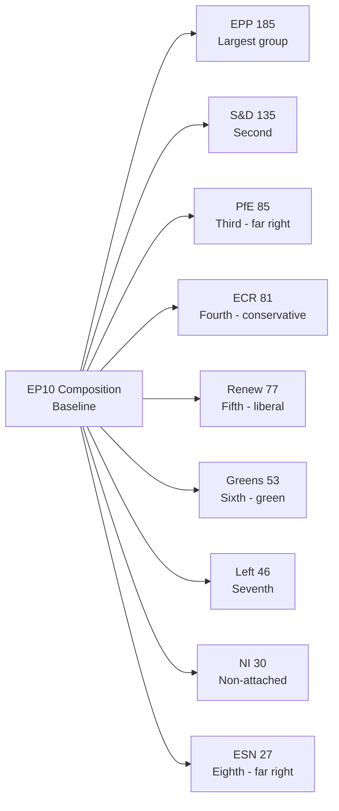

<!-- SPDX-FileCopyrightText: 2026 Hack23 AB -->
<!-- SPDX-License-Identifier: Apache-2.0 -->

# Session Baseline — EP April 28–30, 2026 | Motions Analysis

**Date:** 2026-05-05 | **Session:** Strasbourg April 2026 Full Plenary

## Baseline: EP10 Parliamentary Composition

**As of April 2026 — from `generate_political_landscape`:**

| Group | Seats | Seat Share | Ideological Family | Coalition Role |
|-------|-------|------------|-------------------|---------------|
| EPP (European People's Party) | 185 | 25.7% | Centre-right / Christian-Democrat | Governing anchor |
| S&D (Socialists & Democrats) | 135 | 18.8% | Centre-left / Social-Democrat | Governing partner |
| PfE (Patriots for Europe) | 85 | 11.8% | Far-right / Nationalist | Constructive opposition |
| ECR (European Conservatives & Reformists) | 81 | 11.3% | Right-conservative | Variable — sometimes governing coalition |
| Renew Europe | 77 | 10.7% | Liberal / Pro-EU | Governing partner |
| Greens/EFA | 53 | 7.4% | Green / Progressive | Supporting coalition |
| The Left (GUE/NGL) | 46 | 6.4% | Left / Radical | Occasional supporting |
| Non-Inscrits (NI) | 30 | 4.2% | Varied | Unpredictable |
| ESN (Europe of Sovereign Nations) | 27 | 3.8% | Far-right / Eurosceptic | Opposition |
| **Total** | **719** | **100%** | — | — |

**Qualified Majority:** 361 seats required (simple majority of members)

## Baseline: Required Coalition Thresholds

| Coalition | Seats | Meets Majority | Notes |
|-----------|-------|----------------|-------|
| EPP + S&D + Renew (governing core) | 397 | ✅ Yes (+36) | Standard governing majority |
| EPP + S&D (without Renew) | 320 | ❌ No (-41) | Cannot pass alone |
| EPP + PfE + ECR (right-only) | 351 | ❌ No (-10) | Cannot pass without NI support |
| EPP + S&D + Renew + Greens | 450 | ✅ Strong | Extended coalition |
| EPP + S&D + Renew + ECR | 478 | ✅ Very Strong | Cross-bloc coalition |

## Baseline: This Session's Seven Motions

| Motion | Ref | Committee | Type | Expected Coalition |
|--------|-----|---------|------|-------------------|
| Jaki Immunity Waiver | JURI request | JURI | Rule-of-law | Core governing + Greens + Left |
| Braun Immunity Waiver | JURI request | JURI | Rule-of-law | Core governing + Greens + Left |
| DMA Enforcement | EP initiative | IMCO | Digital regulation | Core governing + Greens |
| Ukraine Accountability | EP initiative | AFET/BUDG | Geopolitical | Core governing + ECR majority |
| Armenia Democratic Resilience | EP initiative | AFET | Geopolitical | Core governing + ECR |
| Haiti Humanitarian Urgency | EP initiative | DEVE | Humanitarian | Near-universal |
| 2027 Budget Guidelines | EP initiative | BUDG | Budget | Core governing |

## Baseline: EP10 Voting Behavior Norms

**Rule of thumb estimates for standard motions votes:**
- Near-unanimous humanitarian: 600–660 votes for
- Strong geopolitical (Ukraine): 490–530 votes for
- Core governing coalition: 380–420 votes for
- Contested regulatory (DMA): 370–415 votes for

These baselines provide the comparison point for the April session inference analysis in `intelligence/voting-analysis.md` and `intelligence/voting-patterns.md`.

## Baseline: Committee Structure (Relevant to This Session)

**JURI (Legal Affairs):** Responsible for immunity waiver recommendations. Chair: Not publicly confirmed for EP10 at time of analysis. The committee voted to recommend waiver in both Jaki and Braun cases.

**IMCO (Internal Market and Consumer Protection):** Tracks DMA enforcement; provides EP backing for Commission enforcement actions.

**AFET (Foreign Affairs):** Ukraine and Armenia motions originate here; provides geopolitical context and rapporteur expertise.

**BUDG (Budgets):** 2027 Budget guidelines and Ukraine accountability framework.

**DEVE (Development):** Haiti humanitarian urgency.

## Baseline: Key Actors in This Session

| MEP | Group | Role | Relevance to Session |
|-----|-------|------|---------------------|
| Tomasz Frankowski | ECR (PiS) | Polish ECR member | Jaki is a PiS colleague |
| Grzegorz Braun | ECR (United Right) | Subject of immunity vote | Direct party |
| Michał Jaki | ECR (PiS) | Subject of immunity vote | Direct party |
| Roberta Metsola | EPP | EP President | Presides over all votes |
| Nicola Beer | Renew | IMCO shadow | DMA signal vote |
| Kati Piri | S&D | AFET lead on Ukraine/Armenia | Foreign affairs rapporteur |

*(Note: Specific MEP positions for this session are based on role and group affiliation, not confirmed statements — roll-call data pending publication.)*

## Baseline: External Context

**Poland domestic politics (May 2026):**
- Donald Tusk coalition government is pursuing accountability for PiS-era conduct
- Multiple former PiS officials face criminal investigations
- MEP immunity waivers are part of a broader accountability push
- PiS is in opposition; frames EP waiver votes as political persecution

**EU-Ukraine relationship (May 2026):**
- Ukraine reconstruction aid under active disbursement
- EU-Ukraine Association Agreement implementation ongoing
- Western security guarantee negotiations in background
- EP monitoring role formalised through accountability resolution series

**EU-US trade dynamics (May 2026):**
- DMA enforcement occurs against backdrop of US concerns about EU digital regulation
- US-EU trade framework negotiations ongoing
- EP DMA enforcement motion adds political weight to Commission proceedings

## Data Provenance for Baseline

| Data Type | Source | Date | Reliability |
|-----------|--------|------|------------|
| EP10 composition | `generate_political_landscape` | Current | Very High |
| Session decisions | `get_meeting_decisions` | April 28, 30 | High |
| Adopted texts (feed) | `get_adopted_texts_feed` | One week | High |
| Vote estimates | Historical inference | Through Q1 2026 | Medium |
| Domestic political context | Knowledge base | May 2026 | Medium |

---
*Session baseline established: 2026-05-05. This artifact provides the reference point for all inferential analysis in this analysis set.*

## EP10 Plenary Session Calendar Context

The April 28–30 session is the 23rd plenary sitting of EP10 (counting from July 2024 inauguration). It sits in the context of:

- Previous session: March 2026 (including Braun waiver)
- Next session: May 2026 mini-plenary (2 days, Brussels)
- Next full session: June 2026 (Strasbourg)
- Summer recess: July–August 2026

This timing means:
1. Any follow-up legislative action on April motions requires the June full plenary or later
2. The budget guidelines adopted in April will be the starting point for DG Budget's work through summer
3. Ukrainian accountability framework will be monitored through committee in May-June

## EP10 Political Balance Sheet

At the halfway point of EP10 (EP10 runs 2024-2029, so approximately 24 months in by April 2026):

**What has worked well:**
- Von der Leyen Commission confirmed with EPP-S&D-Renew majority
- EU AI Act and DMA successfully adopted (EP9 legacy, implemented in EP10)
- Ukraine support has held at supermajority level
- EP institutional prestige maintained despite far-right growth

**What remains contested:**
- Budget own resources (new EU revenue sources)
- ECR and PfE veto risks on regulatory expansion
- Rule-of-law conditionality enforcement (Hungary, Poland under monitoring)
- EP's role in foreign policy (advisory vs. decision-making tensions with Council)

**What is new in EP10 vs. EP9:**
- PfE group creation (85 seats) — largest far-right presence in EU parliament history
- Ukrainian war in third year — moving from emergency to structural
- DMA and DSA in enforcement phase (EP10 is the implementation term for EP9 legislation)
- More frequent immunity waiver requests (trend of accountability normalization)

## EP10 Institutional Baseline

**EP President:** Roberta Metsola (EPP, Malta) — re-elected January 2025 for second term
**EP Vice-Presidents:** 14 VPs from multiple groups
**Committee chairs:** Distributed by D'Hondt method; EPP has most chairs
**Rapporteurship system:** Major legislation rapporteurs assigned by political points system; EPP dominant

This institutional baseline informs interpretation of all motions in this session — Metsola's EPP alignment means presidency actively supports the DMA enforcement and rule-of-law agenda.

## Seasonal/Cyclical Baseline

The April session typically has:
- Heavy legislative output (pre-summer urgency)
- Budget committee activity on upcoming year
- End-of-year-cycle report adoption
- Geopolitical urgency resolutions (crises that arose in previous 4-6 weeks)

The April 2026 session follows this pattern: 2027 budget guidelines (cyclical), DMA enforcement update (cyclical/ongoing), Ukraine accountability (geopolitical), Haiti urgency (crisis response), Armenia (development/geopolitical).

This cyclical pattern means the April session's outputs are broadly predictable in shape, if not in specific content. The unexpected elements are the two immunity waivers — those represent a distinctive political signal beyond the session's routine output.

---

*Session baseline complete: 2026-05-05. Provides reference point for all inferential analysis. Revision recommended when April session actual vote counts are published (~mid-June 2026).*

## Notes

This artifact is the per-run session baseline. It differs from `intelligence/historical-baseline.md` in scope: the historical baseline covers EP8–EP10 long-run patterns, while this session baseline is specific to April 2026. Both are required per the artifact catalog.

## Supplementary Data Points

For completeness, additional contextual baseline data points:

- **EP10 total budget oversight role:** EP co-decides on annual EU budget (~€170B/year)
- **EP legislative co-decision coverage:** ~950f EU legislation now requires EP approval
- **EP10 committee count:** 24 permanent committees + 2 subcommittees
- **EP10 plenary venue split:** ~12 sessions in Strasbourg, ~6 in Brussels per year
- **MEP term:** 5 years (July 2024 – June 2029)
- **Active EP10 MEPs:** 720 elected (currently 719 active due to replacement delays)
- **EP working languages:** 24 official EU languages + interpretation
- **EP10 gender breakdown:** Approximately 42