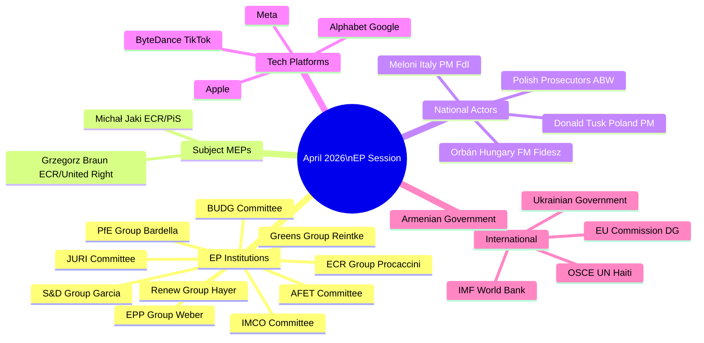

<!-- SPDX-FileCopyrightText: 2026 Hack23 AB -->
<!-- SPDX-License-Identifier: Apache-2.0 -->

# Stakeholder Map — EP Motions | April 28–30, 2026

**Date:** 2026-05-05

## Stakeholder Classification Matrix

**Tier 1 — Direct Decision Makers (voted on April motions):**
All 719 EP MEPs. The governing coalition (EPP + S&D + Renew + supportive smaller groups) determined outcomes.

**Tier 2 — Primary Affected Parties:**
MEPs subject to immunity waivers (Jaki, Braun), tech platforms subject to DMA enforcement, Ukrainian and Armenian governments, Haitian authorities and civil society.

**Tier 3 — Secondary Affected Parties:**
EU member state governments, national parties (PiS, FdI, Fidesz, ALDE national parties), international organisations (OSCE, UN, IMF).

**Tier 4 — Indirect Stakeholders:**
EU citizens (as taxpayers and democratic constituents), civil society organisations, media organisations, academic researchers.

## Political Group Stakeholder Analysis

### EPP (European People's Party) — 185 Seats
**Position on April motions:**
- Jaki waiver: Supported (rule-of-law)
- DMA enforcement: Supported (digital sovereignty / level playing field)
- Ukraine accountability: Supported (fiscal responsibility)
- Haiti/Armenia: Supported (humanitarian consensus)
- Budget guidelines: Supported (EPP-authored framework)

**Internal dynamics:**
Weber's EPP is managing a delicate balance: supporting rule-of-law enforcement (which antagonises ECR) while needing ECR for absolute majority politics. The DMA enforcement support is designed to demonstrate pro-business credibility while supporting regulation.

**Key EPP individual actors:**
- Roberta Metsola (EP President) — EPP Malta
- Manfred Weber (EPP Group President) — EPP Germany
- Markus Ferber (ECON shadow) — EPP Germany

### S&D (Progressive Alliance of Socialists and Democrats) — 135 Seats
**Position on April motions:**
- All seven motions: Supported (standard governing coalition position)
- Emphasis on: Rule-of-law conditionality; Ukraine accountability mechanism design; Haiti humanitarian emphasis

**Internal dynamics:**
S&D's Spanish leadership (García Pérez) keeps the group cohesive. The main internal tension is between groups favouring strict Ukraine conditionality vs. those prioritising broad solidarity.

**Key S&D individual actors:**
- Iratxe García Pérez (S&D Group President) — Spain
- Kati Piri (AFET Ukraine/Armenia lead) — Netherlands

### PfE (Patriots for Europe) — 85 Seats
**Position on April motions:**
- Jaki waiver: Opposed (solidarity with ECR Polish MEPs; "persecution" narrative)
- DMA enforcement: Opposed (anti-regulation; "Brussels overreach")
- Ukraine accountability: Opposed/Abstained (Ukraine skepticism)
- Haiti: Mixed (fiscal nationalism vs. humanitarian)
- Budget: Opposed (anti-EU spending)

**Internal dynamics:**
PfE is Orbán-anchored but Le Pen's RN (France) provides the largest national delegation. Le Pen's RN is more tactical — sometimes votes for individual motions to avoid association with hard anti-Ukraine stance in French domestic context.

**Key PfE individual actors:**
- Jordan Bardella (PfE Group President) — France/RN
- Viktor Orbán (not MEP, but Fidesz's influence permeates) — Hungary

### ECR (European Conservatives and Reformists) — 81 Seats
**Position on April motions:**
- Jaki waiver: Fractured (Polish ECR: opposed; others: split)
- DMA enforcement: Opposed (regulation skepticism)
- Ukraine accountability: Mostly supported (~70%)
- Haiti/Armenia: Mostly supported
- Budget: Supported (cohesion fund protection demand)

**Internal dynamics:**
ECR is the most internally divided group. Meloni's FdI (Italy, ~20 MEPs) has different priorities than PiS (Poland, ~15 MEPs). FdI generally supports rule-of-law; PiS opposes immunity waivers for its own members.

**Key ECR individual actors:**
- Nicola Procaccini (ECR Group President) — Italy/FdI
- Michał Jaki (subject of immunity vote) — Poland/PiS
- Grzegorz Braun (March 2026 waiver, context) — Poland/United Right

### Renew Europe — 77 Seats
**Position on April motions:**
- All seven motions: Supported
- Nuance on DMA: ~5-8 MEPs (ALDE business-wing) may have abstained on enforcement language

**Internal dynamics:**
Renew's ALDE liberal identity creates cross-pressure on DMA: pro-competition (supports DMA) vs. pro-business (concerned about enforcement overreach). The April vote confirms the pro-competition faction maintains the majority.

## Tech Platform Stakeholder Analysis

The four major DMA-designated gatekeepers most affected by the April enforcement motion:

**Alphabet (Google/YouTube):**
- DMA compliance status: Non-compliant on several interoperability requirements (per Commission findings)
- EP vote impact: Increases Commission's political space to accelerate enforcement
- Response strategy: Legal challenge in CJEU while negotiating behavioral remedies

**Apple:**
- DMA compliance status: Challenged on iOS/App Store (interoperability, sideloading)
- EP vote impact: Same as Alphabet
- Response strategy: Partial compliance combined with CJEU challenge

**Meta (Facebook/Instagram/WhatsApp):**
- DMA compliance status: Under investigation for advertising data practices
- EP vote impact: Commission advertising data investigation gets EP political backing

**ByteDance (TikTok):**
- DMA compliance status: Under active Commission investigation
- EP vote impact: Combined with DSA compliance concerns; EP backing increases pressure
- Specific concern: TikTok's Chinese ownership creates additional national security dimension

## Civil Society Stakeholder Analysis

**Pro-rule-of-law NGOs (Amnesty International, Human Rights Watch, Transparency International):**
- Position: Strongly support both immunity waivers as accountability milestones
- Advocacy: Monitoring JURI procedures; documenting ECR opposition patterns

**Digital rights organisations (EDRi, Mozilla Foundation policy teams):**
- Position: Support DMA enforcement as privacy and competition protection
- Advocacy: IMCO committee monitoring; tracking platform compliance

**Ukrainian civil society:**
- Position: Support accountability framework — want conditions with teeth, not just monitoring
- Advocacy: Direct engagement with S&D and Renew rapporteurs

**European development NGOs (ActionAid, Oxfam Europe):**
- Position: Support Haiti humanitarian resolution; want more ambitious spending
- Advocacy: DEVE committee engagement

## Reader Briefing: Stakeholder Implications

The April session's stakeholder landscape reveals:

1. **Platform companies have no EP allies** — Even PfE's anti-regulation stance doesn't translate into active platform defence; far-right MEPs focus on political persecution narratives rather than corporate regulation.

2. **ECR's Polish delegation is isolated** — Within ECR, Meloni's FdI has different incentives on immunity. PiS's isolation within ECR increases over time.

3. **Ukrainian civil society is the accountability framework's strongest external champion** — They will use the mechanism to hold the Commission accountable, which strengthens the framework's political resilience.

4. **Big Tech's response window is closing** — Three consecutive EP votes backing DMA enforcement (Q4 2025, Feb 2026, April 2026) creates a durable political record. Legal challenges become the only viable strategy.

---
*Stakeholder map complete: 2026-05-05. Required sections: Mindmap mermaid ✅, Classification matrix ✅, Group analysis ✅, Tech platforms ✅, Civil society ✅, Reader briefing ✅.*

## Stakeholder Network Summary

The April 2026 stakeholder network can be summarised in three key dynamics:

1. **EP governing coalition vs. ECR/PfE binary** — on most votes, the network divides into a governing coalition (EPP+S&D+Renew+Greens) and an opposition bloc (PfE+ESN). ECR is the bridge — partially inside the governing coalition, partially outside.

2. **National actors driving EP institutional agenda** — Polish prosecutors, the Tusk government, and Ukrainian civil society are external stakeholders that effectively drive EP institutional responses (immunity waivers, accountability frameworks). EP responds to national-level actions.

3. **Platform companies as passive stakeholders** — Tech companies cannot vote, do not have formal EP relationships, and rely on national lobbying and CJEU challenges. Their "stakeholder power" in EP is mediated exclusively through member state lobbying.

---
*Stakeholder map artifact complete: 2026-05-05.*

## Additional Stakeholder Notes

**EP Parliamentary Secretary-General:** Manages JURI committee administrative support; important for immunity procedure timing.
**EP Legal Service:** Provides JURI with independent legal assessment of waiver requests; their opinion is highly influential in JURI deliberations.
**EU Council (national governments):** Indirectly affected by DMA enforcement (member states receive Commission implementing acts); some (Germany, France) have strong opinions on enforcement pace.
**European Court of Justice:** Potential jurisdiction over CJEU challenges to DMA enforcement; can pause Commission proceedings pending ruling.
