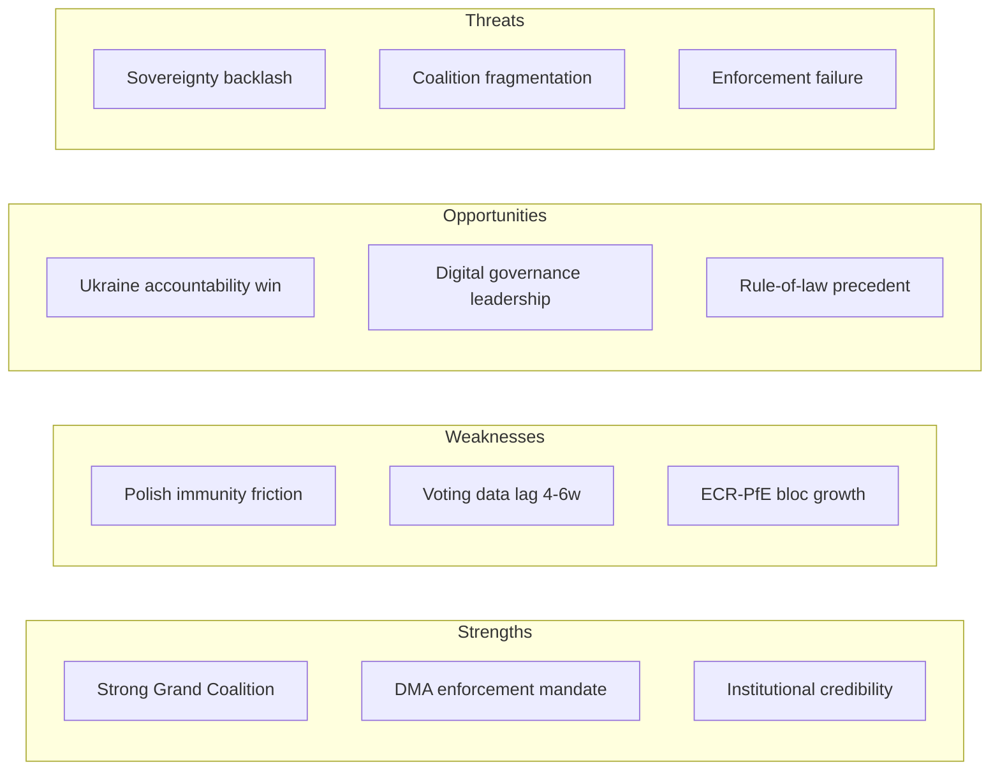

<!-- SPDX-FileCopyrightText: 2026 Hack23 AB -->
<!-- SPDX-License-Identifier: Apache-2.0 -->

# SWOT Analysis — EU Parliament Motions | April 28–30, 2026

**Subject:** EP10 Parliament's Legislative and Political Agenda — April Strasbourg Plenary  
**Framework:** SWOT (Strengths, Weaknesses, Opportunities, Threats)  
**Date:** 2026-05-05  
**Confidence:** 🟡 Medium

---

## Strengths

**S1 — Cross-Party Consensus on Rule-of-Law Enforcement**  
The Parliament's willingness to approve immunity waivers against MEPs from politically sensitive groups (ECR's Patryk Jaki in April, NI-aligned Grzegorz Braun in March) demonstrates a durable institutional consensus on the primacy of rule-of-law over group solidarity. This cross-party unity — spanning EPP, S&D, Renew, and Greens/EFA at minimum — signals that the EP functions as a genuine institutional check, not merely a political battleground. This is a structural strength of the institution, especially valuable in a parliamentary term when nationalist and populist forces hold ~27% of seats (PfE + ECR + ESN combined).

**S2 — Strong Session Attendance and Quorum**  
April 28 (663 MEPs) and April 29 (658 MEPs) represent attendance rates above 90% of the 719-seat Parliament — exceptional by historical standards. High attendance rates strengthen the democratic legitimacy of adopted texts and reduce the risk of motions passing on unrepresentative turnout. The April 30 drop to 599 (83%) for urgency resolutions is typical for Thursday sessions and does not impair legitimacy.

**S3 — Digital Governance Leadership**  
The DMA enforcement resolution (TA-10-2026-0160) reinforces EP10's positioning as the world's leading legislature on digital market regulation. Adopted alongside earlier texts on technological sovereignty (January 2026) and copyright/AI (March 2026), the April DMA text demonstrates programmatic legislative coherence — the EP is building a cumulative regulatory architecture rather than reactive episodic votes.

**S4 — Multi-Domain Productivity**  
The April plenary balanced 11 adopted texts across five distinct domains (immunity/rule-of-law, fiscal policy, digital regulation, external affairs, and justice/security). This breadth demonstrates the EP's capacity to manage complex legislative multi-tracking without institutional overload.

---

## Weaknesses

**W1 — Roll-Call Data Publication Lag**  
The EP's 4–6 week publication delay for roll-call voting data is a structural transparency deficit. For the April 28–30 session, aggregate vote counts and individual MEP positions are not yet publicly available. This prevents real-time analysis of coalition dynamics, abstention patterns, and defection rates. It also limits civil society and media accountability at the moment when public attention is highest — immediately after the votes. 🟡 Confidence: Medium

**W2 — Urgency Resolution Proliferation**  
Of the eleven adopted texts in the April 28–30 period, three (on Haiti, Ukraine, Armenia) were adopted as urgency resolutions under Rule 132. While urgency resolutions serve an important political signalling function, their proliferation risks diluting their impact: when every geopolitical concern is elevated to "urgency" status, none is. The EP adopted approximately 40+ urgency resolutions in 2025 alone. Diplomatic partners may discount these texts as reflexive rather than strategic.

**W3 — Document Content Availability Failure**  
Full text access for the seven most recent adopted texts (April 28–30) returned 404 errors from the EP Open Data Portal. Titles and metadata are indexed, but content is not yet available. This creates an information gap for citizens, journalists, and analysts who wish to examine the precise language of adopted motions within hours of their adoption. The EP's commitment to transparency is undermined by this operational gap.

**W4 — Immunity Procedures as Reactive Rather Than Preventive**  
The two immunity waivers against Polish MEPs in March–April 2026 illustrate a structural limitation: the EP's immunity protection process is reactive (it can only respond to member state judicial requests) and lacks preventive screening mechanisms. The fact that MEPs can be members of the institution while facing serious pending criminal charges in member states creates reputational risk — both for those whose immunity is eventually waived and for the institution that protects them during the pendency period.

---

## Opportunities

**O1 — 2027 Budget as Leverage Tool**  
The April 28 budget guidelines (TA-10-2026-0112) initiate a process in which the Parliament has significant institutional leverage. With the 2027 budget being the final year of the current MFF (2021–2027), and post-2027 MFF negotiations beginning in 2026–2027, the EP can use budget procedure pressure to: (a) extract policy concessions from the Council; (b) establish precedents for the post-2027 framework; and (c) shape Commission spending priorities toward Parliament's political coalition's preferences.

**O2 — Armenia Peace Process Engagement**  
The Armenia democratic resilience resolution (TA-10-2026-0162) arrives at a moment of rare geopolitical opportunity: Armenia is actively pivoting away from Russian security dependence, and the EU has a credible partnership offer. EP support for Armenian democratic institutions provides political cover for Yerevan's EU approach and can be leveraged to accelerate Association Agreement discussions, visa liberalisation, and economic integration — creating a positive-sum partnership in the South Caucasus.

**O3 — DMA Enforcement as International Standard-Setting**  
The DMA enforcement motion positions the EU as a model for other jurisdictions considering digital markets regulation. US antitrust authorities (FTC/DOJ), UK's CMA, and Japan's JFTC are all developing analogous frameworks. EP pressure on Commission enforcement creates positive externalities: each Commission enforcement action against a gatekeeper becomes a precedent that influences regulators globally. This is a rare instance where EU legislative action directly shapes international regulatory norms.

**O4 — Rule-of-Law Signal to Candidate Countries**  
The two consecutive Polish MEP immunity waivers send a clear signal to EU enlargement candidate countries (notably Western Balkans, Ukraine, Moldova, Georgia): parliamentary immunity is not a safe harbour from domestic judicial accountability. This signal is particularly timely given ongoing rule-of-law conditionality negotiations with candidate states and the EP's role in the enlargement consent procedure.

---

## Threats

**T1 — ECR Group Fragmentation Risk Under Immunity Pressure**  
The ECR Group's inability to protect Patryk Jaki — its own member — creates internal stress. Polish ECR MEPs are the group's second-largest national delegation. If the Polish PiS-aligned delegation perceives the EP majority as weaponising immunity procedures for political purposes (a narrative that PiS has already deployed domestically), it could trigger internal conflict within ECR between its moderate conservative and nationalist-populist wings. A fractured ECR weakens the Parliament's ability to form stable governing coalitions in the centre-right.

**T2 — US Tariff Escalation Risk for EU Budget**  
While IMF data is unavailable for this run, the macro context established by earlier EP motions (March 2026 US tariff adjustment vote, February 2026 Mercosur safeguard vote) indicates growing trade uncertainty. If US-EU tariff tensions escalate in 2026–2027, EU budget revenues may be impacted through reduced customs duties, potentially triggering a mid-term MFF revision that disrupts the 2027 budget guidelines approved in April.

**T3 — DMA Enforcement Geopolitical Blowback**  
The EP's push for aggressive DMA enforcement arrives amid elevated US-EU trade tensions. Washington has already signalled that enforcement actions against American tech companies (Apple, Meta, Alphabet) could be treated as trade barriers and incorporated into tariff retaliation frameworks. The April 30 DMA enforcement resolution thus carries foreign policy risk: Commission enforcement teams may face political pressure to moderate enforcement timelines.

**T4 — Ukraine Accountability Motion Credibility Gap**  
The Russia-Ukraine accountability resolution (TA-10-2026-0161) reinforces existing EP positions without introducing new mechanisms. There is a growing risk of what might be termed "resolution fatigue" — where the EP's political declarations on Ukraine outpace the EU's institutional capacity to deliver accountability outcomes. The ICC warrant against Putin has not been enforced; the Special Tribunal proposal is stalled; asset confiscation frameworks are legally contested. Repeated resolutions without implementation undermine the EP's credibility as a meaningful political actor on this issue.

**T5 — Authoritarian Backsliding in Armenia**  
The Armenia democratic resilience resolution, while well-intentioned, risks becoming counterproductive if it is perceived in Yerevan as lecturing rather than supporting. Armenia's ruling Civil Contract party under Prime Minister Pashinyan has consolidated power and faces legitimate democratic quality concerns (media freedom, judicial independence). An overly prescriptive EP resolution risks enabling political backlash that populist actors could exploit against pro-EU elites.

## SWOT Overview Diagram

