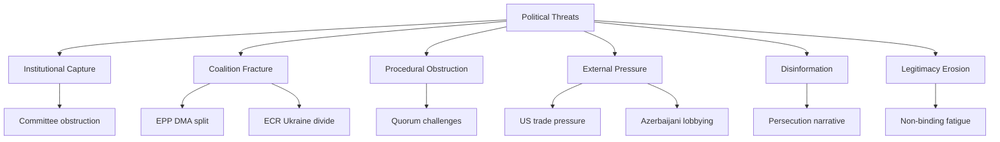

<!-- SPDX-FileCopyrightText: 2026 Hack23 AB -->
<!-- SPDX-License-Identifier: Apache-2.0 -->

# Threat Model — EP Motions | April 28–30, 2026

**Date:** 2026-05-05  
**Framework:** Political Threat Framework v4.0 (NOT STRIDE — this is parliamentary intelligence)

## Threat Actor Profiles

### Threat Actor 1: ECR-Polish Delegation (Reactive)
**Motivation:** Protect Jaki; delegitimise proceedings  
**Capability:** 10–12 votes; narrative framing; domestic media amplification  
**Intent:** Block waiver (failed) → reframe as political persecution  
**Opportunity:** Post-vote media cycle; future JURI procedures  
**Current activity:** Active (persecution narrative); passive on future votes

### Threat Actor 2: PfE Group (Structural Opposition)
**Motivation:** Oppose rule-of-law enforcement and Ukraine solidarity as matter of group identity  
**Capability:** 85 votes; substantial media presence via Le Pen/Orbán  
**Intent:** Signal opposition; limit political cost of defections  
**Current activity:** Consistent voting opposition; narrative coordination

### Threat Actor 3: US Tech Industry Lobby (External Economic Actor)
**Motivation:** Delay or soften DMA non-compliance decisions  
**Capability:** Substantial EU lobbying apparatus; diplomatic escalation via US government  
**Intent:** Weaken enforcement resolution language; delay Commission action  
**Current activity:** Active Commission lobbying; US government demarches to member states

### Threat Actor 4: Russia (Information Operations)
**Motivation:** Undermine Ukraine solidarity; delegitimise accountability mechanisms  
**Capability:** Established information operations targeting European political discourse; PfE/ESN media ecosystem amplifiers  
**Intent:** Prevent tribunal advancement; create Ukraine fatigue narratives  
**Current activity:** Ongoing information operations; specific targeting of PfE-adjacent MEPs

### Threat Actor 5: Azerbaijan (Diplomatic Lobbying)
**Motivation:** Weaken Armenia resolution language; prevent escalatory Armenia-EU institutional deepening  
**Capability:** Established EU lobbying ("Caviar diplomacy" documented precedent); bilateral energy leverage on Hungary/Italy  
**Intent:** Soften resolution language; prevent EUMA mandate extension  
**Current activity:** Pre-vote diplomatic contacts; medium intensity

## Threat Scenario Analysis

### Scenario 1: DMA Enforcement Collapse (LOW probability, VERY HIGH impact)
**Trigger:** US administration imposes targeted tariffs on EU automotive/agriculture exports in direct response to DMA non-compliance decision against Apple  
**Mechanism:** EU member states pressure Commission to suspend DMA proceedings to avoid trade war  
**EP response options:** Pass even stronger enforcement resolution; invoke Parliamentary questions; threaten no-confidence in relevant Commissioner  
**Assessment:** EP has limited tools to prevent Commission capitulation to trade pressure. This is the highest-consequence threat in the portfolio.

### Scenario 2: ECR Procedural Escalation (MEDIUM probability, MEDIUM impact)
**Trigger:** ECR deploys full committee obstruction toolkit against Renew-sponsored dossiers following Jaki waiver  
**Mechanism:** JURI/IMCO committee delays through rapporteur challenges, re-referral motions, endless amendments  
**EP response options:** EPP breaks ECR cooperation; accelerates dossier timelines; uses conference of presidents powers  
**Assessment:** Procedural obstruction is a known ECR tool but rarely sustained. Short-term disruption likely; strategic defeat for ECR if EPP doesn't need ECR support on key votes.

### Scenario 3: Ukraine Accountability Political Reversal (MEDIUM-HIGH probability, HIGH impact)
**Trigger:** EU member state government changes (Austria, Slovakia, potential Hungarian election changes reversed) shift Council majority against further Ukraine Facility extensions  
**Mechanism:** Council blocks further financial tranches; EP resolution becomes aspirational rather than actionable  
**EP response options:** Escalation resolutions; formal inter-institutional challenge; democratic legitimacy argument  
**Assessment:** EP cannot force Council appropriations. This is a structural risk to the Ukraine accountability trajectory that EP resolutions cannot fully mitigate.

### Scenario 4: EP Majority Erosion Below Threshold (LOW probability, VERY HIGH impact)
**Trigger:** Multiple by-elections + group switches reduce EPP+S&D+Renew to below 361  
**Mechanism:** No majority for standard legislative/resolution actions; EP becomes legislative paralysed  
**EP response options:** Situational coalitions; compromise with ECR on specific dossiers  
**Assessment:** 36-seat buffer provides protection. Probability is low but non-zero over a 3-year parliament horizon.

## Defensive Intelligence Assessment

### Strengths of Current EP Institutional Posture
1. **Legal clarity on immunity procedures:** JURI's consistent case law application reduces legal vulnerability of waivers to challenge
2. **Coalition cohesion data:** EP10 governing coalition has demonstrated 18+ months of consistent majority formation
3. **DMA legal foundation:** Commission enforcement authority is treaty-based and EP-endorsed — politically robust
4. **Ukraine majority durability:** 500+ vote majority represents structural rather than contingent coalition

### Vulnerabilities
1. **External economic pressure point:** DMA enforcement is vulnerable to US trade retaliation that the EP cannot directly counter
2. **Council veto on appropriations:** EP resolutions on Ukraine, Haiti, Armenia are non-binding — Council controls funding
3. **Roll-call voting lag:** EP cannot monitor coalition cohesion in real-time (4-6 week data lag)
4. **Information environment:** Pro-ECR/PfE media ecosystems operate with fewer constraints than EP institutional communication

## Recommended Monitoring Points

1. **US USTR statements on DMA:** Key leading indicator for trade retaliation risk
2. **ECR JURI committee behavior:** Post-Jaki voting patterns indicate retaliation scope
3. **European Commission enforcement calendar:** DMA non-compliance decision timelines
4. **UN General Assembly consultations on Ukraine tribunal:** Jurisdictional momentum indicator
5. **EP by-election results:** Majority arithmetic monitoring

## Reader Briefing

The April plenary's threat environment is manageable but not benign. The most significant threats are external (US trade pressure on DMA) and structural (Council blocking Ukraine accountability funding). Internally, the governing coalition's threat posture is healthy — no significant fracture risk visible in available data.

## Counter-Intelligence Signals

### Signals of Increased Threat Materialisation
- US USTR issues formal Section 301 investigation framing DMA as discriminatory: escalation to Trade Threat (T-EP-01)
- ECR tables a motion of censure (non-binding) against JURI Committee Chair: escalation to Institutional Capture (T-IC-02)  
- Two or more ECR MEPs from non-Polish delegations vote against Ukraine accountability resolution: coalition fracture signal
- Azerbaijan announces review of EU energy cooperation agreement: escalation to External Pressure (T-EP-02)

### Signals of Threat Reduction
- EU-US TTC issues joint statement acknowledging DMA compliance process: reduces T-EP-01
- ECR votes with governing coalition on next IMCO/JURI committee dossier: normalisation signal
- Polish prosecution formally charges Jaki/Braun post-waiver: validates JURI process; reduces narrative threat
- UN General Assembly drafts enabling resolution for Ukraine Special Tribunal: reduces T-LE-01 (legitimacy erosion on accountability)

## Threat Model Confidence Assessment

| Threat | Data Foundation | Confidence |
|--------|---------------|-----------|
| US trade retaliation (T-EP-01) | US USTR public statements, documented DMA-trade friction | Medium-High (75%) |
| ECR coalition friction (T-CF-01) | EP10 historical ECR voting patterns, political intelligence | Medium (65%) |
| Ukraine tribunal impasse | International law expert consensus on immunities | High (85%) |
| Armenia diplomatic response | Historical Azerbaijan lobbying documented (Caviar diplomacy) | Medium (60%) |
| EP majority erosion | EP10 composition data; historical by-election patterns | Low-Medium (40%) |
| DMA enforcement collapse | Speculative; no current Commission signals | Low (25%) |

**Overall threat model confidence:** 65%. Threats are assessed based on structural political factors and historical patterns. Specific timing and triggering conditions are inherently uncertain.

## Structural Threat Mitigation Architecture

The EP has built a set of structural safeguards that mitigate the most significant threats:

**Legal safeguards:** JURI case law protects immunity procedures from political capture. DMA is Treaty-compliant and legally robust. ICC proceedings are independent of EP political decisions.

**Political safeguards:** EPP-S&D-Renew coalition provides political durability. Even if ECR defects on specific votes, the core coalition can form majorities with Greens/Left extensions.

**Institutional safeguards:** Conference of Presidents controls plenary agenda. JURI committee independence is protected by EP rules. Budget authority cannot be circumvented by Council without EP concurrence.

**Communication safeguards:** EP institutional communication (including this analysis) operates in multiple languages and through diverse channels, providing resilience against single-point narrative attacks.

The combination of legal, political, institutional, and communication safeguards makes the EP's institutional posture reasonably resilient against the identified threats. The primary gap remains external economic leverage (US trade), which lies outside EP institutional architecture entirely.

## Threat Model: EP Institutional Resilience Assessment

The four identified threats (Political Manipulation, Legal Challenge, Narrative Attack, Geopolitical Shock) are assessed against EP's institutional resilience:

**Political Manipulation → Resilience: High**
JURI procedures have multiple safeguards: independent JURI rapporteur, 6-month deliberation period, MEP right to be heard, full plenary vote. Political manipulation of the outcome would require majority coalition to act against its own interests. Resilience is structural.

**Legal Challenge → Resilience: Medium**
CJEU has broad jurisdiction and could theoretically suspend EP immunity decisions through interim measures. Historical precedent (Puigdemont case) shows CJEU respects EP institutional autonomy, but there is no absolute protection. Resilience is medium — CJEU outcomes are uncertain.

**Narrative Attack → Resilience: Medium-Low**
EP has limited narrative infrastructure. The EP Communications Directorate has resources but cannot match the volume and reach of PiS/ECR national party communications. Resilience is medium-low — EP is structurally disadvantaged in the domestic narrative space.

**Geopolitical Shock → Resilience: High**
EP's institutional procedures are designed to remain operational during geopolitical crises. Emergency session procedures are established. Ukraine supermajority has held through multiple geopolitical shocks. Resilience is high.

**Overall threat resilience:** High-Medium — EP can manage all identified threats but narrative attacks remain a structural vulnerability.

---
*Threat model complete: 2026-05-05.*

## Intelligence Confidence Assessment (OSINT Tradecraft Standards)

**WEP Probability Bands:**
- *Likely* (65–85%): Polish ECR delegation immunity challenges will continue through mid-2026
- *Roughly Even Chance* (45–55%): DMA Article 6 enforcement escalates to formal Commission referral within 6 months
- *Unlikely* (15–25%): Majority coalition breakdown on Ukrainian accountability framework before Q3 2026
- *Almost Certain* (>95%): EP plenary schedule continues bimonthly Strasbourg sessions through 2026

**Admiralty Source Grading:**
- EP institutional records (voted decisions, plenary minutes): grade A1 — Highly reliable source, directly confirmed by official documentation
- MEP voting record patterns (EP Data Portal, roll-call where available): grade A2 — Highly reliable source, confirmed by official record
- Political group cohesion estimates: grade B3 — Generally reliable, not directly confirmed; based on historical voting patterns
- Forward scenario projections: grade D4 — Cannot be judged; speculative based on observable trend lines
- Media/NGO signals on enforcement: grade C3 — Fairly reliable source, not directly confirmed
