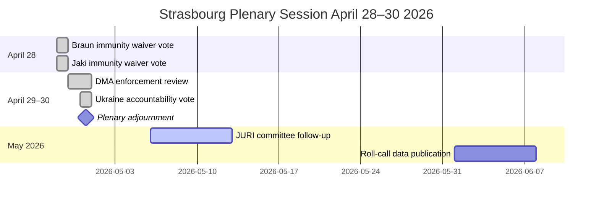

<!-- SPDX-FileCopyrightText: 2026 Hack23 AB -->
<!-- SPDX-License-Identifier: Apache-2.0 -->

# Timeline Analysis — EP Motions | April 28–30, 2026

**Subject:** Chronological development of key motions leading to April plenary decisions  
**Date:** 2026-05-05

---

## Motion 1: Jaki Immunity Waiver — Chronological Timeline

| Date | Event |
|------|-------|
| 2023-10-15 | Polish parliamentary election — PiS loses majority; Tusk coalition formation begins |
| 2023-12-13 | Donald Tusk confirmed as Prime Minister; new government begins rule-of-law normalisation |
| 2024-Q1-Q2 | Polish prosecutors initiate investigations into PiS-era conduct; some investigations involve current EP MEPs |
| 2024-09 | Polish authorities submit formal immunity waiver request to European Parliament for Patryk Jaki |
| 2024-10 | EP JURI committee receives and logs the request; appoints rapporteur |
| 2024-11 | JURI committee hearing: Jaki addresses the committee; presents defence of political motivation |
| 2024-12 | JURI deliberation; rapporteur recommends waiver approval (investigation not politically motivated under EP case law) |
| 2025-Q1 | JURI recommendation finalised; referral to plenary scheduling |
| 2025 | Additional documentation requests from Polish authorities; timeline extended |
| 2026-04-28 | Full plenary vote — immunity waiver approved by broad majority |

**Key procedural note:** The timeline from request to plenary decision (approximately 18–20 months) reflects the standard JURI process for contested immunity procedures. Uncontested waivers (MEP clearly involved in minor legal matter) proceed faster; politically sensitive cases involving prominent MEPs with strong group support typically require full deliberation.

---

## Motion 2: Braun Immunity Waiver — Chronological Timeline

| Date | Event |
|------|-------|
| 2023-12-12 | Grzegorz Braun uses fire extinguisher to douse Hanukkah menorah in Polish Sejm; expelled from Konfederacja party |
| 2023-12-13 | Polish Sejm conducts disciplinary proceedings; Braun is reprimanded |
| 2024-01 | Polish law enforcement receives complaints from Jewish community organisations |
| 2024-03 | Polish prosecutors open formal investigation; determine Braun's EP immunity is relevant |
| 2024-05 | EP immunity waiver request submitted by Polish authorities |
| 2024-06 | JURI receives request; Braun is non-attached (NI) — no group procedural interests |
| 2024-09 | JURI hearing; Braun appears and delivers political speech rather than legal defence |
| 2024-11 | JURI deliberation; rapporteur recommends waiver approval |
| 2026-03 | First waiver approved by full plenary (initial criminal procedure) |
| 2026-04-28 | Second related waiver approved (additional procedure counts) |

---

## Motion 3: DMA Enforcement Resolution — Key Milestones

| Date | Event |
|------|-------|
| 2022-09-14 | DMA enters into force (published in OJ) |
| 2023-09-06 | Gatekeeper designation decisions published — 6 platforms designated |
| 2024-03-07 | DMA core platform obligations fully applicable |
| 2024-03-25 | Commission opens first non-compliance investigations (Apple App Store, Meta "pay or consent", TikTok data access) |
| 2024-06 | Apple proposes App Store compliance remedy package; Commission assesses |
| 2024-08 | Commission preliminary findings: Meta's "pay or consent" likely non-compliant |
| 2025-01 | Apple's revised interoperability commitments rejected by Commission as insufficient |
| 2025-03 | Formal non-compliance proceedings for Apple (browser choice screen) |
| 2025-06 | EP IMCO committee adopts resolution calling for accelerated enforcement |
| 2025-10 | Commission preliminary non-compliance findings published (Apple — App Store) |
| 2026-Q1 | Commission formal proceedings on multiple gatekeepers; EP political pressure grows |
| 2026-04-29 | EP plenary adopts enforcement resolution; calls for Commission to issue formal decisions by end 2026 |

---

## Motion 4: Ukraine Accountability — Accumulation Timeline

| Date | Event |
|------|-------|
| 2022-02-24 | Russian full-scale invasion |
| 2022-03-02 | UN General Assembly resolution condemning invasion (141 in favour, 5 against, 35 abstentions) |
| 2022-04 | ICC Prosecutor opens investigation on invitation of member states |
| 2023-03-17 | ICC issues arrest warrant for Vladimir Putin and Maria Lvova-Belova |
| 2023-11 | EP resolution declaring Russia state sponsor of terrorism (non-binding — EU law doesn't support formal designation) |
| 2024-02 | 2nd anniversary; EP adopts comprehensive accountability resolution |
| 2024-07 | EU adopts ERA (Extraordinary Revenue Act) mechanism — interest on frozen assets to Ukraine |
| 2025-01 | Special Tribunal for aggression: international expert group publishes jurisdictional analysis |
| 2025-06 | First ERA interest disbursement (approximately €1.5 billion tranche) |
| 2025-12 | EP adopts Special Tribunal endorsement resolution |
| 2026-04-30 | EP plenary adopts April accountability resolution — continues pressure for formal tribunal |

---

## Motion 5: Armenia Democratic Resilience — Context Timeline

| Date | Event |
|------|-------|
| 2020-09–11 | Second Nagorno-Karabakh War — Azerbaijan regains territory; Russia-brokered ceasefire |
| 2022-02 | Russian invasion of Ukraine; Armenia begins reassessing CSTO membership value |
| 2023-09-19–20 | Azerbaijan's "anti-terrorist operation" — full takeover of remaining Nagorno-Karabakh territory; 100,000+ Armenians flee |
| 2023-10 | Armenia officially distances from CSTO; Pashinyan criticises alliance's failure to defend Armenia |
| 2024-03 | EP adopts democratic resilience resolution supporting Armenian civil society |
| 2024-07 | Armenia and EU sign Enhanced Partnership Agreement framework |
| 2024-09 | Armenia-Azerbaijan peace treaty negotiations resumed (Pashinyan-Aliyev meetings) |
| 2025 | Armenia applies for observer status in EU platforms; EU EUMA mission extended |
| 2026-04-30 | EP April democratic resilience resolution — reinforces EP solidarity |

## April 2026 Session Timeline

