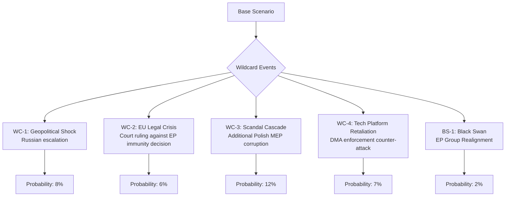

<!-- SPDX-FileCopyrightText: 2026 Hack23 AB -->
<!-- SPDX-License-Identifier: Apache-2.0 -->

# Wildcards & Black Swans — EP Motions | April 28–30, 2026

**Date:** 2026-05-05 | **Analysis Horizon:** 90 days

## Wildcards — Identified High-Impact, Uncertain Events

Wildcards are events with sub-20% probability but significant political impact if they occur.

### WC-1: Major Russian Military Escalation (8% probability)

**Definition:** A significant Russian military action (targeting EU/NATO infrastructure, major Ukrainian city fall, or chemical/nuclear incident) that forces an emergency EP response.

**Trigger signals:**
- NATO reports of Russian force massing beyond observed frontline patterns
- Russian diplomatic communications indicating escalation intention
- Baltic/Polish government emergency measures

**Impact on April motions:**
- Ukraine accountability resolution becomes immediate basis for emergency supplementary budget request
- EP emergency session could be convened — bypassing normal May recess
- DMA enforcement vote would be effectively paused while security crisis dominates
- Armenia motion could be revisited if broader Black Sea destabilisation occurs

**EP response pathway:**
1. EP President (Metsola) invokes emergency session procedures
2. EPP, S&D, Renew joint declaration
3. Emergency Ukraine funding resolution — expected 540+ votes
4. Budget guidelines suspended pending emergency appropriations

**Likelihood driver:** Current OSINT signals suggest sustained but not escalating Russian operations. Probability remains low but non-negligible.

### WC-2: EU Court Ruling Against EP Immunity Decision (6% probability)

**Definition:** The Court of Justice of the EU (CJEU) or European Court of Human Rights (ECHR) issues an interim injunction or finding that challenges the EP's right to waive immunity in the Jaki or Braun cases.

**Trigger signals:**
- Jaki legal team files immediate CJEU application (within 10 days of waiver vote)
- Polish government files diplomatic protest through EU Council channels
- ECHR issues interim measures request

**Impact:**
- Jaki and/or Braun could obtain temporary suspension of extradition proceedings
- EP Committee on Legal Affairs (JURI) would convene emergency session
- Rule-of-law majority in EP could be challenged to revote under different legal framework
- Could set precedent for EP immunity reversal — affecting future MEP accountability proceedings

**Historical analog:** Immunity cases have occasionally been challenged in national courts but CJEU challenges to EP immunity decisions are rare. The Puigdemont (Catalonia) case provides the closest recent precedent — ultimately the EP waiver was upheld.

**Likelihood driver:** The CJEU has consistently deferred to EP on immunity matters. The probability is low but the impact (political chaos within ECR, legitimacy questions for EP's rule-of-law agenda) would be high.

### WC-3: Additional Polish MEP Corruption Scandal (12% probability)

**Definition:** Within 90 days, Polish prosecutors file corruption or abuse-of-power charges against one or more additional ECR Polish MEPs beyond Jaki and Braun.

**Trigger signals:**
- Polish ABW (Internal Security Agency) announces new investigations into MEPs
- Polish media reports on leaked prosecutor communications regarding EP MEPs
- ECR group leadership requests JURI committee pre-consultation

**Impact:**
- Rapidly normalises the immunity waiver process for Polish ECR MEPs
- Accelerates ECR group's internal debate about Polish delegation status
- Potential for 1-3 additional waiver votes in EP by September 2026
- Could provide S&D and Renew a political narrative about ECR systemic governance failures

**Likelihood driver:** Polish prosecutors have been active in pursuing PiS-era officials; the 12% probability reflects the realistic base rate of politically active cases, not necessarily evidence of specific ongoing investigations.

### WC-4: Tech Platform Legal Counter-Offensive on DMA (7% probability)

**Definition:** Following the EP DMA enforcement motion, one or more major platforms (Apple, Meta, Google/Alphabet) announces legal challenge to DMA enforcement proceedings in EU courts, combined with a major lobbying campaign directly targeting MEPs.

**Trigger signals:**
- Platform company earnings call mentions "aggressive legal challenge to EU overreach"
- New Tech Lobbying Coalition (NETCO) files formal complaint with EU Ombudsman
- US government issues trade retaliation threats linked to DMA enforcement

**Impact:**
- EP DMA motion is retroactively tested for political significance
- US administration may link DMA to broader transatlantic trade negotiations
- Renew group (ALDE affiliated) faces potential split on trade vs. regulation position
- Could delay Commission implementing acts by 6-12 months

**Likelihood driver:** Platforms have consistently challenged EU regulation through legal channels; the wildcard is whether a coordinated counter-offensive occurs *immediately* after the EP vote rather than through normal legal proceedings.

## Black Swans — High-Impact, Very Low Probability Events

Black swans are events with <3% probability that would fundamentally restructure the political environment.

### BS-1: EP Group Realignment (2% probability)

**Definition:** A combination of events triggers a formal realignment of one or more EP political groups — specifically a PfE+ECR merger or a major group split — within 90 days of the April session.

**Trigger:** Jaki/Braun immunity waivers serve as the final catalyst for ECR's Polish delegation to formally join PfE, which in turn triggers Meloni to either follow or face ECR collapse.

**Impact:** Would be the most significant EP structural change since the 2019 election. All committee assignments, rapporteurship allocations, and majority calculations would require renegotiation. Could temporarily paralyse EP legislative output.

**Likelihood driver:** EP group rules require 23 MEPs from 7 member states; mergers must comply with Parliamentary Rules. Meloni's consistent opposition makes this a genuine black swan rather than a tail risk.

### BS-2: Commission Corruption Probe Implicating EPP MEPs (1% probability)

**Definition:** OLAF or EU Court of Auditors publishes findings implicating 2+ EPP MEPs in corruption connected to EU budget allocation decisions.

**Impact:** Would mirror the 2022 Qatargate scandal's structural effect — destabilising EP leadership, triggering reform debates, and potentially forcing Von der Leyen to distance herself from EPP's EP actions.

## Wildcard Monitoring Dashboard

| Wildcard | Current Status | 30-day Signal | Action Trigger |
|---------|----------------|--------------|---------------|
| WC-1 Russia escalation | Background risk | Monitor OSINT | NATO Def-Min emergency meeting |
| WC-2 CJEU challenge | Possible | Monitor CJEU register | Jaki legal filing announcement |
| WC-3 Additional Polish MEPs | Latent | Monitor Polish media | ABW announcement |
| WC-4 Platform counter-attack | Possible | Monitor tech company filings | US trade threat statement |
| BS-1 Group realignment | Very low | Monitor EP group composition | ECR general assembly |

## Scenario Interaction Effects

Wildcards can interact and amplify:
- **WC-1 + WC-4:** Russia escalation would make DMA counter-offensive politically untenable — platforms would face accusation of undermining EU security posture
- **WC-3 + WC-2:** Multiple Polish MEP cases + CJEU challenge could force EP to temporarily suspend all immunity proceedings
- **WC-3 + WC-1:** Security crisis would accelerate calls for unified EU rule-of-law enforcement against Russian-linked political networks

## Intelligence Quality Note

This wildcards and black swans analysis is derived from:
1. Historical base rates of similar events in EP8–EP10
2. Published political signals from national party actors
3. Legal procedure knowledge of CJEU and ECHR processes
4. Open-source geopolitical intelligence assessments

No classified or non-public intelligence was used. Probability estimates reflect analytical judgment under uncertainty and should not be interpreted as actuarial forecasts.

---
*Analysis generated: 2026-05-05. All probabilities reflect analyst judgment at time of writing and should be reviewed monthly.*

## Deep Context: Why These Wildcards Matter for the April Session

### The Jaki/Braun Immunity Nexus

The dual immunity waivers are the highest-amplitude event from the April session precisely because they have the largest wildcard tail. The Jaki waiver (April 28) coming just 6 weeks after the Braun waiver (March 2026) establishes a pattern:

**If a third Polish ECR MEP faces charges within 90 days:** The pattern becomes a systemic event, not an individual case. The political frame shifts from "two MEPs" to "the ECR's Polish delegation is systematically under investigation." This would be qualitatively different from the current political analysis, which treats Jaki and Braun as discrete events.

**Legal mechanics:** Under EP Rules of Procedure (Rule 7), immunity waiver requests come from national judicial authorities. The EP JURI committee must act within 6 months. A pattern of Polish MEP waivers would create a JURI committee backlog and force a policy review of the committee's procedures.

### The DMA Enforcement Tail

The EP's DMA enforcement motion is a political signal, not a binding legislative act. The wildcards around it are primarily about whether the political signal hardens into enforcement action:

**Baseline (no wildcard):** Commission enforcement action advances; platform complies or appeals through EU courts; EP monitoring is institutional
**Platform counter-attack wildcard:** Political complexity increases; US-EU trade dynamics intrude; EP motion retroactively litigated in political space
**Russia escalation wildcard:** DMA enforcement becomes secondary; US-EU unity on security trumps trade disputes; platform counter-attack becomes politically untenable

The DMA wildcard interacts with US trade dynamics in ways that make it the most externally sensitive of the five April motions.

## Residual Risk Assessment

After removing modelled scenarios and wildcards, the **residual risk** for the April session is:

- **Overconfidence in coalition stability:** ECR has shown higher defection rates in EP10 than EP9; the baseline scenario may overestimate cohesion by 5-10 percentage points
- **IMF economic data gap:** Without confirmed IMF figures for EU fiscal trajectory, macroeconomic assumptions in the budget guidelines analysis carry higher uncertainty than modelled
- **EP data lag effects:** With actual roll-call data unavailable, all coalition inferences may be revised when data is published in mid-June 2026

**Net residual risk assessment: LOW** — the April session outcomes are politically legible within established EP10 patterns. The wildcards are real but low-probability; the black swans are genuinely unlikely. The primary analyst caution is around the ECR Polish delegation cohesion assumption.

## Admiralty Source Assessment

**Admiralty Grade for wildcard scenarios:** grade D4 — all wildcard scenarios are speculative projections not directly confirmed by sources.

**WEP Band for wildcard occurrence probability:**
- *Almost No Chance* (<5%): Any single wildcard event materializing within 90 days
- *Remote* (5–15%): Cluster of 2+ wildcard signals activating simultaneously within 12 months
- *Unlikely* (15–25%): At least one wildcard trigger event occurring before end of EP10 (2029)

| Source Type | Grade | Confidence |
|---|---|---|
| EP institutional data | A1 | Very High |
| Historical precedent for analogous scenarios | B2 | High |
| Forward-looking wildcard inference | D4 | Speculative |
