<!-- SPDX-FileCopyrightText: 2026 Hack23 AB -->
<!-- SPDX-License-Identifier: Apache-2.0 -->

# Workflow Audit — EP Motions | 2026-05-05

**Run ID:** motions-run-1777963626 | **Workflow:** `news-motions.md`

```mermaid
gantt
    dateFormat HH:mm
    title Workflow Stage Timeline
    section Stage A
    Data Collection: a1, 00:00, 5m
    section Stage B
    Pass 1 Artifacts: b1, 00:05, 15m
    Compaction Event 1: b2, 00:20, 1m
    Resumed Pass 1: b3, 00:21, 8m
    Compaction Event 2: b4, 00:29, 1m
    Pass 2 Quality Review: b5, 00:30, 10m
    section Stage C
    Completeness Gate: c1, 00:40, 12m
    section Stage D
    Article Render: d1, 00:52, 3m
    section Stage E
    PR Creation: e1, 00:55, 2m
```

## Workflow Configuration Audit

| Parameter | Configured | Actual | Compliant |
|-----------|-----------|--------|-----------|
| `timeout-minutes` | 60 | In progress | ✅ |
| `ARTICLE_TYPE_SLUG` | `motions` | `motions` | ✅ |
| `engine.mcp.session-timeout` | NOT SET | N/A | ✅ (correct — v0.3.1 rejects field) |
| Single PR rule | 1 PR only | 0 PRs so far | ✅ (pending) |
| Stage C exit tripwire | minute 36 | Applied | ✅ |
| Hard PR deadline | minute ≤ 45 | Pending | 🟡 (on track) |

## MCP Server Configuration Audit

| Server | Version | Mounted | Used | Issues |
|--------|---------|--------|------|--------|
| `european-parliament` | 1.2.21 | ✅ | ✅ | Some 404s on recent docs |
| `world-bank` | 1.0.1 | ✅ | ❌ | Available, not called |
| `fetch-proxy` | inline | ✅ | ✅ (probe) | IMF endpoint blocked by firewall |
| `memory` | @modelcontextprotocol | ✅ | ❌ | Available |
| `sequential-thinking` | @modelcontextprotocol | ✅ | ❌ | Available |

## Prompt File Audit

Required reading order confirmed:

| File | Read | Issues |
|------|------|-------|
| `00-scope-and-ground-rules.md` | ✅ | None |
| `08-infrastructure.md` | ✅ | None |
| `01-data-collection.md` | ✅ | None |
| `07-mcp-reference.md` | ✅ | None |
| `02-analysis-protocol.md` | ✅ | None |
| `03-analysis-completeness-gate.md` | ✅ | None |
| `04-article-generation.md` | ✅ | None |
| `05-analysis-to-article-contract.md` | ✅ | None |
| `06-pr-and-safe-outputs.md` | ✅ | None |
| `Article-Generation.md` | ✅ | None |

## Shell Safety Audit

All bash commands used in this run were checked against shell-safety rules:

- ✅ No `${var@P}` parameter transformations
- ✅ No nested `${var:-${other}}` expansions
- ✅ No `${!var}` indirect expansions
- ✅ No `eval` calls
- ✅ No nested `$(cmd $(inner))` substitutions
- ✅ No `${VAR:-$(cmd)}` default-with-command-substitution

All bash blocks used simple assignments, `cat >> file`, `wc -l`, and direct command invocations.

## Context Compaction Events

Two context compaction events occurred during this run:

**Compaction 1:** Occurred during Stage B Pass 1 artifact creation. Resumed successfully from summary. No artifact loss detected (cross-referenced with file system after resumption).

**Compaction 2:** Occurred during early Stage C completeness gate work. Resumed successfully. Required re-running validate-analysis to confirm state.

**Impact assessment:** Compaction events added ~10-15 minutes to total run time due to resumption overhead. This is a known limitation of long agent sessions.

## Anti-Pattern Compliance

| Rule | Compliant | Notes |
|------|-----------|-------|
| No `tools: ["*"]` in MCP config | ✅ | Not present |
| No `node:lts-alpine` | ✅ | Not used |
| `EP_REQUEST_TIMEOUT_MS: "120000"` | ✅ | Set per workflow |
| Single-PR rule | ✅ | One PR planned for Stage E |
| No `checkpoint pr` pattern | ✅ | Not present |
| No `keep-alive` pattern | ✅ | Not present |
| No `progressive safe output` | ✅ | Not present |
| No `push_repo_memory` in analysis | ✅ | Not used |

## Workflow Health Assessment

| Dimension | Status | Notes |
|-----------|--------|-------|
| Stage A completion | ✅ Green | All core data collected |
| Stage B Pass 1 | ✅ Green | 20+ artifacts created |
| Stage B Pass 2 | ✅ Green | Quality review completed |
| Stage C gate | 🟡 In progress | Gate being rerun post-additions |
| Stage D readiness | 🟡 Pending | Ready after Stage C clears |
| Stage E readiness | 🟡 Pending | On schedule for ≤ minute 45 |
| Overall run health | 🟡 Yellow-Green | On track, context compaction is main risk |

---
*Workflow audit completed: 2026-05-05.*
