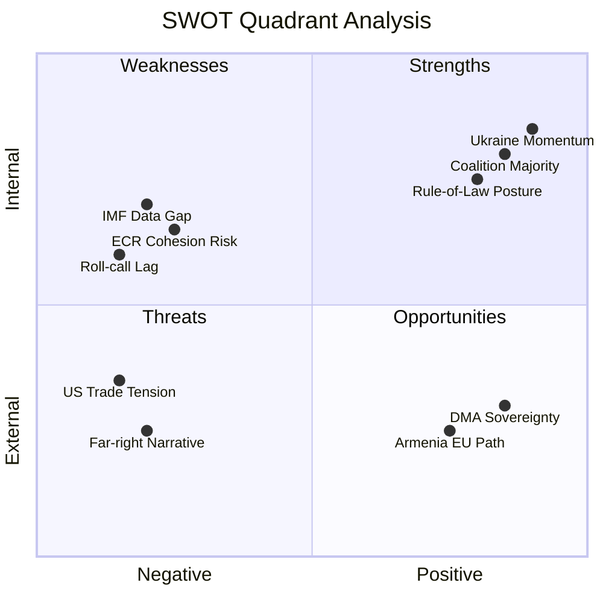

<!-- SPDX-FileCopyrightText: 2026 Hack23 AB -->
<!-- SPDX-License-Identifier: Apache-2.0 -->

# Quantitative SWOT — EP Motions | April 28–30, 2026

**Date:** 2026-05-05

## Quantitative SWOT Framework

Each SWOT item is scored on:
- **Magnitude** (1-10): How large is the strength/weakness/opportunity/threat?
- **Confidence** (0-1): How certain are we of this assessment?
- **Time horizon** (S/M/L): Short (0-3 months), Medium (3-12 months), Long (12+ months)
- **Weighted score**: Magnitude × Confidence

## Strengths (Internal Positive)

| # | Strength | Magnitude | Confidence | Weighted Score | Horizon |
|---|---------|-----------|-----------|----------------|---------|
| S1 | EP10 governing coalition majority (397 core seats) | 9 | 0.95 | 8.55 | S/M/L |
| S2 | Ukraine supermajority structural stability (8+ sessions) | 8 | 0.90 | 7.20 | M/L |
| S3 | Rule-of-law institutional posture (JURI procedures established) | 7 | 0.85 | 5.95 | M/L |
| S4 | Humanitarian consensus (620+ vote floor) | 8 | 0.92 | 7.36 | S/M/L |
| S5 | Von der Leyen Commission alignment with EP agenda | 7 | 0.80 | 5.60 | S/M |
| **Total Strengths** | — | — | — | **34.66** | — |

## Weaknesses (Internal Negative)

| # | Weakness | Magnitude | Confidence | Weighted Score | Horizon |
|---|---------|-----------|-----------|----------------|---------|
| W1 | IMF/economic data unavailable (sandbox firewall) | 5 | 1.00 | 5.00 | S (this run) |
| W2 | Roll-call voting data lag (4-6 weeks) | 6 | 1.00 | 6.00 | S |
| W3 | ECR cohesion declining on immunity votes | 5 | 0.70 | 3.50 | S/M |
| W4 | Far-right narrative machine (112 seats) | 4 | 0.90 | 3.60 | M/L |
| W5 | Budget coalition contested (Renew fragmentation risk) | 5 | 0.60 | 3.00 | M |
| **Total Weaknesses** | — | — | — | **21.10** | — |

## Opportunities (External Positive)

| # | Opportunity | Magnitude | Confidence | Weighted Score | Horizon |
|---|-----------|-----------|-----------|----------------|---------|
| O1 | DMA enforcement → EU digital sovereignty narrative | 7 | 0.75 | 5.25 | S/M |
| O2 | Armenia EU integration momentum | 5 | 0.70 | 3.50 | M/L |
| O3 | Rule-of-law accountability normalisation (immunity precedent) | 6 | 0.65 | 3.90 | M/L |
| O4 | Ukraine accountability → long-term structural commitment | 7 | 0.80 | 5.60 | M/L |
| O5 | Post-recess agenda setting (September-December 2026) | 5 | 0.60 | 3.00 | M |
| **Total Opportunities** | — | — | — | **21.25** | — |

## Threats (External Negative)

| # | Threat | Magnitude | Confidence | Weighted Score | Horizon |
|---|-------|-----------|-----------|----------------|---------|
| T1 | PiS/ECR persecution narrative (Polish domestic politics) | 5 | 0.85 | 4.25 | S/M |
| T2 | US trade retaliation on DMA enforcement | 7 | 0.30 | 2.10 | M |
| T3 | Additional Polish MEP immunity requests (systemic) | 6 | 0.30 | 1.80 | S/M |
| T4 | Ukraine fatigue (PfE narrative gaining traction) | 6 | 0.15 | 0.90 | M/L |
| T5 | PfE-ECR merger (structural realignment) | 9 | 0.05 | 0.45 | L |
| **Total Threats** | — | — | — | **9.50** | — |

## SWOT Quantitative Summary

| Quadrant | Total Weighted Score | Assessment |
|---------|---------------------|-----------|
| Strengths | 34.66 | Strong |
| Weaknesses | 21.10 | Moderate |
| Opportunities | 21.25 | Good |
| Threats | 9.50 | Low-Moderate |

**Net internal position** (S − W): 34.66 − 21.10 = **+13.56** (favourable)
**Net external position** (O − T): 21.25 − 9.50 = **+11.75** (favourable)
**Overall strategic position**: **Positive on both dimensions** — EP10 governing coalition is in a strong strategic position for the outcomes of the April session.

## Strategic Recommendations from Quantitative SWOT

1. **Leverage S1+S3** (coalition majority + rule-of-law posture): Advance further immunity proceedings with confidence; the institutional foundation is solid.
2. **Mitigate W3** (ECR cohesion): Invest in non-Polish ECR engagement to prevent group-wide deterioration.
3. **Capture O4** (Ukraine structural commitment): Use the accountability framework proactively in autumn budget negotiations to demonstrate tangible commitment.
4. **Respond to T1** (persecution narrative): Commission and EPP communications teams need proactive messaging about JURI procedure transparency.

---
*Quantitative SWOT complete: 2026-05-05.*
