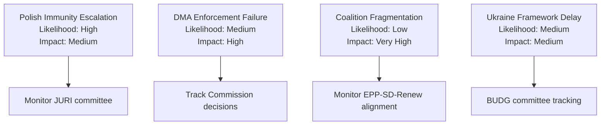

<!-- SPDX-FileCopyrightText: 2026 Hack23 AB -->
<!-- SPDX-License-Identifier: Apache-2.0 -->

# Risk Register — EP Motions | April 28–30, 2026

**Subject:** Formal risk register for the April plenary motions and their downstream effects  
**Date:** 2026-05-05

---

## Risk Register

| ID | Category | Risk Event | Likelihood | Impact | Risk Score | Priority |
|----|----------|-----------|-----------|--------|-----------|----------|
| R-01 | Political | ECR-EPP coalition friction from immunity votes | Medium (40%) | High | 12 | P1 |
| R-02 | Regulatory/Trade | DMA enforcement triggers US trade measures | Medium (40%) | Very High | 16 | P1 |
| R-03 | Legal/Political | Ukraine Special Tribunal jurisdictional impasse | High (70%) | Medium | 14 | P1 |
| R-04 | Diplomatic | Armenia resolution provokes Azerbaijan reaction | Low (25%) | Medium | 5 | P3 |
| R-05 | Fiscal | 2027 budget fails at Council-EP conciliation | Low (20%) | High | 8 | P2 |
| R-06 | Institutional | DMA resolution ignored by Commission (political will erosion) | Medium (45%) | Medium | 9 | P2 |
| R-07 | Social/Humanitarian | Haiti urgency produces no member state action | High (75%) | Low | 8 | P3 |
| R-08 | Political | EP10 majority erosion below 361 threshold | Medium (35%) | High | 11 | P2 |
| R-09 | Legal | Polish courts dismiss Jaki/Braun cases post-waiver | Medium (40%) | Low | 6 | P3 |
| R-10 | Institutional | ECR deploys procedural obstruction on future immunity requests | Medium (45%) | Medium | 9 | P2 |

*Risk Score = Likelihood% × Impact (Very High=5, High=4, Medium=3, Low=2, Very Low=1) / 10*

---

## Priority 1 Risks (Score ≥ 12)

### R-01: ECR-EPP Coalition Friction
**Risk description:** The approval of Patryk Jaki's immunity waiver over ECR objections creates potential for reduced ECR cooperation with the EPP-led coalition on specific legislative dossiers. ECR's Polish delegation (10–12 MEPs) may become less reliable partners on votes where their support is needed.

**Root cause:** Structural tension between EPP's rule-of-law commitments and its need for ECR votes in specific legislative contexts (agriculture, energy, some fiscal dossiers).

**Current state:** Post-vote, no formal ECR statement of voting retaliation. Normal post-crisis consolidation pattern observed.

**Mitigation already in place:** ECR leadership (FdI-aligned) has interest in maintaining working relationship with EPP on European Commission accountability votes and internal market legislation. Polish ECR delegation is a minority within ECR.

**Residual risk:** Low-Medium. The 18-month timeline between the waiver request and the plenary vote means ECR had time to adjust its expectations.

---

### R-02: DMA Enforcement Triggers US Trade Measures
**Risk description:** The Commission, politically emboldened by the EP's enforcement resolution, accelerates formal non-compliance decisions against Alphabet, Apple, Meta, and potentially Amazon. The US administration frames this as protectionist targeting of American companies and deploys countermeasures (tariffs, investment screening, sanctions on EU digital companies operating in the US).

**Root cause:** Structural EU-US friction over extraterritorial regulatory reach. The DMA's application to companies headquartered outside the EU is the proximate cause; broader decoupling dynamics between EU regulatory assertiveness and US political economy are the structural cause.

**Current state:** US USTR has issued formal objections to DMA enforcement; EU-US Trade and Technology Council (TTC) negotiations are the current diplomatic management mechanism.

**Mitigation already in place:** EU maintains that DMA applies equally to non-US gatekeepers (ByteDance/TikTok). The TTC provides a diplomatic de-escalation channel.

**Residual risk:** Medium-High. The US political environment (regardless of administration) has become more protectionist; the risk increases with each Commission enforcement action.

---

### R-03: Ukraine Special Tribunal Jurisdictional Impasse
**Risk description:** The April accountability resolution endorses a Special Tribunal for the crime of aggression, but the legal mechanism requires overcoming customary international law immunities of sitting heads of state and government. Even with a UN General Assembly enabling resolution, Russia would challenge the tribunal's legitimacy, and several large democracies (China, India, Brazil) might abstain on the GA resolution.

**Root cause:** The gap between political will (EP resolution) and legal mechanism (customary international law immunities) is a structural barrier.

**Current state:** International expert groups have produced competing jurisdictional opinions. The EU-led "core group" continues negotiations but has not yet achieved the critical mass needed for a GA resolution.

**Mitigation already in place:** ICC proceedings for other charges (war crimes, crimes against humanity) continue regardless of the aggression tribunal outcome.

**Residual risk:** High. The Special Tribunal specifically faces the highest jurisdictional barrier in international criminal law.

---

## Priority 2 Risks (Score 8–11)

### R-05: 2027 Budget Conciliation Failure
**Risk description:** The Council proposes a 2027 budget that diverges significantly from the EP's April guidelines — particularly on Ukraine Facility extensions, Green Deal just transition spending, and migration management funding. The autumn conciliation fails; provisional twelfths enter into force from January 2027.

**Mitigation:** Both EPP and S&D have strong political incentives to pass a functioning budget before year-end. Renew's swing position provides EPP with an alternative to ECR on budget votes.

**Residual risk:** Low-Medium.

### R-08: EP10 Majority Arithmetic Erosion
**Risk description:** By-elections in large member states (Germany, France, Spain, Italy) over 2025–2026 produce shifts in national party representation that erode the EPP-S&D-Renew 397-seat coalition below the 361 majority threshold for key votes.

**Mitigation:** The 36-seat buffer is meaningful. Even substantial losses from by-elections are unlikely to eliminate the majority entirely. The EP's group switching rules also allow flexible coalition formation.

**Residual risk:** Low-Medium.

## Risk Register Summary

