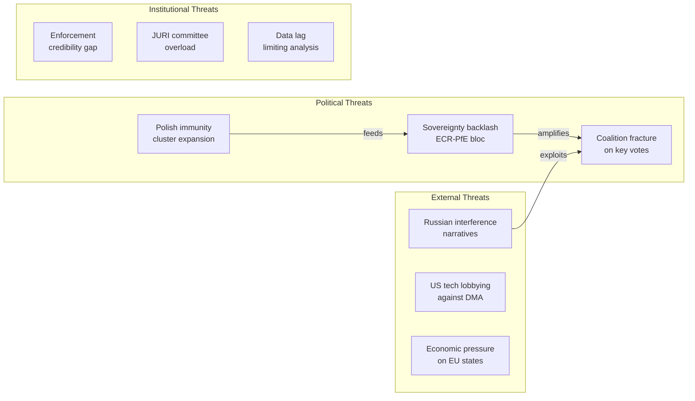

<!-- SPDX-FileCopyrightText: 2026 Hack23 AB -->
<!-- SPDX-License-Identifier: Apache-2.0 -->

# Threat Landscape — EP Motions | April 28–30, 2026

**Subject:** Political threat landscape using Political Threat Framework v4.0 (6-dimension model)  
**Date:** 2026-05-05  
**Framework:** Political Threat Framework v4.0 — NOT STRIDE (which is for cybersecurity). This artifact uses the parliamentary intelligence variant: Institutional Capture, Coalition Fracture, Procedural Obstruction, External Pressure, Disinformation, and Legitimacy Erosion.

---

## Dimension 1: Institutional Capture

**Definition:** Threat actors use institutional positions, procedural rules, or committee structures to block or redirect policy outcomes.

**Active threats:**

**T-IC-01: Committee Chair Delay Tactics**  
ECR-aligned or PfE-aligned committee chairs could use procedural tools (requesting re-referral to committee, calling for further hearings, tabling amendments to extend debate) to delay implementing legislation that follows from adopted resolutions. For DMA enforcement, the IMCO committee's rapporteurship allocation determines how fast the next DMA follow-up regulation (if any) proceeds.  
*Probability: Low-Medium | Impact: Medium | Timeline: 3–12 months*

**T-IC-02: JURI Committee Procedural Defence of ECR Members**  
If future ECR MEPs face immunity requests, ECR has incentive to use JURI committee membership to delay procedures. The standard JURI procedure includes rapporteur appointment, hearing of the MEP, committee deliberation — each step can be slowed.  
*Probability: Medium | Impact: Medium | Timeline: Per case*

**T-IC-03: Budget Committee Blockade on Ukraine Facility Extensions**  
PfE/ECR BUDG committee members can propose amendments to 2027 budget guidelines that would condition Ukraine Facility disbursements on peace negotiation requirements — a structural capture attempt to instrumentalise EU financial power.  
*Probability: Low-Medium | Impact: High | Timeline: October–December 2026*

---

## Dimension 2: Coalition Fracture

**Definition:** Political divisions within nominally aligned groups produce unexpected vote defections, blocking legislative progress.

**Active threats:**

**T-CF-01: EPP Eastern/Western Split on DMA**  
German CDU/CSU MEPs (EPP) are broadly supportive of DMA enforcement; French EPP members are more cautious about trade retaliation; Italian EPP members are split. A 20-MEP EPP defection on a DMA non-compliance decision vote could prevent majority formation.  
*Probability: Medium | Impact: Medium | Timeline: Immediate-ongoing*

**T-CF-02: S&D Anti-Ukraine Minority**  
A small minority within S&D (particularly from parties with traditional pro-Russian alignments, including some Greek, Bulgarian, and Slovak S&D-affiliated parties) consistently abstains or votes against the most aggressive Ukraine accountability formulations. If this minority grows, S&D's contribution to Ukraine majority coalitions diminishes.  
*Probability: Low-Medium | Impact: Medium | Timeline: Ongoing*

**T-CF-03: Renew Group Digital Liberalism vs. Enforcement**  
Renew's free-market wing opposes interventionist enforcement framing. If the DMA enforcement resolution includes language that goes beyond "proportionate enforcement" toward "aggressive intervention," some Renew MEPs from Nordic and German liberal parties (FDP) may abstain.  
*Probability: Low-Medium | Impact: Low-Medium | Timeline: Immediate*

---

## Dimension 3: Procedural Obstruction

**Definition:** Formal procedural mechanisms (referrals back to committee, quorum challenges, points of order, emergency procedure objections) used to delay or block votes.

**Active threats:**

**T-PO-01: Emergency Procedure Objection on Haiti Resolution**  
Urgency resolutions require approval of the urgent procedure by a majority. If PfE/ESN bloc decides to challenge the urgent procedure classification for Haiti, forcing a separate vote, it creates political exposure for those opposing it while potentially delaying the resolution.  
*Probability: Low | Impact: Low | Timeline: Immediate*

**T-PO-02: Quorum Challenge on 2027 Budget Guidelines**  
If the budget guidelines include contested provisions (e.g., specific Green Deal spending figures), a quorum challenge (requesting verification that 361 MEPs are present and voting) could be used to delay or interrupt the vote.  
*Probability: Very Low | Impact: Low | Timeline: Session-specific*

---

## Dimension 4: External Pressure

**Definition:** Non-EP actors (national governments, multinational corporations, foreign governments, international organisations) exert pressure on MEPs or the institution to modify positions.

**Active threats:**

**T-EP-01: US Administration Pressure on DMA**  
The US executive branch (State Department, USTR) has explicitly objected to DMA enforcement targeting of US tech companies. Formal diplomatic demarches to member state capitals (which then pressure MEPs via national parties) is a documented lobbying pathway.  
*Probability: High | Impact: Medium-High | Timeline: Ongoing*

**T-EP-02: Azerbaijani Lobbying on Armenia Resolution**  
Azerbaijan employs a sophisticated European lobbying operation (documented in "Caviar diplomacy" investigations). MEPs in countries with significant Azerbaijan trade/energy relationships (Italy, Hungary, Austria) may receive pressure to weaken Armenia resolution language.  
*Probability: Medium | Impact: Low-Medium | Timeline: Pre-vote*

**T-EP-03: Russian Information Operations on Ukraine Resolution**  
Russia's documented information operations targeting European public opinion and MEPs (particularly in PfE/ECR-adjacent national party networks) seek to create scepticism about accountability mechanisms, framing them as escalatory.  
*Probability: High | Impact: Low-Medium (net) | Timeline: Ongoing*

---

## Dimension 5: Disinformation

**Definition:** False or misleading narratives about EP procedures, MEP conduct, or legislative content spread through media and social media channels.

**Active threats:**

**T-DI-01: Immunity Waiver "Political Persecution" Narrative**  
Pro-ECR/PiS media (predominantly Polish-language online ecosystems, with some pan-European right-wing media amplification) frames the Jaki immunity waiver as politically motivated persecution. This narrative targets Polish domestic opinion, not the EP vote outcome (which is already decided).  
*Probability: High (already occurring) | Impact: Low-Medium | Timeline: Immediate*

**T-DI-02: DMA "Anti-American Protectionism" Framing**  
US tech sector-aligned media frames DMA enforcement as discriminatory protectionism. If this narrative is adopted by US political figures, it creates trade retaliation risk (Dimension 4).  
*Probability: High (ongoing) | Impact: Medium | Timeline: Ongoing*

---

## Dimension 6: Legitimacy Erosion

**Definition:** Sustained attacks on the EP's legitimacy, authority, or democratic mandate that reduce the political weight of its resolutions.

**Active threats:**

**T-LE-01: Non-Binding Resolution Fatigue**  
Critics from both left (The Left group — insufficient action) and right (ECR/PfE — overreach) characterise the EP's external affairs resolutions as performative. If this framing becomes dominant, EP resolutions lose their signalling value.  
*Probability: Medium | Impact: Medium | Timeline: Long-term*

**T-LE-02: ECR/PfE "Democratic Deficit" Narrative**  
Far-right groups consistently invoke EP10's reliance on EPP-S&D-Renew coalition as evidence of an unrepresentative "globalist supermajority" ignoring the 300+ seats of ECR/PfE/ESN/NI. The immunity waivers intensify this framing.  
*Probability: High | Impact: Low-Medium | Timeline: Ongoing*

## Threat Landscape Overview

