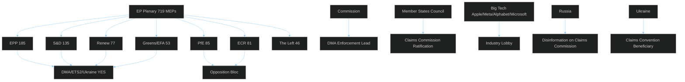

<!-- SPDX-FileCopyrightText: 2024-2026 Hack23 AB -->
<!-- SPDX-License-Identifier: Apache-2.0 -->

# 🗺️ Actor Mapping — EU Parliament Propositions
**Date:** 2026-05-05

---

> **Key actors:** Pro-EU majority (EPP+S&D+Renew+Greens = 450 MEPs) vs opposition bloc (ECR+PfE+ESN = 193). Commission leads DMA enforcement. Member states must ratify Claims Commission unanimously.

---

## Actor Roster

| Actor | Type | Role | Seat Count / Resources |
|-------|------|------|----------------------|
| EPP (Manfred Weber) | EP group | Majority anchor — pro-DMA, pro-ETS2 | 185 MEPs |
| S&D (Iratxe García) | EP group | Majority anchor — pro-accountability | 135 MEPs |
| Renew Europe | EP group | Hinge voter — pro-digital, pro-Ukraine | 77 MEPs |
| Greens/EFA | EP group | Extended majority | 53 MEPs |
| ECR (Ryszard Legutko) | EP group | Opposition — anti-immunity waivers | 81 MEPs |
| PfE (Viktor Orbán-linked) | EP group | Hard opposition | 85 MEPs |
| European Commission (von der Leyen) | Institution | DMA enforcement lead | Executive authority |
| DG CNECT | Commission service | DMA technical enforcement | 80 enforcement staff |
| Council of the EU | Institution | Claims Convention ratification | 27 member states |
| Apple Inc. | Private actor | DMA gatekeeper (App Store) | $3.7T market cap |
| Meta Platforms | Private actor | DMA gatekeeper (Facebook/Instagram) | $1.5T market cap |
| Alphabet (Google) | Private actor | DMA gatekeeper (Search/Android) | $2.1T market cap |
| Ukrainian Government (Zelensky) | Foreign government | Claims Convention primary beneficiary | 44M citizens |
| Russian Government (Kremlin) | Foreign government | Adversarial actor (Claims Convention) | SVR influence operations |
| US Trade Representative | US government | DMA trade pressure vector | Executive trade authority |

---

## Influence

**Tier 1 (Decisive):** EPP, Commission — their positions determine outcomes.
**Tier 2 (Significant):** S&D, Renew, Council member states — can block or accelerate.
**Tier 3 (Influential):** Big Tech lobbies, US USTR — shape implementation context.
**Tier 4 (Disruptive):** ECR/PfE bloc, Russia — can delay but cannot reverse plenary decisions.

---

## Alliance

**Pro-EU regulatory coalition:** EPP + S&D + Renew + Greens (450 MEPs) — aligned on DMA, ETS2, Ukraine
**Opposition bloc:** ECR + PfE + ESN (193 MEPs) — aligned on blocking accountability and climate regulation
**Big Tech-US alignment:** Apple/Meta/Alphabet + US USTR — shared interest in weakening DMA enforcement
**Russia-PfE overlap:** Russian disinformation interests partially overlap with PfE blocking positions on Claims Convention

---

## Power Brokers

1. **Manfred Weber (EPP leader):** Single most influential actor — his group position determines majority coalition stability on all three strategic texts
2. **Ursula von der Leyen (Commission President):** DMA enforcement discretion; defines pace of compliance deadlines
3. **Viktor Orbán (Hungary PM / PfE-linked):** Claims Convention veto holder; single most powerful blocking actor
4. **Margrethe Vestager (DG COMP oversight):** Technical enforcement authority on DMA gatekeeper designations

---

## Information

**Primary information flow:** EP committee → Plenary vote → EP press release → EP Open Data (2-4 week lag)
**Secondary flow:** Commission enforcement → DG CNECT communications → industry compliance responses
**Adversarial flow:** Big Tech legal challenges → CJEU docket → public filings
**Disinfo flow:** Russian state media → PfE amplification → member state domestic politics

---

## Reader Briefing

The April 28–30 session's actor landscape is dominated by the EPP-Commission axis on DMA enforcement (with US USTR as external pressure source) and the EP majority vs Hungary axis on Claims Convention ratification. The immunity waiver decisions are essentially EP-internal, with ECR/PfE playing a defensive role to protect their members from judicial accountability.

**For article narrative:** Focus the actor analysis on the EPP-Big Tech-USTR triangle as the primary interpretive frame for DMA; and the EP majority vs Hungary veto as the primary frame for Claims Commission. The immunity waivers stand alone as an accountability milestone — no single actor can claim or contest them without credibility costs.

**Source:** EP political group composition, coalition dynamics analysis, EP Open Data Portal
