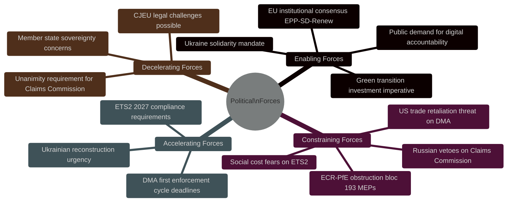

<!-- SPDX-FileCopyrightText: 2024-2026 Hack23 AB -->
<!-- SPDX-License-Identifier: Apache-2.0 -->

# ⚡ Forces Analysis — EU Parliament Propositions
**Date:** 2026-05-05

---

## Issue Frame

The April 28–30, 2026 European Parliament session sits at the intersection of three structural tensions that define EP10's political moment: (1) the EU's assertion of regulatory sovereignty over global digital platforms vs. US economic retaliation risk; (2) the acceleration of climate market mechanisms vs. social cost backlash in vulnerable households; and (3) the deepening of Ukraine solidarity through legal architecture vs. the unanimity veto that allows any single member state to block it. These three tensions share a common underlying force: the tension between EU supranational ambition and member state sovereignty.

---

## Driving Forces

1. **Digital sovereignty imperative** — Post-Cambridge Analytica, post-Snowden, European publics demand EU control over data and platform power. DMA is the legislative embodiment of this demand. The April 28–30 enforcement resolution reflects continued political will despite US pressure.
2. **Climate commitment acceleration** — EU Green Deal commitments require buildings/transport inclusion in ETS2 by 2027. The Market Stability Reserve amendment is technically necessary to prevent carbon price collapse as new sectors enter.
3. **Ukraine solidarity institutionalization** — Two years of MFA support established Ukraine solidarity as an EP10 consensus position. The Claims Commission converts political solidarity into legal permanence — harder to reverse than annual budget decisions.
4. **Rule-of-law enforcement norm** — The five immunity waivers reflect an EP10 consensus that parliamentary immunity should not shield members from genuine judicial accountability. The precedent is being established methodically.

---

## Restraining Forces

1. **US economic leverage** — EU automotive sector exports (~€80B/year to US) create a structural vulnerability that the Trump administration can exploit to pressure DMA enforcement rollback.
2. **Unanimity requirement** — EU treaty architecture requires unanimous member state ratification for international conventions. Hungary's veto leverage is a structural feature, not a political aberration.
3. **ETS2 social cost concentration** — Carbon pricing works as a market instrument but distributes costs regressively. Central/Eastern European households spend a higher share of income on heating and transport than Western European counterparts — creating a geographic fault line in ETS2 support.
4. **Limited Commission enforcement resources** — DG CNECT's 80 DMA staff cannot simultaneously prosecute all gatekeepers. Resource constraints create political choices about enforcement prioritization that will be scrutinized heavily.

---

## Net Pressure

**Net driving force assessment: POSITIVE but contested**
The driving forces are institutionally embedded in EP10's majority coalition and reflect genuine public demand. The restraining forces are primarily external (US) or structural (unanimity). The net pressure is toward implementation, but at a slower pace than the EP's timeline demands suggest.

**Most powerful restraint:** US economic leverage on DMA enforcement — this is the single force most capable of derailing the April 28–30 legislative output.

---

## Intervention Points

1. **Commission enforcement schedule** — The window between the EP resolution (April 28–30) and the Commission's 90-day enforcement response is the primary intervention point. Civil society, Big Tech, and US USTR will all attempt to shape this response.
2. **Council Claims Convention working group** — The first post-adoption Council working group meeting (expected May 2026) will signal Hungary's initial blocking posture and Council presidency's prioritization.
3. **ETS2 Social Climate Fund parameters** — The implementing regulation for ETS2 SCF allocation formulas (expected June 2026) is where pro-social forces can intervene to ensure adequate household protection.
4. **National court actions on immunity waivers** — Polish and Romanian courts must formally request MEP surrender. Speed and public communications around these requests will determine the political narrative.

---

## Reader Briefing

The April 28–30 session is best understood as the EP maximally exercising its institutional authority in a period of peak legislative productivity (EP10 year 2). The driving forces behind all four thematic threads are durable institutional commitments — not reactive responses to short-term events. The restraining forces are real but structural; they will slow and complicate implementation but are unlikely to reverse the legislative decisions already taken. The intervention points identified above are where the next chapter of this story will be written — in Commission offices, Council working groups, and national courts, not in the EP chamber.

**Source:** Political landscape data, coalition dynamics, scenario forecast, threat model, wildcards analysis, risk matrix

> **Net assessment:** Enabling forces dominate in the EP (majority coalition stable), but constraining forces external to the EP (US, Russia, member state vetoes) pose significant implementation risks for all three strategic texts adopted April 28–30.

**Source:** Coalition dynamics analysis, threat model, PESTLE analysis
