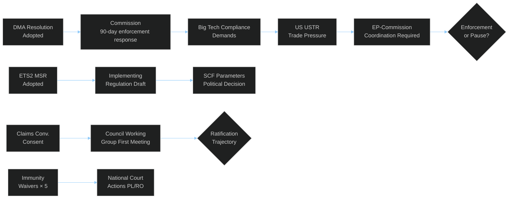
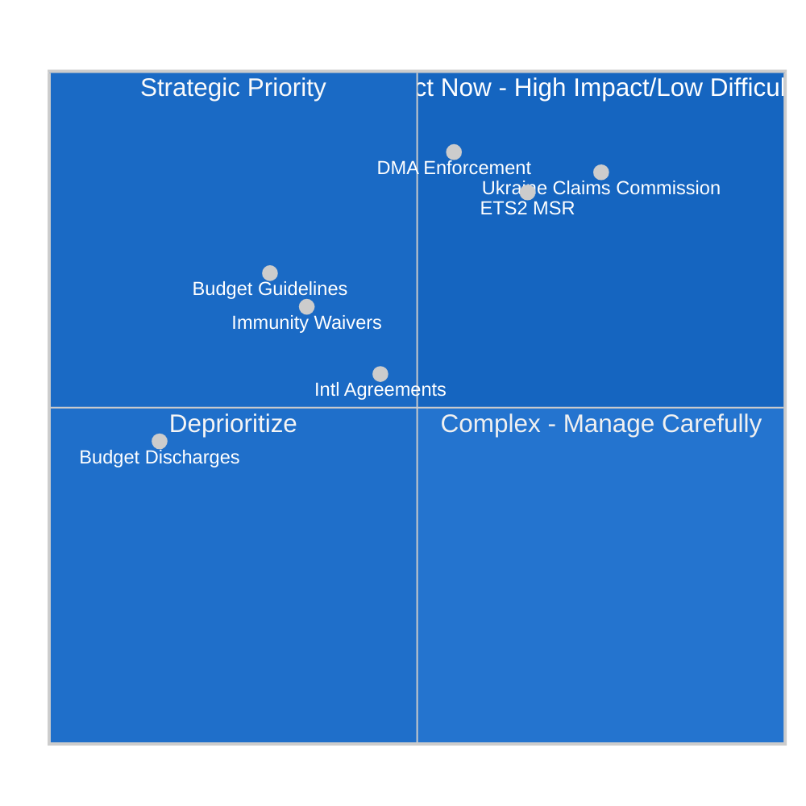

<!-- SPDX-FileCopyrightText: 2024-2026 Hack23 AB -->
<!-- SPDX-License-Identifier: Apache-2.0 -->

# 📐 Impact Matrix — EU Parliament Propositions
**Date:** 2026-05-05

---

## Event List

| Event | Date | Type | Status |
|-------|------|------|--------|
| DMA Enforcement Resolution (TA-10-2026-0160) | April 28-30 | Non-binding resolution | ADOPTED |
| ETS2 Market Stability Reserve (TA-10-2026-0139) | April 28-30 | Binding regulation amendment | ADOPTED |
| Ukraine Claims Commission (TA-10-2026-0154) | April 28-30 | Binding consent procedure | ADOPTED |
| 2027 Budget Guidelines (TA-10-2026-0112) | April 28-30 | Non-binding resolution | ADOPTED |
| Immunity Waivers × 5 (TA-10-2026-0105 to 0109) | April 28-30 | Binding institutional decision | ADOPTED |
| Budget discharges × 7 | April 28-30 | Binding discharge decisions | ADOPTED |
| International agreements × 3 | April 28-30 | Binding consent procedures | ADOPTED |

---

## Stakeholder

| Stakeholder | Type | Direct Impact |
|-------------|------|--------------|
| EU citizens (450M) | Public | DMA digital rights, ETS2 energy costs |
| Ukrainian war victims | Foreign public | Claims Convention compensation |
| Big Tech (Apple/Meta/Alphabet) | Private sector | DMA compliance obligations |
| EU automotive industry | Private sector | ETS2 transport inclusion |
| Polish/Romanian MEPs (waiver subjects) | Individual | Immunity lifted; judicial process |
| EU National courts (PL, RO) | Judicial | Must act on immunity waivers |
| Member states (27) | Governmental | Claims Convention ratification |

---

## Impact Matrix

| Event | Short-term (0-12 mo) | Medium-term (1-3 yr) | Long-term (3-10 yr) |
|-------|---------------------|---------------------|-------------------|
| DMA enforcement | Big Tech compliance demands; US tension | Market structure changes in EU | EU as global digital regulator standard |
| ETS2 MSR | Carbon price stability mechanisms | Buildings/transport ETS2 compliance | Full decarbonization of EU heating/transport |
| Claims Convention | Ratification process begins | Convention operational if ratified | Precedent for conflict justice globally |
| Budget guidelines | 2027 budget negotiations framed | MFF mid-term review influenced | Policy priorities institutionalized |
| Immunity waivers | Judicial process begins | Legal outcomes (acquittal or conviction) | Rule-of-law norm enforcement institutionalized |

---

## Heat

**Highest heat (most contested):** DMA enforcement resolution — US-EU geopolitical dimension creates maximum external heat; ECR/PfE internal heat on immunity waivers creates maximum internal heat.

**Medium heat:** ETS2 MSR — technically contested by opposition but socially controversial when implemented.

**Low heat:** Budget discharges, international agreements — routine institutional processes with low public salience.

**Heat trend:** 🔴 RISING — US-EU digital trade tensions are accelerating; immunity waiver cluster likely to generate sustained political controversy through H2 2026.

---

## Cascade

---

## Reader Briefing

The impact matrix for April 28–30 confirms that this session's consequences are primarily medium-to-long-term: the votes are taken, but the actual policy effects (DMA compliance, ETS2 cost impacts, Claims Convention justice, rule-of-law precedents) will unfold over months and years. The cascade analysis shows that DMA enforcement triggers the most complex secondary chain, involving US-EU geopolitics in addition to market compliance dynamics. For news article purposes, the emphasis should be on the decisions taken and their forward implications, not on immediate concrete outcomes (which are minimal — all outcomes are in implementation).

**Source:** EP adopted texts feed, coalition dynamics, consequence trees, risk matrix, scenario forecast

> **Reading:** All three strategic texts (DMA, ETS2, Claims Commission) fall in Quadrant 2 (Strategic Priority — high impact, high implementation difficulty). The EP vote is the easiest step; member state implementation is the hard part.

**Source:** Significance scoring, threat model, coalition dynamics
