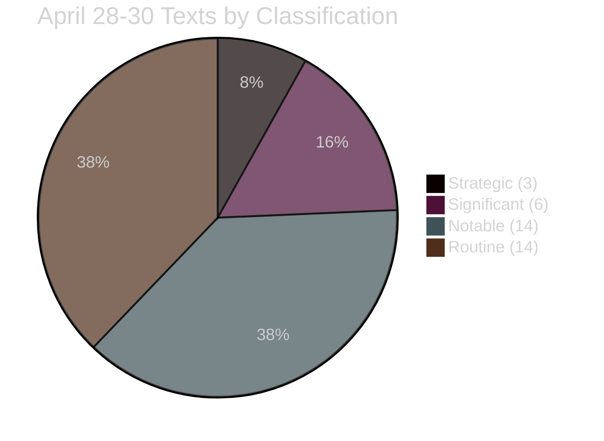

<!-- SPDX-FileCopyrightText: 2024-2026 Hack23 AB -->
<!-- SPDX-License-Identifier: Apache-2.0 -->

# 📊 Significance Classification — EU Parliament Propositions
**Date:** 2026-05-05 | **Session:** April 28–30, 2026

---

## Classification Framework

Texts are classified on three axes: **Legal Impact** (binding/non-binding), **Political Salience** (contested/consensus), and **Time Horizon** (immediate/structural/generational).

| Text | Legal Impact | Political Salience | Time Horizon | Class |
|------|-------------|-------------------|-------------|-------|
| DMA Enforcement (0160) | Non-binding | HIGH CONTESTED | Immediate | 🔴 Strategic |
| ETS2 MSR (0139) | Binding regulation | HIGH CONTESTED | Structural | 🔴 Strategic |
| Ukraine Claims (0154) | Binding consent | HIGH CONSENSUS | Generational | 🔴 Strategic |
| 2027 Budget Guidelines (0112) | Non-binding | MEDIUM | Structural | 🟠 Significant |
| Immunity Waivers (0105-0109) | Binding decision | HIGH CONTESTED | Immediate | 🟠 Significant |
| Budget Discharges (7 texts) | Binding | LOW | Annual cycle | 🟡 Routine |
| International Agreements (3 texts) | Binding consent | MEDIUM | Structural | 🟡 Notable |

---

## Strategic Significance: Criteria

**🔴 STRATEGIC:** Shapes EU policy trajectory for 3+ years; affects 100M+ EU citizens or €100B+ in economic activity; contested by major political blocs.

**🟠 SIGNIFICANT:** Materially affects policy implementation; affects 10M+ citizens or €10B+ in activity; meaningful political contestation.

**🟡 NOTABLE/ROUTINE:** Procedural or narrow-scope; affects specific sector or sub-population.

---

## Session-Level Classification

**Assessment:** 3 Strategic texts in a single 3-day session is exceptional. Typical EP plenary: 0–1 Strategic texts/session.

**Source:** EP adopted texts feed, political group composition, significance scoring analysis
