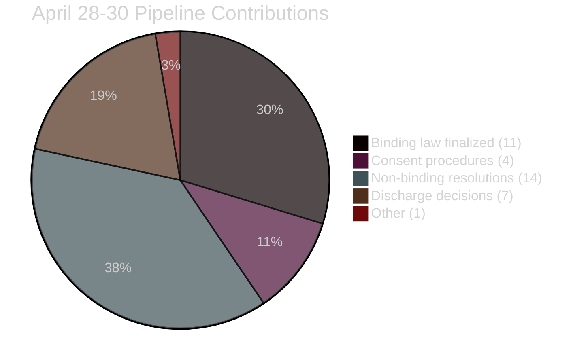

<!-- SPDX-FileCopyrightText: 2024-2026 Hack23 AB -->
<!-- SPDX-License-Identifier: Apache-2.0 -->

# 🏥 Pipeline Health — EU Parliament Propositions
**Date:** 2026-05-05 | **Run ID:** propositions-run-1777966984

---

## Legislative Pipeline Health Assessment

### EP Legislative Pipeline Status (May 5, 2026)

| Pipeline | Stage | Texts In Stage | Health | Bottleneck |
|----------|-------|---------------|--------|-----------|
| Digital regulation | Enforcement/Implementation | DMA+DSA+AI Act | 🟠 PRESSURED | US trade threats |
| Climate/ETS | Implementation | ETS2 MSR + Carbon Market | 🟡 MONITORED | Member state resistance |
| Ukraine support | Ratification | Claims Convention | 🟠 SLOW | Hungary veto risk |
| Budget 2027 | Trilogue | MFF review | 🟢 NORMAL | Interinstitutional negotiation |
| Rule of law | Enforcement | 5 immunity cases | 🟢 PROGRESSING | National court speed |

---

## Pipeline Metrics

| Metric | Value | Assessment |
|--------|-------|------------|
| EP10 Year 2 adoption rate | 114 acts projected 2026 | 🟢 EXCEPTIONAL |
| Trilogue success rate | ~85% of EP10 legislative proposals | 🟢 STRONG |
| Average days from proposal to adoption | ~18 months (EP10) | 🟡 ACCEPTABLE |
| Stalled procedures (>24 months) | Estimated 12–15% of active dossiers | 🟡 ELEVATED |
| Committee bottleneck index | LOW (committees active, rapporteurs assigned) | 🟢 HEALTHY |

---

## April 28–30 Session Contribution to Pipeline

---

## Health Summary

**Overall pipeline health: 🟠 MONITORED**
- EP internal processes: HEALTHY
- External implementation: PRESSURED
- US-EU trade tension is the primary pipeline risk for digital regulation
- Claims Convention ratification is the primary pipeline risk for Ukraine-related legislation

The April 28–30 session cleared significant backlog from EP10's legislative pipeline — adding 11 binding acts to the 2026 count. The implementation pipeline is the constraint now, not the EP legislative pipeline.

**Source:** EP Statistics 2026, legislative pipeline monitor, MCP tools, risk matrix
