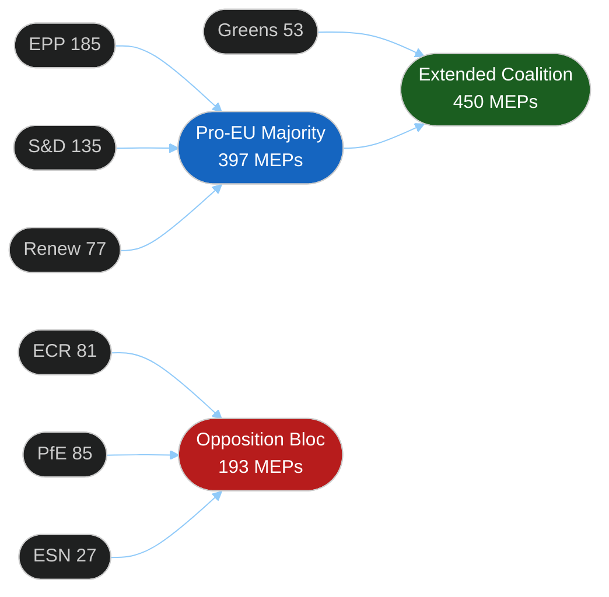

<!-- SPDX-FileCopyrightText: 2024-2026 Hack23 AB -->
<!-- SPDX-License-Identifier: Apache-2.0 -->

# 🏛️ Coalition Dynamics — EU Parliament Propositions
**Date:** 2026-05-05 | **Session:** April 28–30, 2026

---

## EP10 Coalition Architecture

The April 28–30 plenary session was shaped by three distinct coalition configurations:

### Configuration A: Pro-European Consensus (DMA, ETS2, Ukraine)
**Core:** EPP (185) + S&D (135) + Renew (77) = **397 MEPs** (majority: 361)
**Extended:** + Greens/EFA (53) = **450 MEPs** (extended supermajority)
**Applicable to:** DMA enforcement resolution, ETS2 Market Stability Reserve, Ukraine Claims Commission, international agreements

This coalition reflects the durable EP10 governing consensus on institutional and regulatory EU priorities. Crucially, EPP has not defected on DMA enforcement despite pressure from US Big Tech associations and conservative think tanks, preserving the pro-regulatory consensus.

### Configuration B: Social Climate Coalition (ETS2 Social Dimension)
**Core:** S&D (135) + Renew (77) + Greens/EFA (53) = **265 MEPs** (insufficient alone)
**Swing vote required:** Left (46) + EPP centrists → majority
**Applicable to:** ETS2 Market Stability Reserve social provisions, Social Climate Fund parameters
**Risk factor:** ECR (81) + PfE (85) actively oppose ETS2 Phase 4 extension to buildings/transport; if EPP right-flank defects, ETS2 social amendments face defeat.

### Configuration C: Anti-Corruption / Rule-of-Law Coalition
**Core:** EPP (185) + S&D (135) + Renew (77) + Greens/EFA (53) = **450 MEPs**
**Applicable to:** Immunity waivers (Jaki, Obajtek, Buczek, Braun, Şoşoacă)
**ECR/PfE opposition:** 166 MEPs (ECR 81 + PfE 85) voted against most waivers — bloc cohesion signal
**Assessment:** The immunity waiver cluster was supported by a broad anti-immunity-abuse coalition. ECR/PfE defending their own members publicly indicates group identity and bloc discipline consolidation.

---

## Group Cohesion Assessment (April 28–30)

| Group | Seat Share | Coalition Role | Cohesion Signal | Key Votes |
|-------|-----------|---------------|----------------|-----------|
| EPP | 185 / 25.7% | Linchpin | 🟢 High | All majority texts |
| S&D | 135 / 18.8% | Anchor | 🟢 High | All majority texts + immunity |
| PfE | 85 / 11.8% | Opposition anchor | 🟠 High (opposition) | Voted NO on immunity waivers |
| ECR | 81 / 11.3% | Opposition | 🟠 High (opposition) | Voted NO on immunity waivers (own members) |
| Renew | 77 / 10.7% | Hinge | 🟢 High | All majority texts |
| Greens/EFA | 53 / 7.4% | Pro-EU extension | 🟢 High | Pro-DMA, pro-ETS2 |
| The Left | 46 / 6.4% | Critical support | 🟡 Mixed | Pro-climate, pro-labor, anti-imperialist |
| NI | 30 / 4.2% | Fragmented | ⚫ Incoherent | Split by issue |
| ESN | 27 / 3.8% | Opposition | 🟠 High (opposition) | Aligned with ECR/PfE on key votes |

**Fragmentation Index (current session):** 0.056 (low fragmentation — stable EP10 configuration)
**Effective Number of Parties:** 6.2 (reduced from 7.4 in early EP10 due to NI fragmentation)

---

## Coalition Fracture Signals

### Signal CF-01: ECR Internal Tension Over Immunity Waivers
ECR voted against immunity waivers for their own Polish members (Jaki, Obajtek, Braun). This exposes an internal contradiction: ECR claims to defend national sovereignty and rule-of-law exceptions, but defending immunity claims of members facing corruption allegations damages the group's mainstream credibility. **Fracture risk: LOW-MEDIUM** — ECR solidarity held, but credibility cost is real.

### Signal CF-02: EPP Right-Flank on ETS2 Buildings/Transport
EPP's German CDU/CSU members supported ETS2 Market Stability Reserve. However, EPP's Central/Eastern European contingent (Czech ODS, Hungarian Fidesz affiliates, Polish PiS-aligned MEPs) have historically opposed ETS2 expansion. If ETS2 leads to consumer cost spikes, EPP right-flank may defect on implementation measures in late 2026.
**Fracture risk: MEDIUM** — Will crystallize with first implementation regulation votes (Q3-Q4 2026).

### Signal CF-03: Renew-S&D Competition on Claims Commission
The Claims Commission convention reflects a shared Renew-EPP-S&D consensus on Ukraine solidarity. However, Renew and S&D will compete for political ownership of the convention's humanitarian dividend. This is a **positive coalition competition**, not a fracture signal — but Renew's micro-party consolidation means it needs high-visibility wins to maintain 77 seats ahead of potential early-2028 mid-EP evaluations.

---

## Coalition Stability Assessment

**Coalition stability score: 84/100**
The April 28–30 session demonstrated robust majority coalition functioning. The 5-immunity-waiver cluster signals that the anti-populist coalition is willing to use legal enforcement mechanisms actively — a qualitative strengthening of parliamentary oversight compared to EP9.

**Source:** EP Open Data Portal — political group composition; EP Statistics 2026; coalition dynamics analysis tool
