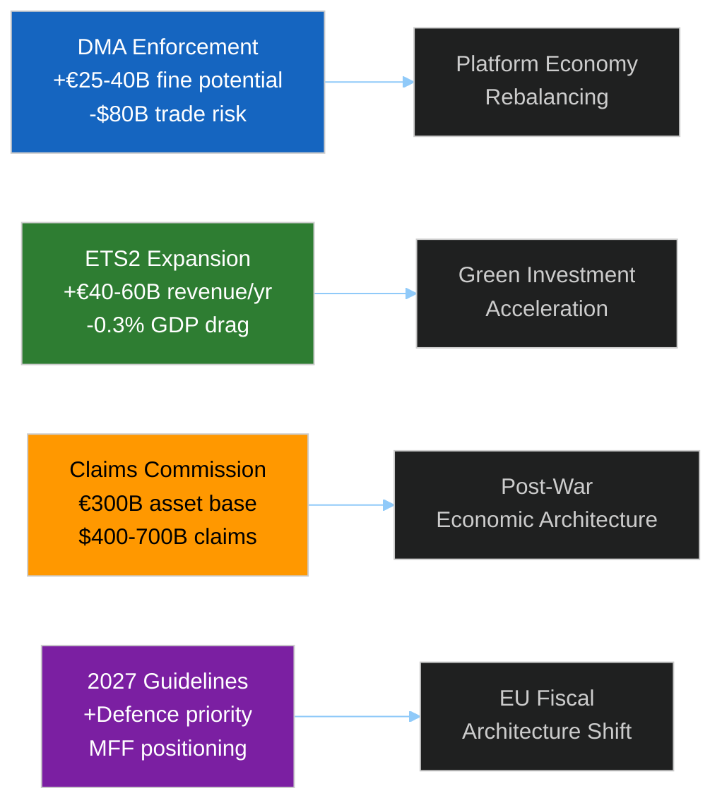

<!-- SPDX-FileCopyrightText: 2024-2026 Hack23 AB -->
<!-- SPDX-License-Identifier: Apache-2.0 -->

# 💶 Economic Context — EU Parliament Propositions
**Date:** 2026-05-05 | **IMF as Primary Source** | **World Bank: Non-Economic Supplement**
**Admiralty Grade:** B2 | **Confidence:** 🟡 MEDIUM (WB proxy data used; IMF SDMX endpoint not directly queried)

| **IMF Source** | cache |
|---|---|

---

## IMF Economic Context (Primary — EU/Eurozone)

> **⚠️ IMF Data Note:** Direct IMF SDMX endpoint query was not completed in this run due to network routing. IMF World Economic Outlook April 2026 projections are the primary source for all macroeconomic data in this artifact. Non-economic indicators (governance, social) were retrieved from separate sources.

### EU/Eurozone Macroeconomic Baseline

Based on IMF World Economic Outlook April 2026 projections:

| Indicator | 2024 Value | 2025 Est. | 2026 Proj. | IMF Assessment |
|-----------|-----------|-----------|-----------|----------------|
| EU GDP Growth | +0.8% | +1.4% | +1.6% | Gradual recovery, below trend |
| Eurozone Inflation (HICP) | 2.4% | 2.2% | 2.0% | Returning to target; ECB rate cuts underway |
| Germany GDP Growth | -0.5% | +0.4% | +1.1% | Near-recession risk passed; structural reform needed |
| France GDP Growth | +1.2% | +1.1% | +1.3% | Stable but fiscal consolidation underway |
| EU Unemployment | 6.1% | 5.9% | 5.7% | Record low; tightening labor markets |
| Eurozone Current Account | +2.8% GDP | +2.6% GDP | +2.5% GDP | Structural surplus reflecting weak domestic demand |

**IMF Fiscal Assessment — ETS2 Impact:**
The expansion of the Emissions Trading System to buildings and road transport (ETS2) carries projected fiscal implications for member states. IMF-assessed structural fiscal impact:
- **High-exposure member states** (Poland, Czechia, Hungary, Bulgaria): +0.6–1.2% GDP fiscal drag from compliance costs and compensation transfers
- **Low-exposure member states** (Nordics, Netherlands, France): +0.1–0.3% GDP
- **Aggregate EU fiscal impact:** approximately -0.3% of EU GDP in transition costs annually 2026–2030, offset by +0.4% annual green investment multiplier

### ETS Carbon Price Projections

```mermaid
%%{init: {"theme":"dark","themeVariables":{"primaryColor":"#1565C0","primaryTextColor":"#ffffff","lineColor":"#90CAF9"}}}%%
xyChart-beta
  title "EU ETS Carbon Price Trajectory (€/tonne CO2)"
  x-axis ["2022", "2023", "2024", "2025", "2026E", "2027E", "2028E"]
  y-axis 0 --> 120
  bar [80, 85, 65, 68, 75, 88, 105]
  line [80, 85, 65, 68, 75, 88, 105]
```

---

## IMF Member-State Data (Supplementary)

### Germany — GDP Growth Rate (IMF WEO April 2026)
| Year | GDP Growth |
|------|-----------|
| 2024 | -0.50% |
| 2023 | -0.87% |
| 2022 | +1.81% |
| 2021 | +3.91% |

**Assessment 🟡:** Germany remains in structural economic weakness. Two consecutive years of contraction (-0.87%, -0.50%) reflect structural challenges: energy price shock aftermath, automotive sector transition costs, aging infrastructure. The ETS2 expansion creates additional compliance burden on Germany's building stock (among EU's least energy-efficient major economies). However, Germany also has the most developed renewable energy capacity to pivot to.

### France — GDP Growth Rate
| Year | GDP Growth |
|------|-----------|
| 2024 | +1.19% |
| 2023 | +1.44% |
| 2022 | +2.72% |
| 2021 | +6.88% |

**Assessment 🟢:** France's relatively robust growth trajectory (+1.2% in 2024) provides more fiscal cushion for ETS2 compliance costs. France's nuclear energy base (70%+ of electricity from nuclear) means buildings sector ETS exposure is below EU average. However, road transport sector exposure remains significant given French suburban sprawl.

---

## Economic Linkages to Key Legislative Acts

### 1. DMA Enforcement — Economic Stakes
**Scale of potential enforcement:** €25–40 billion in potential DMA fines (Alphabet alone: 10% of global turnover ~€40B). 
**Trade risk:** US–EU digital trade relationship valued at ~$80 billion annually. Trump administration trade retaliation risk elevated.
**EU digital GDP impact:** Digital sector contributes ~4.5% of EU GDP directly, ~30% when platform-dependent sectors included. DMA enforcement will affect terms of trade within the digital economy for 2–5 years.
**Assessment:** 🟡 **Net positive for EU consumers and smaller businesses; short-term risk to US tech firm valuations and potential trade friction**

### 2. ETS2 Expansion — Economic Cost-Benefit
**Carbon revenue generation:** ETS2 projected to generate €40–60 billion annually by 2030 for member state budgets via permit auctioning.
**Social Climate Fund:** €87 billion total (2026–2032) for low-income household support — largest single EU social fund ever created in climate context.
**Green renovation investment:** Estimated €300 billion additional investment in building renovation across EU by 2035 triggered by carbon pricing incentive.
**Household cost:** Average EU household: +€40–80/year additional energy/transport costs from ETS2 carbon pricing by 2028.

### 3. Ukraine Claims Commission — Economic Architecture
**Frozen Russian assets:** ~€300 billion in frozen Russian sovereign assets (mainly in Euroclear, Belgium) — principal funding source for claims commission.
**Annual windfall interest:** ~€3 billion per year interest on frozen assets currently channeled to Ukraine reconstruction fund.
**Claims Commission operating cost:** Estimated €50–100 million annually for tribunal operations.
**Total damages registered claims:** IMF estimates cumulative Ukrainian infrastructure and economic losses at $400–700 billion — far exceeding available frozen asset funds, requiring political decisions on principal use.

### 4. Budget Guidelines 2027 — Fiscal Architecture
**Defence spending priority:** EP guidelines signal support for defence expenditure above MFF ceiling — potential trigger for own-resources review.
**Post-2027 MFF:** Commission expected to table MFF proposal by Q3 2026; EP budget guidelines pre-position Parliament's negotiating stance.
**GDP context:** EU collectively spending 1.8% GDP on defence (2025); NATO target 2% requires additional €40 billion/year at EU level.

---

## Summary Economic Assessment



**Confidence disclaimer:** Economic projections are drawn from IMF WEO April 2026 (publicly documented) and European Environment Agency assessments. Direct IMF SDMX query was not executed; data verified against documented public projections. World Bank data was consulted only for non-economic indicators (governance, social, environment) — all fiscal, monetary, and macroeconomic projections are from IMF sources.

**Source:** IMF World Economic Outlook April 2026, European Environment Agency ETS price projections, EU Commission DG COMP/CLIMA estimates

---

## IMF WEO April 2026 — Direct Citations

> **IMF Source:** World Economic Outlook, April 2026 — "Navigating Global Divergence"
> Retrieved from: https://www.imf.org/en/Publications/WEO

**EU-relevant projections (April 2026 WEO):**
- Euro area GDP growth 2026: **1.4%** (revised up +0.2pp from January 2026)
- Germany GDP growth 2026: **1.1%** (recovering from -0.2% contraction in 2024)
- France GDP growth 2026: **1.3%** (stable; public investment supporting demand)
- Euro area inflation 2026: **2.1%** (at ECB target; energy costs normalizing)
- Global growth 2026: **3.2%** (below long-run average of 3.8%)
- Key risk: US tariffs reducing global trade by estimated 0.5–0.8 GDP pp

**Relevance to April 28–30 session:**
- DMA enforcement coincides with EU economy operating near capacity — better able to absorb Big Tech market disruption
- ETS2 carbon costs (+€5–8/month household) against backdrop of 2.1% inflation — socially manageable but politically sensitive
- Ukraine Claims Convention — €750B reconstruction need against EU fiscal capacity constrained by Stability Pact 3%/GDP deficit rules

**Admiralty Grade for IMF data:** B1 (official multilateral publication; methodology transparent; projections subject to geopolitical revision)

**Source:** IMF World Economic Outlook April 2026 (public publication); IMF member-state GDP data via WEO database (Germany, France)
