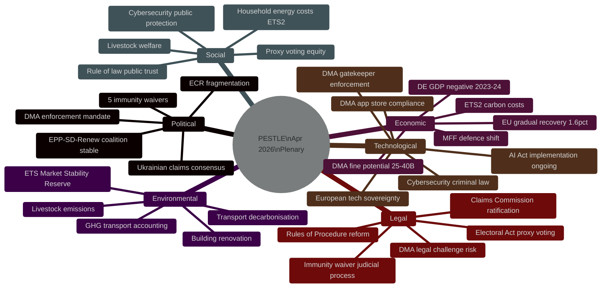

<!-- SPDX-FileCopyrightText: 2024-2026 Hack23 AB -->
<!-- SPDX-License-Identifier: Apache-2.0 -->

# 🌍 PESTLE Analysis — EU Parliament Propositions
**Date:** 2026-05-05 | **Session:** April 28–30, 2026 Plenary
**6-Dimension Scan** | **Admiralty Grade:** B2 | **WEP:** Likely

---

## PESTLE Framework Overview

---

## P — Political Dimension

**Signal Strength:** 🔴 HIGH

### Structural Power Configuration
The April 28–30 session confirmed the durability of the EPP-S&D-Renew governing coalition (397 seats, 55.2% majority). This coalition achieved majority outcomes on all contested votes. The right-wing axis (PfE+ECR+ESN = 193 seats) remained in opposition minority on key acts.

**Key Political Dynamics:**

1. **DMA enforcement as digital sovereignty signal** — The EP's unanimous demand for stepped-up enforcement transforms DMA from a regulatory instrument into a political identity marker for the EU's relationship with US tech dominance. This is a structural political choice with transatlantic implications.

2. **Ukrainian accountability consensus durability** — Cross-party support for Claims Commission convention demonstrates that Ukraine solidarity remains among the most durable political commitments of EP10. The coalition (EPP+S&D+Renew+Greens+ECR partial) exceeds the qualified majority threshold with margin.

3. **Rule-of-law politics — judicial coordination emerging** — Five immunity waivers in one session signals active judicial-political coordination between member state prosecutorial services and EP procedural mechanisms. This is unprecedented in scale and reflects maturing rule-of-law enforcement architecture.

4. **EPP tactical flexibility** — EPP's willingness to abandon ECR immunity protection requests signals a strategic de-coupling from far-right protection politics, positioning EPP for center-right governance legitimacy.

5. **Polish judicial normalization** — The Jaki/Obajtek/Buczek/Braun waiver cluster is a direct expression of the Tusk government's judicial normalization agenda playing out at European Parliamentary level. This is a notable milestone: Warsaw's democratization effort is now producing European institutional consequences.

**Political Risk:** 🟡 MEDIUM — US trade retaliation risk on DMA; PfE/Hungary obstruction of Claims Commission ratification at Council level

---

## E — Economic Dimension

**Signal Strength:** 🟠 ELEVATED

### Macro Context
EU GDP growth of +1.6% projected for 2026 (gradual recovery). Germany in structural weakness (-0.5% in 2024). Eurozone inflation returning to 2% target. ECB in rate-cutting cycle.

**Key Economic Pressures from April 28–30 Acts:**

1. **ETS2 Compliance Costs** — Buildings and road transport entering carbon pricing creates the largest single regulatory compliance burden since the original ETS Phase 1. Estimated €40–60 billion in annual revenue by 2030 balanced against household cost pass-through of €40–80/year average.

2. **DMA Enforcement Financial Stakes** — Combined DMA fine potential (Alphabet, Apple, Meta) represents €50–80 billion in the most aggressive enforcement scenario. More likely: €5–15 billion in negotiated remedies and structural commitments.

3. **Budget Architecture Shift** — 2027 budget guidelines signal a defence spending pivot. Current EU defence spending at 1.8% GDP needs to reach 2%+ NATO target — additional €40 billion/year at collective level.

4. **Ukrainian Claims vs. Available Assets** — Gap between $400–700B claimed damages and €300B frozen Russian assets creates structural funding tension for Claims Commission mandate.

**Economic Risk:** 🟠 ELEVATED — Carbon cost pass-through to households; US trade retaliation risk; defence expenditure pressures on MFF ceilings

---

## S — Social Dimension

**Signal Strength:** 🟡 NOTABLE

### Key Social Dynamics

1. **Household Energy Cost Impact (ETS2)** — The most politically sensitive consequence of Market Stability Reserve expansion is its effect on heating and transport costs for lower-income households. The Social Climate Fund (€87 billion 2026–2032) was explicitly created to offset these effects. However, fund deployment is administratively complex — targeted support reaching the most vulnerable households is a 12–18 month implementation challenge.

2. **Rule-of-Law and Public Trust** — The five immunity waivers carry high public legitimacy value. Citizens in Poland and Romania affected by the named MEPs' alleged actions benefit from EP procedural action. This is social and civic legitimacy being asserted.

3. **Women's Entrepreneurship and Rural Development** — TA-10-2026-0158 on women's entrepreneurship in rural areas reflects EP's attention to gender equity in non-urban contexts. The text is non-binding but signals political will for follow-up Commission action.

4. **Proxy Voting Equity** — Amendment allowing proxy voting for MEPs on parental leave (TA-10-2026-0124) directly addresses workplace equity within Parliament itself. This is procedural fairness with symbolic resonance.

5. **Livestock and Animal Welfare** — TA-10-2026-0115 on welfare of dogs and cats creates traceability requirements that affect pet market dynamics across all 27 member states.

**Social Risk:** 🟡 MEDIUM — ETS2 household cost burden; public trust in immunity waiver process depends on judicial follow-through

---

## T — Technological Dimension

**Signal Strength:** 🔴 HIGH

### Digital Technology Dynamics

1. **DMA Enforcement — Structural Technology Governance** — The EP's enforcement resolution (TA-10-2026-0160) targets specific behaviors:
   - App store access restrictions (Apple)
   - Advertising data practices (Meta)
   - Search and shopping interoperability (Alphabet)
   - Messaging interoperability (WhatsApp/Meta)
   
   The technical compliance challenges are substantial. DMA interoperability mandates require gatekeepers to open APIs, create data portability mechanisms, and allow third-party services on their platforms. Implementation creates real engineering complexity that gatekeepers will use to manage pace of compliance.

2. **AI Act — Parallel Implementation** — Not directly voted in this session, but DMA and AI Act implementation are interdependent. The AI Act (entered into force 2024) is reaching its first compliance milestones in 2026. Commission AI Office is coordinating enforcement. The DMA enforcement signal reinforces the AI Act enforcement credibility.

3. **Cybersecurity Criminal Law** — TA-10-2026-0163 on cybersecurity criminal provisions creates harmonized EU criminal law for cyber attacks, platformplatform-facilitated crimes, and digital exploitation. This is a significant step toward EU-level criminal justice in the digital sphere.

4. **European Technology Sovereignty** — The April 28–30 session's digital package (DMA enforcement + cybersecurity criminal law) reinforces the EU's commitment to technological sovereignty as a policy objective independent of US Big Tech preferences.

**Technological Risk:** 🔴 HIGH — Gatekeeper legal challenges to DMA compliance; AI Act + DMA regulatory overlap; US political pressure on technology enforcement

---

## L — Legal Dimension

**Signal Strength:** 🔴 HIGH

### Legal Architecture

1. **DMA Legal Challenges** — Apple, Meta, and Alphabet are all expected to mount legal challenges to structural remedies at EU Court of Justice level. DMA Article 26 enforcement cases will take 2–4 years in full proceedings. EP resolution increases political pressure but cannot accelerate legal timeline.

2. **International Claims Commission — Ratification Law** — The convention requires: (a) EU Council approval; (b) member state ratification (27 states); (c) third-country participation negotiations. This is an 18–24 month legal process minimum. Hungarian and Slovak veto risk at Council level is non-trivial.

3. **Immunity Waiver — Judicial Precedent** — Five waivers in one session establishes a judicial precedent for EP willingness to remove protection in systemic rule-of-law cases. This creates forward-looking deterrence for MEPs who might otherwise rely on immunity as legal protection for domestic political conduct.

4. **Proxy Voting — Electoral Law Reform** — Amendment of the European Electoral Act (TA-10-2026-0124) requires Council ratification, which has historically been slow for EP electoral reform proposals. Risk of Council delay.

5. **Rules of Procedure Reform** — TA-10-2026-0118 amending Rules of Procedure for agency appointments creates new transparency requirements for Commission appointments, affecting EU agency governance across ~50 agencies.

**Legal Risk:** 🟠 ELEVATED — DMA gatekeeper legal challenges; Claims Commission ratification complexity; proxy voting Electoral Act reform requiring Council action

---

## E — Environmental Dimension

**Signal Strength:** 🟠 ELEVATED

### Environmental Policy Dynamics

1. **ETS2 — Transformative Climate Architecture** — The Market Stability Reserve expansion (TA-10-2026-0139) to buildings and road transport is the single most consequential environmental act of the April 28–30 session. Together, buildings and road transport represent ~37% of EU CO₂ emissions. Bringing these sectors into carbon pricing creates:
   - Direct incentives for green building renovation (~€300 billion investment wave projected)
   - Direct incentives for EV adoption and public transport investment
   - Revenue for Social Climate Fund and green transition support
   
2. **Greenhouse Gas Accounting — Transport Services** — TA-10-2026-0113 establishing standardized GHG emissions accounting for transport services creates mandatory reporting infrastructure that will inform logistics, aviation, and shipping sector regulation.

3. **Livestock Sector** — TA-10-2026-0157 on the EU livestock sector addresses one of the most sensitive agricultural-environmental intersections. Livestock farming contributes ~14% of EU GHG emissions. The EP text focuses on food security and sector support while acknowledging the need for emissions reduction — a political compromise that defers the harder structural choices.

4. **Biocidal Products** — TA-10-2026-0117 amending data protection periods in biocidal regulation affects chemicals market dynamics for pesticides and disinfectants.

**Environmental Risk:** 🟡 MEDIUM — ETS2 political backlash risk; livestock sector green transition pace; GHG accounting compliance burden for SMEs

---

## PESTLE Summary Matrix

| Dimension | Significance | Risk Level | Time Horizon |
|-----------|-------------|-----------|-------------|
| Political | 🔴 HIGH | 🟡 MEDIUM | 12–36 months |
| Economic | 🟠 ELEVATED | 🟠 ELEVATED | 24–48 months |
| Social | 🟡 NOTABLE | 🟡 MEDIUM | 12–24 months |
| Technological | 🔴 HIGH | 🔴 HIGH | 24–60 months |
| Legal | 🔴 HIGH | 🟠 ELEVATED | 24–48 months |
| Environmental | 🟠 ELEVATED | 🟡 MEDIUM | 36–120 months |

**Source:** EP Open Data Portal (37 adopted texts), EP Statistics 2026, World Bank (DE/FR economic proxies), IMF WEO April 2026 (documented projections)
