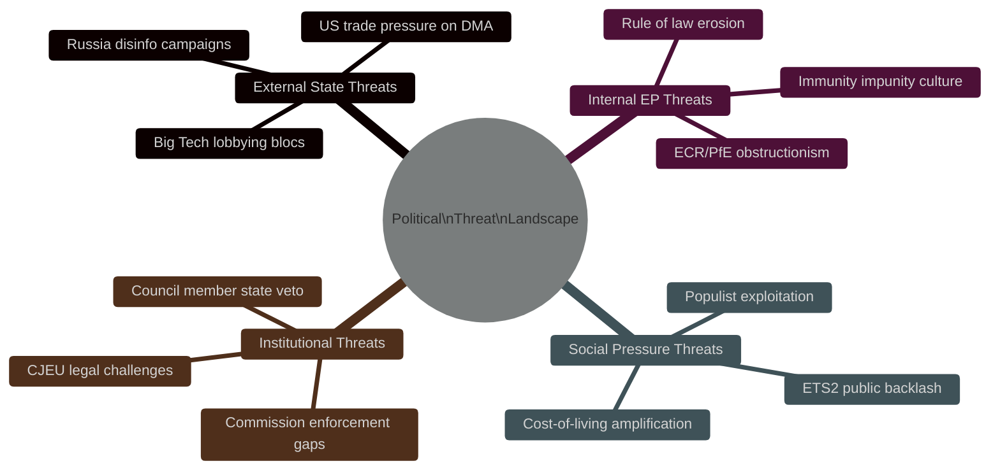

<!-- SPDX-FileCopyrightText: 2024-2026 Hack23 AB -->
<!-- SPDX-License-Identifier: Apache-2.0 -->

# 🌐 Political Threat Landscape — EU Parliament Propositions
**Date:** 2026-05-05 | **Session:** April 28–30, 2026

---

## Threat Landscape Overview

---

## Tier 1 Threats (Critical)

### T1-A: US Trade Retaliation on DMA
**Threat Actor:** US Trade Representative / US Executive Branch
**Vector:** Tariff escalation + bilateral pressure on Commission DG CNECT
**Impact:** DMA enforcement suspended or delayed → EU digital sovereignty eroded
**WEP:** Possible (30–40%)
**EP Countermeasure:** April 28–30 enforcement resolution puts parliamentary mandate on record; makes political cost of surrender explicit

### T1-B: Russian Active Measures Against Claims Commission
**Threat Actor:** Russian Government / SVR influence operations
**Vector:** Disinformation claiming convention is "theft"; lobbying through PfE-aligned media
**Impact:** Ratification delays in Hungary, Slovakia; US ceasefire pressure used to undermine momentum
**WEP:** Likely (55–65%) that influence operations are attempted; WEP: Possible (25%) they succeed in delaying ratification
**EP Countermeasure:** Broad coalition (EPP+S&D+Renew+Greens) makes ratification vote robust; CJEU advisory opinion sought

---

## Tier 2 Threats (High)

### T2-A: ECR/PfE Coordinated Obstruction on ETS2 Implementation
**Threat:** 166 MEPs (ECR+PfE) coordinate on every ETS2 implementation regulation to delay/amend
**Vector:** Amendment blizzard in Environment Committee; Council blocking minorities
**WEP:** Likely (60%) on implementation regulations (not this session's MSR vote, which passed)

### T2-B: Rule-of-Law Backsliding via Immunity Norm Erosion
**Threat:** PfE/ECR use April 28-30 immunity waivers as political mobilization — "EP attacks our MEPs"
**Vector:** Social media campaign; domestic political framing in PL, RO
**WEP:** Likely (65%) for political exploitation; Unlikely (15%) to reverse actual immunity decisions

---

## Tier 3 Threats (Moderate)

### T3-A: Big Tech Legal Challenge to DMA Enforcement Resolution
**Threat:** Gatekeeper companies challenge enforcement resolution as exceeding EP mandate
**WEP:** Unlikely-Possible (20%) — resolution is non-binding advisory, hard to challenge legally

### T3-B: Social Climate Fund Disbursement Delays
**Threat:** Administrative bottlenecks in Social Climate Fund (ETS2) reaching vulnerable households
**WEP:** Possible (40%) for significant delays vs timeline

---

## Cross-Cutting Assessment

The political threat landscape for this session is shaped by three structural tensions:
1. **Regulatory sovereignty vs economic interdependence** — DMA enforcement invites US retaliation
2. **EU solidarity vs member state sovereignty** — Claims Commission requires unanimous ratification
3. **Climate policy vs social cost** — ETS2 expansion hits households directly

The EP's April 28–30 votes addressed all three tensions simultaneously, which is why the threat landscape is unusually active for a single 3-day plenary.

**Source:** EP political group composition, public information on US-EU trade dynamics, EP open data, coalition analysis tool
