<!-- SPDX-FileCopyrightText: 2024-2026 Hack23 AB -->
<!-- SPDX-License-Identifier: Apache-2.0 -->

# 🔮 Scenario Forecast — EU Parliament Propositions
**Date:** 2026-05-05 | **Horizon:** 6–18 months from April 30, 2026
**WEP Probability Bands Applied** | **Admiralty Grade:** B2

---

## Scenario Overview

The April 28–30, 2026 plenary adopted a cluster of acts with distinctly different forward trajectories. This forecast assesses three primary scenarios for each of the four dominant legislative threads.

```mermaid
%%{init: {"theme":"dark","themeVariables":{"primaryColor":"#1565C0","primaryTextColor":"#ffffff","lineColor":"#90CAF9"}}}%%
flowchart TD
  START["April 30, 2026\nBaseline State:\n37 Acts Adopted"]
  
  START --> DMA_PATH["DMA Enforcement\nScenario Branches"]
  START --> ETS2_PATH["ETS2 Implementation\nScenario Branches"]
  START --> UKRA_PATH["Claims Commission\nScenario Branches"]
  START --> IMMU_PATH["Immunity/Rule-of-Law\nScenario Branches"]

  DMA_PATH --> DMA_A["Scenario A\nFull Structural Remedies\nWEP: Possible 30-45%"]
  DMA_PATH --> DMA_B["Scenario B\nNegotiated Compliance\nWEP: Likely 55-65%"]
  DMA_PATH --> DMA_C["Scenario C\nUS Trade Stalemate\nWEP: Possible 25-35%"]

  ETS2_PATH --> ETS2_A["Scenario A\nSmooth Rollout\nWEP: Possible 35-45%"]
  ETS2_PATH --> ETS2_B["Scenario B\nDelays + Social Tensions\nWEP: Likely 55-65%"]
  ETS2_PATH --> ETS2_C["Scenario C\nPartial Reversal\nWEP: Unlikely 10-20%"]

  UKRA_PATH --> UKRA_A["Scenario A\nRapid Ratification\nWEP: Unlikely 20-30%"]
  UKRA_PATH --> UKRA_B["Scenario B\nPartial Ratification\nWEP: Likely 55-65%"]
  UKRA_PATH --> UKRA_C["Scenario C\nHungary Veto Block\nWEP: Possible 30-40%"]

  IMMU_PATH --> IMMU_A["Scenario A\nAll Prosecutions Proceed\nWEP: Likely 55-65%"]
  IMMU_PATH --> IMMU_B["Scenario B\nMixed Outcomes\nWEP: Likely 60-70%"]
  IMMU_PATH --> IMMU_C["Scenario C\nPolitical Backlash\nWEP: Unlikely 10-20%"]

  style DMA_A fill:#D32F2F,color:#fff
  style DMA_B fill:#2E7D32,color:#fff
  style DMA_C fill:#FF9800,color:#000
  style ETS2_A fill:#2E7D32,color:#fff
  style ETS2_B fill:#FF9800,color:#000
  style ETS2_C fill:#D32F2F,color:#fff
  style UKRA_A fill:#2E7D32,color:#fff
  style UKRA_B fill:#FF9800,color:#000
  style UKRA_C fill:#D32F2F,color:#fff
  style IMMU_A fill:#2E7D32,color:#fff
  style IMMU_B fill:#FF9800,color:#000
  style IMMU_C fill:#D32F2F,color:#fff
```

---

## Scenario 1: DMA Enforcement Track

### Scenario 1-A: Full Structural Remedies (WEP: Possible 30–45%)
**Trigger conditions:** Commission issues structural remedy decisions against Alphabet and/or Apple by Q3 2026; EU Court of Justice fast-tracks interim measures; US retaliates with tariff threats but EU holds firm.

**Narrative:** The EP's enforcement resolution galvanizes the Commission to move beyond fines toward behavioral remedies — forcing Apple to open iOS to third-party app stores globally, requiring Google to provide equal search result placement for competitor services. This triggers legal challenge avalanche but also serves as the EU's most powerful demonstration of digital sovereignty.

**Key early-warning indicators:**
- Commission enforcement timeline communication by June 2026
- Preliminary hearing dates at EU General Court for DMA cases
- US USTR statements on DMA as trade barrier

**Economic impact:** €10–40 billion in structural remedy compliance costs for Big Tech; significant shift in EU digital market dynamics for SMEs and consumers.

### Scenario 1-B: Negotiated Compliance Settlement (WEP: Likely 55–65%) — **MOST PROBABLE**
**Trigger conditions:** Commission and gatekeepers agree to enhanced compliance roadmaps; fines in €1–5 billion range; structural behavioral changes negotiated over 12–18 months.

**Narrative:** The EP's political pressure shifts the Commission's posture from monitoring to active enforcement, but the process follows a negotiated path rather than full structural remedy orders. Apple agrees to App Store interoperability framework; Meta commits to data portability enhancements; Alphabet provides enhanced search competitor access. This is slower than EP wants but faster than gatekeepers prefer — a typical Brussels compromise.

**Key early-warning indicators:**
- Commission "compliance roadmap" agreements announced Q3 2026
- DMA penalty proceedings formally opened against one or more gatekeepers
- Industry associations publishing "DMA compliance investment" figures

**Economic impact:** €1–5 billion in fines; significant compliance costs managed over medium term; no major disruption to digital market structure in short term.

### Scenario 1-C: US Trade Stalemate (WEP: Possible 25–35%)
**Trigger conditions:** Trump administration formally designates DMA enforcement as unfair trade barrier; threatens 25% tariffs on EU exports; Commission delays enforcement to manage trade relationship.

**Narrative:** The geopolitical dimension overwhelms the regulatory dimension. Commission leadership under US pressure reduces enforcement intensity, arguing that trade relationship must take priority. This would represent a significant political defeat for the EP majority and an erosion of the EU's regulatory credibility.

**Key early-warning indicators:**
- USTR "National Trade Estimate Report" formally citing DMA
- US-EU trade talks framework launched with DMA on agenda
- Commission internal legal opinions on DMA vs. trade law compatibility

---

## Scenario 2: ETS2 Implementation Track

### Scenario 2-A: Smooth ETS2 Rollout (WEP: Possible 35–45%)
**Trigger conditions:** Commission delegated acts issued on time (Q4 2026); member states establish national compensation schemes by Q2 2027; Social Climate Fund disbursements begin Q3 2027.

**Narrative:** The ETS2 implementation proceeds roughly on schedule, with Social Climate Fund effectively cushioning lower-income household impacts. Member states design carbon revenue recycling mechanisms that maintain political support. Green renovation investment accelerates.

**Key early-warning indicators:**
- Commission issuing ETS2 implementing regulations by October 2026
- Member state compensation scheme legislation passed by March 2027
- Green bond issuance for renovation finance increasing

### Scenario 2-B: ETS2 with Delays and Social Tensions (WEP: Likely 55–65%) — **MOST PROBABLE**
**Trigger conditions:** ETS2 implementation regulations delayed; Social Climate Fund disbursement bureaucratic bottlenecks; household energy cost visibility triggers public resistance in Germany/Poland/France.

**Narrative:** ETS2 implementation proceeds but more slowly than planned, with significant social friction. Energy and heating cost increases become politically visible in winter 2026–2027, triggering protests in countries with high energy poverty. Commission and member states manage through a combination of phase-in adjustments and emergency fuel assistance packages. Political pressure from right-wing parties (ECR, PfE) intensifies but does not achieve full reversal.

**Key early-warning indicators:**
- Household energy price increases tracked monthly via Eurostat
- ECR/PfE joint parliamentary questions on ETS2 costs
- Commission announcing "implementation flexibility" provisions

### Scenario 2-C: Partial ETS2 Reversal (WEP: Unlikely 10–20%)
**Trigger conditions:** New EP majority emerging with ECR support that backs away from ETS2; Commission proposing amendment to delay buildings/transport inclusion; economic recession accelerating cost-of-living crisis.

**Narrative:** Political reversal would require ECR+PfE alliance with disaffected EPP members to reach a blocking majority — this is possible in a severe economic downturn scenario but not currently visible in the political configuration. EPP's core identity on climate is moderately supportive.

---

## Scenario 3: Ukraine Claims Commission Ratification

### Scenario 3-A: Rapid Ratification (<18 months) (WEP: Unlikely 20–30%)
**Trigger conditions:** Hungary and Slovakia do not block Council approval; all 27 member states ratify within 18 months; Russia-Ukraine ceasefire does not complicate ratification politics.

**Narrative:** The political momentum from EP adoption carries through Council and member state ratifications with relatively few obstacles. Claims Commission begins registering claims by Q1 2028.

### Scenario 3-B: Partial Ratification with Delays (WEP: Likely 55–65%) — **MOST PROBABLE**
**Trigger conditions:** Hungary delays Council approval for 6–9 months through procedural objections; 2–3 member states face parliamentary ratification delays; Commission establishes provisional application framework.

**Narrative:** Hungary's Orbán government uses every procedural avenue to delay Council approval of the convention, extracting concessions on other dossiers. Commission proposes provisional application mechanism allowing Claims Commission to begin operations in participating member states before full ratification. Partial operationalization by Q3 2027.

**Key early-warning indicators:**
- Council working party meetings on convention text
- Hungarian Council blocking statements
- Commission provisional application proposal

### Scenario 3-C: Hungarian Veto Block (WEP: Possible 30–40%)
**Trigger conditions:** Hungary formally vetoes Council approval using unanimity requirement; convention stuck without Council backing; Commission launches infringement for non-ratification.

**Narrative:** If the convention requires Council unanimity rather than qualified majority, Hungary can block. The legal question of whether Ukraine Claims Commission convention requires unanimity is unresolved. If unanimity required, Hungary veto risk is significant.

---

## Scenario 4: Immunity Waiver Judicial Outcomes

### Scenario 4-A: All Five Prosecutions Proceed (WEP: Likely 55–65%)
**Trigger conditions:** Polish and Romanian courts proceed normally; immunity waivers hold under any legal challenges; ECR political interference fails to halt proceedings.

**Narrative:** All five MEPs subject to immunity waivers face judicial proceedings. Jaki/Obajtek cases center on state enterprise management during PiS era. Braun case proceeds on hate crime/antisemitism grounds. Şoşoacă faces criminal proceedings in Romania. Political context in both countries (Tusk government in Poland, new Romanian government) supports judicial independence.

### Scenario 4-B: Mixed Judicial Outcomes (WEP: Likely 60–70%) — **MOST PROBABLE**
**Trigger conditions:** Some prosecutions proceed, others face legal challenges or political obstacles; courts acquit on some charges; pattern of proceedings unclear.

**Narrative:** Polish courts actively proceed against the cleaner cases (Braun on antisemitism; Obajtek on financial irregularities) while politically complex cases (Jaki as former minister) face legal delays. Romanian case proceeds independently. Results over 18 months: 2–3 MEPs formally charged; 1–2 cases dropped for insufficient evidence.

### Scenario 4-C: Political Backlash and Reversal (WEP: Unlikely 10–20%)
**Trigger conditions:** Change of government in Poland reverting to PiS-aligned politics; Commission DG JUST intervening to halt politically motivated prosecutions; EP reversing waiver decisions under pressure.

**Narrative:** Highly unlikely given current political configuration. Would require multiple political reversals simultaneously.

---

## Cross-Scenario Risk Matrix

| Scenario Thread | Most Probable | Key Risk | Time to Resolution |
|----------------|---------------|----------|-------------------|
| DMA Enforcement | Negotiated Settlement | US trade retaliation | 12–18 months |
| ETS2 Implementation | Delays + Social Tensions | Household cost visibility | 18–30 months |
| Claims Commission | Partial Ratification | Hungary veto | 24–36 months |
| Immunity Proceedings | Mixed Outcomes | Political interference | 12–24 months |

**Source:** EP Open Data Portal, EP Statistics 2026, political group composition data, WEP probability framework (Words Estimative Probability standard bands)

---

## Admiralty Source Grading

| Scenario | Evidence Base | Admiralty Grade |
|----------|--------------|----------------|
| S1A — DMA compliance cascade | EP resolution text; Commission enforcement track record | B1 |
| S1B — DMA enforcement pause | US trade pressure signals; historical TTIP precedent | B2 |
| S2A — ETS2 smooth implementation | MSR mechanism design; SCF parameterization | B1 |
| S2B — ETS2 social revolt | Eurostat household data; Yellow Vest precedent 2018 | A2 |
| S3A — Claims Convention ratified | UNCC precedent; EP-Council consensus | B1 |
| S3B — Claims Convention blocked | Hungary track record; unanimity requirement | A1 |
| S4A — Immunity prosecutions advance | National court jurisdiction; EP waiver decision | A2 |

**Note on scenario probability calibration:** WEP bands are analytical estimates based on structural factors, not statistical models. All scenarios should be treated as indicative of directional probability, not precise forecasts.
