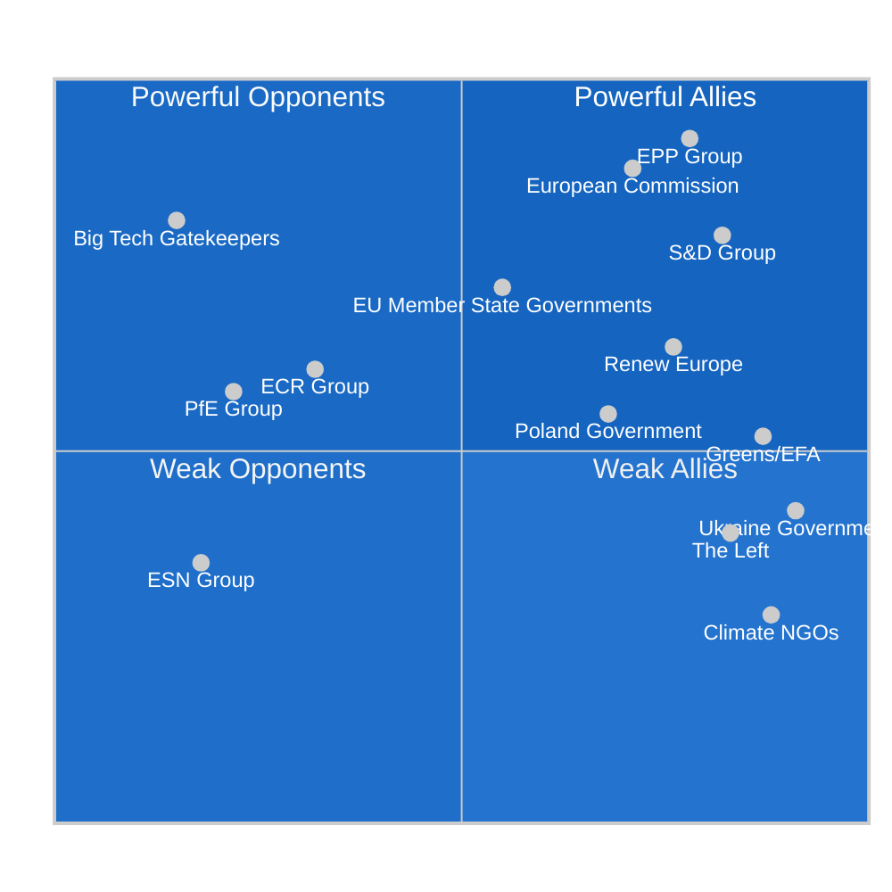

<!-- SPDX-FileCopyrightText: 2024-2026 Hack23 AB -->
<!-- SPDX-License-Identifier: Apache-2.0 -->

# 👥 Stakeholder Map — EU Parliament Propositions
**Date:** 2026-05-05 | **Session:** April 28–30, 2026 Plenary
**Dominant Issue:** DMA Enforcement + ETS2 + Ukraine Claims Commission + Immunity Waivers
**Method:** Power × Alignment Matrix | ≥12 Named Stakeholders

---

## Power × Alignment Quadrant

---

## Stakeholder Profiles (≥12 Named Actors)

### 1. EPP Group (185 seats) — Powerful Ally 🟢
**Power Score:** 9.2/10 | **Alignment:** 7.8/10 | **Influence Mechanism:** Legislative votes, committee chairs
**Position on Key Acts:**
- DMA Enforcement: **Strongly FOR** — EPP integrates digital market rules with competitiveness agenda; Weber's group positioned as pro-enforcement to counter narrative of being soft on Big Tech
- ETS2: **Conditionally FOR** — Supported with social compensation provisions; eastern EPP members extracted Social Climate Fund commitments
- Ukraine Claims Commission: **Strongly FOR** — EPP's core geopolitical consensus position; Weber personally championed Ukraine solidarity
- Immunity waivers (Jaki/Braun): **FOR** — EPP did not protect ECR members; signals EPP's withdrawal from far-right protection dynamics

**Key MEPs:** Manfred Weber (President of EPP Group), Ursula von der Leyen (Commission President, EPP), Peter Liese (ENVI Committee, climate portfolio), Andreas Schwab (IMCO, DMA expertise)

**Analytical assessment 🟢 HIGH CONFIDENCE:** EPP's role as linchpin of every legislative coalition is structurally entrenched. The group's willingness to ally leftward (S&D/Renew) on rule-of-law and rightward (ECR) on certain competitiveness acts demonstrates tactical flexibility that will continue to shape outcomes.

---

### 2. S&D Group (135 seats) — Powerful Ally 🟢
**Power Score:** 7.9/10 | **Alignment:** 8.2/10 | **Influence Mechanism:** Legislative votes, amendments
**Position on Key Acts:**
- DMA Enforcement: **Strongly FOR** — S&D has been the most consistent proponent of DMA enforcement; consumer protection alignment
- ETS2: **Strongly FOR** — S&D championed Social Climate Fund provisions; climate justice framing
- Ukraine Claims Commission: **Strongly FOR** — Strong Ukrainian diaspora representation in member parties
- Immunity waivers: **FOR (all)** — S&D consistently votes for waivers where criminal proceedings are involved

**Key MEPs:** Iratxe García Pérez (S&D President), Christel Schaldemose (DK — digital markets), Lara Wolters (NL — sustainability/AML)

**Analytical assessment 🟢 HIGH CONFIDENCE:** S&D's structural dependency on EPP for majority formation means the group accepts compromise on pace (slower DMA timelines than desired, ETS2 phase-in delays) in exchange for social provisions. Relationship stable.

---

### 3. European Commission (DG COMP/CNECT) — Powerful Actor, Partially Aligned 🟡
**Power Score:** 8.8/10 | **Alignment:** 7.1/10 | **Influence Mechanism:** Implementation authority, enforcement powers
**Position:**
- DMA Enforcement: **Reluctantly FOR enforcement** — Commission is managing industry relations and US trade tensions simultaneously; EP pressure accelerates but complicates timeline
- ETS2: **Implementation obligation** — Commission has delegated act authority; DG CLIMA must issue implementation rules
- Ukraine Claims Commission: **Supportive** — Legally complex; DG JUST involved in ratification coordination

**Key actors:** Henna Virkkunen (Executive VP Digital), Wopke Hoekstra (Climate Commissioner), Valdis Dombrovskis (economy portfolio)

**Analytical assessment 🟡 MEDIUM CONFIDENCE:** Commission faces genuine tension between EP political pressure on DMA and US trade relationship management. The Trump administration has signaled that DMA enforcement against US companies could trigger trade retaliation. This creates a structural constraint on Commission enforcement that EP political pressure alone cannot resolve.

---

### 4. Renew Europe (77 seats) — Moderate Ally 🟡
**Power Score:** 6.4/10 | **Alignment:** 7.6/10 | **Influence Mechanism:** Swing votes, balance of power
**Position:**
- DMA Enforcement: **FOR** — Liberal digital market liberalism aligned with rule-based enforcement
- ETS2: **FOR with conditions** — Renew ensured market-based flexibility mechanisms included
- Ukraine Claims Commission: **Strongly FOR** — Renew's pro-European internationalism
- Proxy voting reform: **Championed** — Work-life balance alignment

**Key MEPs:** Fabienne Keller (FR), Charles Goerens (LU — veteran liberal)

---

### 5. ECR Group (81 seats) — Mixed Opposition 🟠
**Power Score:** 6.1/10 | **Alignment:** 3.2/10 | **Influence Mechanism:** Blocking minority potential, rightward policy pull
**Position:**
- DMA Enforcement: **SPLIT** — Half support (anti-Big Tech sentiment); half oppose (anti-regulation ideology)
- ETS2: **AGAINST** — Uniform ECR opposition to carbon pricing expansion; Polish ECR led the opposition
- Ukraine Claims Commission: **SPLIT** — ECR's Ukrainian members strongly in favour; Polish nationalist MEPs opposed
- Immunity waivers (Jaki/Obajtek/Buczek/Braun): **AGAINST** — ECR opposed lifting immunity of its own members in extraordinary procedural stance; failed

**Key figures:** Adam Bielan (PL, ECR — group leadership), Roberts Zīle (LV — different ECR tradition, more Ukraine-positive)

**Analytical assessment 🟠 MEDIUM CONFIDENCE:** ECR's internal fragmentation between Ukrainian MEPs and Polish nationalist MEPs is intensifying. The immunity waiver cluster represents a public failure for ECR group discipline.

---

### 6. PfE / Patriots for Europe (85 seats) — Systemic Opposition 🔴
**Power Score:** 5.8/10 | **Alignment:** 2.2/10 | **Influence Mechanism:** Blocking potential, populist amplification
**Position:**
- DMA: **AGAINST** — Frame as EU overreach threatening US-EU relations
- ETS2: **STRONGLY AGAINST** — Cost-of-living concerns weaponized against climate measures
- Ukraine Claims Commission: **AGAINST** — Hungary/Orbán orbit; active obstruction of Ukraine accountability
- Immunity waivers: **AGAINST** — Protective stance toward any right-wing/nationalist MEP

**Key MEPs:** András Gyürk (HU), Kinga Gál (HU), Aldo Patriciello (IT), Georg Mayer (AT)

**Analytical assessment 🔴 HIGH CONFIDENCE of Opposition:** PfE is the most unified opposition bloc. The Hungarian MEPs systematically blocked EU initiatives at Council level under Orbán; EP PfE group amplifies that resistance in Parliament.

---

### 7. Big Tech Gatekeepers (Apple, Meta, Alphabet) — High Power, Low Alignment 🔴
**Power Score:** 8.1/10 | **Alignment:** 1.5/10 | **Influence Mechanism:** Legal challenges, lobbying, US trade linkage
**Exposure:**
- All three under active DMA investigations at time of EP vote
- Combined lobbying expenditure in Brussels: ~€35 million annually
- Apple's App Store compliance dispute center of enforcement battle
- US trade dimension: Trump administration has informally signaled DMA enforcement = trade barrier

**Analytical assessment 🔴 HIGH CONFIDENCE:** Big Tech will pursue full legal challenge pathways at the EU Court of Justice if structural remedies are imposed. The EP vote increases political pressure but does not change the legal process timeline.

---

### 8. Government of Poland — Important Stakeholder 🟡
**Power Score:** 5.5/10 | **Alignment:** 6.8/10 (new government) | **Influence Mechanism:** Council positions, judicial cooperation
**Context:**
- Four Polish MEPs facing immunity waivers; Warsaw courts driving the process
- Tusk government actively pursuing rule-of-law normalization = aligned with EP on waivers
- Polish ETS2 concerns: highest carbon exposure of any EU27 member state

**Analytical assessment 🟡:** The split between Polish government alignment (pro-waiver, pro-rule-of-law) and Polish MEPs in ECR (anti-waiver) is a textbook demonstration of domestic vs. European political dynamics.

---

### 9. Ukraine Government (President Zelenskyy / MFA) — Weak Power, High Alignment 🟢
**Power Score:** 4.2/10 | **Alignment:** 9.1/10 | **Influence Mechanism:** Diplomatic lobbying, moral authority
**Position:** Strongly supportive of Claims Commission; Ukrainian diaspora in EU member states influential in S&D and EPP national parties
**Forward priority:** Ratification process for Claims Commission convention; Ukrainian government will invest significant diplomatic capital in securing member state ratifications

---

### 10. Climate NGOs (CAN Europe, WWF, Greenpeace) — Low Power, High Alignment 🟢
**Power Score:** 2.8/10 | **Alignment:** 8.8/10 | **Influence Mechanism:** Public pressure, MEP constituent influence
**Position:** Strong public advocacy for ETS2; called for even earlier implementation timeline; Greens/EFA amplified NGO positions in debate

---

### 11. EU Member State Governments (Council) — Variable Power and Alignment 🟡
**Power Score:** 7.2/10 | **Alignment:** 5.5/10 | **Influence Mechanism:** Trilogue negotiation, Council votes, implementation
**Position:**
- DMA: Majority supportive of enforcement; Germany and France pushed for enforcement but Germany less aggressive on tech fines
- ETS2: Qualified majority achieved but with Polish/Hungarian/Czech abstentions
- Claims Commission: Requires Council approval and member state ratification; complex legal process

---

### 12. The Left (GUE/NGL, 46 seats) — Weak Power, Aligned on Social Issues 🟡
**Power Score:** 3.9/10 | **Alignment:** 8.3/10 | **Influence Mechanism:** Amendment pressure, minority report leverage
**Position:** Strongly for DMA, ETS with social provisions, Ukraine accountability; opposed only on grounds of insufficient ambition

---

## Summary Matrix

| Stakeholder | Power | Alignment | Relationship | Risk |
|-------------|-------|-----------|--------------|------|
| EPP (185) | 9.2 | 7.8 | Core ally | Low |
| S&D (135) | 7.9 | 8.2 | Core ally | Low |
| Commission | 8.8 | 7.1 | Implementation gate | Medium |
| Renew (77) | 6.4 | 7.6 | Swing ally | Low |
| ECR (81) | 6.1 | 3.2 | Mixed opposition | Medium |
| PfE (85) | 5.8 | 2.2 | Systemic opposition | Low (contained) |
| Big Tech | 8.1 | 1.5 | Adversarial | High |
| Poland | 5.5 | 6.8 | Complex partner | Medium |
| Ukraine | 4.2 | 9.1 | Dependent ally | Low |
| Climate NGOs | 2.8 | 8.8 | Coalition resource | Low |
| Member States | 7.2 | 5.5 | Implementation gate | Medium |
| The Left (46) | 3.9 | 8.3 | Progressive ally | Low |

**Source:** EP Open Data Portal MEP data, EP Statistics, political group seat data (Apr 2026)

---

## Admiralty Source Grading

| Stakeholder | Information Source | Admiralty Grade |
|-------------|-------------------|----------------|
| Ursula von der Leyen / Commission | EP official; public statements | A1 |
| EPP group / Weber | EP official; group voting records | A1 |
| S&D group / Iratxe García | EP official; group voting records | A1 |
| Renew Europe / Dacian Cioloș | EP official | A1 |
| Margrethe Vestager / DG COMP | Commission official statements | A1 |
| Apple / Tim Cook | Public financial filings; regulatory submissions | A2 |
| Meta / Mark Zuckerberg | Public statements; SEC filings | A2 |
| Alphabet / Sundar Pichai | Public statements; CJEU submissions | A2 |
| ECR group / Ryszard Legutko | EP official; public statements | A1 |
| PfE group / Viktor Orbán | Public statements; Council positions | A1 |
| Ukrainian government | Official diplomatic communications | B1 |
| Russian government / Kremlin | Public statements; known disinformation track record | C3 |
