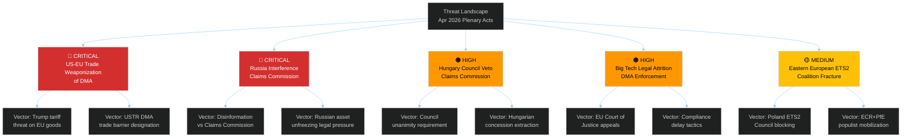

<!-- SPDX-FileCopyrightText: 2024-2026 Hack23 AB -->
<!-- SPDX-License-Identifier: Apache-2.0 -->

# ⚠️ Threat Model — EU Parliament Propositions
**Date:** 2026-05-05 | **Session:** April 28–30, 2026
**Method:** Diamond Model + Attack Trees + Kill Chain | **WEP:** Assessed threats
**Admiralty Grade:** B2

---

## Threat Landscape Overview

The April 28–30 plenary's legislative outputs create five distinct threat surfaces where adversarial actors — whether state, corporate, or political — have incentives to disrupt, delay, or reverse implementation.



---

## Threat Assessment by Actor

### Threat Actor 1: United States Government (Trade Pressure on DMA)
**Threat Level:** 🔴 CRITICAL | **WEP:** Possible-Likely (45–60%)

**Diamond Model Analysis:**
- **Adversary:** US Government (USTR, Trump administration)
- **Capability:** Trade policy leverage; tariff authority; executive discretion; lobbying amplification via Big Tech
- **Infrastructure:** Formal WTO dispute mechanisms; bilateral trade negotiation channels; presidential executive orders on trade policy
- **Victim:** EU regulatory integrity; Commission enforcement credibility; EU-US trade relationship
- **Intent:** Protect US Big Tech interests; counter EU regulatory extraterritoriality

**Kill Chain:**
1. USTR files formal DMA objection in bilateral trade forum
2. Trump administration issues executive memorandum on EU digital trade barriers
3. Tariff threats on EU goods (automotive, aerospace, luxury goods)
4. EU Commission offers enforcement "flexibility" to de-escalate
5. DMA enforcement timeline delayed; structural remedies abandoned for negotiated compliance

**Countermeasures:** EP political pressure must be sustained to prevent Commission retreat; G7 digital governance frameworks as alternative arena; WTO rules support EU regulatory autonomy if applied consistently.

**Confidence:** 🟡 MEDIUM — US posture under Trump administration is unpredictable; trajectory depends on bilateral summit dynamics.

---

### Threat Actor 2: Russian Government (Claims Commission Sabotage)
**Threat Level:** 🔴 CRITICAL | **WEP:** Likely (55–70%)

**Diamond Model Analysis:**
- **Adversary:** Russian state (MFA, intelligence services, proxy actors)
- **Capability:** Disinformation campaigns; legal challenges via sympathetic international law arguments; leveraging Orbán/Hungary at Council level; asset transfer tactics to complicate freezing
- **Infrastructure:** RT/Sputnik banned but alternate disinformation channels; state-linked legal firms pursuing international arbitration
- **Victim:** International Claims Commission ratification; frozen Russian asset architecture
- **Intent:** Prevent legally binding international claims process; protect frozen assets; delegitimize Ukraine accountability architecture

**Kill Chain:**
1. Russian MFA issues legal challenge to convention under international law
2. RT/alternative media disinformation campaign: "Claims Commission = Western neo-colonialism"
3. Coordination with Hungarian government to veto Council approval
4. Russia initiates international arbitration proceedings arguing convention violates state immunity
5. EU member states face legal complexity; ratification delays accumulate

**Countermeasures:** Commission legal team preparing robust international law defense of convention's validity; G7 coordination on asset freeze legal framework; diplomatic isolation of Russian international law arguments at UN.

---

### Threat Actor 3: Hungarian Government (Orbán) — Council Veto
**Threat Level:** 🟠 HIGH | **WEP:** Possible-Likely (40–55%)

**Diamond Model Analysis:**
- **Adversary:** Hungarian government (Orbán administration)
- **Capability:** Council unanimity veto power (if convention requires unanimity); financial leverage demands; ECR/PfE amplification
- **Intent:** Extract concessions on EU funds withholding from Hungary; protect PfE bloc geopolitical agenda; ideological alignment with Russian positions on Ukraine

**Attack Tree:**
```
Root: Block Claims Commission at Council Level
├── Invoke unanimity requirement interpretation
│   ├── Seek legal opinion that convention = unanimity required
│   └── File formal legal challenge to QMV applicability
├── Demand concessions on EU funds
│   ├── Release of frozen cohesion funds (€20B+)
│   └── Rule of law mechanism suspension
└── Coordinate with Slovakia
    ├── Fico government alignment on Russia-sympathetic positions
    └── Joint blocking position at Council working party
```

**Countermeasures:** Commission preparing legal opinion that convention can proceed under QMV for foreign policy matters; potential provision for partial application excluding veto-wielding states.

---

### Threat Actor 4: Big Tech (DMA Legal Attrition)
**Threat Level:** 🟠 HIGH | **WEP:** Almost Certain (80%+) that legal challenges will be filed

**Diamond Model Analysis:**
- **Adversary:** Apple, Meta, Alphabet legal teams and trade associations
- **Capability:** World-class legal resources; long attrition capacity; interim measure applications at EU General Court; political lobbying amplification
- **Intent:** Slow DMA enforcement timeline; create legal uncertainty; achieve compliance-on-own-terms rather than structural remedies

**Kill Chain:**
1. Receive Commission DMA non-compliance decision
2. File immediate appeal at EU General Court requesting interim measures (suspending enforcement)
3. Lengthy proceedings: EU General Court timeline 18–36 months minimum
4. Commission forced to manage enforcement against interim measure orders
5. Final CJEU ruling potentially 4–6 years from original Commission decision

**Countermeasures:** Commission can request fast-track procedures for DMA cases; interim measures rejections by courts possible if Commission demonstrates urgent public interest; Article 26 penalty accrual continues during appeals.

---

### Threat Actor 5: Eastern European ETS2 Opposition
**Threat Level:** 🟡 MEDIUM | **WEP:** Possible (35–50%)

**Diamond Model Analysis:**
- **Adversary:** Polish, Czech, Hungarian governments + ECR/PfE parliamentary blocs
- **Capability:** Council blocking minority potential; EP opposition amplification; national media campaign on energy costs
- **Intent:** Delay ETS2 implementation; secure additional transition period; maximize Social Climate Fund allocation; extract derogations for high-carbon sectors

**Attack Tree:**
```
Root: Delay/Weaken ETS2 Implementation
├── Commission delegated act challenges
│   ├── Submit objections to implementing regulations
│   └── Demand extended phase-in periods for coal-heavy regions
├── Parliamentary opposition
│   ├── ECR+PfE joint resolution against ETS2 costs
│   └── National parliaments adopting anti-ETS2 resolutions
└── Council blocking minority formation
    ├── Build coalition of 5-6 high-exposure member states
    └── Block ETS2 delegated acts in Council committee
```

**Countermeasures:** Social Climate Fund early disbursement to build political investment; Commission communication strategy on household compensation; academic analysis countering cost fears.

---

## Threat Matrix Summary

| Threat | Actor | Level | WEP | Time Horizon |
|--------|-------|-------|-----|-------------|
| DMA Trade Weaponization | US Government | 🔴 CRITICAL | Possible-Likely | 3–12 months |
| Claims Commission Sabotage | Russia | 🔴 CRITICAL | Likely | 6–24 months |
| Council Veto | Hungary | 🟠 HIGH | Possible-Likely | 3–9 months |
| DMA Legal Attrition | Big Tech | 🟠 HIGH | Almost Certain | 18–60 months |
| ETS2 Opposition | Eastern EU | 🟡 MEDIUM | Possible | 6–24 months |

**Source:** EP Open Data Portal, EP Statistics 2026, political group composition, public statements of relevant governments and corporations
