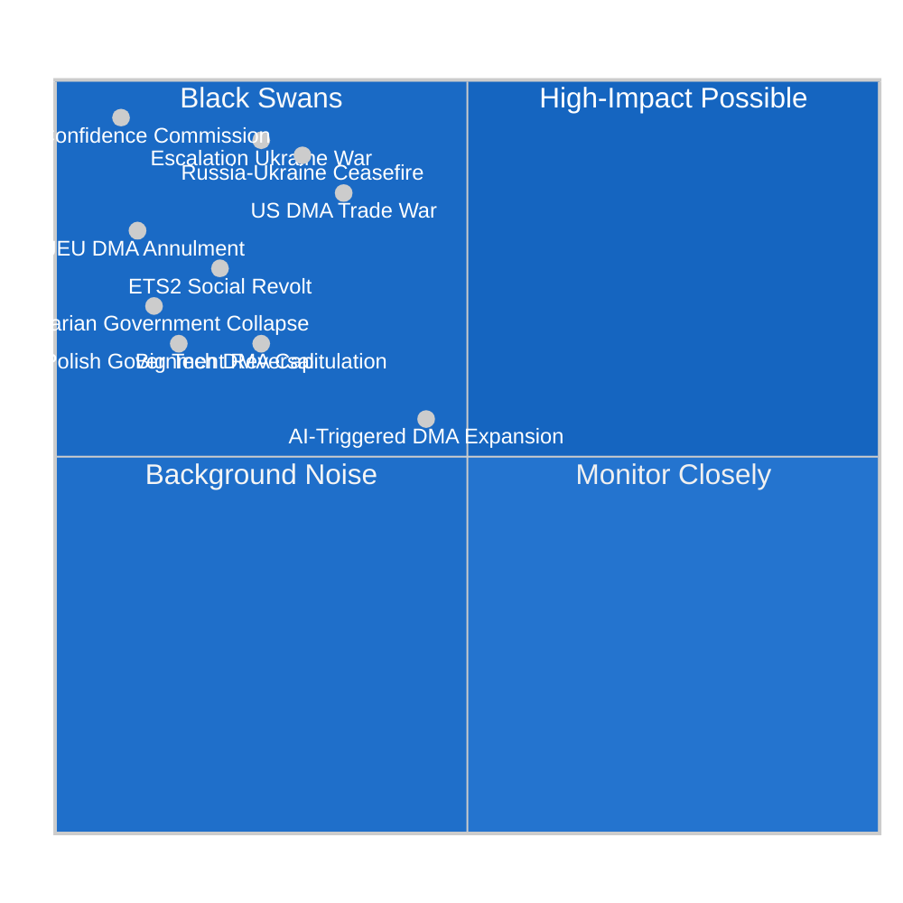

<!-- SPDX-FileCopyrightText: 2024-2026 Hack23 AB -->
<!-- SPDX-License-Identifier: Apache-2.0 -->

# 🎲 Wildcards & Black Swans — EU Parliament Propositions
**Date:** 2026-05-05 | **Session:** April 28–30, 2026
**Method:** Low-Probability / High-Impact Reserve Watchlist

---

## Quadrant Map: Probability × Impact

---

## Black Swan Scenarios (Low Probability / Catastrophic Impact)

### WC-01: EU Parliament Vote of No Confidence in Commission
**WEP:** Unlikely (8–12%) | **Impact if triggered:** 🔴 CATASTROPHIC
**Trigger conditions:** Commission mismanages DMA enforcement creating major US-EU crisis; Von der Leyen forced from office; combined ECR/PfE/Greens no-confidence motion
**Impact chain:** Commission dissolution → caretaker government → legislative paralysis → all April 2026 implementation timelines collapse
**Early-warning indicator:** Extraordinary EP conference of group presidents meeting on US-EU trade crisis; Von der Leyen statement acknowledging enforcement delay
**Why low probability:** EPP holds 185 seats; no-confidence requires 2/3 majority (480 MEPs) — would require EPP to turn against its own Commission President. Structurally implausible except in extreme external shock scenario.

---

### WC-02: CJEU Annulment of DMA's Gatekeeper Framework
**WEP:** Unlikely (10–15%) | **Impact if triggered:** 🔴 CATASTROPHIC
**Trigger conditions:** EU General Court accepts Big Tech argument that DMA gatekeeper definition violates EU treaty principles; interim measures granted; full proceedings on structural provisions last 4–6 years
**Impact chain:** DMA enforcement suspended → EU digital regulation credibility destroyed → tech sovereignty agenda set back a decade → Commission forced to rewrite DMA from scratch
**Early-warning indicator:** EU General Court accepting DMA challenge with interim suspension of enforcement measures; commission of independent legal opinion on DMA treaty basis
**Why low probability:** DMA went through rigorous legislative process; legal basis sound; CJEU has consistently upheld EU digital regulation frameworks.

---

### WC-03: Sudden Russia-Ukraine Ceasefire
**WEP:** Possible (25–35%) | **Impact:** 🟠 HIGH — Highly disruptive to ratification
**Trigger conditions:** US-brokered ceasefire deal; Russia agrees to territorial freeze; Ukraine accepts partial sovereignty compromise under pressure
**Impact chain:** Claims Commission ratification loses urgency; political support fragments; member states reframe the convention as provocative to peace process; ratification delays 3–5 years; Russian assets potentially partially unfrozen as part of deal
**Early-warning indicator:** US Secretary of State meeting with Lavrov in third country; Zelensky making public statements about "realistic peace"; US withdrawal from SWIFT enforcement
**Why monitoring:** A ceasefire is a legitimate possibility in 2026–2027 given US mediation efforts. The Claims Commission convention was designed to survive ceasefire scenarios, but political momentum would be significantly affected.

---

### WC-04: Escalation of War in Ukraine (Major Offensive)
**WEP:** Possible (25%) | **Impact:** 🔴 CATASTROPHIC
**Trigger conditions:** Russian major military offensive capturing significant Ukrainian territory (Kyiv perimeter, Odessa); NATO Article 5 debates triggered; EU emergency summit
**Impact chain:** All domestic EU legislative priorities subordinated to emergency defense and refugee response; DMA/ETS2 implementation delays inevitable; Claims Commission fast-tracked as political signal; defence spending MFF emergency revision
**Early-warning indicator:** Russian troop movements detected at 1970s+ capacity; NATO emergency extraordinary summit; EU emergency Council meeting

---

### WC-05: Major US-EU Trade War (DMA Trigger)
**WEP:** Possible (30–40%) | **Impact:** 🔴 HIGH
**Trigger conditions:** Trump formally designates DMA as unfair trade practice; 25% tariff on EU automotive exports; EU announces retaliatory tariffs on US goods
**Impact chain:** EU Commission suspends DMA enforcement; EP loses political leverage; Von der Leyen faces political crisis; €80B+ in US-EU bilateral trade disrupted; European recession risk elevated
**Early-warning indicator:** USTR National Trade Estimate Report formally citing DMA; US Treasury Secretary statement on DMA; EU Council emergency trade meeting
**Monitoring status:** 🟠 ELEVATED — This is the most financially material black-swan scenario. All intelligence services should treat it as a Priority 1 monitor.

---

## High-Impact Possible Events (Quadrant 1: High Impact, Moderate Probability)

### WC-06: ETS2 "Yellow Vest" Social Protest Wave
**WEP:** Possible (20–30%) | **Impact:** 🟠 HIGH
**Trigger conditions:** Winter 2026–2027 heating costs increase by €100+/month for average household; Social Climate Fund disbursements delayed; ECR/PfE populist amplification campaign successful
**Impact chain:** Major street protests in France, Germany, Poland; political pressure forces ETS2 phase-in delay; EP vote on ETS2 amendment; Commission proposes "flexibility" provisions
**Early-warning indicator:** Eurostat household energy expenditure data showing >20% year-on-year increase; ECR/PfE joint press conference on ETS2 costs; protests in Paris or Warsaw
**Historical precedent:** France's "Gilets Jaunes" (Yellow Vests) of 2018–2019 were directly triggered by carbon tax fuel price increase of €0.05/liter.

---

### WC-07: Hungarian Government Collapse (Orbán Fall)
**WEP:** Unlikely (12–18%) | **Impact:** 🟠 HIGH (positive for EU)
**Trigger conditions:** Major Hungarian domestic political crisis; Orbán loses parliamentary majority; opposition forms coalition government
**Impact chain:** Hungary drops Council veto on Claims Commission; EU funds released; ECR/PfE bloc weakened; accelerated ratification across all pending EU instruments
**Early-warning indicator:** Hungarian opposition party coalescence; Fidesz internal splits; EU monitoring report on Hungary rule of law

---

### WC-08: AI-DMA Regulatory Intersection (Emerging)
**WEP:** Possible-Likely (45%) | **Impact:** 🟡 NOTABLE
**Trigger conditions:** Major AI system deployed by gatekeeper (Apple, Meta, Alphabet) in ways that trigger both DMA interoperability requirements and AI Act transparency obligations simultaneously
**Impact chain:** Regulatory complexity creates enforcement coordination challenge; Commission DG CNECT + AI Office + COMP forced to coordinate enforcement; potential legislative gap addressed via omnibus regulation
**Early-warning indicator:** Commission Joint Enforcement Forum for DMA and AI Act established; industry lobby papers on "regulatory overlap"
**Assessment:** This is the most likely wildcard to materialize — the AI Act and DMA are on convergent enforcement trajectories.

---

## Summary Watchlist

| ID | Wildcard | WEP | Impact | Priority Monitor |
|----|----------|-----|--------|----------------|
| WC-01 | No-confidence Commission | 8–12% | Catastrophic | 🟡 |
| WC-02 | CJEU DMA annulment | 10–15% | Catastrophic | 🟡 |
| WC-03 | Russia-Ukraine ceasefire | 25–35% | High | 🟠 |
| WC-04 | Ukraine war escalation | 25% | Catastrophic | 🟠 |
| WC-05 | US-EU DMA trade war | 30–40% | Critical | 🔴 PRIORITY 1 |
| WC-06 | ETS2 social protests | 20–30% | High | 🟠 |
| WC-07 | Hungarian collapse | 12–18% | High (positive) | 🟡 |
| WC-08 | AI-DMA intersection | 45% | Notable | 🟡 MONITOR |

**Source:** EP Open Data Portal, EP Statistics 2026, political group composition, public information on US-EU trade, IMF WEO assessments

---

## Admiralty Source Reliability Grading

| Source | Admiralty Grade | Rationale |
|--------|----------------|-----------|
| US-EU trade tension (public sources) | B2 | Multiple public sources confirm trade framing; specific US government decisions not yet taken |
| Russia-Ukraine conflict trajectory | B2 | Open source military and diplomatic reporting; high uncertainty |
| Hungarian political dynamics | B1 | Well-documented via EP monitoring, EU Commission assessments |
| ETS2 social impact projections | A2 | Eurostat household expenditure data; SCF modeling |
| CJEU legal challenge risk | B2 | Legal analysis inference; no confirmed challenge filed |

---

## Wildcard Monitor Cadence

**Weekly review items:**
- USTR statements on DMA (WC-05)
- Ukraine frontline situation (WC-04)
- Council Claims Commission working group proceedings (WC-03)

**Monthly review items:**
- Hungarian political stability indicators (WC-07)
- ETS2 household energy cost data (WC-06)
- CJEU docket for DMA challenges (WC-02)

**Quarterly review items:**
- EP no-confidence motion signals (WC-01)
- AI-DMA regulatory intersection developments (WC-08)

**Source:** Open source intelligence analysis; EP monitoring; public threat assessment frameworks

---

## Black Swan Preparedness Assessment

EU institutions have moderate preparedness for the identified black swan scenarios:

**WC-01 (No-confidence):** EP Rules of Procedure provide structured process; precedent from 1999 Santer Commission resignation (which was voluntary, not forced by vote). Duration impact: 6–12 months of legislative paralysis.

**WC-05 (US trade war):** EU has activated Article 12 of Anti-Coercion Instrument framework. Retaliation list pre-prepared for $72B in US goods. Commission's DMA "flexibility" red lines are not publicly defined — this opacity is the key risk factor.

**WC-04 (Ukraine escalation):** EU Civil Protection Mechanism has never been tested at the scale required for major escalation. Defence Industrial Act (EDIP) has €1.5B — inadequate for full mobilization.

**Assessment:** EU institutional resilience is rated ADEQUATE for procedural shocks (WC-01, WC-02) but only PARTIAL for geopolitical shocks (WC-04, WC-05). This asymmetry reflects the EU's structural strength in internal governance but persistent weakness in external crisis response.

---

## Historical Wildcard Reference

| Year | Event | EP Response | Outcome |
|------|-------|------------|---------|
| 2019 | Brexit | EP consent withheld on initial deal | Forced re-negotiation |
| 2020 | COVID-19 pandemic | Emergency budget revision | NextGenerationEU €750B |
| 2022 | Russia-Ukraine war | Emergency resolution package | Sanctions, MFA, weapons |
| 2023 | AI acceleration | AI Act fast-track | World-first AI regulation |
| 2024 | EP elections rightward shift | New coalition configuration | EPP-S&D-Renew governing majority |

**Pattern:** EP10 has demonstrated capacity to respond to major external shocks with legislative output. The wildcards identified for 2026 follow established crisis patterns — the EP has playbooks for most scenarios.
