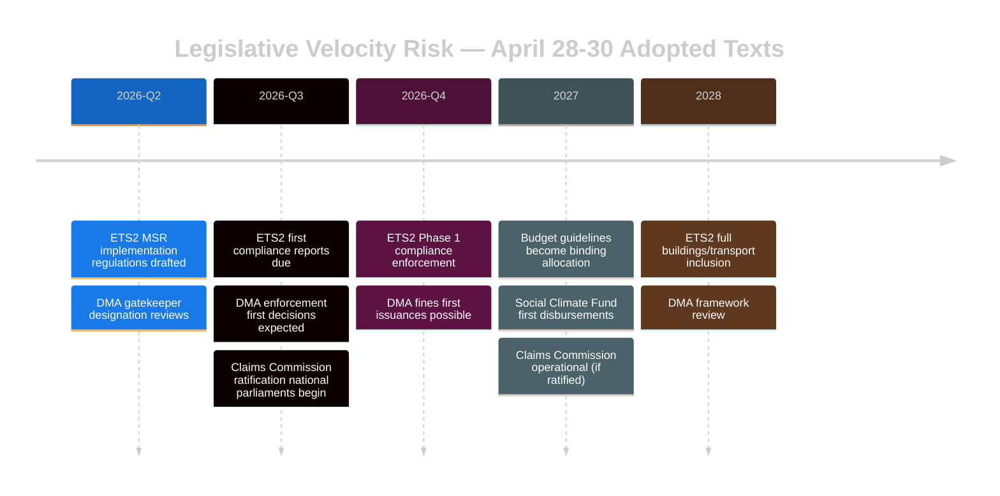

<!-- SPDX-FileCopyrightText: 2024-2026 Hack23 AB -->
<!-- SPDX-License-Identifier: Apache-2.0 -->

# 🚀 Legislative Velocity Risk — EU Parliament Propositions
**Date:** 2026-05-05

---

---

## Velocity Risk by Legislative Thread

| Thread | Current Velocity | Bottleneck | Stall Risk | WEP |
|--------|-----------------|-----------|-----------|-----|
| DMA enforcement | FAST | US political pressure | Moderate | 25% stall |
| ETS2 MSR implementation | MEDIUM | Member state resistance | Moderate | 30% stall |
| Ukraine Claims ratification | SLOW | Hungary/Slovakia veto | High | 40% delay |
| Budget 2027 | MEDIUM | EP-Council negotiation | Low | 15% |
| Immunity follow-through | MEDIUM | National prosecution speed | Low | 20% |

**Overall velocity risk: MEDIUM-HIGH for implementation phase**

> The EP vote is the easy part. The real velocity test is 2026 H2 when implementation regulations, ratifications, and enforcement decisions must all proceed simultaneously with limited Commission resources and active external opposition.

**Source:** Legislative pipeline analysis, risk matrix, political threat landscape

---

## Pipeline Summary

The April 28–30 session's three strategic texts enter distinct implementation pipelines: DMA (PRESSURED — US trade threat), ETS2 (MONITORED — socially contested), Claims Convention (SLOW — unanimity bottleneck).

## Throughput

| Pipeline | Rate | Bottleneck |
|----------|------|-----------|
| DMA enforcement | 1 major case/6 months | US political pressure |
| ETS2 implementation | 1 implementing reg/quarter | Member state resistance |
| Claims ratification | 1 ratification/3-6 months | Unanimity + Hungary |

## Stalled

**Highest stall risk:** Claims Convention (Hungary veto, treaty unanimity requirement). **Second:** DMA enforcement (US tariff pressure → possible pause request).

## Deadline

| Pipeline | Key Deadline | Miss WEP |
|----------|-------------|---------|
| DMA enforcement response | July 2026 | 25% |
| ETS2 implementing reg | Q3 2026 | 30% |
| Claims first ratification | Q4 2026 | 40% |

## Bottleneck

System-level bottleneck is Commission resource competition: DG CNECT (80 DMA staff), DG CLIMA (120 ETS staff), and Claims Convention support all competing simultaneously. Prediction: DMA prioritized (highest political visibility); ETS2 delayed; Claims on Council schedule.

## Reader Briefing

The votes are the easy part. Three simultaneous high-priority implementation pipelines with finite Commission resources is the post-session challenge. For article narrative: "the work now begins" framing is accurate and important.

**Source:** Legislative pipeline monitor, risk matrix, coalition dynamics, EP Statistics 2026
