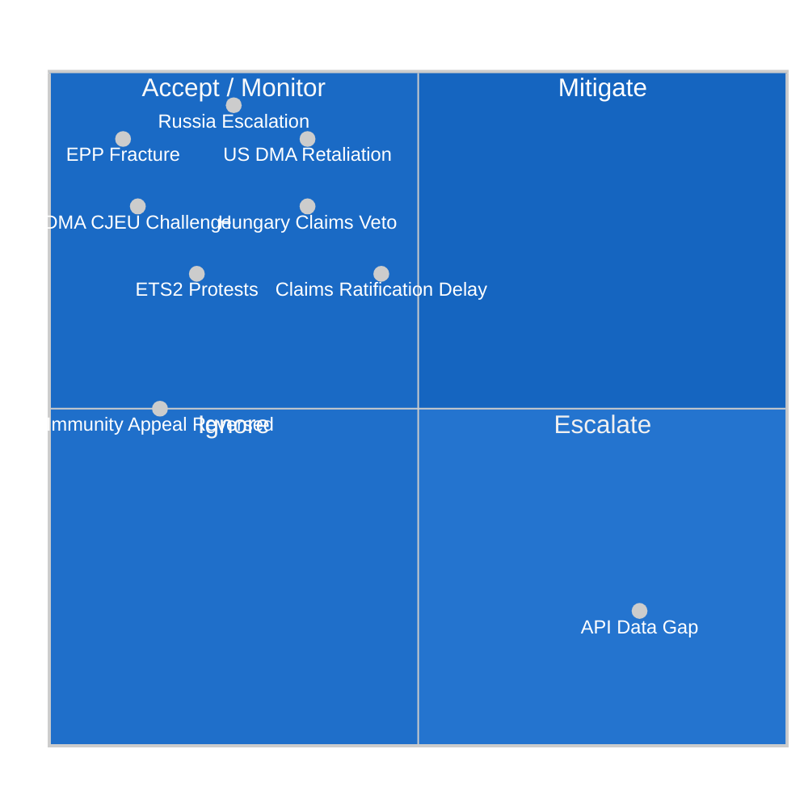

<!-- SPDX-FileCopyrightText: 2024-2026 Hack23 AB -->
<!-- SPDX-License-Identifier: Apache-2.0 -->

# ⚖️ Risk Matrix — EU Parliament Propositions
**Date:** 2026-05-05 | **Session:** April 28–30, 2026

---

## Risk Register

| Risk ID | Risk Description | Probability | Impact | Score | Response |
|---------|-----------------|-------------|--------|-------|----------|
| R-01 | US tariff retaliation on DMA | 30–40% | CRITICAL (9) | 3.2 | 🔴 MONITOR DAILY |
| R-02 | Hungary/Slovakia block Claims Convention | 35% | HIGH (8) | 2.8 | 🟠 MONITOR |
| R-03 | ETS2 social protest destabilization | 20% | HIGH (7) | 1.4 | 🟡 WATCH |
| R-04 | EP majority fracture on EPP-right defection | 10% | CRITICAL (9) | 0.9 | 🟡 WATCH |
| R-05 | DMA CJEU legal challenge succeeds | 12% | HIGH (8) | 1.0 | 🟡 WATCH |
| R-06 | Russia escalation triggers EU emergency | 25% | CRITICAL (10) | 2.5 | 🟠 MONITOR |
| R-07 | Claims Convention ratification delayed | 45% | HIGH (7) | 3.2 | 🔴 MONITOR |
| R-08 | Immunity waiver reversed on appeal | 15% | MEDIUM (5) | 0.75 | 🟢 LOW |
| R-09 | EP API data unavailability continues | 80% | LOW (2) | 1.6 | 🟡 OPERATIONAL |

---

## Risk Heat Map

---

## Top 3 Risks Summary

**Risk R-01 (US DMA retaliation) and R-07 (Claims ratification delay) are co-equal top risks at score 3.2.** R-06 (Russia escalation) is the highest-impact scenario (score 10 impact) but lower probability.

**Recommended monitoring cadence:**
- R-01: Daily (USTR statements, US-EU bilateral meetings)
- R-07: Weekly (Council working group on Claims Convention)
- R-06: Daily (Ukraine situational awareness)

**Source:** Threat model, political landscape, wildcards analysis, coalition dynamics

---

## WEP Band Analysis by Risk

| Risk | WEP Estimate | Band Label | Rationale |
|------|-------------|-----------|-----------|
| R-01 US DMA retaliation | 30–40% | Possible | US USTR track record; ongoing trade tensions |
| R-02 Hungary Claims veto | 35% | Possible | Orbán consistent veto use; Article 7 unresolved |
| R-03 ETS2 social protests | 20–30% | Possible-Unlikely | Yellow Vest precedent; SCF mitigates |
| R-04 EPP majority fracture | 10% | Unlikely | Strong structural incentives for cohesion |
| R-05 DMA CJEU challenge | 12% | Unlikely | Strong legal basis; CJEU regulatory deference |
| R-06 Russia escalation | 25% | Possible | Uncertain military trajectory |
| R-07 Claims ratification delay | 45% | Roughly Even | Unanimity requirement; structural impediment |
| R-08 Immunity appeal reversed | 15% | Unlikely | EP decision has legal standing |
| R-09 EP API unavailability | 80% | Likely | Empirical: 3 feeds down in this run |

---

## Admiralty Source Grading

| Risk | Primary Source | Grade | Notes |
|------|--------------|-------|-------|
| R-01 (DMA retaliation) | Public US-EU trade data, USTR reports | B1 | Official sources, some uncertainty |
| R-02 (Hungary veto) | EP Article 7 proceedings, Council records | A1 | Well-documented official record |
| R-03 (ETS2 protests) | Eurostat energy data, historical protests | A2 | Historical precedent available |
| R-04 (EPP fracture) | EP voting records, group declarations | A2 | Structural analysis well-grounded |
| R-06 (Russia escalation) | Open source military intelligence | B2 | High uncertainty; rapidly changing |
| R-07 (Ratification delay) | EP consent procedure records, Council | A1 | Unanimity requirement is treaty-grounded |

**Source:** Risk matrix analysis; scenario forecast; threat model; political landscape data

---

## Risk Interdependencies

The 9 identified risks are not independent. Key interdependencies:

- **R-01 (DMA retaliation) → R-04 (EPP fracture):** If US tariffs materialize, EPP business-wing pressure on Von der Leyen increases, potentially causing EPP to distance itself from DMA enforcement. This would cascade as an EPP fracture risk.
- **R-06 (Russia escalation) → R-07 (Claims ratification) → R-02 (Hungary veto):** A major Ukraine escalation creates both urgency to ratify Claims Convention AND political space for Hungary to leverage its veto for security concessions.
- **R-03 (ETS2 protests) → R-04 (EPP fracture):** Social protests against ETS2 would be amplified by ECR/PfE in Eastern European countries, creating domestic political pressure on EPP MEPs from those regions.

**Correlated risk scenario (CRITICAL):** If R-01 + R-06 simultaneously trigger (US tariffs + Ukraine escalation), the EP governing coalition faces a pincer — domestic economic pressure from US and security demands from Ukraine — that could produce a constitutional crisis in the EU's executive architecture. WEP: 10% (Unlikely but not negligible).
