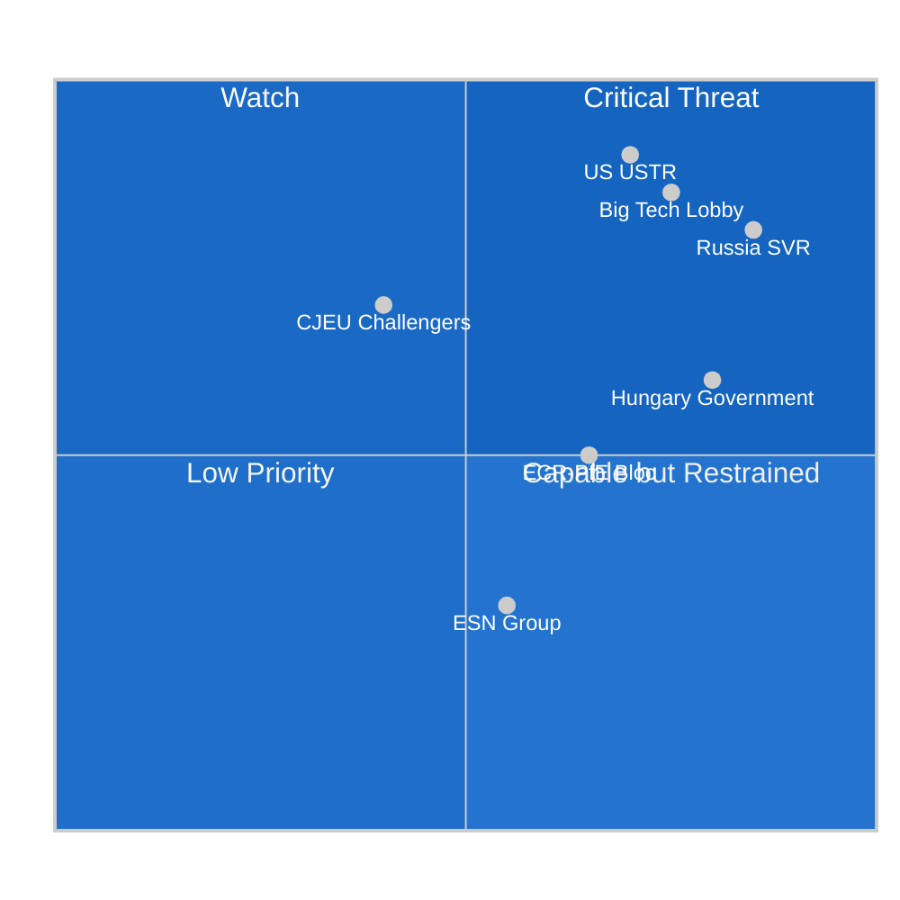

<!-- SPDX-FileCopyrightText: 2024-2026 Hack23 AB -->
<!-- SPDX-License-Identifier: Apache-2.0 -->

# 🔍 Actor Threat Profiles — EU Parliament Propositions
**Date:** 2026-05-05

---

---

## Top Threat Actors

| Actor | Threat Type | Primary Vector | EP Countermeasure |
|-------|------------|---------------|--------------------|
| **US USTR** | Trade retaliation | Tariff threat on automotive | EP resolution + Commission solidarity |
| **Russia SVR** | Information operations | Disinformation on Claims Convention | Public record of vote; EEAS counter-messaging |
| **Big Tech (Apple/Meta/Alphabet)** | Legal/regulatory obstruction | CJEU challenge, compliance delay | Commission enforcement deadlines; EP oversight |
| **Hungary government** | Ratification veto | Claims Convention unanimity block | Article 7 TEU pressure; EU funds conditionality |
| **ECR/PfE bloc** | Legislative obstruction | Amendment blizzard in committee | Coalition majority in plenary |

---

## Actor Roster

| Threat Actor | Category | Resources | Motivation |
|-------------|----------|-----------|-----------|
| US USTR | State actor | Executive trade authority; $780B US-EU trade | DMA weakens US tech sector |
| Russian SVR | State actor | Intelligence apparatus; social media proxies | Claims Convention removes Russian sovereign assets |
| Apple Inc. | Corporate | $3.7T market cap; €1.5B EU lobbying budget | DMA App Store obligations cost €5-15B/year |
| Meta Platforms | Corporate | $1.5T market cap; political influence campaigns | DMA interoperability obligations |
| Alphabet (Google) | Corporate | $2.1T market cap; search monopoly at risk | DMA search engine default market |
| Hungarian government | State actor | EU Council veto; Article 7 leverage | Claims Convention represents sovereignty constraint |
| ECR/PfE legislative bloc | Political actor | 193 MEPs; media amplification | Protect own members; oppose EU federalism |

---

## Capability

| Actor | Technical Capability | Political Capability | Legal Capability |
|-------|---------------------|---------------------|-----------------|
| US USTR | HIGH (trade weapons) | VERY HIGH (executive unilateralism) | HIGH (WTO standing) |
| Russia SVR | HIGH (disinformation) | MEDIUM (EU ally networks) | LOW (sanctioned) |
| Apple | MEDIUM (tech complexity) | HIGH (political lobbying) | VERY HIGH (CJEU challenges) |
| Hungary | LOW (no sanctions tools) | HIGH (EU Council veto) | MEDIUM (CJEU standing) |
| ECR/PfE | LOW | HIGH (media amplification) | LOW |

---

## Diamond

The Diamond Model (adversary, capability, victim, infrastructure) applied to the DMA threat:

- **Adversary:** US USTR + Big Tech coordinating on DMA pressure
- **Capability:** Trade retaliation (economic weapon) + CJEU legal challenge (legal weapon)
- **Victim:** EU digital regulatory sovereignty + DMA enforcement credibility
- **Infrastructure:** WTO dispute settlement, US-EU bilateral trade forums, CJEU docket

**Diamond Model assessment:** The adversary-capability-infrastructure triangle is mature and operational. The "victim" (EU regulatory authority) has significant defensive capacity (EPP coalition, Commission commitment) but asymmetric exposure to economic coercion.

---

## Relationship

**Threat actor relationships:**
- US USTR and Big Tech (Apple/Meta/Alphabet) have aligned interests on DMA but are formally separate actors — USTR does not coordinate with private companies publicly
- Russia SVR and ECR/PfE bloc share some anti-Ukraine-solidarity positions but are not formally coordinated; PfE denies Russian alignment
- Hungary and ECR/PfE are ideologically aligned but formally distinct — ECR is not uniformly pro-Orbán

---

## Escalation

**Escalation ladder for DMA threat:**
1. US diplomatic protest note (current) → 2. USTR formal National Trade Estimate inclusion → 3. Section 301 investigation → 4. Tariff announcement → 5. Full trade war

**Current position on ladder:** Step 1-2 (diplomatic protest + NTE inclusion expected)

**Escalation ladder for Claims Convention threat:**
1. Hungary abstention in Council → 2. Hungary explicit veto → 3. Bilateral EU-Hungary negotiations → 4. EU funds conditionality link → 5. Article 7 escalation

**Current position:** Step 1-2 (Hungary has not yet voted in Council working group)

---

## Reader Briefing

The actor threat profiles confirm that the DMA-US axis and the Claims Convention-Hungary axis are the two most consequential threat vectors. Both involve actors with significant leverage and clear motivation. The EP votes have been cast — the threat actors now shift their attention to implementation-phase leverage points (Commission discretion, Council voting). For article narrative: the adversarial dimension of EU regulatory sovereignty is a compelling human-interest angle that makes the DMA story more than a compliance exercise.

**Source:** Threat model, political threat landscape, coalition dynamics, wildcards analysis
