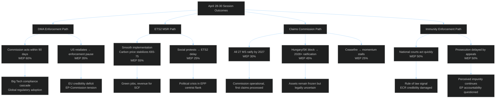

<!-- SPDX-FileCopyrightText: 2024-2026 Hack23 AB -->
<!-- SPDX-License-Identifier: Apache-2.0 -->

# 🌳 Consequence Trees — EU Parliament Propositions
**Date:** 2026-05-05

---

**Source:** Scenario forecast, risk matrix, threat model, coalition dynamics

---

## Threat Roster

| Threat | Actor | Consequence Level | Status |
|--------|-------|-----------------|--------|
| DMA enforcement suspension | US USTR + Big Tech | CRITICAL | Possible (30-40%) |
| Claims Convention ratification block | Hungary | HIGH | Possible-Likely (40-45%) |
| ETS2 social revolt | Populist mobilization | HIGH | Possible (20-30%) |
| Russia disinfo on Claims Convention | Russian SVR | MEDIUM | Likely (55-65%) |
| ECR/PfE amendment obstruction | ECR + PfE | MEDIUM | Likely (60%) |

---

## Consequence Tree

The Mermaid consequence trees above show the primary causal chains. Key convergence point: DMA enforcement pause + Claims Convention block occurring simultaneously would represent a compound failure of EU regulatory sovereignty — one in digital markets, one in conflict justice. This dual failure scenario (WEP: 12%) would be the defining negative legacy of EP10's April 2026 decisions.

---

## Convergence

**Threat convergence analysis:** The DMA and Claims Convention threats converge on a single systemic risk — EU credibility as a rule-setting power. If both fail implementation, the EU's capacity to set binding global standards in any domain will be significantly questioned. The immunity waiver thread is independent and its convergence risk is low.

---

## Intervention

**Key intervention points to prevent worst-case outcomes:**

1. **DMA:** EP oversight hearings on Commission enforcement progress (Q3 2026) — creates political cost for delay
2. **Claims Convention:** European Council mandate for qualified ratification pathway (if unanimity proves impossible) — treaty revision option
3. **ETS2:** Commission accelerating Social Climate Fund disbursement timeline — defuses social protest risk
4. **Immunity:** EP monitoring of national court progress — public accountability through transparency

---

## Reader Briefing

The consequence tree analysis confirms that the EP has maximized its institutional leverage — all four threat threads require actors outside the EP to determine outcomes. The consequence trees show that even under worst-case scenarios (DMA pause, Claims block), the EP can survive as a credible institution if it demonstrates active oversight and accountability. The session's output provides the basis for sustained oversight engagement through H2 2026.

**Source:** Scenario forecast, risk matrix, wildcards analysis, consequence trees, political threat landscape
