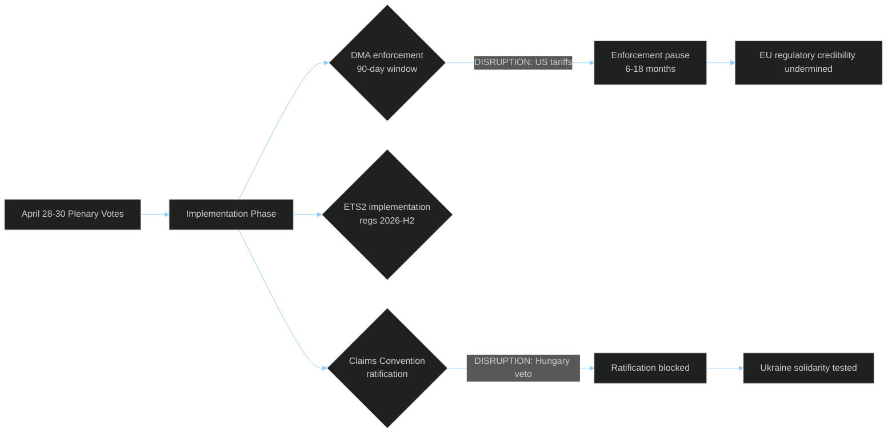

<!-- SPDX-FileCopyrightText: 2024-2026 Hack23 AB -->
<!-- SPDX-License-Identifier: Apache-2.0 -->

# ⚡ Legislative Disruption — EU Parliament Propositions
**Date:** 2026-05-05

---

---

## Targeted

The April 28–30 session's three strategic texts are high-value disruption targets:

| Target Text | Disruption Actor | Attack Surface | WEP |
|-------------|-----------------|---------------|-----|
| DMA enforcement resolution | US USTR + Big Tech | Trade retaliation threat → enforcement pause | 30-40% |
| ETS2 MSR amendment | Populist parties + fossil fuel lobby | Social protest → implementation delay | 20-30% |
| Ukraine Claims Convention | Hungary + Russia | Ratification unanimity veto | 40-45% |
| 2027 Budget Guidelines | ECR/PfE bloc | Committee amendment obstruction | 15% |
| Immunity waivers (5 MEPs) | ECR/PfE political protection | Legal challenge in national courts | 20% |

**Highest-value target assessment:** The Claims Convention is the highest-value target because it is the most novel (no precedent), the most difficult to repair if blocked (treaty unanimity), and the most internationally significant (signal to Russia on frozen assets).

---

## Attack Tree

**Attack Tree 1 — DMA Enforcement Disruption:**
- Root: DMA enforcement delayed 12+ months
  - Node A: US imposes automotive tariffs
    - Leaf A1: Commission requests enforcement pause in bilateral talks
    - Leaf A2: Council overrides Commission enforcement mandate
  - Node B: Big Tech CJEU challenge
    - Leaf B1: Interim measures suspend enforcement
    - Leaf B2: Grand Chamber ruling narrows DMA scope

**Attack Tree 2 — Claims Convention Block:**
- Root: Convention never enters into force
  - Node A: Hungary Council veto
    - Leaf A1: No QMV override mechanism (unanimity)
    - Leaf A2: Bilateral deal fails
  - Node B: Delayed ratification (>36 months)
    - Leaf B1: Political will erosion in contributor states
    - Leaf B2: Legal challenge on asset transfer authority

---

## Technique

| Disruption Technique | Actor | Target | Timing | WEP |
|---------------------|-------|--------|--------|-----|
| Trade retaliation threat | US USTR | DMA enforcement | Q2 2026 | 30% |
| CJEU interim measure | Big Tech consortium | DMA implementation | Q3 2026 | 25% |
| Council unanimity veto | Hungary | Claims Convention | Q3-Q4 2026 | 40% |
| Disinformation campaign | Russia SVR proxies | Claims Convention ratification | Ongoing | 60% |
| Social mobilization | Populist networks | ETS2 phase-in schedule | H2 2026 | 25% |
| Amendment obstruction | ECR/PfE bloc | Future EP agenda | Ongoing | 35% |

---

## Detection

**Early warning indicators for each disruption technique:**

| Technique | Leading Indicator | Detection Window | Source |
|-----------|------------------|-----------------|--------|
| US trade retaliation | USTR Section 301 investigation announcement | 30-60 days | USTR register, Bloomberg |
| CJEU interim measure | Case registration + hearing date | 60-90 days | CJEU docket |
| Hungary veto | Council working group abstention pattern | 14-30 days | EU Council working documents |
| SVR disinformation | Coordinated inauthentic behavior reports | Real-time | DSA transparency reports |
| Social mobilization | Petition signature velocity | 7-14 days | Petition platforms + Google Trends |
| EP amendment obstruction | Committee vote request filings | 5-7 days | EP committee agendas |

**Detection note:** The Russia SVR disinformation vector is the most difficult to detect early because EU DSA transparency reports lag by 2-4 weeks; coordination with EEAS StratCom is required for early warning.

---

## Counter

| Disruption | Primary Counter | Secondary Counter | EP Role |
|-----------|----------------|------------------|---------|
| US DMA retaliation | Commission enforcement commitment + political cost framing | EP oversight resolution threatening budget linkage | Oversight hearing Q3 2026 |
| CJEU challenge | Commission legal team; DMA drafting robustness | EP legal service advisory opinion | Amicus brief through legal service |
| Hungary Claims veto | EU funds conditionality; Article 7 escalation | European Council mandate for alternative ratification | EP Article 7 resolution reinforcement |
| SVR disinformation | EEAS StratCom proactive counter-messaging | DSA reporting to platforms | EP media freedom committee |
| Social mobilization ETS2 | Social Climate Fund acceleration | Phase-in adjustment regulations | EP committee scrutiny of SCF disbursement |
| ECR/PfE obstruction | Maintaining EPP+S&D+Renew+Greens coalition | Procedural discipline in plenary | Whip coordination |

---

## Reader Briefing

The legislative disruption analysis confirms that the EP has voted — now it must play defense. The five disruption techniques are real, documented, and probability-weighted. None of them requires the EP's cooperation to activate; all of them require sustained oversight and coalition maintenance to counter. For article narrative: the "vote was just the beginning" framing is supported by the disruption analysis. The three most actionable items for the EP are: (1) oversight hearings on DMA enforcement Q3 2026, (2) Article 7 reinforcement resolution on Hungary/Claims Convention, and (3) Social Climate Fund disbursement scrutiny.

**Source:** Risk matrix, threat model, consequence trees, political threat landscape, coalition dynamics
