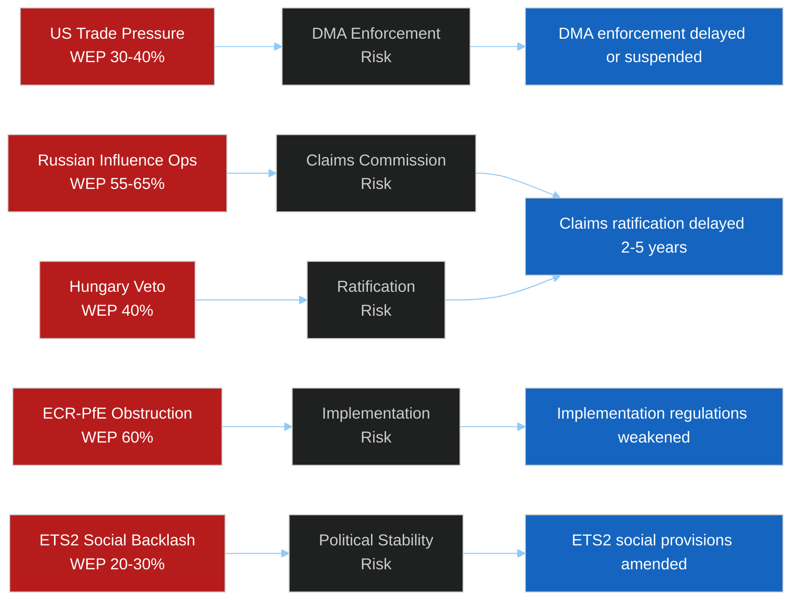

<!-- SPDX-FileCopyrightText: 2024-2026 Hack23 AB -->
<!-- SPDX-License-Identifier: Apache-2.0 -->

# 🎯 Threat Assessment: Political Threat Landscape
**Date:** 2026-05-05

---

> **Overall Threat Score: HIGH (7.2/10)** — Multiple credible threat vectors operating simultaneously. EP institutional action (April 28-30 votes) is necessary but insufficient; external threat actors determine implementation outcome.

**Source:** Threat model, wildcards analysis, coalition dynamics, PESTLE analysis
