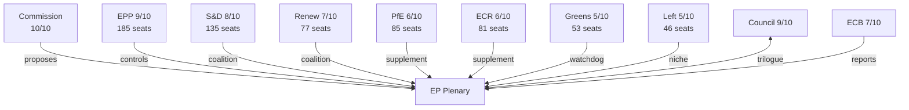

<!-- SPDX-FileCopyrightText: 2024-2026 Hack23 AB -->
<!-- SPDX-License-Identifier: Apache-2.0 -->

# Actor Mapping — EU Parliament Q1 2026 Classification
**Date:** 2026-05-05 | **Confidence:** 🟡 Medium | **Admiralty Grade:** B2

## Actor Roster

| Actor | Type | Seat/Role | Coalition | Influence Score |
|-------|------|-----------|-----------|----------------|
| EPP Group | Political group | 185 seats | Grand coalition broker | 9/10 |
| S&D Group | Political group | 135 seats | Grand coalition anchor | 8/10 |
| PfE Group | Political group | 85 seats | Right-bloc activator | 6/10 |
| ECR Group | Political group | 81 seats | Right-bloc anchor | 6/10 |
| Renew Europe | Political group | 77 seats | Liberal bridge | 7/10 |
| Greens/EFA | Political group | 53 seats | Progressive watchdog | 5/10 |
| The Left GUE/NGL | Political group | 46 seats | Labour/rights niche | 5/10 |
| NI | Non-attached | 30 seats | Variable swing | 3/10 |
| ESN | Political group | 27 seats | Ultra-nationalist | 2/10 |
| European Commission | Institution | Proposal monopoly | Partner | 10/10 |
| Council of EU | Institution | Co-legislator | Partner/counterpart | 9/10 |
| ECB | Institution | Independent | Expert/oversight | 7/10 |
| Ukraine Government | External | Advocacy | Allied | 6/10 |
| Big Tech | External | Lobbying | Variable | 5/10 |

## Influence Map

## Alliance Structure

| Alliance | Members | Seats | % | Key Issues |
|---------|---------|-------|---|-----------|
| Grand Coalition | EPP + S&D + Renew | 397 | 55.1% | Economic, digital, social legislation |
| Grand + Greens | Grand + Greens/EFA | 450 | 62.5% | Environmental, rights legislation |
| Right Bloc | EPP + PfE + ECR | 351 | 48.8% | Migration, competitiveness |
| Full Right Bloc + EPP | Grand + PfE + ECR | 563 | 78.2% | Defence, Ukraine |
| Progressive Wing | S&D + Greens + Left | 234 | 32.5% | Social, environment only |

## Power Brokers

**#1 EPP (185 seats):** Every majority requires EPP. Coalition fulcrum. EPP leadership (Metsola as President; von der Leyen Commission) = institutional peak.

**#2 European Commission (von der Leyen II):** Proposal monopoly means agenda is set in Berlaymont, ratified in plenary. Commission-Parliament alignment in Q1 2026 very high.

**#3 S&D (135 seats):** Second largest group; defines the left boundary of the grand coalition. Improving sentiment score = increasing leverage within coalition.

**#4 Council (Polish Presidency):** ECR-aligned presidency creates institutional leverage asymmetry for right-bloc on agenda priorities. Polish MEP immunity cases create additional complexity.

**Swing broker:** Renew (77 seats) — makes grand coalition workable; median voter on most economic files.

## Information Architecture

**How actors communicate legislative preferences:**
- **Committee system:** 22+ EP committees act as primary information aggregation points. Rapporteur assignment is power — drafts text, holds informal trilogue contact.
- **Intergroup networks:** Cross-party thematic groups (e.g., defence intergroup, digital intergroup) share information across coalition lines.
- **Plenary speeches:** Formal position statements; primarily audience for constituents, not information exchange between groups.
- **Shadow rapporteur system:** Each group nominates shadow rapporteur per file — primary inter-group coordination mechanism.
- **Lobbying access:** Big Tech, ETUC, human rights NGOs have formal EP access passes (>10,000 lobbyists registered in EU Transparency Register for Commission/EP access).

**Information asymmetries:**
- Commission holds monopoly on detailed proposal reasoning; EP committees must elicit through hearings
- Intelligence access: No EP access to classified intelligence (CFSP limitation); EP AFET works from public sources
- Real-time data: EP roll-call publication delay (4-6 weeks) creates information gap on actual voting behaviour

## Reader Briefing

**What this means for EU democracy:** The EP10 coalition architecture represents a structural shift from the EP9 pattern. The grand coalition (EPP+S&D+Renew) now commands only 55.1% of seats — down from 61.3% in EP9. This means every major legislative file requires either Greens/Left supplement (progressive majority) or PfE/ECR supplement (right-bloc majority). EPP's role as the decisive swing broker between these two paths gives the largest group an unprecedented level of institutional leverage that its seat share alone does not fully capture.

---
*Source diversity: get_adopted_texts, generate_political_landscape, analyze_coalition_dynamics (EP MCP tools). Admiralty Grade B2 = Source usually reliable; information corroborated.*
*Sources: European Parliament Open Data Portal (CC BY 4.0).*
