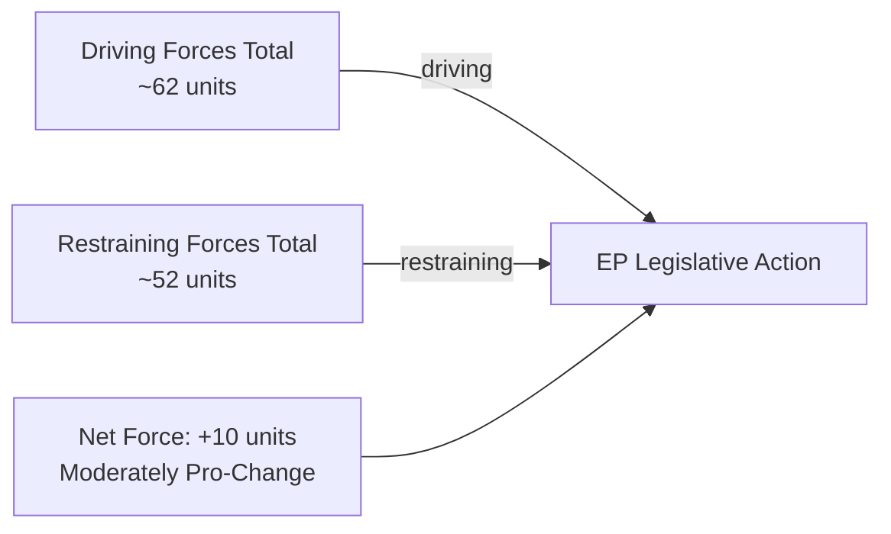

<!-- SPDX-FileCopyrightText: 2024-2026 Hack23 AB -->
<!-- SPDX-License-Identifier: Apache-2.0 -->

# Forces Analysis — EU Parliament Q1 2026 Legislative Forces
**Method:** Lewin Force Field Analysis adapted for parliamentary context
**Date:** 2026-05-05 | **Admiralty Grade:** B2

## Issue Frame

**Central issue:** Will the EU Parliament maintain legislative momentum and coalition cohesion through Q2-Q3 2026 in the face of record fragmentation, geopolitical pressures, and economic headwinds?

**Scope:** EP10 legislative production capacity and grand coalition stability as of Q1 2026 baseline.

**Stakes:** High — EU's ability to respond to Ukraine war, AI revolution, climate transition, and industrial competitiveness challenges simultaneously depends on EP legislative throughput.

## Driving Forces (Towards Change / Legislative Action)

| Force | Strength | Description | Evidence |
|-------|----------|-------------|---------|
| Ukraine war imperative | 9/10 | Geopolitical necessity forcing cross-party consensus | Loan Reg + Claims Commission + 5+ texts |
| AI governance momentum | 8/10 | AI Act implementation phase creating legislative pipeline | DMA enforcement, Copyright/AI resolution |
| Industrial competitiveness crisis | 8/10 | German economic contraction (-0.5% GDP) creating policy urgency | CID, EU Semester, STEP fund |
| Commission-Parliament alignment | 9/10 | Von der Leyen II agenda widely shared across grand coalition | Q1 adoption rate: 100 texts |
| Defence integration mandate | 8/10 | NATO pressure + Ukraine creating first EU defence co-legislation | EDIS, SAFE, single market for defence |
| EP institutional maturity | 7/10 | EP10 has Lisbon Treaty competences and institutional confidence | Co-decision on all major files |
| Democratic legitimacy demand | 7/10 | Post-Brexit EU needs EP to demonstrate democratic functioning | High plenary participation |
| Danish Presidency continuity | 6/10 | Smooth handover from Polish Presidency maintains agenda stability | July 2026 transition |

## Restraining Forces (Against Change / Legislative Paralysis)

| Force | Strength | Description | Evidence |
|-------|----------|-------------|---------|
| Record fragmentation (ENP 6.57) | 8/10 | Coalition assembly costs rising per vote | ENP highest in EP history |
| Grand coalition shrinkage | 7/10 | EPP+S&D+Renew fell from 61% to 55% since EP9 | Seat count data |
| EPP right-pivot temptation | 7/10 | PfE/ECR providing tactical supplementary majorities on right issues | Migration votes |
| Roll-call publication delay | 5/10 | Cannot observe real voting behaviour; coalition management blind | 0 roll-call records Q1 2026 |
| US tariff uncertainty | 6/10 | Trade environment disrupting economic legislation planning | EU-US tariff threat signals |
| Democratic backsliding (PL/HU) | 6/10 | Council blocking potential on rule-of-law files | Budget discharge deferrals |
| Immigration political pressure | 7/10 | Member states demanding restrictive legislation over EP's resistance | Safe third country votes |
| Economic stress (Germany) | 6/10 | Resource constraints on ambition; fiscal headroom limited | WB GDP data -0.5% 2024 |

## Net Pressure

**Net force calculation:**
- Sum of driving forces: 9+8+8+9+8+7+7+6 = 62 units
- Sum of restraining forces: 8+7+7+5+6+6+7+6 = 52 units
- Net force: +10 units (moderately in favour of legislative action)

**Assessment:** Driving forces exceed restraining forces by ~19%. The EP maintains forward legislative momentum but at elevated coordination cost. The "equilibrium" is LEGISLATIVE OUTPUT AT MODERATE-HIGH RATE with INCREASING COALITION FRICTION.

## Intervention Points

**Where interventions could shift the equilibrium:**

1. **Increase driving force — Ukrainian peace process (if any):** A ceasefire creates political space to redirect resources from war support to reconstruction. Could unlock additional economic legislation.

2. **Reduce restraining force — EPP leadership commitment to grand coalition:** If EPP leadership explicitly reaffirms grand coalition over right-bloc coalition, fragmentation costs drop. Danish Presidency could facilitate.

3. **Reduce restraining force — US tariff negotiation:** If US-EU tariff negotiation resolves, economic legislative uncertainty reduces; industrial legislation can proceed without defensive hedging.

4. **Reduce restraining force — Roll-call data availability:** If EP reduces publication delay, coalition managers can observe defections in near-real-time. Currently blind for 4-6 weeks.

5. **Increase driving force — Climate emergency:** If summer 2026 heat records/floods create political urgency, environmental legislation driving force strengthens, potentially rebalancing Green vs competitiveness tension.

## Reader Briefing

**What this means for EU citizens:** The forces analysis shows that the EU Parliament has enough driving force (geopolitical necessity, technological governance urgency, industrial competitiveness crisis) to maintain high legislative output in Q2-Q3 2026. However, the restraining forces (fragmentation, coalition uncertainty, external pressures) are significant and rising. The most important intervention point is EPP leadership's strategic choice: whether to anchor to the grand coalition (moderate, broad mandate) or increasingly use right-bloc supplementary majorities for selective issues (migration, competitiveness). This choice will define EP10's political character for the remainder of the term.

---
*Source: generate_political_landscape, analyze_coalition_dynamics, get_adopted_texts (EP MCP tools). Admiralty Grade B2.*
*Sources: European Parliament Open Data Portal (CC BY 4.0).*
