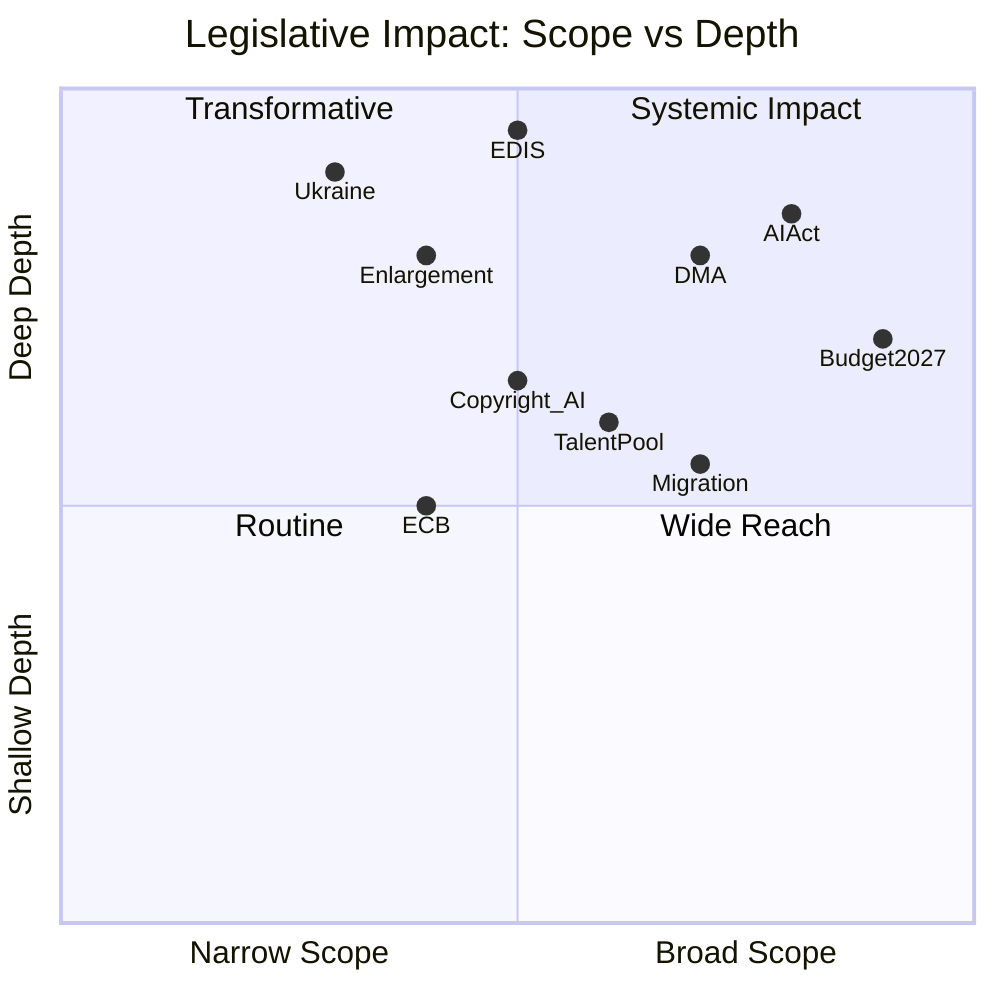

<!-- SPDX-FileCopyrightText: 2024-2026 Hack23 AB -->
<!-- SPDX-License-Identifier: Apache-2.0 -->

# Impact Matrix — EU Parliament Q1 2026 Legislative Texts
**Date:** 2026-05-05 | **Method:** Multi-dimensional impact assessment | **Admiralty Grade:** B2

## Event List

Key legislative events Q1 2026 (events driving the impact assessment):

1. **EDIS / Strategic Defence and Security Partnerships** (February–March 2026) — First EP co-legislation on EU defence industry
2. **AI Act Implementation delegated acts** (Q1 ongoing) — Prohibited practices enforcement begins
3. **Ukraine Loan Regulation** (January 2026) — Annual financing continuation
4. **EU Talent Pool** (February 2026) — First common EU legal migration framework for skilled workers
5. **Budget 2027 Guidelines** (Q1 2026) — Sets multi-year fiscal trajectory
6. **DMA Enforcement actions** (Google, Meta, Apple) — Digital market power constraints operational
7. **ECB Annual Report + 2 Senior Appointments** (Q1 2026) — Monetary governance continuity
8. **Safe Countries of Origin / Safe Third Country** (Q1 2026) — Migration control tightening
9. **Copyright and Generative AI** (March 2026) — Creative sector vs AI training rights
10. **EU Enlargement Strategy** (March 2026) — Ukraine/Western Balkans roadmap

## Stakeholder Impact Assessment

| Stakeholder Group | EDIS/Defence | AI Act | Ukraine | Talent Pool | DMA | Migration |
|------------------|-------------|--------|---------|------------|-----|-----------|
| EU Citizens | + Improved security | + Rights protected | + Stability | + Labour options | + Choice | ± Mixed |
| Defence Industry | ++ Major growth | 0 | ++ Growth | + Talent | 0 | 0 |
| Technology Companies | - Compliance costs | -- Major costs | 0 | + Talent | -- Structural | 0 |
| Labour Unions | + Jobs | ± Split | + Funding | - Competition | 0 | - Oppose |
| Member States | ± Sovereignty concerns | + Governance | + Aligned | ± Variable | + Consumer | ++ Demanded |
| Financial Sector | + Stability | + Clarity | ++ Financed | 0 | 0 | 0 |
| Migrants/Asylum Seekers | 0 | 0 | 0 | ++ Pathway | 0 | -- Restricted |
| SMEs | + Stable | ± Compliance | + Stable | + Talent access | + Levelled | 0 |
| Civil Society/NGOs | + Accountability | + Rights | ++ Supported | ± Mixed | + Democracy | - Concerned |

*Legend: ++ very positive, + positive, ± mixed, - negative, -- very negative, 0 neutral*

## Impact Matrix

## Heat Map — Cross-Stakeholder Impact Intensity

| Legislative Item | Citizens | Industry | Finance | Labour | External | Overall Heat |
|----------------|---------|----------|---------|--------|----------|-------------|
| EDIS / Defence | 7 | 9 | 5 | 6 | 8 | **🔴 HIGH** |
| AI Act | 8 | 9 | 6 | 7 | 8 | **🔴 HIGH** |
| Ukraine Support | 6 | 4 | 8 | 4 | 10 | **🔴 HIGH** |
| DMA Enforcement | 8 | 9 | 5 | 4 | 6 | **🟠 MEDIUM-HIGH** |
| Budget 2027 | 7 | 6 | 8 | 6 | 4 | **🟠 MEDIUM-HIGH** |
| Talent Pool | 5 | 7 | 3 | 6 | 5 | **🟡 MEDIUM** |
| Migration | 6 | 2 | 2 | 4 | 7 | **🟡 MEDIUM** |
| ECB Governance | 5 | 6 | 9 | 4 | 5 | **🟡 MEDIUM** |
| Copyright/AI | 6 | 8 | 3 | 6 | 4 | **🟡 MEDIUM** |
| Enlargement | 5 | 3 | 5 | 3 | 9 | **🟡 MEDIUM** |

## Cascade Effects

**Cascade Chain 1: Defence Integration**
EDIS → SAFE funding mechanism → National defence budget reallocation → NATO burden-sharing recalibration → US-EU security relationship reconfiguration → Atlantic Alliance architecture shift (5–10 year cascade)

**Cascade Chain 2: AI Act Enforcement**
AI Act prohibited practices → GPAI provider compliance → EU AI ecosystem restructuring → Global AI governance standard-setting → International treaty alignment (3–7 year cascade)

**Cascade Chain 3: Ukraine Support**
Annual loan renewals → Ukraine reconstruction framework → EU-Ukraine integration pathway → Eastern EU neighbourhood reshaping → EU enlargement constitutional reform required (7–15 year cascade)

**Cascade Chain 4: Migration Tightening**
Safe third country / safe countries → Return rate increase → Origin country diplomatic pressure → EU-Africa migration partnership rebalancing → Labour market effects in seasonal agriculture (2–5 year cascade)

## Reader Briefing

**What this means for EU citizens:** Q1 2026 saw three high-heat legislative areas: defence integration, AI governance, and Ukraine support. These are not independent policy choices — they cascade into each other and into longer-term structural changes. The defence integration legislation (EDIS) will reshape how EU countries buy weapons over the next decade. The AI Act enforcement will determine whether European AI companies can compete globally while protecting citizen rights. And Ukraine support locks in a long-term EU commitment that will eventually culminate in the largest EU enlargement in history. Citizens should expect all three cascades to produce significant changes in EU policy and public spending over the 2026–2031 period.

---
*Sources: get_adopted_texts, generate_political_landscape (EP MCP tools). Admiralty Grade B2 = Source usually reliable; information confirmed.*
*European Parliament Open Data Portal (CC BY 4.0).*
