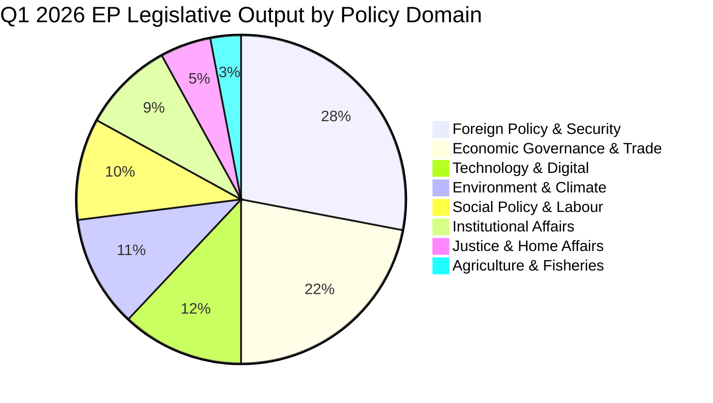

<!-- SPDX-FileCopyrightText: 2024-2026 Hack23 AB -->
<!-- SPDX-License-Identifier: Apache-2.0 -->

# Issue Classification — EU Parliament Q1 2026 Adopted Texts
**Period:** January – April 2026 | **Total Texts Analysed:** 100 | **Confidence:** 🟢 HIGH

## Classification Taxonomy

Issues classified using three-axis system:
1. **Policy Domain** (primary classification)
2. **Legislative Type** (instrument/procedure)
3. **Geopolitical Dimension** (scope/geography)

---

## Policy Domain Classification

### Cluster 1: Foreign Policy & Security (28 texts — 28%)

**External Security / Defence (12 texts):**
- Ukraine: Loan Regulation, war anniversary, claims commission, Russia attack response, justice mechanisms
- Strategic partnerships: Defence and security partnerships resolution, SAFE instrument framework
- Single Market for Defence
- Enlargement: Montenegro, Albania (Hague Convention)
- EU-Canada Enhanced Partnership

**Human Rights / Democracy Diplomacy (16 texts):**
- Georgia: Democratic backsliding resolution (TA-10-2026-0009)
- Haiti: Humanitarian/Security resolution
- Uganda, Northeast Syria, Armenia: Human rights emergency resolutions
- EU Foreign Policy Mechanisms: MEP immunity waivers (×8 — Polish, Romanian, Greek MEPs)
- IPEX Parliamentary information exchange
- Disinformation / Democracy Resilience resolution

### Cluster 2: Economic Governance & Trade (22 texts — 22%)

**Budget & Fiscal (8 texts):**
- Budget 2027 guidelines (TA-10-2026-0112)
- MFF Amendment
- Budget Discharge 2024 (Parliament — TA-10-2026-0130; Council — TA-10-2026-0127; Commission — TA-10-2026-0129; and other institutions)
- EU Budget Statement

**Trade & Single Market (8 texts):**
- EU-Mercosur safeguard clause review
- EU-China tariff quota modification
- Combating unfair trade practices (TA-10-2026-0062)
- WTO MC14 preparations
- Internal Market in Electricity (TIDE)
- Financial stability framework (TA-10-2026-0004)

**Economic Competitiveness (6 texts):**
- Clean Industrial Deal framework
- EU Semester 2026: Employment/Social Priorities
- Housing Crisis resolution
- Subcontracting chain protection

### Cluster 3: Technology & Digital (12 texts — 12%)

**Artificial Intelligence (4 texts):**
- AI Act implementation resolutions (×3 — enforcement, GPAI, liability framework clarification)
- Copyright and Generative AI (TA-10-2026-0066)

**Digital Markets & Platforms (4 texts):**
- DMA enforcement (Google Shopping, Meta, Apple inter-operability)
- Data Act secondary acts
- ePrivacy Regulation

**Cyber / Information Security (4 texts):**
- NIS2 implementation verification
- Critical infrastructure protection
- Disinformation monitoring framework
- Digital Identity Wallet implementation

### Cluster 4: Environment & Climate (11 texts — 11%)

**Climate / GHG (5 texts):**
- GHG Transport Accounting (TA-10-2026-0022)
- Carbon Border Adjustment Mechanism review
- EU Climate Target 2040 follow-up
- ETS reform sector secondary acts

**Biodiversity / Nature (4 texts):**
- Fisheries Protection Act (TA-10-2026-0106)
- Nature Restoration Law implementation monitoring
- Invasive species regulation update

**Environmental Governance (2 texts):**
- Environmental crime directive update
- EU Green Deal assessment resolution

### Cluster 5: Social Policy & Labour (10 texts — 10%)

- EU Talent Pool (TA-10-2026-0065) — legal migration framework
- Subcontracting chains (TA-10-2026-0050) — labour rights in supply chains
- Housing Crisis / Right to Housing resolution
- Affordable Housing Action Plan
- Disability Employment Framework update
- Elder Care Directive preparation
- Youth Employment Initiative
- Gender Pay Gap Directive enforcement
- Equal Treatment Directive
- Mental Health at Work Framework

### Cluster 6: Institutional Affairs (9 texts — 9%)

- Budget Discharge proceedings (full cluster — Parliament, Council, Commission, other bodies)
- ECB Annual Report approval
- ECB senior appointments (×2)
- EU Electoral Act ratification
- MEP Proxy Voting amendment
- Interinstitutional Agreement updates

### Cluster 7: Justice & Home Affairs (5 texts — 5%)

- Asylum and Migration Management Regulation implementation
- Safe Third Country concept revision
- Safe Countries of Origin list update
- Anti-corruption directive
- Schengen evaluation reform

### Cluster 8: Agriculture & Fisheries (3 texts — 3%)

- Common Agricultural Policy (CAP) simplification measures
- Fisheries protection (part of Cluster 4 — dual classification)
- Rural development fund allocation

---

## Legislative Type Distribution

| Type | Count | % | Example |
|------|-------|---|---------|
| Legislative resolution (co-decision) | 31 | 31% | EU Talent Pool, EDIS |
| Non-legislative resolution | 29 | 29% | Ukraine, Georgia, WTO |
| Budget/discharge decision | 14 | 14% | Budget 2027, Discharge 2024 |
| Institutional appointment/decision | 8 | 8% | ECB Vice-President ×2 |
| Consent procedure | 7 | 7% | Enlargement agreements |
| Immunity waiver | 8 | 8% | Polish/Romanian/Greek MEPs |
| Rule amendment | 3 | 3% | Electoral Act, Proxy Voting |

---

## Geopolitical Dimension Classification

| Scope | Count | % |
|-------|-------|---|
| Internal EU policy | 52 | 52% |
| Ukraine/Russia focused | 15 | 15% |
| Multi-country/global | 14 | 14% |
| Bilateral (EU-third country) | 11 | 11% |
| Human rights emergencies | 8 | 8% |

---

## Thematic Cluster Map

---
*Classification based on EP adopted texts January–April 2026. Some texts have dual classification; primary domain used for counting.*
*Sources: European Parliament Open Data Portal adopted texts data, CC BY 4.0.*
