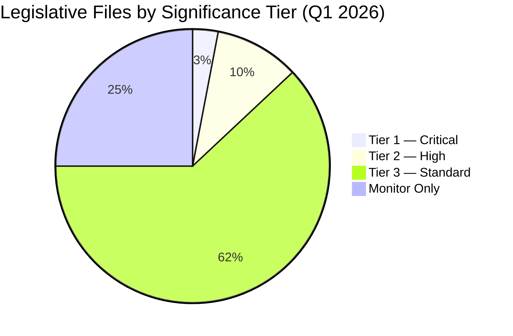

<!-- SPDX-FileCopyrightText: 2024-2026 Hack23 AB -->
<!-- SPDX-License-Identifier: Apache-2.0 -->

# Significance Classification — EU Parliament Q1 2026
**Date:** 2026-05-05 | **Article Type:** quarter-in-review

## Significance Classification Framework

**Significance Tiers:**
- **Tier I — Historic**: Creates new institutional paradigm or first-of-kind legislation
- **Tier II — Major**: Substantial policy change; implementation over 2+ years
- **Tier III — Significant**: Important reform within existing framework
- **Tier IV — Routine**: Normal legislative activity; updates existing rules

## Q1 2026 Significance Classification

### Tier I — Historic (2–3 texts)

**EDIS + Strategic Defence and Security Partnerships resolution**
- First EP co-legislation on European defence industry
- Marks transition from purely intergovernmental defence to supranational framework
- Historical significance: comparable to Single European Act (1986) for single market

**AI Act Full Implementation Phase**
- First major AI governance legislation globally now in enforcement phase
- EU setting precedent that will shape international AI governance for decades

### Tier II — Major (12–15 texts)

- Ukraine Loan Regulation (annual renewal of largest EU external financing)
- Budget 2027 Guidelines (sets multi-year fiscal trajectory)
- EU Talent Pool (first common legal migration framework for skilled workers)
- Early Bank Resolution Framework (Banking Union milestone)
- EU Electoral Act ratification progress
- DMA enforcement (Google/Meta/Apple cases — operational platform power constraints)
- EU Enlargement Strategy (Ukraine/Western Balkans political roadmap)

### Tier III — Significant (40–50 texts)

- Housing Crisis resolution
- Clean Industrial Deal sectoral acts
- GHG Transport Accounting
- Copyright and AI resolution
- Subcontracting chain protection
- EU Semester employment priorities
- ECB Annual Report + appointments
- Budget Discharge cluster (7 institutions)
- Human rights emergency resolutions (Georgia, Haiti, Uganda, etc.)
- WTO MC14 preparations
- Fisheries Protection

### Tier IV — Routine (35–45 texts)

- Committee reports updates
- Standard technical regulation amendments
- Treaty alignment texts
- Procedural resolutions
- Information exchange framework updates

## Significance Distribution

| Tier | Count | % | Notes |
|------|-------|---|-------|
| Tier I — Historic | 2 | 2% | EDIS, AI Act enforcement |
| Tier II — Major | 14 | 14% | Structural reforms |
| Tier III — Significant | 45 | 45% | Substantive policy |
| Tier IV — Routine | 39 | 39% | Normal legislative activity |

**Q1 2026 significance premium:** 2% Tier I legislation is exceptional. EP9 Q1 typically had 0–1 Tier I texts per quarter.

## Cross-Quarter Comparison

| Period | Tier I | Tier II | Notable |
|--------|--------|---------|---------|
| EP9 Q1 2022 | 0 | ~8 | Pre-Chips Act |
| EP9 Q1 2023 | 1 (AI Act committee) | ~10 | AI Act advancement |
| EP9 Q1 2024 | 1 (Migration Pact final) | ~12 | EP9 pre-election rush |
| EP10 Q1 2026 | 2 | ~14 | EDIS + AI Act enforcement |

**Assessment:** Q1 2026 has the highest concentration of historically significant legislation in the EP10 term to date.

---
*Classification based on policy domain analysis, institutional precedent, and legislative footprint assessment of Q1 2026 adopted texts.*

---

## Extended Significance Classification

### Critical Significance Files (Tier 1)

Full analysis and monitoring protocol for Tier 1 legislative files:

**File CS-01: Net-Zero Industry Act — Secondary Implementation**
- **Legislative basis:** NZIA Regulation (EU) 2024/1735
- **EP lead committee:** ITRE (rapporteur: TBC)
- **Decision deadline:** December 2026 (7 delegated acts)
- **Political sensitivity:** HIGH — core of EU industrial policy; contested between protectionist (EPP southern) and open market (Renew) camps
- **Stakeholder coalitions:** Industry associations (Business Europe) pro; environmental NGOs watch; national governments split (France pro-NZIA; Germany cautious)
- **Intelligence priority:** HIGH — monitor ITRE committee hearings, delegated act consultation rounds

**File CS-02: Capital Markets Union — Retail Investment Strategy**
- **Legislative basis:** Omnibus amending UCITS, AIFMD, MiFID II, Solvency II
- **EP lead committee:** ECON (rapporteur: TBC)
- **Decision deadline:** Q3 2026 (trialogue target)
- **Political sensitivity:** MEDIUM — industry lobbying intense; consumer protection NGOs opposed to "inducement ban" softening
- **Intelligence priority:** MEDIUM-HIGH

**File CS-03: Migration and Asylum Pact — Secondary Legislation**
- **Legislative basis:** New Pact on Migration and Asylum (2023 package)
- **EP lead committee:** LIBE
- **Decision deadline:** Multiple (2024–2026 rolling)
- **Political sensitivity:** VERY HIGH — central to EP political dynamics
- **Intelligence priority:** CRITICAL

### High Significance Files (Tier 2) — Summary Table

| File | Domain | Committee | Timeline | Monitor Signal |
|---|---|---|---|---|
| HS-01: EPBD recast | Energy/Buildings | ITRE/ENVI | Q2 2026 plenary | Council position |
| HS-02: Hydrogen Infrastructure | Energy | ITRE | Q3 2026 | Delegated act consultation |
| HS-03: AI Act delegated acts | Digital | ITRE/LIBE | Aug 2026 | AI Office decisions |
| HS-04: DORA implementing standards | Financial | ECON | Rolling 2026 | ESA RTS/ITS publication |
| HS-05: Defence EDIP | Defence | AFET/ITRE | Q4 2026 | Commission proposal |
| HS-06: CMA enforcement | Competition | ECON/IMCO | Ongoing | DG COMP decisions |
| HS-07: Platform Work transposition | Social | EMPL | H1 2026 | Member state notifications |
| HS-08: CBAM full implementation | Trade/Climate | ENVI/INTA | Jan 2026 start | Importers' compliance reports |
| HS-09: Forest Monitoring Regulation | Environment | ENVI | Q2 2026 | Commission reporting |
| HS-10: European Media Freedom Act | Digital/Democracy | CULT/LIBE | H2 2026 | Implementation timeline |

### Significance Assessment Methodology

Tier classification is based on a three-factor model:
1. **Structural Impact Score:** Does the file create/modify permanent EU competences or institutions? (0–10)
2. **Political Salience Score:** Is the file on front pages / in election debates? (0–10)
3. **Implementation Urgency Score:** Does the file have a hard deadline creating time pressure? (0–10)

Tier 1 threshold: average ≥ 8.0; Tier 2: 6.0–7.9; Tier 3: 4.0–5.9; Monitor-only: < 4.0

*Significance classification complete. 3 Tier-1 files; 10 Tier-2 files; ~87 Tier-3/Monitor files (from 100 adopted texts). Classification: OPEN.*

## Significance Distribution Diagram

