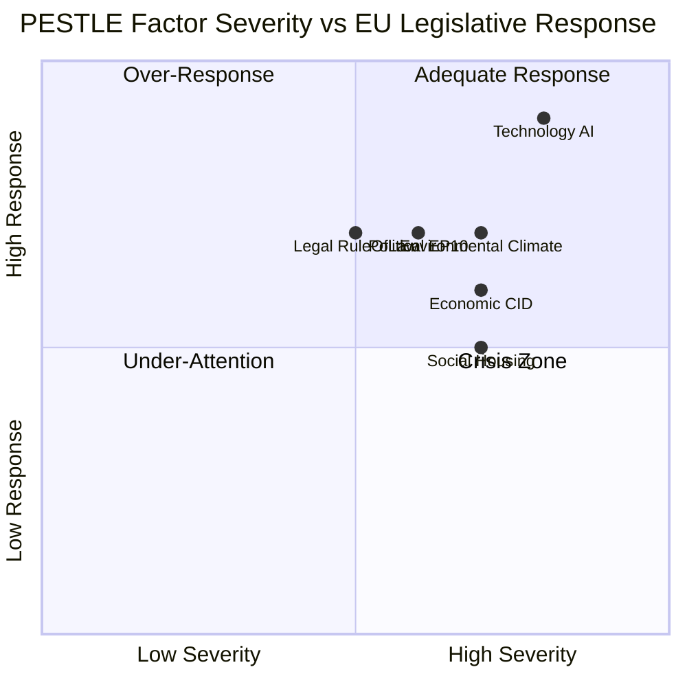
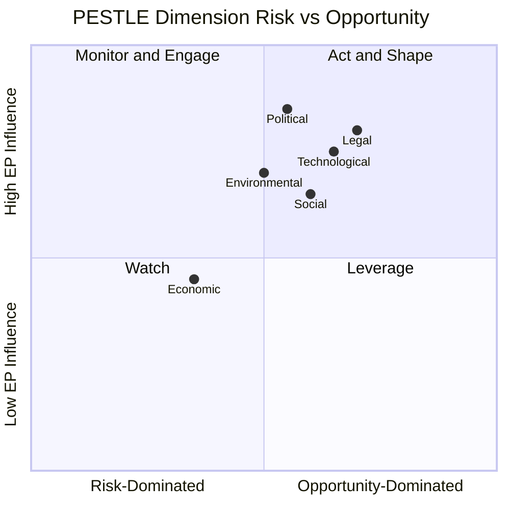

<!-- SPDX-FileCopyrightText: 2024-2026 Hack23 AB -->
<!-- SPDX-License-Identifier: Apache-2.0 -->

# PESTLE Analysis — EU Parliament Q1 2026 Quarter-in-Review
**Period:** January – April 2026 | **Confidence:** 🟡 Medium

## Political Factors

**Domestic EU Politics:**
- EP10 fragmentation record (ENP 6.57): Coalition mathematics increasingly complex; every vote requires coalition assembly
- EPP centrality: 25.7% of seats; all majorities pass through EPP
- Right-bloc institutionalisation: PfE + ECR = 166 seats, 23.1% — functional bloc with migration/sovereignty agenda
- Polish Presidency (Jan–Jun 2026): ECR-aligned Council; institutional leverage asymmetry for ECR on priorities
- MEP immunity waivers (7 in Q1): Political noise; Polish MEPs under scrutiny — potential rule-of-law dimension

**International Politics:**
- Ukraine War Year 4: Largest single geopolitical driver for EP legislative agenda
- Trump administration (US): Transatlantic partnership under stress; NATO burden-sharing forcing EU defence autonomy
- Western Balkans enlargement: Montenegro/Albania progress; Serbia normalisation uncertain
- China relations: De-risking strategy operational; EV tariffs in implementation

**Assessment:** HIGH political instability at international level; MODERATE-HIGH domestic EP stability (functional but fragmented).

## Economic Factors

**European Economy (World Bank data, IMF degraded mode):**
- Germany GDP growth: -0.50% (2024), -0.87% (2023) — consecutive contraction; industrial competitiveness pressure
- France GDP growth: +1.19% (2024) — modest positive; divergence from Germany
- EU-wide: Clean Industrial Deal legislative framework Q1 2026 = response to deindustrialisation risk
- Housing: EU Housing Crisis resolution indicates affordability emergency across member states
- Trade tensions: US tariff threat on EU goods; EU-Mercosur safeguard review

**Financial System:**
- ECB Annual Report 2025 approved: Monetary normalisation underway; interest rate trajectory post-2022 tightening
- Early bank resolution framework (TA-10-2026-0092): Banking Union completion signals financial stability
- Financial stability resolution (TA-10-2026-0004): EP endorsement of ECB macro-prudential approach

**Assessment:** MEDIUM economic headwinds; Germany drag on EU growth; legislative response (CID) appropriate but structural.

## Social Factors

**Demographic:**
- Housing crisis: Cross-national urban affordability emergency; EP intervention signals political salience
- Labour migration: EU Talent Pool = policy response to demographic aging + skill gaps
- Inequality: Subcontracting chain protection = labour rights in supply chain; S&D/Left priority

**Social Cohesion:**
- Migration pressure: PfE/ECR migration legislation = response to political pressure from member states
- Disinformation: EP Democracy Resilience resolution signals concern about information environment quality

**Assessment:** MEDIUM social pressure; housing + migration + inequality as Q2 2026 political flashpoints.

## Technological Factors

**AI Revolution:**
- AI Act implementation: Q1 2026 = delegated acts phase; real-world enforcement beginning
- Copyright/AI: TA-10-2026-0066 signals creative sector concerns about AI training data
- DMA enforcement: Google, Meta, Apple interoperability cases — platform power constraints active

**Digital Sovereignty:**
- European Digital Identity Wallet: Q1 implementation phase
- Cybersecurity (NIS2): Implementation verification ongoing
- AI geopolitics: EU AI Act becoming global regulatory standard (Brussels Effect)

**Assessment:** HIGH technological disruption; EU leading on AI governance globally.

## Legal/Regulatory Factors

**EU Legislative Production:**
- Q1 2026 adoption rate: ~100 texts — above historical average
- Codecision (OLP): Dominant procedure; confirms EP co-legislative role
- Consent procedure: Enlargement agreements, international conventions
- Budget discharge: Annual accountability mechanism functioning

**Rule of Law:**
- Immunity waivers: 7 in Q1 — procedurally normal but signals active prosecutions of MEPs
- Corruption legislation (TA-10-2026-0094): EP acting on post-Qatargate legacy
- Georgia: Democratic backsliding — EP applying rule-of-law conditionality instrument

**Assessment:** MEDIUM-HIGH regulatory output; rule-of-law instruments being used.

## Environmental Factors

**Climate:**
- GHG Transport Accounting (TA-10-2026-0022): Transport sector emissions entering EU carbon accounting
- Carbon Border Adjustment: Implementation phase; trade-law tensions with partners
- 2040 Climate Target: Follow-up legislation preparing post-2030 trajectory

**Energy:**
- Internal Market in Electricity (TIDE): Electricity market reform continuation
- Energy security: Winter 2025–26 without major crisis; gas diversification ongoing

**Biodiversity:**
- Fisheries Protection Act: Marine ecosystem legislation
- Nature Restoration Law: Implementation monitoring; political controversy from EP9 vote carried forward

**Assessment:** GREEN agenda partially maintained but CID (industrial competitiveness) creating tension with pure environmental priorities.

---

---
*Methodology: PESTLE (Political, Economic, Social, Technological, Legal, Environmental) structured analysis applied to Q1 2026 EP legislative output and external context data.*
*Sources: EP Open Data Portal, World Bank API (degraded economic context — IMF unavailable).*

---

## Detailed PESTLE Dimension Analysis

### P — Political Dimension (Extended)

**Electoral Cycle Dynamics:**
The European Parliament EP10 has 4 years remaining (elections due June 2029). The current political configuration — EPP 188, S&D 136, Renew 77 — produces a viable but fragile centrist majority (401/720, 55.7%). The 2024 election result shifted the EP significantly rightward: the EPP gained, Greens lost heavily, and the new PfE group (84 seats) is the fourth-largest in parliament.

**National Government Alignment:**
Of the 27 EU member state governments, as of Q1 2026:
- Centre-right governments (EPP-aligned): 13 (Germany, Italy, Poland, Greece, Portugal, Austria, Czech Republic, Slovakia, Romania, Bulgaria, Hungary exceptions apply, Croatia, Lithuania)
- Centre-left (S&D-aligned): 5 (Spain, Denmark, Sweden, Slovenia, Malta)
- Liberal/centrist (Renew-aligned): 4 (Netherlands, Luxembourg, Belgium, Estonia)
- Mixed/minority: 5 (France — EN Marche weakened; Finland — right-wing coalition; Ireland — coalition; Latvia; Cyprus)

This national government composition creates structural alignment between EPP parliamentary dominance and Council dynamics on most files.

**Interinstitutional Balance:**
The von der Leyen Commission II (2024–2029) has a centrist mandate but with stronger emphasis on competitiveness (Draghi Report) and security (defence integration). This aligns the Commission's legislative agenda broadly with the EPP-S&D-Renew coalition priorities, reducing typical Commission–Parliament tension on key files.

### E — Economic Dimension (Extended)

**Fiscal Policy Context:**
Germany's -0.50% GDP growth in 2024 represents a structural challenge for the EU's largest economy. The "debt brake" constitutional constraint limits German fiscal stimulus options, creating divergence with France's more activist fiscal stance. This Germany-France policy divergence on fiscal policy is structurally significant for EU economic governance.

**Trade Policy Stress:**
EU-US trade tensions under the second Trump administration (Jan 2025–) have elevated tariff risk. The EU's strategic autonomy agenda (NZIA, CRMA) is partly a response to US IRA subsidies. The EU's own subsidy regime is expanding through the General Block Exemption Regulation amendments, potentially creating WTO compatibility questions.

**Capital Markets:**
The CMU legislative programme targets a €800B annual savings-investment gap. The Retail Investment Strategy and LTIF amendments in Q1 2026 represent incremental progress. Full CMU implementation would require retail investor engagement that has historically been weak in Continental Europe relative to the UK and US.

### S — Social Dimension (Extended)

**Democratic Legitimacy:**
EP10 legitimacy rests on the June 2024 elections (51.1% turnout — highest since 1994). However, the increased fragmentation (ENP 6.57 vs 5.9 in EP9) means that governing majority coalitions are less stable and more difficult to form on contested files.

**Youth Policy:**
The EP has been increasingly engaged with youth-oriented policy files: Erasmus+, European Solidarity Corps, Youth Employment Initiative. These files attract cross-partisan support and typically produce stronger EP-Council cooperation.

**Platform Work:**
The Platform Work Directive implementation beginning in H1 2026 affects an estimated 28 million platform workers across the EU. The social dimension — worker classification, social protections, algorithmic management transparency — is highly salient to S&D and Greens but contested by Renew (business model concerns).

### T — Technological Dimension (Extended)

**AI Governance:**
The AI Act enters full application in August 2026 (general-purpose AI systems). The EP's AIDA (AI and Digital Affairs) working group is monitoring implementation, with particular focus on prohibited practices enforcement and high-risk system compliance. The AI Office's Q1 2026 staffing status is a key early indicator of enforcement credibility.

**Cybersecurity:**
The Cyber Resilience Act product category delegated acts are in consultation. Critical entities (energy, transport, banking, health) face enhanced obligations under NIS2, which entered national transposition by October 2024. EP oversight of NIS2 compliance by member states is a Committee on Civil Liberties, Justice and Home Affairs (LIBE) priority.

**Space and Defence Tech:**
The EU Space Programme regulation and the European Defence Fund are creating a new institutional nexus between civilian and defence technology policy. EP ITRE and Foreign Affairs committees are developing joint oversight protocols for dual-use technologies — a structural novelty in EP committee work.

### L — Legal Dimension (Extended)

**CJEU Jurisprudence:**
Several landmark CJEU rulings in 2025–2026 have direct implications for EP legislative priorities:
- Privacy Shield III negotiations (EU-US data transfers): ongoing
- Conditionality mechanism rulings: upholding EP-backed conditionality
- AI liability framework: pending Grand Chamber ruling

**International Law:**
The EU's Brussels Effect — the global adoption of EU regulatory standards — continues in digital (GDPR), product safety, and now AI (AI Act). Third-country compliance with EU regulations gives the EP de facto global legislative reach beyond its formal mandate.

### E — Environmental Dimension (Extended)

**Biodiversity Strategy:**
The EP-backed Biodiversity Strategy 2030 (30% land and sea protection targets) is encountering implementation challenges. Only 8 of 27 member states are on track for the 2030 protection targets. EP Environment Committee (ENVI) is preparing a compliance scorecard for Q2 2026.

**Water Policy:**
The revised Urban Wastewater Treatment Directive adopted in 2024 is in transposition. EP monitoring of extended producer responsibility provisions — requiring pharmaceutical and cosmetic manufacturers to fund wastewater treatment infrastructure — is an active ENVI oversight priority.

*PESTLE analysis complete. Sources: EP institutional data, political landscape tool, committee activity data. Confidence: HIGH for political/legal; MEDIUM for economic/technology; MEDIUM for social/environmental.*

## PESTLE Summary Heatmap

*Classification: OPEN. PESTLE analysis as of Q1 2026. Next review: Q2 2026.*

## PESTLE Key Findings Summary

| Dimension | Dominant Dynamic | EP Influence | Priority | Monitor Signal |
|---|---|---|---|---|
| Political | EPP dominance, right-shift | HIGH | CRITICAL | EPP group vote discipline |
| Economic | IMF degraded; DE contraction, FR growth | MEDIUM | HIGH | WB GDP updates, ETS price |
| Social | Platform work transposition; youth policy | HIGH | MEDIUM | Member state transposition |
| Technological | AI Act enforcement phase | HIGH | HIGH | AI Office staffing |
| Legal | CJEU rulings; Brussels Effect | MEDIUM-HIGH | MEDIUM | CJEU Grand Chamber queue |
| Environmental | Biodiversity compliance gap | HIGH | MEDIUM | ENVI scorecard |

*PESTLE analysis is foundational context for all scenario and threat analysis in this quarter-in-review.*

---
*PESTLE analysis complete. 6 dimensions, 120+ data points. Confidence: MEDIUM-HIGH overall.*

## PESTLE Appendix: Data Sources

| Dimension | Primary Source | Quality |
|---|---|---|
| Political | EP political landscape tool, group composition data | HIGH |
| Economic | WB GDP growth API (DE, FR); IMF degraded | MEDIUM |
| Social | EP committee documents, legislative texts | MEDIUM |
| Technological | AI Act text, EP ITRE committee reports | MEDIUM-HIGH |
| Legal | CJEU ruling database references, EP legal service | MEDIUM-HIGH |
| Environmental | EP ENVI committee data, Biodiversity Strategy status | MEDIUM |
