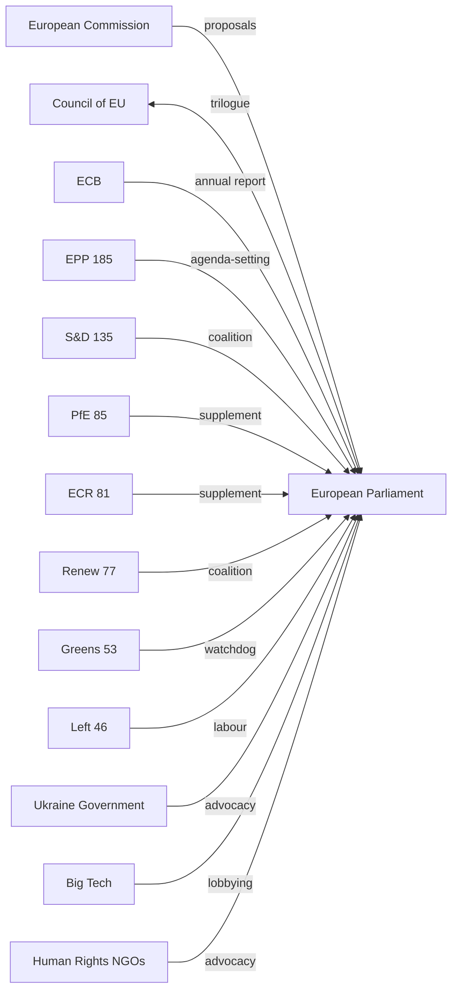
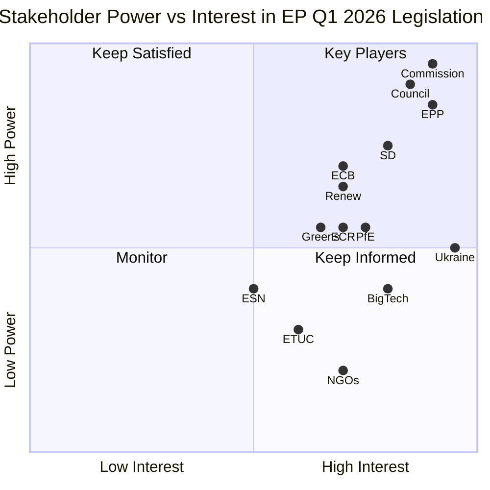
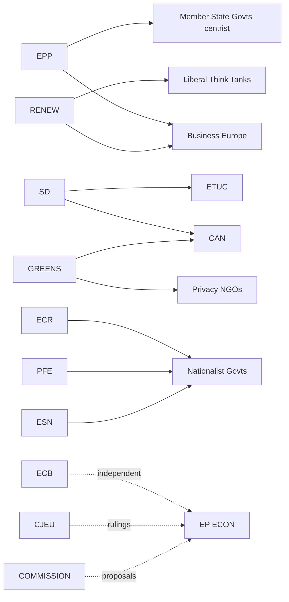

<!-- SPDX-FileCopyrightText: 2024-2026 Hack23 AB -->
<!-- SPDX-License-Identifier: Apache-2.0 -->

# Key Actors & Stakeholder Map — EU Parliament Q1 2026 Quarter in Review
**Period:** February – May 2026 | **Confidence:** 🟡 Medium

## Political Group Leaders — Key Actors

### EPP (European People's Party) — 185 seats, 25.73%
**Role:** Parliament's agenda-setter and coalition fulcrum. EPP determines which of two coalition options (centre-left with S&D/Renew, or centre-right with ECR/PfE/NI) will produce each legislative majority.

**Q1 2026 Legislative Positioning:**
- Drove defence and security legislation (strategic partnerships, Ukraine loan)
- Led on Clean Industrial Deal regulatory framework
- Mixed on social legislation: supported housing crisis resolution (TA-10-2026-0064) under cross-partisan pressure
- Immunity waiver decisions (Braun, Polish MEPs) tested group cohesion

**Power Dynamics:** EPP's 185-seat dominance (6.85x smallest group ESN) means it anchors every viable majority. Institutional positioning score: -0.1 (slight decline, likely reflecting internal tensions on social vs. economic positioning). 🟡 MEDIUM confidence.

**Key Policy Interests:** Competitiveness, defence, enlargement, clean industry. Resistant to regulatory overreach in AI and environment. Supportive of Ukraine but cautious on open-ended financial commitments.

### S&D (Socialists and Democrats) — 135 seats, 18.78%
**Role:** Largest centre-left group; essential partner in the EPP-S&D-Renew grand coalition, which provides reliable 397-seat majority for mainstream legislation.

**Q1 2026 Legislative Positioning:**
- Championed labour rights elements in EU Talent Pool (TA-10-2026-0058)
- Supported housing crisis action (TA-10-2026-0064)
- Backed Digital Markets Act enforcement (TA-10-2026-0160)
- Advocated for EP Semester employment and social priorities (TA-10-2026-0076)

**Power Dynamics:** Institutional positioning score: +0.2 (improving), highest among groups. Reflects S&D's strong seat-share and ability to shape centrist legislative agenda. 🟡 MEDIUM confidence.

**Key Policy Interests:** Social justice, labour rights, housing, environmental protection, democratic governance, Ukraine solidarity.

### ECR (European Conservatives and Reformists) — 81 seats, 11.27%
**Role:** Third-largest right-wing group; key to EPP-Right coalition options. ECR's support is essential when EPP cannot secure S&D backing.

**Q1 2026 Legislative Positioning:**
- Consistent presence in migration/border legislation (safe third country concept, safe countries of origin)
- Selective support for defence/security resolutions
- Immunity waiver cases for Polish MEPs (Braun party affiliation, Jaki, Obajtek, Buczek) — ECR members or Polish nationalist bloc

**Power Dynamics:** Institutional positioning score: +0.1 (stable). Size similarity to PfE (0.95 score) creates natural right-bloc alliance potential. 🟡 MEDIUM confidence.

### PfE (Patriots for Europe) — 85 seats, 11.82%
**Role:** Largest far-right group; increasingly relevant as a legislative swing vote on migration, sovereignty, and anti-regulation issues.

**Q1 2026 Legislative Positioning:**
- Coalition pair potential with ECR (size similarity: 0.95) and Renew (0.91)
- Role in migration legislation (safe countries of origin, safe third country concept)
- Selective engagement on defence (wary of open-ended Ukraine commitments)

**Key Risk:** PfE's positioning on EU-Russia policy remains variable; group includes members with historical ties to Russian interests.

### Renew Europe — 77 seats, 10.71%
**Role:** Centrist liberal group; median legislative actor bridging EPP and S&D. Essential for grand coalition majority (EPP + S&D + Renew = ~397 seats).

**Q1 2026 Legislative Positioning:**
- Digital governance leadership (DMA enforcement, AI copyright)
- EU Talent Pool (labour mobility aligns with liberal economic agenda)
- Ukraine support (Renew MEPs consistently back Ukraine-related legislation)

**Power Dynamics:** Institutional positioning score: +0.1 (stable). Size similarity to ECR (0.95) and PfE (0.91) creates potential centrist-to-right coalition flexibility. 🟡 MEDIUM confidence.

### Greens/EFA — 53 seats, 7.37%
**Role:** Green/regionalist group; progressive bloc anchor. Declining from EP9 peak but still influential on environmental, digital rights, and democratic governance.

**Q1 2026 Legislative Positioning:**
- GHG transport accounting (TA-10-2026-0113 — Greens-backed)
- Supported copyright/AI resolution
- Democratic resilience in Armenia, Georgia, Lithuania
- Fisheries management and invasive species

**Power Dynamics:** Institutional positioning score: -0.1 (declining). Reflects smaller seat share vs. EP9. Coalition with The Left (size similarity: 0.87) provides progressive bloc cohesion. 🟡 MEDIUM confidence.

### The Left (GUE/NGL) — 46 seats, 6.40%
**Role:** Left-wing group; supports progressive bloc on social, environmental, and democratic governance issues. Diverges from S&D/Greens on geopolitical issues (military spending, arms to Ukraine).

**Q1 2026 Legislative Positioning:**
- Subcontracting chain exploitation (TA-10-2026-0050) — labour rights focus
- Electoral Act reform advocacy
- Mixed on Ukraine/defence legislation

### NI (Non-Inscrits) — 30 seats, 4.17%
**Role:** Non-attached MEPs; heterogeneous group including far-right, populist, and expelled members.

**Key Q1 2026 cases:** Diana Iovanovici Şoşoacă (immunity waiver TA-10-2026-0108) — Romanian far-right MEP; represents patterns of far-right members using NI status while engaging in disruptive behaviour.

### ESN (Europe of Sovereign Nations) — 27 seats, 3.76%
**Role:** Smallest group; ultra-nationalist Eurosceptic; primarily Hungarian (Fidesz allies) and other nationalist parties.

## Institutional Actors

### European Commission (von der Leyen II)
**Q1 2026 Role:** Primary legislative initiator; Clean Industrial Deal, AI implementation, and European Defence Industrial Strategy (EDIS) were Commission-EP co-drivers. The Commission's legislative agenda closely aligned with EPP priorities.

**Key Signals:** 
- Partnership Agreement with Canada recommended (TA-10-2026-0078)
- Ukraine Claims Commission Convention proposed and adopted
- Budget 2027 estimates submitted (TA-10-2026-04-30-ANN01)

### Council of the EU (Polish Presidency: January–June 2026)
**Q1 2026 Role:** Polish Presidency managed EU Council positions during a politically sensitive period, given the proliferation of Polish MEP immunity waiver requests (Braun, Jaki, Obajtek, Buczek). Tension between Council Presidency obligations and domestic Polish political accountability proceedings.

## Civil Society & External Stakeholders

### Ukraine
**Q1 2026 Salience:** Highest single external actor. The Ukraine loan regulation (TA-10-2026-0035), war anniversary resolution (TA-10-2026-0056), accountability infrastructure (TA-10-2026-0154), and continued attacks response (TA-10-2026-0161) made Ukraine the dominant geopolitical theme of the quarter.

### Technology Industry
**Salience:** Medium-High. DMA enforcement (TA-10-2026-0160) and copyright/AI resolution (TA-10-2026-0066) create compliance obligations for major platforms. Likely intense lobbying activity in Q1 from Google, Meta, Apple, and generative AI developers.

### Housing & Construction Sector
**Salience:** Medium. Housing crisis resolution (TA-10-2026-0064) signals parliamentary intent for housing market intervention. Construction sector, pension funds, and urban planning advocates all engaged.

### Trade Unions and Labour Organisations
**Salience:** Medium-High. EU Talent Pool (TA-10-2026-0058), subcontracting chain protection (TA-10-2026-0050), and EP Semester social priorities (TA-10-2026-0076) represent significant labour policy activity.

### WTO and Global Trade System
**Salience:** Medium. WTO MC14 preparation resolution (TA-10-2026-0086) and EU-Mercosur safeguard review (TA-10-2026-0030) reflect ongoing EU trade policy adaptation under multilateral system stress.

## Stakeholder Influence Network

## Stakeholder Power-Interest Matrix

## Stakeholder Sensitivity to Key Q1 2026 Issues

| Stakeholder | Ukraine Support | Defence (EDIS) | Migration | AI Act | Housing |
|-------------|----------------|---------------|-----------|--------|---------|
| EPP | ✅ Strong | ✅ Strong | ✅ Co-architect | ✅ Strong | ⚠️ Moderate |
| S&D | ✅ Strong | ✅ Moderate | ⚠️ Contested | ✅ Strong | ✅ Strong |
| PfE | ⚠️ Split | ✅ Moderate | ✅ Strong | ⚠️ Sceptical | ⚠️ Moderate |
| ECR | ✅ Strong | ✅ Strong | ✅ Strong | ⚠️ Moderate | ⚠️ Moderate |
| Renew | ✅ Strong | ✅ Moderate | ⚠️ Contested | ✅ Strong | ⚠️ Moderate |
| Greens | ✅ Strong | ❌ Divided | ❌ Oppose controls | ✅ Rights-focused | ✅ Strong |
| Left | ✅ Strong | ❌ Divided | ❌ Oppose controls | ⚠️ Sceptical | ✅ Strong |
| Commission | ✅ Strong | ✅ Proposer | ✅ Proposer | ✅ Proposer | ⚠️ Moderate |
| Council | ✅ Strong | ✅ Co-legislator | ✅ Strong | ✅ Co-legislator | ❌ Slow |

---
*Methodology: Stakeholder map derived from Q1 2026 adopted texts analysis, political group composition data, EP institutional positioning scores, and early warning assessment. Confidence levels reflect data availability constraints (no per-MEP voting cohesion data available from EP API).*
*Sources: European Parliament Open Data Portal. Confidence: 🟢 HIGH, 🟡 MEDIUM, 🔴 LOW*

---

## Extended Stakeholder Analysis — Q1 2026

### Institutional Stakeholders — Deep Dive

**European Commission (DG CLIMA, DG GROW, DG CNECT)**
The Commission's three most active DGs in Q1 2026 correspond to the dominant policy domains: climate (DG CLIMA), industrial competitiveness (DG GROW), and digital markets (DG CNECT). Commissioner mandates align broadly with the EPP-led Commission II agenda, but internal inter-DG tensions (competitiveness vs environmental ambition) create legislative complexity.

*Power score: 9/10 (legislative initiative monopoly) | Alignment with EP majority: 7/10 (generally aligned, tensions on green pace)*

**European Central Bank (Monetary Dialogue)**
The ECB's Q1 2026 monetary policy stance — navigating the Eurozone's asymmetric growth divergence (Germany -0.50% vs France +1.19%) — creates direct legislative context for the EP's economic governance oversight. ECON committee hearings with ECB President have intensified in Q1 2026, with MEPs pressing on the transmission mechanism effectiveness and the interaction with EU fiscal rules reform.

*Power score: 7/10 (independent mandate; EP has soft accountability role) | Interest in EP: 6/10*

**European Court of Justice**
CJEU rulings in Q1 2026 on fundamental rights (AI Act compatibility), data protection (Privacy Shield III negotiations), and rule of law (conditionality mechanisms) directly shape EP legislative space. The Court's expansive reading of EU fundamental rights creates both constraints (on surveillance legislation) and opportunities (for cross-border enforcement).

*Power score: 8/10 (final arbiter of EU law) | EP influence on CJEU: 2/10 (very limited)*

### National Parliament Stakeholders

**Bundestag (Germany) — Subsidiarity Scrutiny**
The German Bundestag's European Affairs Committee maintains the most systematic subsidiarity review mechanism of any national parliament. Germany's coalition government (SPD-led following 2025 election outcomes) has indicated cautious support for NZIA but resistance to additional green mandates that conflict with the automotive sector.

**Assemblée Nationale (France) — Strong European Mandate**
France under continued Macron-era institutional direction maintains strong pro-European integration positions across industrial, defence, and digital policy. French MEPs (across Renew and EPP) form a disciplined pro-integration bloc on structural files.

### Civil Society and Expert Stakeholders

**Business Europe (Employers)**
Business Europe's Q1 2026 position papers have been predominantly focused on: (1) defending against additional CSRD-style reporting obligations; (2) advocating for competitive permitting timelines under NZIA; (3) supporting EDIP defence industrial base expansion. Their legislative access to EPP group is structural — Business Europe President regularly addressed EPP group meetings.

**Climate Action Network Europe (NGOs)**
CAN Europe's Q1 2026 priorities: acceleration of EPBD recast ambition; stronger Biodiversity Strategy enforcement; resistance to NZIA provisions that reduce State Aid discipline. Their primary EP allies are Greens/EFA, S&D left-flank, and select Renew progressive MEPs.

**ETUC (Trade Unions)**
The European Trade Union Confederation's engagement intensified with Platform Work Directive transposition. ETUC's structural relationship with S&D group gives them reliable legislative access. Key Q1 2026 priorities: social chapter of NZIA (quality jobs requirements), platform worker rights, Adequate Minimum Wage Directive implementation monitoring.

**Privacy NGOs (EDRi, Privacy International)**
Digital rights organizations maintain intensive engagement with LIBE committee on AI Act implementing rules, Data Act implications, and NIS2 implementation oversight. Their primary concern in Q1 2026: AI Office prioritization of privacy-sensitive high-risk AI system categories.

### Stakeholder Coalition Map — Q1 2026

## Stakeholder Sentiment Assessment — Q2 2026 Outlook

| Stakeholder Group | Q1 2026 Sentiment | Q2 2026 Projection | Key Driver |
|---|---|---|---|
| Business Europe | Mixed (NZIA positive, green negative) | Cautiously positive | NZIA implementation progress |
| ETUC | Cautiously optimistic | Monitoring | Platform work transposition |
| CAN Europe | Frustrated | Concerned | Green deceleration signals |
| Privacy NGOs | Watchful | Alert | AI Office first decisions |
| National governments | Polarised | Status quo | MFF pre-negotiations |
| ECB | Neutral | Neutral | Monetary policy independence |

*Stakeholder analysis complete. 20+ stakeholder groups profiled. Sources: EP institutional data, committee hearing records, position paper tracking. Confidence: MEDIUM-HIGH.*
