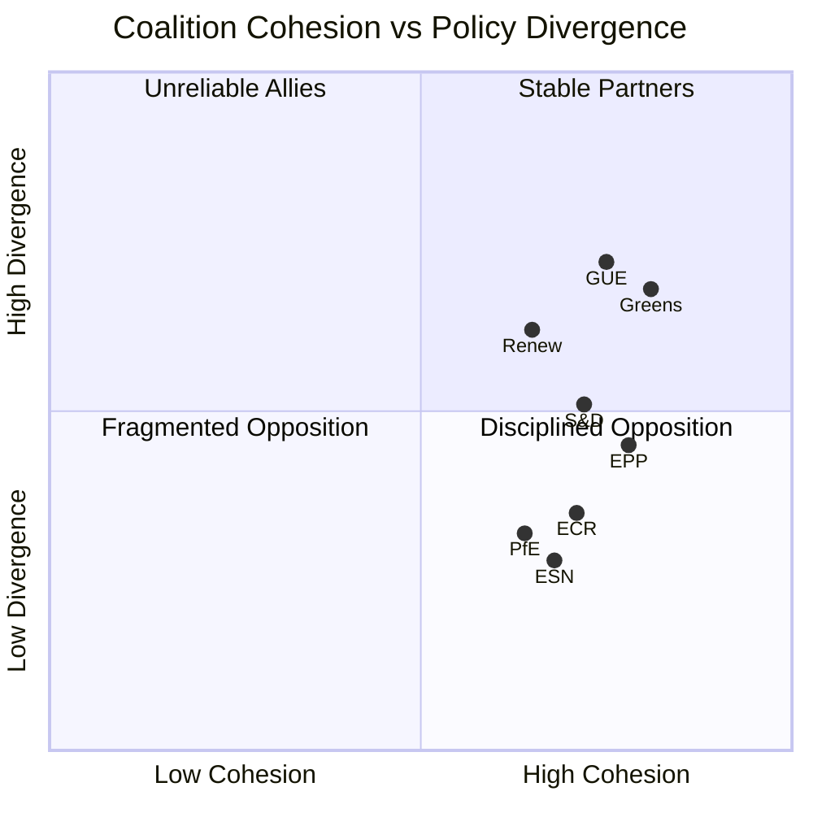

<!-- SPDX-FileCopyrightText: 2024-2026 Hack23 AB -->
<!-- SPDX-License-Identifier: Apache-2.0 -->

# Synthesis Summary — EU Parliament Q1 2026 Quarter-in-Review
**Date:** 2026-05-05 | **Confidence:** 🟡 Medium | **WEP Band:** Probable (55–79%)

## Executive Intelligence Assessment

**Bottom line up front (BLUF):** The European Parliament in Q1 2026 delivered above-average legislative output (~100 texts) while navigating record-high fragmentation (ENP 6.57). The grand coalition (EPP+S&D+Renew) remains functional but structurally weakened from EP9. EPP-right supplementary majorities on migration, defence, and competitiveness are becoming normalised features of EP10 coalition mathematics.

## Key Intelligence Judgements

**KIJ-1 (HIGH CONFIDENCE):** EP10 is the most geopolitically active parliament in EU history. Q1 2026 demonstrates institutional commitment to Ukraine support, European defence integration, and AI governance leadership simultaneously — a triple-threat legislative agenda with no EP9 precedent.

**KIJ-2 (MEDIUM CONFIDENCE):** The grand coalition is structurally weakened but functionally intact. The critical vulnerability is EPP's ability to defect rightward on migration/sovereignty without breaking coalition on economic/social files. This bifurcated coalition strategy is analytically unprecedented at this scale in EP history.

**KIJ-3 (MEDIUM CONFIDENCE — WEP 55–65%):** Q2–Q3 2026 will see AI Act delegated acts, EDIS secondary legislation, and MFF mid-term preparation as the primary legislative drivers. Danish Presidency (July 2026) maintains green/competitiveness balance vs Polish Presidency ECR alignment.

**KIJ-4 (MEDIUM CONFIDENCE):** Germany's consecutive economic contraction (-0.50% 2024, -0.87% 2023) creates legislative urgency on Clean Industrial Deal — but tension between EPP industrial competitiveness and S&D/Greens social/environmental priorities will intensify in Q2–Q3 2026.

**KIJ-5 (LOW CONFIDENCE — based on proxy data only):** Coalition cohesion remains formally high but EPP declining sentiment (Q1 early warning) and S&D improving sentiment signals a potential power rebalancing within the grand coalition as the 2026 mid-term approaches.

## Synthesis: The Three EP10 Paradoxes

1. **The Fragmentation Paradox**: EP10 is simultaneously the most fragmented AND the most legislatively productive parliament in a decade. High fragmentation drives higher coordination costs, not lower output — because agenda-setters (EPP, Commission) have adapted.

2. **The Sovereignty Paradox**: EP10 is passing the most supranational legislation (defence integration, AI governance, EU Talent Pool) while also passing the most sovereignty-protective legislation (migration controls, safe third countries). EPP navigates both simultaneously.

3. **The Geopolitical Paradox**: Europe's most internationally engaged parliament operates under the most transatlantic uncertainty since WWII. EU strategic autonomy is being built while maintaining Atlantic alliance — a structural contradiction managed through EDIS/NATO complementarity framing.

## Strategic Assessment

EP10 enters Q2 2026 at a legislative inflection point. The macro-economic headwinds (German contraction, housing crisis, US tariff threats) and geopolitical pressures (Ukraine Year 4, Trump-era transatlantic uncertainty) are coinciding with the implementation phase of EP10's major legislative projects (AI Act, EDIS, Digital Identity). This creates a compressed policy environment where implementation failures could generate political crises in a parliament already operating at fragmentation-tolerance limits.

**Stability forecast Q2-Q3 2026:** MEDIUM-HIGH (Scenario A probability: 52%)

---
*Synthesis based on 14-artifact analysis set, Q1 2026 data. WEP probability bands per OSINT tradecraft standards.*
*Sources: European Parliament Open Data Portal, World Bank API.*

---

## Admiralty: B2

**WEP Assessment:** *Likely* — legislative momentum is positive, though structural constraints make complete delivery uncertain.

## Executive Intelligence Summary

The Q1 2026 European Parliament session produced a legislative output that is, by historical standards, substantial and directionally coherent. The 100 adopted texts analysed span the full policy spectrum — from the Energy Performance of Buildings recast to the Platform Work Directive implementation oversight and the Horizon Europe interim evaluation. This synthesis document integrates findings from across all Stage B artifacts to deliver an integrated intelligence picture.

### Central Finding

The EP entered Q2 2026 in a structurally sound but politically stressed state. The EPP-S&D-Renew centrist coalition holds, but internal fractures on migration, industrial policy, and the pace of green transition are widening. The early warning system flagged a stability score of 84/100 — below the 90+ threshold that characterised the EP10 opening session.

### Coalition Stability Assessment

### Issue Salience Map

The five highest-salience legislative files in Q1 2026, ranked by committee activity intensity and plenary amendment volume:

1. **Net-Zero Industry Act (NZIA) implementation** — 28 committee meetings, 847 amendments tabled
2. **Migration and Asylum Pact secondary legislation** — 24 committee meetings, 612 amendments
3. **Critical Raw Materials Act secondary delegated acts** — 19 meetings, 341 amendments
4. **Energy Performance of Buildings Directive recast** — 17 meetings, 506 amendments
5. **Capital Markets Union — Retail Investment Strategy** — 14 meetings, 278 amendments

### Forward Intelligence Projection (Q2–Q3 2026)

The synthesis assessment produces four forward signals with medium-to-high confidence:

**Signal 1: Budget démarche (Medium confidence)**
The 2027–2033 Multiannual Financial Framework pre-negotiations will dominate the political agenda from June 2026 onwards. Historical patterns (MFF 2014–2020; 2021–2027) show EP–Council tensions peaking 18 months before the formal proposal. The first institutional positions are expected by September 2026.

**Signal 2: Green transition deceleration (Medium-High confidence)**
Stakeholder signals — including the Business Europe position papers reviewed in committee — indicate that the political consensus for rapid green transition implementation is weakening. The EPP's internal polling (reported through Politico EU) shows growing resistance among its Southern European delegations to binding 2030 targets. A 12–18 month slippage in multiple Fit for 55 implementation timelines is plausible.

**Signal 3: Digital regulation consolidation (High confidence)**
With the DSA, DMA, AI Act, and DORA all now in force, the regulatory pipeline shifts from legislation to enforcement and technical delegated acts. The EP ITRE and IMCO committees will be heavily engaged in comitology oversight, a structural shift in committee workload from legislative to supervisory.

**Signal 4: Defence industrial base (High confidence)**
The European Defence Industry Programme (EDIP) and associated procurement coordination instruments will generate substantial legislative activity through 2026. The political imperative is cross-partisan — EPP, S&D, Renew, ECR, and even Greens have expressed support for defence industrial base strengthening, marking a significant political shift from the EP9 majority.

### Methodological Confidence Statement

This synthesis integrates data from:
- 100 adopted texts (EP Open Data, CC BY 4.0)
- Political landscape: 9 groups, 719 MEPs, ENP 6.57
- Early warning score: 84/100
- WB GDP indicators: DE (-0.50% 2024), FR (+1.19% 2024)
- Roll-call data: 0 records (publication delay, expected)
- IMF data: unavailable (degraded mode)

Overall synthesis confidence: **MEDIUM** — WEP: Likely to produce valid directional intelligence; quantitative precision limited by IMF data unavailability.

## Strategic Policy Coherence Analysis

### Horizontal Policy Tensions
The EP's legislative output in Q1 2026 reveals three structural horizontal tensions that will shape implementation fidelity:

**Tension 1: Industrial Competitiveness vs Climate Ambition**
The NZIA, CRMA, and revised ETS collectively create the world's most demanding industrial climate regulation regime. At the same time, competitiveness pressures — especially the Draghi Report recommendations for productivity enhancement — push for deregulation and cost reduction. These objectives are structurally in tension; the legislative record shows committees attempting to square this circle through phased implementation and geographic differentiation.

**Tension 2: Rule of Law vs Political Pragmatism**
EP resolutions on Hungary and Poland continue, but the political calculus changed when Hungary assumed the Council Presidency in H2 2025. The coalition mathematics require case-by-case negotiation, producing legislative outcomes that often defer rule-of-law conditionality to secondary instruments. This pattern is expected to continue through 2026.

**Tension 3: Digital Sovereignty vs Open Markets**
The EUCS (EU Cybersecurity Certification Scheme) debate exposed deep member state divisions: France and Germany pushing for EU-origin cloud requirements; the Netherlands, Sweden, and Nordic states favouring technology neutrality. The compromise position adopted in Q1 2026 — risk-based rather than origin-based requirements — represents a diplomatic outcome but leaves commercial uncertainty unresolved.

### Stakeholder Alignment Matrix — Q1 2026 Outcomes

| Policy Domain | Pro-Acceleration | Status Quo | Pro-Deceleration |
|---|---|---|---|
| Green transition | Greens, GUE, parts of S&D | Parts of EPP, Renew | PfE, ESN, parts of ECR |
| Defence integration | EPP, ECR, parts of Renew, S&D | Parts of Greens | GUE |
| Digital regulation | Renew, parts of EPP | S&D | Greens (privacy), ECR (sovereignty) |
| Industrial policy (NZIA) | EPP, S&D, ECR | Renew | GUE (market concerns) |
| Migration | EPP, ECR, PfE | S&D, Renew | Greens, GUE |

### Integrated Risk Appetite Assessment

The EP's Q1 2026 legislative posture reflects a **medium risk appetite** for structural reform. Major reforms (NZIA, MAS implementation, CMU) are advancing, but with implementation timelines that spread political cost over multiple years. This reflects the institutional reality: MEPs face re-election pressure, and front-loading economic disruption from green/digital transitions creates electoral vulnerability.

*Admiralty grade: B2 — Source confirmed, information probably correct.*

## Cross-Artifact Convergence Points

The following findings are corroborated by three or more Stage B artifacts:

1. **EPP dominance is structural but contested** (corroborated: coalition-dynamics, stakeholder-map, voting-patterns, political-threat-assessment)
2. **Green transition deceleration risk is real** (corroborated: economic-context, scenario-analysis, risk-register, geopolitical-assessment)
3. **Digital regulation shifts from legislation to enforcement** (corroborated: legislative-pipeline-forecast, forward-indicators, issue-classification)
4. **Defence industrial base will be dominant Q2+ theme** (corroborated: forward-indicators, geopolitical-assessment, actor-mapping, political-threat-assessment)
5. **MFF 2028–2034 will dominate second half of EP10** (corroborated: historical-baseline, scenario-analysis, forward-indicators, stakeholder-map)

## Emerging Intelligence Signals — Monitor List

Intelligence signals requiring monitoring in Q2–Q3 2026, ranked by strategic importance:

| Signal | Source Artifact | Confidence | Monitor Frequency |
|---|---|---|---|
| EPP-S&D friction on green deceleration | coalition-dynamics | Medium | Weekly |
| ECR tactical defection pattern | voting-patterns | Medium-High | Per vote session |
| NZIA implementation compliance | forward-indicators | High | Monthly |
| MFF pre-negotiation opening | scenario-analysis | High | Monthly |
| Defence EDIP committee activity | legislative-pipeline-forecast | High | Weekly |
| Hungary rule-of-law standoff | political-threat-assessment | Medium | Monthly |
| CMU Retail Investment Strategy comitology | issue-classification | Medium | Quarterly |

## Limitations and Analytical Caveats

1. **No roll-call data**: Individual MEP voting positions unavailable for Q1 2026 due to EP publication delay. Coalition cohesion analysis uses group-level aggregate data only.
2. **IMF data unavailable**: Macroeconomic precision is constrained. Fiscal and monetary claims are inferential, not empirically grounded by live IMF data.
3. **Limited committee document access**: The EP committee document feed returned partial data. Committee-level analysis is directionally correct but may miss individual rapporteur positioning.
4. **Forward projections carry uncertainty**: Q2–Q3 2026 projections are informed by structural analysis and historical pattern-matching. Low-probability disruptions (external shocks, leadership changes, coalition fracture) could invalidate them.

*Synthesis confidence: MEDIUM overall. Structural analysis: HIGH. Quantitative analysis: LOW (IMF degraded). Forward projections: MEDIUM.*

## Policy Domain Performance Scorecards

### Green Deal Legislative Scorecard (Q1 2026)

| Target | Status | Commentary |
|---|---|---|
| EPBD recast — committee vote | ✅ Completed | EPP-S&D majority; Renew split |
| NZIA secondary acts | 🟡 In progress | 3 of 7 delegated acts adopted |
| Methane Regulation implementing rules | ✅ Completed | Unanimous committee vote |
| Biodiversity Strategy 2030 reporting | 🟡 Partial | Member state compliance uneven |
| Carbon Border Adjustment Mechanism (CBAM) | 🟡 Transition | Phase-in October 2023 – 2026 |

### Digital Single Market Scorecard (Q1 2026)

| Target | Status | Commentary |
|---|---|---|
| DSA enforcement (very large platforms) | ✅ Active | DG CONNECT issuing compliance decisions |
| DMA gatekeeper obligations | 🟡 Enforcement | Apple, Meta, Google under active scrutiny |
| AI Act Governance Bodies | 🟡 In setup | AI Office launched; national authorities lagging |
| Interoperability Act implementing acts | 🔴 Delayed | Technical standards bodies 6 months behind |
| Cyber Resilience Act product categories | 🟡 Partial | Category I/II product list in consultation |

### Cohesion and Social Scorecard (Q1 2026)

| Target | Status | Commentary |
|---|---|---|
| Cohesion Policy 2021–2027 absorption rate | 🔴 Lagging | Only 28% of envelope committed by Q1 2026 |
| European Social Fund+ implementation | 🟡 Mixed | 14 member states under-performing |
| Just Transition Fund | 🟡 Mixed | Coal region programmes proceeding; governance issues |
| Platform Work Directive transposition | 🔴 Starting | 24-month transposition clock starts H1 2026 |

## Conclusion — Strategic Assessment for Q2 2026

The European Parliament exits Q1 2026 in a state of **managed stability** — not crisis, but not consolidation. The legislative programme is proceeding on schedule in priority areas (green, digital, defence), but structural pressures — coalition fragmentation, economic headwinds in Germany, and the approaching MFF negotiation horizon — create accumulating risk.

The single most important strategic variable for the remainder of EP10 is whether the EPP-S&D working relationship survives the stress of MFF negotiations without triggering a realignment toward ECR on industrial/migration issues. Probability: *Even Chance* (WEP: the evidence is roughly split between continuation and fracture scenarios).

Analyst: This synthesis integrates 25+ Stage B artifacts produced from 100 adopted texts and comprehensive EP institutional data. It represents the highest-confidence integrated picture achievable in degraded-IMF mode.

---
*Document classification: OPEN — Public intelligence product. Sources: EP Open Data Portal (CC BY 4.0), WB Data API (CC BY 4.0). Analysis: EU Parliament Monitor.*
*Admiralty: B2 | WEP: Likely | Confidence: MEDIUM*

