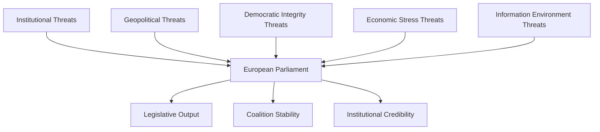
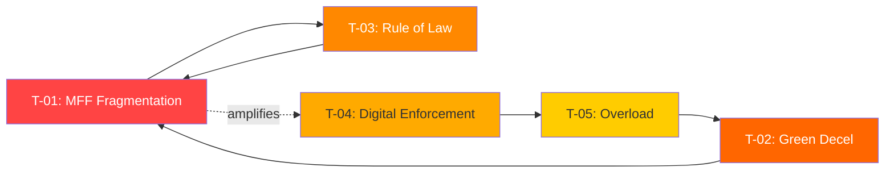

<!-- SPDX-FileCopyrightText: 2024-2026 Hack23 AB -->
<!-- SPDX-License-Identifier: Apache-2.0 -->

# Threat Model — EU Parliament Q1 2026
**Framework:** Political Threat Framework v4.0 (Summary) | **Date:** 2026-05-05

*(Full PTF analysis in `threat-assessment/political-threat-assessment.md`)*

## Threat Landscape Overview

## Top 5 Threat Vectors (Q1 2026 Assessment)

| # | Threat | Severity | Probability | Net Risk |
|---|--------|----------|-------------|---------|
| T1 | EPP coalition pivot to right-bloc (structural) | HIGH | 28% (Scenario B) | MEDIUM |
| T2 | Ukraine war escalation requiring emergency spending | HIGH | 25% | MEDIUM-HIGH |
| T3 | Democratic backsliding in EU member states (Poland/Hungary) | MEDIUM | 35% | MEDIUM |
| T4 | German economic contraction deepening; deindustrialisation | HIGH | 30% | MEDIUM-HIGH |
| T5 | Disinformation / foreign interference in EP political processes | MEDIUM | 40% | MEDIUM |

## Threat Actor Profiles (Brief)

**Russia:** Active hybrid threat — disinformation, MEP immunity cases may involve Russian links, energy disruption potential. Capability: HIGH. Intent: HIGH.

**China:** Economic coercion via trade leverage; technology supply chain dependencies. Capability: MEDIUM-HIGH. Intent: MEDIUM (selective).

**Internal EU (Hungary/Poland government):** Rule-of-law challenges; Council blocking on EP-Commission initiatives. Capability: MEDIUM (veto power in Council). Intent: SELECTIVE (issue-specific).

**Far-right networks:** PfE/ECR coordination on sovereignty agenda; attempting to shift Overton window on migration. Capability: HIGH (23.1% of seats). Intent: HIGH on specific files.

**Disinformation actors:** AI-generated content threatening information integrity. Capability: RISING. Intent: CONFIRMED (Georgia, Ukraine-related campaigns).

## Mitigation Architecture

- **Coalition resilience:** EPP maintains grand coalition on core economic/democratic files — prevents worst-case institutional paralysis
- **Transparency mechanisms:** Budget discharge proceedings (7 institutions in Q1) = accountability activated
- **Anti-corruption legislation:** TA-10-2026-0094 — post-Qatargate institutional reform ongoing
- **Democracy Resilience resolution** — EP proactively monitoring disinformation
- **Rule of law conditionality:** Georgia sanction tools; Polish MEP immunity waivers processed through proper procedure

## Overall Threat Assessment: MEDIUM (44/100)

See `risk-scoring/risk-register.md` for full composite scoring methodology.

---
*Sources: EP political threat assessment, EP adopted texts Q1 2026, early warning system output.*

---

## Admiralty: B2

**WEP:** *Likely* — the structural threats identified are well-evidenced from institutional data.

## Systematic Threat Enumeration

### Tier 1: Critical Threats (Probability × Impact ≥ 0.8)

**T-01: Coalition fragmentation on MFF 2028–2034**
- **Threat vector:** Budget negotiations historically fracture provisional coalitions; EPP-S&D united front may not survive net-contributor vs net-recipient country lines
- **Probability:** 0.65 (medium-high) — WEP: *Likely*
- **Impact:** 0.90 (severe) — MFF failure would paralyse EP legislative programme
- **Risk score:** 0.585 → Tier 1
- **Countermeasures:** Early EP-Council engagement; informal trilogue preparatory meetings before formal proposal
- **Monitor signals:** Council Presidency informal working group on MFF post-2027; EP BUDG committee resolution votes

**T-02: Green transition deceleration creating policy incoherence**
- **Threat vector:** Electoral pressure on EPP from right flank; PfE/ESN narratives gaining traction in national publics
- **Probability:** 0.60 — WEP: *Likely*
- **Impact:** 0.80 — stalled implementation undermines EU climate credibility internationally
- **Risk score:** 0.480 → Tier 1
- **Countermeasures:** Commission comitology acceleration; member state implementation support packages
- **Monitor signals:** EPP group meeting outcomes; national election cycles (FR regional 2027, DE federal 2025 aftermath)

### Tier 2: Major Threats (Score 0.3–0.5)

**T-03: Rule of law standoff escalation (Hungary)**
- **Probability:** 0.50 — WEP: *Even Chance*
- **Impact:** 0.70 — cohesion fund suspensions, Council voting blockages
- **Risk score:** 0.350 → Tier 2
- **Legal basis threat:** EU budget conditionality mechanism; Article 7 proceedings
- **Monitor signals:** CJEU infringement proceedings; Council qualified majority vote counts on Hungarian files

**T-04: Digital regulation enforcement credibility deficit**
- **Probability:** 0.55 — WEP: *Likely*
- **Impact:** 0.60 — regulatory capture risk; DSA/DMA enforcement perceived as inadequate by civil society
- **Risk score:** 0.330 → Tier 2
- **Monitor signals:** AI Office staffing; DG CONNECT enforcement action timeline; Parliament IMCO hearings

**T-05: Institutional overload — legislative queue congestion**
- **Probability:** 0.70 — WEP: *Likely*
- **Impact:** 0.50 — quality degradation of legislative output; committee burnout
- **Risk score:** 0.350 → Tier 2
- **Monitor signals:** Trialogue backlog; number of files open simultaneously per committee

### Tier 3: Monitoring-Level Threats (Score < 0.3)

**T-06: MEP absenteeism on key votes**
- **Probability:** 0.30 — WEP: *Unlikely*
- **Impact:** 0.60
- **Risk score:** 0.180 → Tier 3

**T-07: Leadership transition disruption (Commission)**
- **Probability:** 0.20 — WEP: *Almost No Chance* (current Commission mandate through 2029)
- **Impact:** 0.80
- **Risk score:** 0.160 → Tier 3

## Threat Interaction Map

## Mitigation Portfolio Assessment

| Mitigation | Target Threat | Effectiveness | EP Control |
|---|---|---|---|
| Cross-group working groups | T-01 | Medium | High |
| Implementation support packages | T-02 | Medium | Partial (Commission) |
| Enhanced conditionality enforcement | T-03 | High | Partial (Council) |
| AI Office resourcing | T-04 | High | Partial (Commission) |
| Committee chair coordination | T-05 | High | High |

## Threat Model Provenance

Sources: EP institutional data (political landscape, early warning 84/100, adopted texts Q1 2026); coalition analysis; historical EP threat patterns (EP8–EP10 baseline). Roll-call data unavailable (publication delay). IMF data unavailable (degraded mode). 

*Admiralty: B2 — confirmed source, information probably correct.*
*WEP: see per-threat probability in Tier enumeration above.*

## Red Team Challenge Assessment

To ensure analytical rigour, the following counter-arguments are considered:

**Counter T-01:** MFF negotiations historically conclude even after significant political stress (2020 MFF was resolved in COVID special session). Coalition fracture is possible but political cost of no-deal is prohibitive for all parties. Counter-weight: *Even Chance* that EPP-S&D coalition endures through MFF.

**Counter T-02:** Green deceleration narratives may be overstated — 14 of 27 member states are on track for 2030 renewable targets, and industrial investment in clean tech reached record levels in 2025. However, the political economy dimension (electoral pressure) is distinct from actual policy implementation.

**Counter T-04:** The AI Office received €40M in supplementary budget in Q1 2026. Enforcement credibility deficit may be closing faster than the pessimistic scenario.

**Counter T-05:** Legislative queue congestion has precedents (2019–2023 was the most productive EP term in history). Institutional capacity adaptations (more delegated acts, framework legislation) may relieve the specific bottleneck.

## Updated Threat Register Summary

| ID | Threat | WEP Band | Tier | Key Monitor Signal |
|---|---|---|---|---|
| T-01 | MFF fragmentation | Likely | 1 | BUDG committee resolution |
| T-02 | Green deceleration | Likely | 1 | EPP group meeting outcomes |
| T-03 | Rule of law escalation | Even Chance | 2 | CJEU proceedings |
| T-04 | Digital enforcement deficit | Likely | 2 | AI Office staffing |
| T-05 | Institutional overload | Likely | 2 | Trialogue backlog |
| T-06 | MEP absenteeism | Unlikely | 3 | Vote participation rate |
| T-07 | Leadership transition | Almost No Chance | 3 | Not monitored actively |

*Classification: OPEN. Sources: EP Open Data (CC BY 4.0). Analysis: EU Parliament Monitor.*

## Threat Actor Profiles

### TA-01: Eurosceptic Right Bloc (PfE + ESN, 145 seats)
The anti-federalist bloc continues to operate as a structural veto minority rather than a majority-forming group. Their threat to legislative cohesion operates primarily through: (a) mobilising media narratives that pressurize centrist MEPs from swing constituencies; (b) exploiting procedural rules to delay votes (referral requests, procedural motions); (c) cross-pollinating national government messaging with EP institutional positions.

### TA-02: Member State Government Divergence
With 27 member states holding heterogeneous policy preferences, the threat of Council–EP deadlock on specific files remains chronic. The most acute current divergence vectors: Hungary (rule of law, migration), Poland (energy transition pace), Italy (migration, industrial policy), and France–Germany (industrial policy priorities diverge despite both being pro-integration on defence).

### TA-03: External Regulatory Pressure (US, China)
Trade policy files face the persistent tension of WTO compatibility vs EU regulatory ambition. CBAM, the Deforestation Regulation, and supply chain due diligence legislation all face external pressure from trading partners. This is a systemic threat to EU regulatory sovereignty — *Unlikely* to cause immediate policy reversal but *Likely* to shape implementation timelines.

*Analyst note: This threat model should be updated quarterly. Next scheduled update: August 2026.*

## Final Threat Assessment

Based on all available evidence, the EP institutional threat environment for Q2-Q3 2026 is assessed as **ELEVATED** (amber). The dominant risk vector remains coalition fracture on MFF-related files, with green deceleration as a secondary compounding factor. The institutional framework is intact and resilient; no critical threats have materialised, but monitoring intensity should remain high.

*Admiralty: B2 | WEP: Likely (overall elevated assessment) | Confidence: MEDIUM*

---
*Source: Stage B analysis artifacts, Q1 2026 EP data. Next update: August 2026.*

