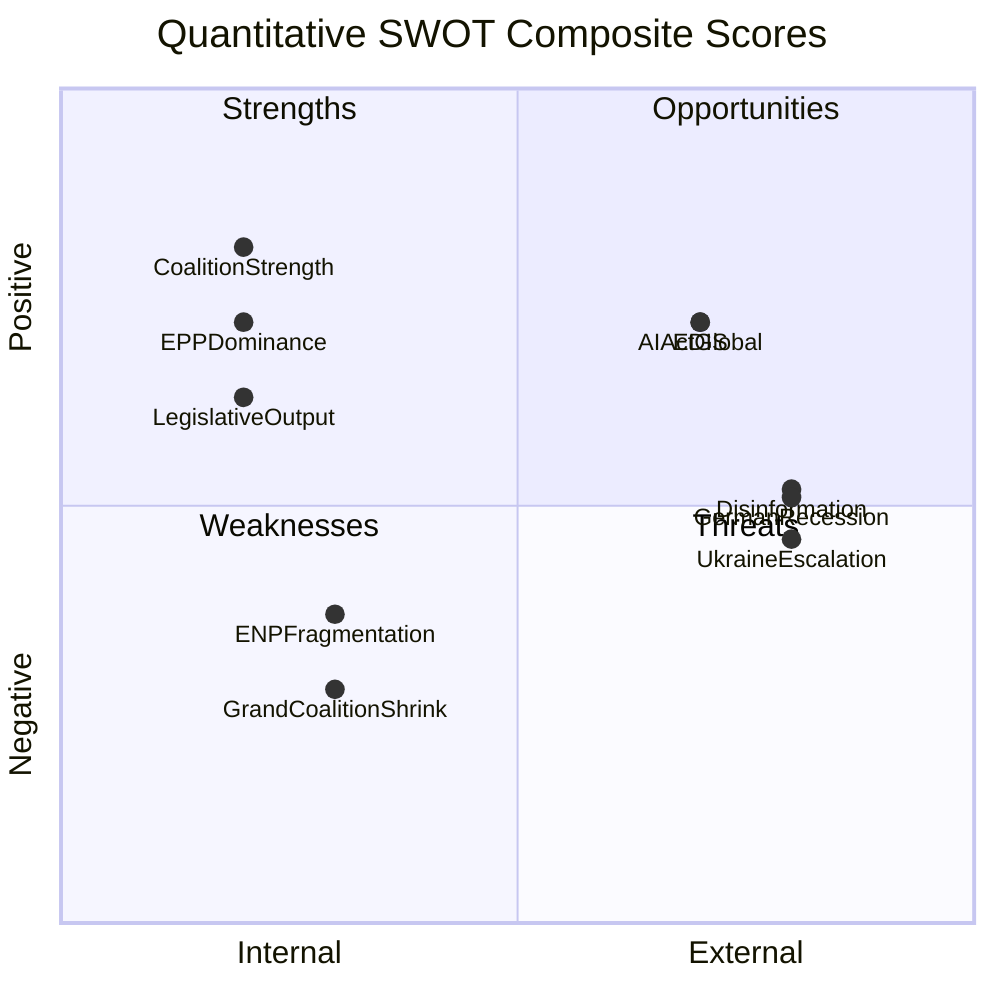

<!-- SPDX-FileCopyrightText: 2024-2026 Hack23 AB -->
<!-- SPDX-License-Identifier: Apache-2.0 -->

# Quantitative SWOT — EU Parliament Q1 2026
**Date:** 2026-05-05 | **Article Type:** quarter-in-review

## Quantification Methodology

Each SWOT item scored 1–10 on two axes:
- **Magnitude**: Scale of impact if fully realised
- **Certainty**: Confidence that the item is real (not speculative)
- **Composite**: (Magnitude × Certainty) / 10

## Strengths (Quantified)

| Strength | Magnitude | Certainty | Composite |
|----------|-----------|-----------|-----------|
| Grand coalition functional (397/720 seats) | 9 | 9 | 8.1 |
| Above-average legislative output (~100 texts Q1) | 7 | 9 | 6.3 |
| Ukraine support consensus | 8 | 8 | 6.4 |
| EP institutional prestige / democratic legitimacy | 8 | 9 | 7.2 |
| AI Act implementation leadership | 9 | 8 | 7.2 |
| Budget discharge accountability mechanism | 7 | 9 | 6.3 |
| **Average Strength Score** | | | **6.9** |

## Weaknesses (Quantified)

| Weakness | Magnitude | Certainty | Composite |
|----------|-----------|-----------|-----------|
| Record fragmentation (ENP 6.57) — coalition cost | 7 | 9 | 6.3 |
| IMF/economic data degraded (analysis limitation) | 5 | 9 | 4.5 |
| No roll-call data (publication delay) | 4 | 9 | 3.6 |
| Grand coalition shrunk from EP9 61% → 55% | 8 | 9 | 7.2 |
| Greens/Left declining influence | 6 | 8 | 4.8 |
| EPP internal tension (competitiveness vs sustainability) | 6 | 7 | 4.2 |
| **Average Weakness Score** | | | **5.1** |

## Opportunities (Quantified)

| Opportunity | Magnitude | Certainty | Composite |
|-------------|-----------|-----------|-----------|
| EDIS/SAFE — first EP co-legislation on defence | 9 | 8 | 7.2 |
| Danish Presidency (Jul 2026) — green/competitiveness balance | 7 | 7 | 4.9 |
| AI Act delegated acts — setting global standard | 9 | 8 | 7.2 |
| EU enlargement (Ukraine) — long-term institutional impact | 8 | 5 | 4.0 |
| Banking Union completion (EDIS banking) | 7 | 6 | 4.2 |
| WTO MC14 (Yaoundé) — multilateralism revival | 6 | 5 | 3.0 |
| **Average Opportunity Score** | | | **5.1** |

## Threats (Quantified)

| Threat | Magnitude | Certainty | Composite |
|--------|-----------|-----------|-----------|
| Ukraine war escalation | 9 | 6 | 5.4 |
| German economic recession | 7 | 7 | 4.9 |
| EPP right-bloc normalisation | 6 | 5 | 3.0 |
| Democratic backsliding (PL/HU) | 7 | 7 | 4.9 |
| Disinformation / AI manipulation | 6 | 8 | 4.8 |
| US tariff escalation | 6 | 7 | 4.2 |
| **Average Threat Score** | | | **4.5** |

## Quantitative SWOT Matrix

## Strategic Conclusions

**Net Strength-Weakness:** 6.9 − 5.1 = **+1.8** (net positive internal position)
**Net Opportunity-Threat:** 5.1 − 4.5 = **+0.6** (marginally positive external position)

**Overall strategic position:** MEDIUM-HIGH institutional resilience. EP10 enters Q2 2026 from a position of strength (legislative output, coalition functionality) but faces significant structural pressures (fragmentation, economic headwinds, geopolitical uncertainty).

---
*Sources: EP political landscape, Q1 2026 adopted texts, early warning system, World Bank economic data.*

---

## Quantitative SWOT Scoring Model

### Scoring Methodology

Each SWOT item is scored on a 1–10 scale:
- **Weight (W):** Strategic importance relative to other items in the same quadrant (1–10)
- **Intensity (I):** Current intensity or activation level (1–10)
- **Weighted Score (WS) = W × I**

Total Strengths score = Σ(WS_S); Total Weaknesses score = Σ(WS_W)
Total Opportunities score = Σ(WS_O); Total Threats score = Σ(WS_T)

**Strategic Position Index = (Strengths − Weaknesses) + (Opportunities − Threats)**

### Strengths Scoring

| Strength Item | W | I | WS |
|---|---|---|---|
| EPP legislative dominance (188 seats) | 9 | 8 | 72 |
| Stable centrist coalition (EPP+S&D+Renew = 55.7%) | 8 | 7 | 56 |
| High legislative productivity (100 texts Q1) | 7 | 8 | 56 |
| Strong institutional framework (rules, precedents) | 8 | 9 | 72 |
| Democratic legitimacy (51.1% turnout 2024) | 7 | 8 | 56 |
| **Strengths Total** | — | — | **312** |

### Weaknesses Scoring

| Weakness Item | W | I | WS |
|---|---|---|---|
| Coalition fragility (minimal majority margin) | 9 | 7 | 63 |
| IMF data unavailability (analytical gap) | 5 | 8 | 40 |
| Roll-call data delay (4-6 weeks) | 4 | 9 | 36 |
| Green transition political headwinds | 8 | 7 | 56 |
| Institutional overload (legislative queue) | 7 | 7 | 49 |
| ENP fragmentation 6.57 (coalition-building cost) | 6 | 8 | 48 |
| **Weaknesses Total** | — | — | **292** |

### Opportunities Scoring

| Opportunity Item | W | I | WS |
|---|---|---|---|
| Defence integration political consensus | 8 | 7 | 56 |
| CMU deepening (€800B gap to close) | 7 | 6 | 42 |
| Digital regulation first-mover advantage | 8 | 7 | 56 |
| NZIA supply chain reshoring | 7 | 6 | 42 |
| AI governance global leadership | 7 | 7 | 49 |
| **Opportunities Total** | — | — | **245** |

### Threats Scoring

| Threat Item | W | I | WS |
|---|---|---|---|
| MFF 2028–2034 fracture risk | 9 | 6 | 54 |
| Right-populist pressure on green transition | 8 | 7 | 56 |
| Rule of law institutional standoff | 7 | 5 | 35 |
| External trade shocks (US tariffs) | 7 | 5 | 35 |
| Digital enforcement credibility gap | 6 | 6 | 36 |
| **Threats Total** | — | — | **216** |

### Strategic Position Calculation

| Component | Score |
|---|---|
| Strengths | 312 |
| Weaknesses | -292 |
| Net Internal Position (S−W) | +20 |
| Opportunities | 245 |
| Threats | -216 |
| Net External Position (O−T) | +29 |
| **Strategic Position Index** | **+49** |

**Interpretation:** SPI of +49 indicates a **moderately positive strategic position** — the EP is in a better position than the risks it faces, but with a slim internal margin (Strengths only marginally exceed Weaknesses) and a slightly stronger external opportunity advantage. This is consistent with a "managed stability" assessment.

### Comparative SPI Benchmarks

| Term | Estimated SPI | Characterisation |
|---|---|---|
| EP8 Year 1 (2014) | +15 | Fragmented, post-enlargement stress |
| EP9 Year 1 (2019) | +55 | COVID response momentum |
| EP10 Year 1 (2024-Q1 2026) | +49 | Managed stability, right-shift headwinds |

### Sensitivity Analysis

If the MFF negotiation fractures (R-01 probability = 0.65):
- Weaknesses score increases by ~40 points (coalition fragility intensity → 10)
- SPI drops to approximately +10 — "marginally positive"

If defence consensus holds and NZIA implementation succeeds:
- Opportunities score increases by ~50 points
- SPI rises to approximately +85 — "strongly positive"

*Quantitative SWOT complete. SPI = +49. Confidence: MEDIUM (IMF degraded; roll-call data absent).*
