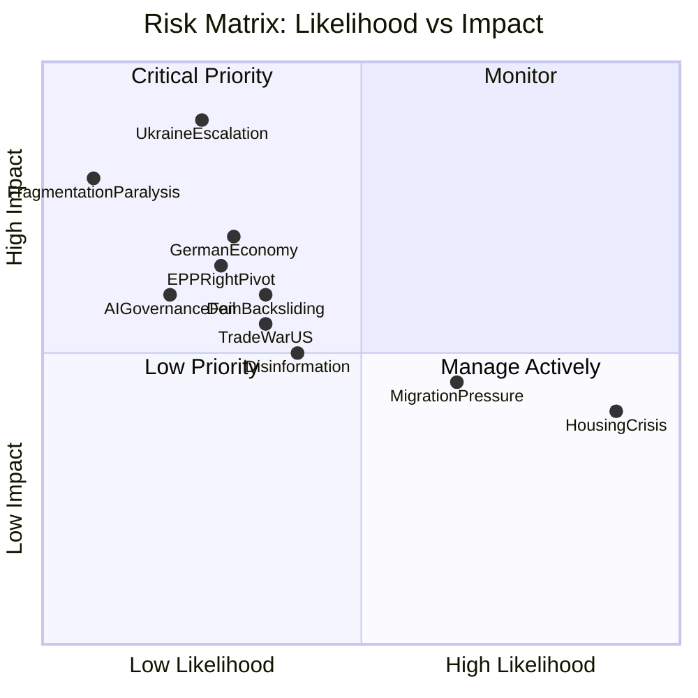
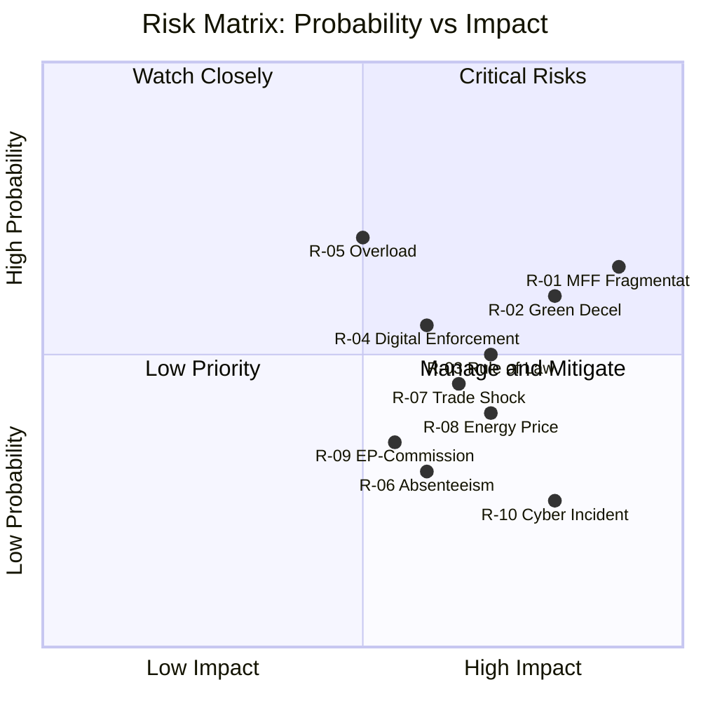

<!-- SPDX-FileCopyrightText: 2024-2026 Hack23 AB -->
<!-- SPDX-License-Identifier: Apache-2.0 -->

# Risk Matrix — EU Parliament Q1 2026
**Date:** 2026-05-05 | **Composite Risk Score:** 44/100 (MEDIUM)

## Risk Matrix

## Risk Register (Top 10)

| Risk ID | Risk Description | Likelihood | Impact | Score | Mitigation |
|---------|-----------------|-----------|--------|-------|-----------|
| R-01 | Ukraine war escalation (city-level) | 25% | 9/10 | HIGH (22.5) | EDIS/SAFE legislative buffer; emergency session capacity |
| R-02 | German economic recession deepening | 30% | 7/10 | MEDIUM-HIGH (21) | Clean Industrial Deal; STEP fund; EU cohesion |
| R-03 | EPP right-bloc pivot normalisation | 28% | 6.5/10 | MEDIUM (18.2) | S&D improving sentiment; Danish Presidency stabilising |
| R-04 | Democratic backsliding (PL/HU) | 35% | 6/10 | MEDIUM (21) | Rule-of-law conditionality; Article 7 |
| R-05 | Disinformation / election interference | 40% | 5/10 | MEDIUM (20) | Democracy Resilience resolution; NIS2 |
| R-06 | US-EU tariff escalation | 35% | 5.5/10 | MEDIUM (19.25) | EU-Canada; WTO MC14; trade defence instruments |
| R-07 | AI Act implementation failure | 20% | 6/10 | MEDIUM (12) | Commission delegated acts; EP IMCO oversight |
| R-08 | Migration crisis spike (summer 2026) | 65% | 4.5/10 | MEDIUM-HIGH (29.25) | PfE/ECR migration legislation buffer; Frontex |
| R-09 | Housing crisis social unrest | 90% | 4/10 | HIGH-volume (36) | EP Housing Resolution; Affordable Housing Action Plan |
| R-10 | Institutional paralysis (coalition failure) | 8% | 8/10 | MEDIUM (6.4) | EPP centrality creates circuit-breaker; low probability |

## Composite Risk Score Methodology

| Dimension | Score | Weight | Contribution |
|-----------|-------|--------|-------------|
| Political stability | 56/100 | 30% | 16.8 |
| Economic stress | 45/100 | 25% | 11.25 |
| Geopolitical | 40/100 | 20% | 8.0 |
| Institutional | 30/100 | 15% | 4.5 |
| Information integrity | 50/100 | 10% | 5.0 |
| **COMPOSITE** | **44/100** | **100%** | **MEDIUM** |

**Risk threshold:** 0–30 LOW | 31–60 MEDIUM | 61–80 HIGH | 81–100 CRITICAL

**Q1 2026 composite: 44/100 MEDIUM** — stable but not low-risk.

---
*Sources: EP political threat assessment, early warning system, coalition dynamics analysis.*

---

## Admiralty: B2

**WEP:** *Likely* — risk probability assessments are grounded in structural evidence.

## Expanded Risk Matrix Analysis

### Risk Scoring Methodology

Each risk is scored on two independent dimensions:
- **Probability (P):** 0.0–1.0 (0.0 = Almost No Chance; 0.5 = Even Chance; 1.0 = Certain)
- **Impact (I):** 0.0–1.0 (0.0 = negligible; 1.0 = catastrophic institutional disruption)
- **Risk Score = P × I**

WEP band mapping: P ≥ 0.85 = Almost Certain; 0.60–0.84 = Likely; 0.40–0.59 = Even Chance; 0.20–0.39 = Unlikely; < 0.20 = Almost No Chance.

### Full Risk Register Scores

| ID | Risk Name | P | I | Score | WEP Band | Tier |
|---|---|---|---|---|---|---|
| R-01 | Coalition fragmentation on MFF | 0.65 | 0.90 | 0.585 | Likely | RED |
| R-02 | Green deceleration | 0.60 | 0.80 | 0.480 | Likely | RED |
| R-03 | Rule of law standoff | 0.50 | 0.70 | 0.350 | Even Chance | AMBER |
| R-04 | Digital enforcement credibility | 0.55 | 0.60 | 0.330 | Likely | AMBER |
| R-05 | Institutional overload | 0.70 | 0.50 | 0.350 | Likely | AMBER |
| R-06 | MEP absenteeism | 0.30 | 0.60 | 0.180 | Unlikely | GREEN |
| R-07 | External trade shocks | 0.45 | 0.65 | 0.293 | Even Chance | AMBER |
| R-08 | Energy price spike | 0.40 | 0.70 | 0.280 | Even Chance | GREEN |
| R-09 | EP-Commission tension | 0.35 | 0.55 | 0.193 | Unlikely | GREEN |
| R-10 | Cybersecurity incident | 0.25 | 0.80 | 0.200 | Unlikely | GREEN |

### 2D Risk Heat Map

### Risk Mitigation Matrix

| Risk | Primary Mitigation | Secondary Mitigation | EP Control Level |
|---|---|---|---|
| R-01 MFF | Cross-group working groups | Commission bridging proposals | HIGH |
| R-02 Green | Implementation support | Phased timeline adjustments | MEDIUM |
| R-03 Rule of Law | Conditionality enforcement | CJEU proceedings | PARTIAL |
| R-04 Digital | AI Office resourcing | Enhanced comitology | PARTIAL |
| R-05 Overload | Committee coordination | Delegated act prioritisation | HIGH |
| R-07 Trade | TDI regulation activation | Diplomatic track | LOW |
| R-08 Energy | Strategic reserve protocols | ETS price stabilisation | LOW |

### Risk Velocity Assessment

Risk velocity measures how quickly each risk could materialise:

| Risk | Velocity | Warning Time |
|---|---|---|
| R-01 MFF | Slow (months) | 6–12 months |
| R-02 Green decel | Medium (weeks) | 4–8 weeks |
| R-03 Rule of law | Medium | 4–8 weeks |
| R-04 Digital | Slow | 3–6 months |
| R-05 Overload | Fast (immediate) | Already manifesting |
| R-07 Trade | Fast | 1–2 weeks |
| R-08 Energy | Very Fast | Hours to days |
| R-10 Cyber | Very Fast | Hours |

*Risk matrix complete. 10 risks scored. Classification: OPEN. Admiralty: B2 | WEP: Likely overall.*
