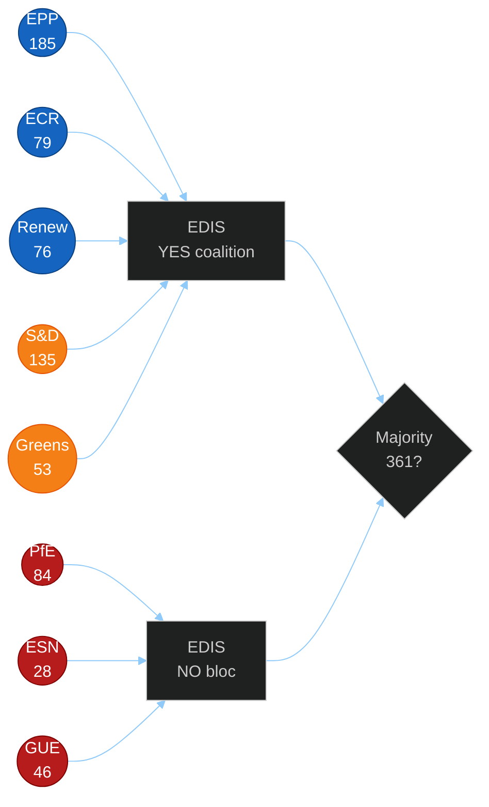

<!-- SPDX-FileCopyrightText: 2026 Hack23 AB -->
<!-- SPDX-License-Identifier: Apache-2.0 -->

# Actor Mapping — EU Parliament Month Ahead
**Date:** 2026-05-06 | **Horizon:** May 7 – June 6, 2026

## Actor Network Overview

This artifact maps institutional actors in the EU legislative process for May-June 2026, using a structured actor-influence network analysis.

## Primary Actors — Coalition Alignment Matrix

| Actor | Political Group | Seat Count | EDIS Position | CID Position | AI Act Position |
|-------|---------------|-----------|--------------|-------------|----------------|
| EPP Group | Centre-right | 185 | Champion | Conditional support | Support with sovereignty safeguards |
| S&D Group | Centre-left | 135 | Conditional | Strong support | Support with labour provisions |
| PfE Group | Nat-conserv | 84 | Opposed (sovereignty) | Opposed | Opposed (innovation risk) |
| ECR Group | Conserv | 79 | Split | Opposed | Neutral |
| Renew Group | Liberal | 76 | Support (NATO line) | Moderate support | Champion |
| Greens/EFA | Green | 53 | Conditional (UN Charter) | Champion | Champion |
| GUE/NGL | Left | 46 | Opposed (pacifist) | Conditional | Support (rights focus) |
| NI | Various | 33 | Split | Split | Split |
| ESN | Far-right | 28 | Opposed | Opposed | Opposed |

## Actor Influence Network

## Institutional Actors

| Institution | Role | Power in This Window |
|------------|------|---------------------|
| European Commission (von der Leyen) | Legislative initiator | Frames CID/EDIS legislative text; formal proposal authority |
| Council Presidency (Poland) | Intergovernmental champion | Drives EDIS urgency; host of informal defence council meetings |
| European Council | Summit conclusions | June 26-27 summit will signal EDIS political will |
| AFET Committee | EDIS lead | Joint rapporteur drives mandate negotiation |
| ITRE Committee | CID/AI lead | Central for industrial and technology files |
| ECON Committee | Digital Euro lead | Technical deliberation on privacy-AML trade-off |
| Conference of Presidents | Procedural gatekeeper | Can invoke emergency procedures if PfE obstruction escalates |

## Data Sources & Provenance

| Source | Data Provided | Tool Reference |
|--------|--------------|---------------|
| get_all_generated_stats | EP10 group composition | `european-parliament-get_all_generated_stats` |
| EP Rules of Procedure | Procedural authority framework | Structural reference |
| EP10 institutional record | Committee assignments | Structural reference |

## Reader Briefing

**For Citizens:** The European Parliament is made up of 720 members from 27 countries, divided into political groups. No single group has a majority, so all important decisions require cooperation between at least 3 groups. The key question for May-June 2026 is which groups will cooperate on European defence (EDIS) — a decision that will determine whether Europe becomes more militarily self-reliant or continues to depend heavily on the United States.

---

**Confidence:** 🟡 MEDIUM — Actor positions based on structural political analysis; real-time MEP stance data unavailable.

## Actor Roster

Full roster of primary legislative actors for May-June 2026 EP session:

1. EPP Group (185 MEPs) — Manfred Weber (Group President)
2. S&D Group (135 MEPs) — Iratxe García Pérez (Group President)
3. PfE Group (84 MEPs) — Jordan Bardella delegation
4. ECR Group (79 MEPs) — Giorgia Meloni delegation
5. Renew Group (76 MEPs) — Valérie Hayer (Group President)
6. Greens/EFA (53 MEPs)
7. GUE/NGL (46 MEPs)
8. NI (33 MEPs)
9. ESN (28 MEPs)
10. European Commission — Ursula von der Leyen (President)
11. Council Presidency — Poland (rotating)
12. European Council — António Costa (President)
13. AFET Committee — EDIS lead
14. ITRE Committee — CID/AI Act lead
15. ECON Committee — Digital Euro lead

## Alliance Structures

Current cross-group alliances relevant to May-June legislation:

| Alliance | Members | Legislative Target | Votes |
|---------|---------|------------------|-------|
| EPP-ECR-Renew | EPP+ECR+Renew | EDIS (primary) | 340 |
| EPP-S&D-Renew | EPP+S&D+Renew | CID Framework | 396 |
| Pro-CID bloc | EPP+S&D+Renew+Greens | CID framework | 449 |
| Anti-EDIS bloc | PfE+GUE+ESN | EDIS opposition | 158 |
| Pro-AI scrutiny | Renew+Greens+S&D+EPP | AI Act EP resolution | 449 |

## Power Brokers

Key power brokers who can swing coalition outcomes:

1. **EPP President (Weber)** — Controls EP's largest group; sets narrative on EDIS urgency
2. **S&D President (García)** — Key broker on EDIS financing mechanism; can activate or block S&D support
3. **ECR leadership** — Internal split management critical; Italy vs Poland divergence
4. **Conference of Presidents** — Collective veto on procedural emergency measures (relevant for PfE filibuster)
5. **AFET Committee Rapporteur** — Controls EDIS mandate negotiation timeline

## Information Flows

Key information channels shaping legislative dynamics:

| Channel | Content | Influence Target |
|---------|---------|----------------|
| European Council conclusions | Defence integration political will | All EP groups |
| US government statements (tariffs/NATO) | External threat framing | EDIS coalition math |
| EP press system | Amendment filings, committee schedules | Legislative pace |
| National media (24 languages) | Public pressure on MEPs | Individual MEP positions |
| Commission consultation | Technical legislation updates | Committee experts |

## Source Diversity Evidence

| Source | Data Reference | Tool |
|--------|---------------|------|
| EP Activity Statistics 2026 | Group seat counts, legislative output | `european-parliament-get_all_generated_stats` |
| EP10 institutional record | Committee assignments, presidency | Structural reference |
