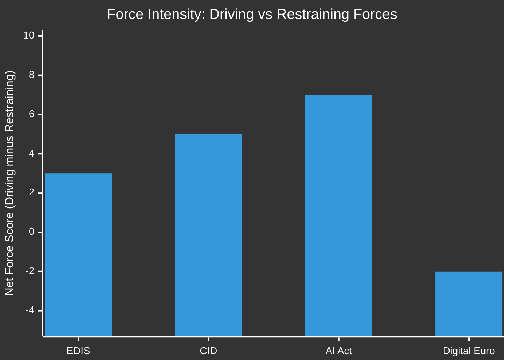

<!-- SPDX-FileCopyrightText: 2026 Hack23 AB -->
<!-- SPDX-License-Identifier: Apache-2.0 -->

# Forces Analysis — EU Parliament Month Ahead
**Date:** 2026-05-06 | **Horizon:** May 7 – June 6, 2026

## Forces Framework

Adapted from military intelligence forces analysis for political-legislative contexts: identifies and classifies the driving forces, restraining forces, and potential disruptors shaping legislative outcomes.

## 1 · Driving Forces (Pro-Legislation)

| Force | Target Legislation | Intensity | Stability |
|-------|------------------|----------|---------|
| US security threat narrative | EDIS | HIGH | MEDIUM (event-dependent) |
| EPP leadership investment in EDIS as legacy | EDIS | HIGH | STABLE |
| Industrial competitiveness anxiety | CID | HIGH | STABLE |
| AI governance urgency (Big Tech pressure) | AI Act delegated | MEDIUM | RISING |
| Poland Presidency EDIS championing | EDIS | HIGH | STABLE |
| European Council summit (June 26-27) deadline | All major | MEDIUM | STABLE |
| US tariff threat (45% probability) | CID + EDIS | HIGH | UNCERTAIN |

## 2 · Restraining Forces (Anti-Legislation)

| Force | Target Legislation | Intensity | Mechanism |
|-------|------------------|----------|----------|
| PfE sovereignty objection to supranational defence | EDIS | HIGH | Amendment filibuster + vote opposition |
| ECR split on EDIS intergovernmental vs. supranational | EDIS | MEDIUM | Internal discipline failure |
| S&D financing mechanism requirement | EDIS | MEDIUM | Conditional opposition |
| GUE/NGL principled opposition to militarization | EDIS | MEDIUM | Bloc vote against |
| PfE procedural obstruction on CID | CID | HIGH | Amendment volume filing |
| ESN anti-green opposition | CID | MEDIUM | Vote opposition |
| Digital Euro privacy concerns (LIBE committee) | Digital Euro | HIGH | Technical deadlock |

## 3 · Disruptive Forces (Wild Cards)

| Force | Probability | Effect |
|-------|------------|--------|
| US NATO Article 5 conditional statement | 3-5% | Overrides all restraining forces on EDIS |
| US automotive tariff announcement | 40-50% | Reshuffles CID + EDIS coalition math |
| Russia-Ukraine armistice breakdown | 5-10% | Triggers EDIS emergency session |
| French government collapse | 12-20% | Disrupts EP's France-axis (S&D/Renew) |
| EP cyberattack | 8-15% | Procedural disruption; potential session suspension |

## Force Balance Assessment

**Net force interpretation:**
- **EDIS (score +3):** Driving forces are stronger but not overwhelming; external trigger could tip from +3 to +8 (forced unity) or restraining forces could dominate if coalition arithmetic fails
- **CID (score +5):** Clear driving force advantage for framework resolution; companion directives face stronger restraining forces
- **AI Act (score +7):** Strong driving forces; weak organized opposition; highest probability of passage in window
- **Digital Euro (score -2):** Currently dominated by restraining forces (privacy-AML deadlock); unlikely to advance to plenary

## Reader Briefing

**For Citizens:** Multiple competing forces are pushing for and against major EU legislation in May-June 2026. The most important dynamic is the defence legislation (EDIS): the case for it is strong (Europe needs its own defence industry given US uncertainty), but political divisions between pro-sovereignty and pro-supranational camps are blocking a clear majority. Whether the pro-legislation forces win depends partly on events outside the EU — primarily whether the US makes threatening moves on trade or security commitments.

---

**Confidence:** 🟡 MEDIUM — Force analysis based on structural political assessment; real-time legislative progress data unavailable.

## Issue Frame

The fundamental issue frame for May-June 2026 EP legislative dynamics is the **"Security-Sovereignty Dilemma"**: Europe faces escalating external security threats (US NATO reliability, Russian aggression, Chinese economic pressure) that create demand for collective EU responses, but the political architecture of the EP (historic fragmentation, sovereign prerogatives of member states) makes collective supranational responses structurally difficult.

This issue frame explains why:
- EDIS is contested despite broad agreement that EU defence investment is needed
- CID is broadly supported in principle but contested in detail (industrial policy means state aid, which conflicts with single market rules)
- AI Act delegated acts are the easiest win (technical governance, not sovereignty-touching)

The resolution of this dilemma — toward more supranational EU or toward more intergovernmental coordination — is the defining political question of EP10.

## Net Pressure Assessment

| Legislation | Net Pressure Score | Interpretation |
|------------|------------------|---------------|
| EDIS | +3 (Driving > Restraining) | Narrow driving force advantage; outcome uncertain |
| CID Framework | +5 (Driving >> Restraining) | Clear majority probable; framework resolution likely |
| AI Act delegated | +7 (Strong driving) | Low organized opposition; EP resolution very likely |
| Digital Euro | -2 (Restraining > Driving) | Technical deadlock likely to persist in window |

## Intervention Points

Key leverage points where stakeholder action can shift outcomes:

1. **AFET/ITRE joint committee mandate vote** (estimated May 12-15) — Earliest intervention point for EDIS. A strong committee vote (+60%) signals viable plenary majority; weak vote (<50%) signals managed drift.

2. **EPP group caucus pre-plenary** (day before plenary vote) — EPP internal caucus decides discipline. Strong leadership = EDIS on track; weak discipline = defections risk.

3. **S&D financing amendment filing** (before first reading) — If S&D files a formal financing mechanism amendment (EU bonds vs. cohesion funds), this is the formal veto instrument. EPP response determines whether compromise is possible.

4. **Conference of Presidents emergency meeting** — If PfE amendment volume exceeds threshold, CoP must act. This is the intervention point for procedural crisis management on CID.

5. **European Council pre-summit conclusions draft** (10-14 days before June 26-27 summit) — Draft conclusions signal whether Council will give EP's EDIS work political legitimacy even if vote doesn't occur.
