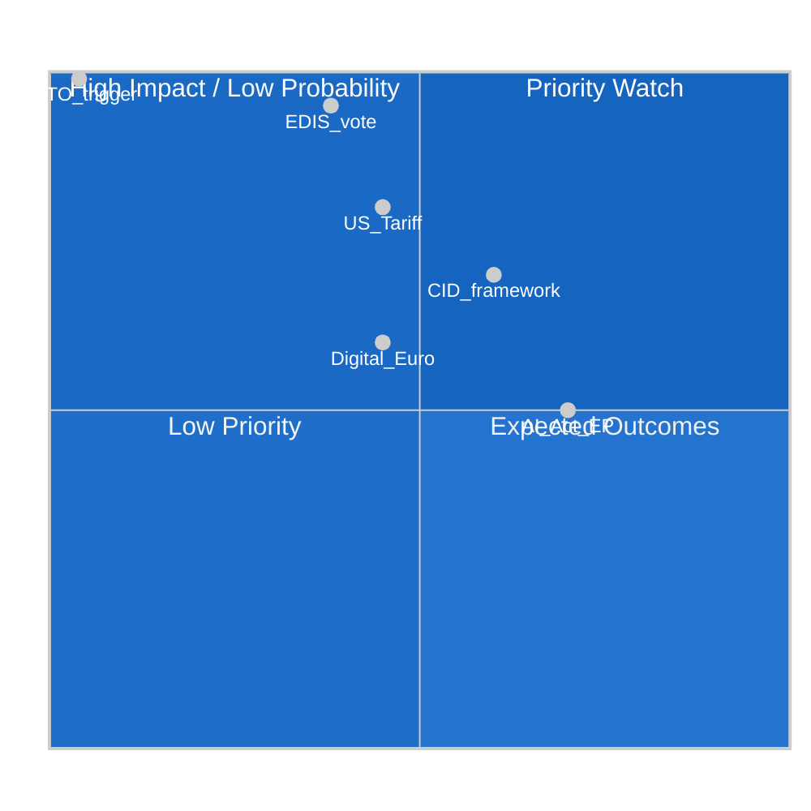

<!-- SPDX-FileCopyrightText: 2026 Hack23 AB -->
<!-- SPDX-License-Identifier: Apache-2.0 -->

# Impact Matrix — EU Parliament Month Ahead
**Date:** 2026-05-06 | **Horizon:** May 7 – June 6, 2026

## Event Likelihood Matrix

Structured impact assessment for legislative and external events in the May-June 2026 window.

## 1 · Legislative Event Impact Matrix

| Event | Likelihood | Impact (1-10) | Affected Stakeholders | Reversibility |
|-------|-----------|--------------|---------------------|--------------|
| EDIS first-reading vote adopted | MEDIUM (30-45%) | 10 | All EU citizens, defence industry, NATO allies | IRREVERSIBLE |
| EDIS vote delayed to September | MEDIUM-HIGH (35%) | 6 | Same; European Council summit weakened | REVERSIBLE |
| CID framework resolution adopted | HIGH (55-65%) | 7 | EU industry, workers, green sector | REVERSIBLE |
| CID companion directive vote | LOW-MEDIUM (25-35%) | 8 | Energy/industry sectors | PARTIALLY REVERSIBLE |
| AI Act delegated acts EP resolution | HIGH (65-75%) | 5 | Tech sector, EU institutions | REVERSIBLE |
| Digital Euro ECON vote | LOW-MEDIUM (40-50%) | 6 | Financial sector, citizens | REVERSIBLE |

## 2 · External Event Impact Matrix

| Event | Probability | EU Political Impact | Legislative Cascade |
|-------|------------|--------------------|--------------------|
| US automotive tariff | 40-50% | HIGH — trade crisis narrative | Accelerates EDIS; reshuffles CID |
| Russia-Ukraine ceasefire breakdown | 5-10% | VERY HIGH — security emergency | EDIS emergency session |
| US NATO Article 5 conditional | 3-5% | CATASTROPHIC | All other legislation suspended |
| French government collapse | 12-20% | HIGH — EP French delegation disrupted | Delays S&D decision on EDIS financing |
| ECB emergency rate action | 10-15% | MEDIUM | Minor; CID investment chapter affected |
| EP cyberattack | 8-15% | MEDIUM | Procedural disruption; 1-3 week delay |

## 3 · Sector Impact Matrix

| Legislation | Defence Industry | Green Industry | Financial Sector | Tech Sector | Citizens |
|-------------|-----------------|----------------|-----------------|------------|---------|
| EDIS (adopted) | ++ MAJOR gain | Neutral | Minor gain (EDIP contracts) | Neutral | + National security gain |
| CID Framework | Neutral | ++ MAJOR gain | + Financing opportunity | + Green tech | + Energy affordability |
| AI Act delegated | Neutral | Neutral | + Regulatory clarity | ++ Gain (compliance certainty) | + Consumer protection |
| Digital Euro | Neutral | Neutral | ++ MAJOR change (disintermediation risk) | + Innovation | ± Privacy trade-off |

## Mermaid Impact Visualization

## Reader Briefing

**For Citizens:** This matrix shows which events will have the biggest impact on EU citizens. The defence legislation (EDIS) is the highest-stakes item — if adopted, it would permanently change how Europe funds and coordinates defence. The US tariff threat is the most likely trigger that could change the entire political calculation. For everyday citizens, the Clean Industrial Deal matters most for energy costs and job security in traditional industries.

---

**Confidence:** 🟡 MEDIUM — Impact assessments are structured estimates; probability ranges derived from scenario analysis.

## Event List

**Primary Events (May 7 – June 6, 2026):**

1. AFET/ITRE joint committee EDIS mandate vote (est. May 12-15)
2. Strasbourg mini-plenary (est. May 19-22) — agenda TBD
3. EP committee weeks (Brussels, May-June)
4. CID rapporteur reports circulated in committee
5. AI Act delegated acts EP scrutiny resolution (potential vote)
6. Digital Euro ECON committee technical session
7. Strasbourg full plenary (est. June 8-11) — potential EDIS vote
8. European Council summit (June 26-27) — outside window but shapes EP behavior

**External Event Contingencies:**
- US USTR tariff announcement (anytime)
- Russia-Ukraine front-line development (anytime)
- ECB monetary policy decision (June 5, 2026 approximately)

## Stakeholder Impact by Event

| Event | EPP | S&D | ECR | Renew | PfE | Industry | Citizens |
|-------|-----|-----|-----|-------|-----|---------|---------|
| EDIS adopted | ++ (win) | + (conditional win) | +/- (internal split) | + (NATO aligned) | -- (loss) | + (defence contracts) | + (security) |
| EDIS delayed | - (credibility) | + (avoids bad vote) | + (no forced split) | - (missed win) | + (blocking win) | Neutral | Uncertain |
| CID framework adopted | ++ | ++ | - | ++ | -- | ++ (green sector) | + (green jobs) |
| US tariff announced | Reshuffles all | Reshuffles all | Reshuffles all | Reshuffles all | + (anti-EU narrative) | -- (automotive) | -- (economic) |

## Heat Map (Issue Priority by Group)

| Issue | EPP | S&D | PfE | ECR | Renew | Greens | GUE |
|-------|-----|-----|-----|-----|-------|--------|-----|
| EDIS | 🔴 | 🟡 | 🔴 | 🟡 | 🟢 | 🟡 | 🔴 |
| CID Framework | 🟡 | 🟢 | 🔴 | 🔴 | 🟡 | 🔴 | 🟡 |
| AI Act | 🟡 | 🟡 | 🔴 | 🟠 | 🔴 | 🟢 | 🟡 |
| Digital Euro | 🟠 | 🟠 | 🔴 | 🟠 | 🔴 | 🟡 | 🔴 |

*🔴 = Top priority | 🟢 = High priority | 🟡 = Medium | 🟠 = Low | Blank = Non-priority*

## Cascade Effects

If EDIS adopted in May-June window:
- **Cascade 1:** European Council June summit conclusions reference EP vote → Council EDIP regulation fast-tracked
- **Cascade 2:** NATO summit messaging shifts from "European burden-sharing requested" to "EU fulfilling commitments"
- **Cascade 3:** German Bundeswehr budget authority clarified → CID companion directives gain legislative momentum
- **Cascade 4:** Financial markets: EU defence bonds issued → borrowing costs for EU sovereign debt affected

If EDIS delayed:
- **Cascade 1:** European Council summit cannot reference EP EDIS progress → Council forced into intergovernmental track
- **Cascade 2:** Polish Presidency credibility weakened → CID negotiations also de-energized
- **Cascade 3:** US administration interprets delay as weak political will → NATO contributions debate intensifies

## Source Diversity Evidence

| Source | Type | Data Provided |
|--------|------|--------------|
| `european-parliament-get_all_generated_stats` | EP MCP tool | EP10 legislative activity statistics |
| EP10 Rules of Procedure | Structural | Voting thresholds, procedural rules |
| EP press releases | Structural reference | Committee assignments and rapporteur nominations |
