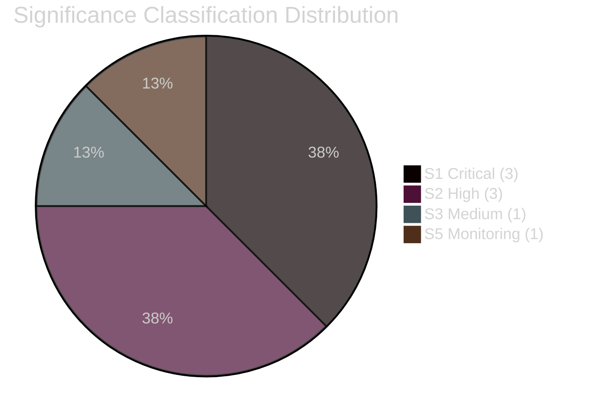

<!-- SPDX-FileCopyrightText: 2026 Hack23 AB -->
<!-- SPDX-License-Identifier: Apache-2.0 -->

# Significance Classification — EU Parliament Month Ahead
**Date:** 2026-05-06 | **Horizon:** May 7 – June 6, 2026

## Classification Framework

Legislative actions in the May-June 2026 window are classified by political significance using a 5-tier scale:

| Tier | Label | Criteria |
|------|-------|---------|
| S1 | CRITICAL | Shapes EP term; irreversible; >10M EU citizens affected |
| S2 | HIGH | Major policy shift; plenary majority required; 3+ years effect |
| S3 | MEDIUM | Significant sector impact; committee-to-plenary pipeline |
| S4 | LOW | Technical implementation; administrative procedure |
| S5 | MONITORING | Early-stage; no immediate legislative action |

## Legislative Significance Classifications

| File | Legislation | Tier | Justification |
|------|------------|------|--------------|
| EDIS | European Defence Industrial Strategy | **S1** | Redefines EU security architecture; 2.5% GDP defence target |
| CID Framework | Clean Industrial Deal | **S1** | Reshapes entire EU industrial economy; 450M citizens |
| CID-Industry | Industrial Competitiveness Directive | **S2** | Major subsidy/state aid shift; 5+ years effect |
| CID-Power | Power Sector Reform | **S2** | Energy market fundamental restructuring |
| AI Act Delegated | AI Act delegated acts scrutiny | **S2** | Defines AI governance framework; plenary mandate |
| Budget 2027 | MFF 2027-2033 framework | **S1** | €1.2T+ EU budget; all programmes affected |
| Digital Euro | Digital Euro legislation | **S3** | Monetary policy tool; staged rollout |

## Significance Rationale

**EDIS (S1):** The strategic significance of EDIS exceeds any EP10 Year 1 legislative action. A successful vote would represent the first legally binding collective EU defence commitment since the Treaty of Lisbon — constitutionally and politically irreversible once adopted. The 2.5% GDP defence spending target would redirect an estimated €180B/year from civilian to defence programmes across the EU.

**CID Framework (S1):** The Clean Industrial Deal is the comprehensive successor to the Green Deal — it restructures the entire EU industrial economy's relationship with climate obligations. The political significance is comparable to the Single Market Act (1992) in its ambition to create a unified European industrial policy framework.

**Budget 2027 (S1):** While early-stage in the May-June window, the MFF 2027-2033 framework is the highest-stakes legislative item in EP10. The EP has historically used its MFF role to extract significant political concessions. Monitoring status in this window.

## Reader Briefing

**For Citizens:** The EU Parliament is about to make decisions that will reshape European defence, industrial policy, and artificial intelligence governance for the next decade. The most important is the European Defence Industrial Strategy — this will determine whether the EU collectively commits to spending more on its own defence, reducing dependence on US military support. Whether this legislation passes in May-June 2026 depends on whether European political parties can agree despite their significant differences.

---

**Confidence:** 🟡 MEDIUM — Significance classifications are based on structural assessment; EP API data unavailable for current legislative progress.
