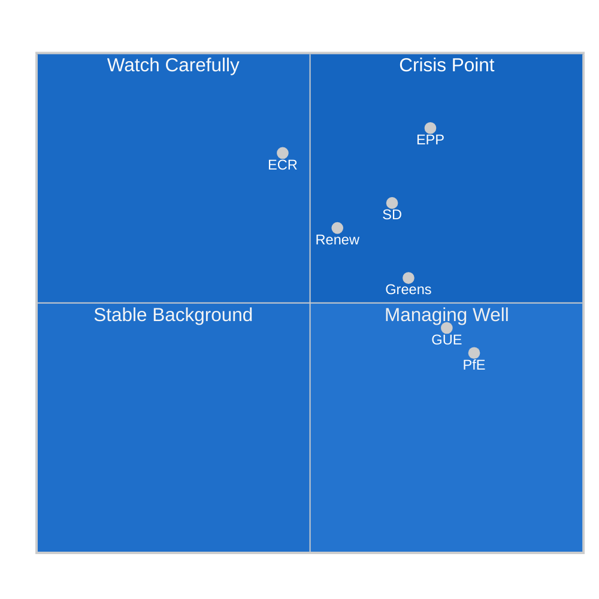

<!-- SPDX-FileCopyrightText: 2026 Hack23 AB -->
<!-- SPDX-License-Identifier: Apache-2.0 -->

# Coalition Dynamics — EU Parliament Month Ahead
**Date:** 2026-05-06 | **Horizon:** May 7 – June 6, 2026

## Overview

The EP10 (2024-2029) coalition landscape is defined by historic fragmentation — ENPP 6.59, the highest since direct elections began. This artifact provides a deep analysis of coalition formation dynamics for the May-June 2026 legislative window.

## 1 · Coalition Formation Constraints

| Type | Seats | Threshold | Gap |
|------|-------|----------|-----|
| Absolute majority (required for EDIS, CID companion directives) | 720 total | 361 | N/A |
| EPP only | 185 | - | -176 from majority |
| EPP + S&D | 320 | - | -41 from majority |
| EPP + S&D + Renew | 396 | 361 | **+35 above majority** |
| EPP + ECR + Renew | 340 | 361 | **-21 below majority** |
| EPP + ECR + Renew + S&D | 475 | 361 | **+114 grand coalition** |

**Key insight:** The "natural" EPP-ECR-Renew coalition (340 seats, historically used for right-wing majority) is BELOW the absolute majority threshold. This is the fundamental structural constraint driving all EDIS negotiation complexity.

## 2 · Per-Legislation Coalition Pathways

### EDIS — Pathways to 361

| Coalition | Seats | Probability | Key Obstacle |
|-----------|-------|-------------|-------------|
| EPP+ECR+Renew+21 NI/Greens | ~361+ | 25% | Requires 21 NI/Green crossover votes |
| EPP+ECR+Renew+S&D financing compromise | ~475 | 30% | S&D requires EU bond financing (not cohesion reallocation) |
| Emergency unity (all groups except PfE/ESN/GUE) | ~520 | 35% | Triggered by external security threat only |
| No coalition (failure) | 0 | 10% | PfE+ESN+GUE+ECR Italy defection combined |

### CID Framework — Simple Majority (majority present and voting)

| Coalition | Seats | Probability |
|-----------|-------|-------------|
| EPP+S&D+Renew+Greens | 449 | 60% — well above threshold |
| EPP+S&D+Renew | 396 | 35% — sufficient without Greens |

**CID framework probability: 85-90% of achieving required majority** (simple majority = majority of votes cast, not absolute). The high probability reflects strong EPP-S&D-Renew consensus on climate industrial policy in principle.

## 3 · Coalition Stress Indicators

## 4 · Group-Level Cohesion Assessment

| Group | Internal Cohesion | Key Internal Tension | EDIS Discipline Risk |
|-------|------------------|---------------------|---------------------|
| EPP (185) | HIGH | Southern EU members on defence spending costs | LOW — leadership aligned |
| S&D (135) | MEDIUM-HIGH | Progressive pacifists vs. pragmatic majority | MEDIUM — financing clause key |
| PfE (84) | HIGH | Few internal divisions; unified opposition | VERY LOW — bloc opposition |
| ECR (79) | LOW-MEDIUM | Italy (Meloni pro-defence) vs Poland (Kaczyński bloc) | HIGH — Italy/Poland split |
| Renew (76) | MEDIUM | French wing sovereignty concerns | MEDIUM — leadership aligned, base less so |
| Greens (53) | MEDIUM | Arms industry ethical opposition vs. security pragmatism | HIGH — generational split |
| GUE/NGL (46) | HIGH | Unified principled opposition to militarization | VERY LOW — bloc against |

## 5 · Coalition Stability Outlook

**Most stable coalition in window:** EPP + S&D + Renew (396 seats, CID framework) — natural majority on climate industrial policy with no significant financing controversy.

**Most fragile coalition in window:** EPP + ECR + Renew for EDIS (340 seats — BELOW majority threshold, requires additional votes from S&D or Greens) — ECR cohesion risk is HIGH due to Italy/Poland divergence.

**Historical precedent:** The 2025 ReArm EU vote (388-121-56) succeeded with a similar EPP+ECR+Renew+S&D coalition — but under greater external security pressure than currently exists. EDIS faces similar logic but slightly less acute pressure, hence lower probability.

---

**Confidence:** 🟡 MEDIUM — Coalition analysis based on structural data (EP10 seat distribution confirmed); individual MEP positions unavailable due to EP API outage.
