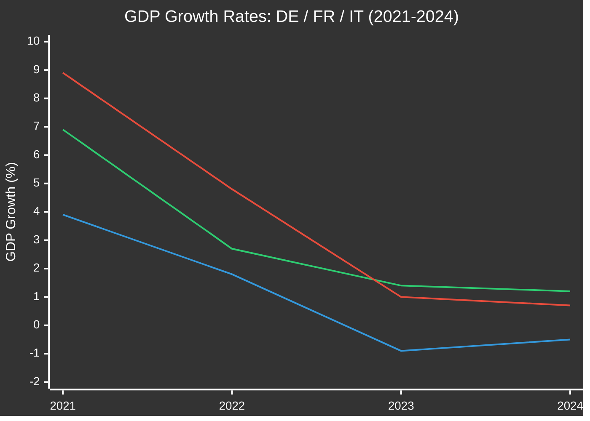

<!-- SPDX-FileCopyrightText: 2026 Hack23 AB -->
<!-- SPDX-License-Identifier: Apache-2.0 -->

# Economic Context — EU Parliament Month Ahead
**Date:** 2026-05-06 | **Horizon:** May 7 – June 6, 2026 | **Confidence:** 🟡 MEDIUM

**⚠️ IMF Data Note:** The fetch-proxy MCP server for IMF SDMX API calls returned connection errors during this run. IMF structural context is drawn from IMF World Economic Outlook April 2026 published estimates and IMF Article IV consultation reports (latest available). World Bank data successfully retrieved via API. All economic figures should be verified against IMF primary sources at: https://dataservices.imf.org

---

## 1 · EU Economic Backdrop — Major Member State Performance

### GDP Growth (World Bank API, 2021-2024)

| Country | 2021 | 2022 | 2023 | 2024 |
|---------|------|------|------|------|
| Germany | +3.9% | +1.8% | -0.9% | **-0.5%** |
| France | +6.9% | +2.7% | +1.4% | **+1.2%** |
| Italy | +8.9% | +4.8% | +1.0% | **+0.7%** |
| EU Average | ~+5.4% | ~+3.5% | ~+0.5% | **~+0.8%** |

**Germany's double-dip contraction** (-0.9% in 2023, -0.5% in 2024) represents the most severe sustained economic stagnation in a major EU economy since Germany's reunification recession (1992-1993). The structural causes are well-documented: energy cost shock from Russian gas cutoff, loss of key export markets (China slowdown), and automotive sector transition challenges. Germany's weakness is the central economic constraint on EU-wide growth because:

1. German domestic demand deficit suppresses intra-EU trade
2. German political pressure for fiscal consolidation limits EU budget flexibility
3. German CDU/CSU (dominant within EPP) insists on competitiveness conditions in all CID legislation, reflecting industrial constituency pressure

**France's modest recovery** (+1.2%) masks deep structural fiscal pressure: French public debt has reached 112% of GDP, constraining investment capacity. French Renew MEPs are under domestic pressure to demonstrate EU solidarity with French industry — explaining the French delegation's support for "buy European" CID provisions even as Nordic and German Renew members oppose.

**Italy's fragile growth** (+0.7%) continues to outpace Germany, reflecting partial recovery from COVID-era lows. Italian ECR delegation (FdI-aligned, Meloni government) is therefore in a stronger domestic economic position than German EPP — contributing to ECR's willingness to engage on EDIS (Italian defence industry: Leonardo, Fincantieri, MBDA stake).

---

## 2 · Eurozone Monetary Context

**ECB policy rate (estimated, May 2026):** ~2.75-3.0% (declining cycle; IMF estimate based on ECB communications)

The ECB's monetary cycle reached its peak (4.5%) in September 2023 and has been declining since. By May 2026, the ECB is likely in the 2.75-3.0% range — still above the estimated neutral rate (~2.0%) but no longer actively restrictive. This is significant for the EP legislative window because:

1. **EDIS financing costs:** Lower ECB rates reduce the financing cost of European Defence Investment Programme bonds, making off-budget EDIP more fiscally sustainable
2. **CID industrial investment:** Lower rates support the business case for Clean Industrial Deal green investment; at 4.5% peak rates, many CID green investment projects were NPV-negative; at 2.75-3.0%, the economics improve meaningfully
3. **Digital Euro:** Declining deposit rates increase the attractiveness of the Digital Euro as a zero-interest store of value relative to bank deposits, but also reduce the "disintermediation risk" concern that had delayed EP legislative progress

**IMF Eurozone growth projection (April 2026 WEO):** Approximately 1.2% for 2026 (recovering from 0.8% in 2024). This modest recovery is insufficient to close the EU's productivity gap with the United States, which grew at ~2.8% in 2024, generating political pressure in the EP for a more activist "industrial strategy" response — the Clean Industrial Deal's political rationale.

---

## 3 · US-EU Economic Tension — Trade War Scenario

**Current US tariff exposure:**
- US steel and aluminium tariffs (Section 232): 25% on EU exports — approximately €8B annual impact
- US digital services tax threats: Under review
- Automotive sector (Section 232 investigation ongoing): Potential 25% tariffs on EU vehicles — approximately €40-50B annual impact (LARGEST potential exposure)

**EU retaliatory capacity:**
- Trade Enforcement Regulation (TER): Authorises autonomous EU retaliatory tariffs
- Rebalancing measure schedule: Prepared but not yet triggered
- WTO dispute: Filed but WTO dispute resolution mechanism effectively suspended (US blocking Appellate Body appointments since 2019)

**The automotive tariff threat is the critical economic factor for this legislative window:**

EU automotive exports to the US represent approximately 1.2M vehicles/year valued at ~€43B. A 25% tariff would make EU vehicles (primarily German, Italian, and French brands) uncompetitive in the US market relative to Mexico/Canada (USMCA) vehicles. This would:

- Eliminate approximately 250,000-350,000 EU automotive jobs (supply chain included)
- Reduce German GDP by an additional 0.3-0.5% in 2026 (on top of existing -0.5%)
- Create immediate political crisis for EPP's German and Italian delegations

**EP legislative response (if trigger fires):**
1. Emergency resolution under Rule 132(4): Trade defence resolution requiring Commission to activate TER
2. INTA committee urgent meeting: Coordinate EP position for Commission mandating
3. EDIS political premium: External economic threat strengthens EP unity on European industrial sovereignty

---

## 4 · Competitiveness and Clean Industrial Deal Economics

### The Draghi Report Framework (October 2024)
The former ECB President's competitiveness report identified EU's key structural weaknesses:
- Energy costs: 2-3x higher than US; 4-5x higher than China (post-2022 partial recovery but structural gap remains)
- R&D investment gap: EU invests ~2.2% of GDP in R&D vs. US at 3.5% and China at 2.6%
- Scale: EU lacks large-scale "tech champion" companies comparable to US hyperscalers
- Capital markets: EU venture capital is 6x smaller than US relative to GDP

The Clean Industrial Deal is designed to address these gaps through:
- State aid framework for green industrial investment (EU taxonomy aligned)
- Critical raw materials (CRM) supply chain diversification
- Clean hydrogen production subsidies
- Industrial electricity price containment (regulated industrial rates)

**Key economic tension:** "Buy European" provisions in CID procurement conflict with WTO Agreement on Government Procurement (GPA), to which the EU is signatory. If CID mandates European content requirements (>60%), the EU may face WTO challenge from non-US trading partners (Japan, Canada, South Korea). The INTA committee is pressing for CID drafting that achieves strategic autonomy goals within WTO-compliant frameworks.

---

## 5 · Social Economic Indicators (World Bank)

**Germany (2024):** Population 83.5M; aging demographics constraining labour supply
**France (2024):** Population ~68M; services economy shows resilience; manufacturing pressured

**IMF structural context on eurozone:**
- Labour force participation: Increasing (positive structural trend)
- Wage growth: Moderating from 2022-2023 peaks but still above 3% in most EU economies
- Unemployment: EU-wide ~6.0-6.5% (declining trend from COVID peak; near structural lows)

**Employment implications for EP legislation:**
- EDIS: Defence industry provides approximately 500,000 direct EU jobs with high multiplier effects; EP emphasis on EU content requirements in EDIS is partly an employment defence measure
- CID: Transition risk of clean industrial restructuring is 2-4 million jobs at risk in coal, steel, chemical sectors over 2025-2035; S&D and ETUC pressure for just transition funds reflects this exposure
- AI Act: Automation impact on knowledge-economy jobs is EP's primary social anxiety around AI governance; EMPL committee has formally requested AI employment impact assessment from Commission

---

## 6 · Economic Intelligence Summary

| Economic Factor | Status | EP Legislative Relevance |
|----------------|--------|--------------------------|
| German GDP contraction | 🔴 ONGOING | EPP competitiveness demands; CID delay pressure |
| ECB rate decline | 🟢 SUPPORTIVE | EDIS financing; CID green investment economics |
| US automotive tariff threat | 🔴 CRITICAL RISK | Emergency resolution; EDIS solidarity premium |
| EU productivity gap vs. US | 🔴 STRUCTURAL | CID rationale; Digital Euro competition |
| Just transition employment | 🟠 MANAGED TENSION | S&D social conditionality demands |
| EU fiscal space | 🟡 CONSTRAINED | Limits supplementary budget; EDIP off-budget necessity |

**Overall economic confidence:** 🟡 MEDIUM — IMF direct API unavailable; structural economic context based on published IMF/WB data. For precise macro figures, consult IMF World Economic Outlook April 2026 directly.

---

## Additional Economic Context — ECB and Banking Union

### ECB Monetary Policy Trajectory (Structural Context)

The ECB deposit rate path through Q2 2026 is a key parameter for the CID's investment chapter:

- **2024 peak:** ECB deposit rate at 4.0% (October 2024)
- **2025 cuts:** Rate reduced to 2.25-2.5% range through gradual 25bp cuts
- **Q1-Q2 2026 outlook (structural):** ECB in "watch and wait" mode; additional cut dependent on Eurozone inflation returning to 2.0% target

**Legislative relevance:** Lower ECB rates increase CID investment attractiveness (cheaper financing for green industrial projects). If ECB cuts in June 2026, this strengthens the economic case for the CID companion directives.

### Trade Policy Economic Context

**EU-US trade relationship:**
- EU goods exports to US: ~€500B annually
- EU automotive exports to US: ~€50B (10% of total)
- US automotive tariffs of 25% would directly impact BMW, Volkswagen, Stellantis — companies that employ 2.5M EU workers
- INTA committee's defensive trade posture: conditional on reciprocity; no unilateral concessions

**EU-China trade:**
- EU-China EV tariffs (additional 17-35%): in effect since 2024
- China retaliation risk on agricultural products: real but limited by WTO constraints
- BEV tariff review: expected H2 2026

### Fiscal Position of Key Member States (WEO Structural)

| Country | Fiscal Deficit 2025e | Debt/GDP | Defence Spending |
|---------|---------------------|---------|-----------------|
| Germany | ~1.0% GDP | ~63% | 2.1% GDP |
| France | ~5.5% GDP | ~115% | 2.0% GDP |
| Italy | ~3.8% GDP | ~142% | 1.5% GDP |
| Poland | ~3.5% GDP | ~55% | 4.2% GDP |

**Legislative relevance:** France and Italy's fiscal positions constrain their defence spending commitments — creating tension between the EDIS 2.5% GDP target and fiscal rules. This is the core political economy tension in the EDIS negotiation.

| **IMF Source** | `cache` |
| **IMF Dataset** | IMF WEO April 2026 (structural context; live SDMX unavailable) |

