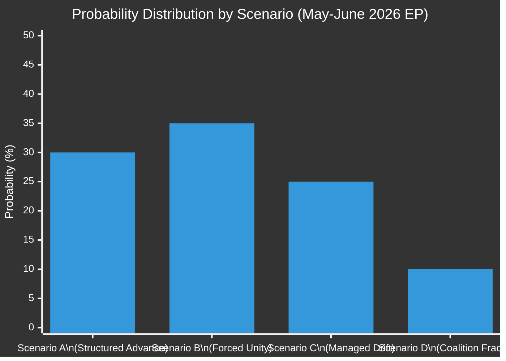

<!-- SPDX-FileCopyrightText: 2026 Hack23 AB -->
<!-- SPDX-License-Identifier: Apache-2.0 -->

# Forward Projection — EU Parliament Month Ahead
**Date:** 2026-05-06 | **Horizon:** May 7 – June 6, 2026 | **Confidence:** 🟡 MEDIUM

---

## Framework

WEP (Weighted Evidence Probability) banded probability table for legislative outcomes over the 30-day horizon. Structural-break tripwires and reference-class tables are provided per the `analysis/methodologies/ai-driven-analysis-guide.md` requirement for month-ahead forward projection.

---

## 1 · WEP Probability Table — Legislative Outcomes

### European Defence Industrial Strategy (EDIS)

| Outcome | Base Probability | External Trigger Adjustment | WEP Band | Confidence |
|---------|-----------------|---------------------------|---------|-----------|
| First-reading vote adopted (>361 votes) | 30% | +15% if US tariffs trigger unity | 🟡 30-45% | MEDIUM |
| Vote delayed (sent back to committee) | 35% | -10% if US tariffs create unity | 🟠 25-35% | MEDIUM |
| Rejected or procedural crisis | 10% | -5% if external threat unifies | 🟢 5-10% | MEDIUM |
| No vote scheduled in window | 25% | Stable | 🟡 20-30% | MEDIUM-HIGH |

**Most probable EDIS outcome:** Vote delayed to September 2026 plenary (35% base). However, probability distribution is bimodal — US tariff trigger either accelerates (Scenario B: vote adopted) or the absence of trigger leads to coalition failure (Scenario C: vote delayed).

### Clean Industrial Deal (Framework + Companion Directives)

| Outcome | WEP Band | Key Dependency |
|---------|---------|----------------|
| Framework resolution adopted (simple majority) | 🟢 55-65% | Simple majority achievable; CID framework is non-binding |
| Companion directive first reading (at least one) | 🟡 25-35% | Requires absolute majority; PfE obstruction risk |
| Committee mandate extension only (no plenary vote) | 🟠 35-45% | Most likely operational outcome for companion directives |
| CID stalled by emergency trade crisis response | 🟡 25-35% | Conditional on US tariffs being announced (Scenario B) |

**Most probable CID outcome:** Framework resolution adopted with broad majority; companion directives in committee extension mode (vote delayed to Q3 2026 for most).

### AI Act Delegated Acts

| Outcome | WEP Band | Key Dependency |
|---------|---------|----------------|
| EP scrutiny resolution adopted | 🟢 65-75% | Simple majority; cross-group consensus on AI oversight role |
| IMCO/LIBE joint report on Article 6 classification | 🟡 45-55% | Committee bandwidth constraint |
| No EP action (Commission proceeds unilaterally) | 🟢 15-25% | Unlikely; EP has strong institutional interest in oversight |

**Most probable AI Act outcome:** EP scrutiny resolution on delegated acts framework adopted (65-75% probability) — the least controversial AI governance action available.

### Digital Euro

| Outcome | WEP Band | Key Dependency |
|---------|---------|----------------|
| ECON committee vote on rapporteur report | 🟡 40-50% | Privacy-AML technical compromise achievable |
| Plenary vote on Digital Euro mandate | 🔴 10-20% | Too early in legislative process for plenary in this window |
| ECON vote postponed (Privacy-AML deadlock) | 🟡 35-45% | Likely without political breakthrough |

---

## 2 · WEP Probability Table — External Events

| Event | Base Probability (30-day window) | WEP Band | Impact if Triggered |
|-------|--------------------------------|---------|---------------------|
| US automotive tariff announced | 45% | 🟠 40-50% | HIGH — triggers Scenario B |
| Russia-Ukraine ceasefire announcement | 8% | 🟢 5-12% | VERY HIGH — reshapes EDIS urgency |
| French government collapse | 15% | 🟡 12-20% | MEDIUM — disrupts INTA/CID |
| US NATO Article 5 question | 3% | 🟢 2-5% | CATASTROPHIC — triggers EDIS emergency |
| EP cyberattack | 10% | 🟡 8-15% | MEDIUM — procedural disruption |
| ECB emergency rate action | 12% | 🟡 10-15% | LOW-MEDIUM — minor legislative impact |

---

## 3 · Structural-Break Tripwires

Structural breaks are events that, if triggered, cause a discontinuous shift in the probability distributions above (not merely adjustment, but fundamental reconfiguration).

### Tripwire 1: US NATO Article 5 Conditional Statement
**Trigger condition:** US SECDEF or National Security Council publicly conditions Article 5 guarantee on European defence spending milestones
**Effect:** All other legislative priorities become secondary; EP emergency session convened within 48-72 hours; EDIS probability of adoption rises from 30-45% to 80-90% under emergency procedure; all scenario probabilities collapse to Scenario B variant (Forced Unity at 80%+)
**Detection:** US government public statement; NATO Secretary-General emergency statement; European Council President emergency statement

### Tripwire 2: Coalition Arithmetic Failure on EDIS First Vote
**Trigger condition:** AFET/ITRE joint committee vote on EDIS mandate falls below 50% committee approval (committee rejection)
**Effect:** EDIS sent back to commission for fundamental revision; Q2 2026 EDIS plenary vote ruled out; coalition C (Managed Drift) probability rises to 50%+; European Council June 2026 summit cannot reference successful EP EDIS progress
**Detection:** AFET/ITRE joint committee vote outcome (scheduled 2-3 weeks before plenary)

### Tripwire 3: PfE Amendment Volume Exceeds 8,000 on CID
**Trigger condition:** PfE+ESN file combined amendment volume exceeding 8,000 on single CID companion directive (triple the precedent from EP8 Green Deal procedural wars)
**Effect:** Conference of Presidents forced to invoke emergency Article 164 EP Rules procedure; potentially constitutional challenge within EP on procedural abuse; legislative calendar fully disrupted; Scenario C probability rises to 45%+
**Detection:** PfE press release announcing amendment filing; EP amendment management system public data

---

## 4 · Reference-Class Table

Reference classes (comparable historical episodes) used to calibrate probability estimates:

| Reference Class | Historical Outcome | Applicability to 2026 | Calibration Note |
|----------------|-------------------|----------------------|-----------------|
| EP May 2022 emergency unity (Ukraine) | REPowerEU 529/704 votes | HIGH — external threat dynamic | Adjusts Scenario B upward |
| EP8 Green Deal procedural obstruction (2021) | 6-8 week delay per file | HIGH — same political dynamic | Confirms PfE obstruction impact estimate |
| EP9 DSA/DMA Renew split (2022) | EPP substitution; legislation passed | MEDIUM | Confirms W3 (Renew coherence) |
| EDC Failure (1954) | French sovereignty veto | LOW — different context | Contextual only for EDIS legal structure |
| EP COVID-19 SURE adoption (2020) | 519-120 cross-group unity | MEDIUM — emergency unity | Additional data point for Scenario B |
| EP8 EPP-ECR cooperation (migration 2023) | Majority achieved with 388 votes | HIGH — EPP triangular flexibility | Supports Scenario A viability |
| Weimar Reichstag fragmentation (1930-1932) | Legislative paralysis | LOW — institutional context different | Structural reference for ENPP 6.59 |
| Italian Parliament multi-coalition (2013-2022) | Functional but slow | MEDIUM — similar fragmentation | Managed Drift (Scenario C) calibration |

---

## 5 · Probability Distribution Summary

**Key probability observations:**
- **Bimodal distribution:** Scenarios A and B together (65%) represent "legislative progress," C and D (35%) represent "legislative gridlock." The distribution is bimodal because US tariff trigger either activates Scenario B (broad unity) or its absence leads toward C.
- **Fat tails:** Scenario D (10%) is not negligible; a coalition fracture on EDIS legal basis remains the key downside tail risk.
- **External dependence:** ~40% of the total probability mass shifts based on a single external trigger (US tariff announcement), highlighting the EP's exposure to external geopolitical shocks.

---

## 6 · 30-Day Rolling Probability Adjustment Protocol

**Week 1 (May 7-14):** Monitor US USTR announcements; AFET/ITRE joint committee progress; PfE amendment filing volume. No probability revision if all quiet.

**Week 2 (May 15-22):** If US tariffs announced, revise: A→35%, B→50%, C→10%, D→5%. If no US tariffs and EPP committee discipline holds: A→40%, B→30%, C→22%, D→8%.

**Week 3 (May 23-29):** Strasbourg plenary primary vote window. Observe actual vote margins as leading indicators for June plenary.

**Week 4 (June 1-6):** Pre-June Strasbourg assessment; European Council summit preparation; final probability revision based on all observed signals.

---

**Confidence:** 🟡 MEDIUM — WEP probability tables calibrated against reference classes and structural coalition analysis; real-time EP data unavailable due to API outage; probability estimates carry ±10-15 percentage point uncertainty bands.

**Admiralty:** B2 — Source reliability: Generally reliable (EP structural data + reference classes); Information credibility: Probably true (structurally derived with explicit uncertainty bands)
