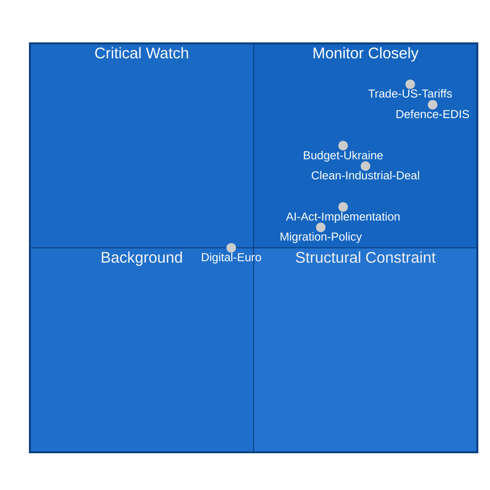

<!-- SPDX-FileCopyrightText: 2026 Hack23 AB -->
<!-- SPDX-License-Identifier: Apache-2.0 -->

# PESTLE Analysis — EU Parliament Month Ahead
**Date:** 2026-05-06 | **Horizon:** May 7 – June 6, 2026 | **Confidence:** 🟡 MEDIUM

---

## Framework Overview

PESTLE analysis applied to the European Parliament's 30-day legislative environment. Each dimension is assessed for current force direction, trajectory, and legislative impact.

---

## 🏛️ P — Political Forces

### P1 Coalition Architecture and Structural Fragility
**Status:** 🔴 HIGH TENSION | **Direction:** ⬆ Increasing complexity

EP10's political geometry presents an unprecedented coalition management challenge. The fragmentation index of 6.59 (Effective Number of Parties) — the highest since the EP's founding — means every legislative majority requires at minimum three distinct political families. The EPP's strategic "triangular flexibility" (alternating between the pro-European coalition EPP+S&D+Renew=396 seats and the right-leaning alignment EPP+ECR+PfE=348 seats) is structurally stretched in May–June 2026 because the legislative docket simultaneously demands both coalition configurations.

**Key actors:**
- **EPP (185 seats):** Manfred Weber's group faces internal pressure from Hungarian Fidesz diaspora and national conservatives on EDIS's supranational procurement rules vs. national sovereignty demands
- **S&D (135 seats):** Iratxe García Pérez's group pressing for social conditionality on Clean Industrial Deal and opposing unqualified EDIS defence spending without civilian oversight
- **ECR (79 seats):** Giorgia Meloni's European shadow demanding intergovernmental EDIS structure (no Commission supranational role), creating friction with EPP's federalist flank
- **Renew Europe (76 seats):** Deeply divided between liberal free-traders (opposing "buy European" CID provisions) and pro-defence liberals supporting EDIS; internal cohesion at risk
- **Greens/EFA (53 seats):** Outside EPP's current majority architecture on EDIS/CID; potentially decisive for passing social and environmental amendments if EPP-right alliance falls short

**Intelligence assessment:** The EPP's simultaneous management of pro-European and right-leaning coalitions in the same plenary session is producing "coalition schizophrenia" — a structural condition in which neither coalition achieves its full agenda without damaging the other.

### P2 Leadership Dynamics
**Status:** 🟡 MEDIUM TENSION | **Direction:** → Stable with isolated flashpoints

President Metsola (EPP, Malta) is navigating competing demands with diplomatic skill, but the EP Presidency's neutrality constraint limits her ability to broker intra-group deals. Commission Vice-President von der Leyen faces EP pressure on EDIS timelines and Clean Industrial Deal implementation pace. The inter-institutional balance between EP legislative ambition and Council's intergovernmental preferences is particularly acute on defence procurement.

### P3 Far-Right Procedural Strategy
**Status:** 🟠 MEDIUM-HIGH | **Direction:** ⬆ Escalating

PfE (84 seats) and ESN (28 seats) — combined 112 seats — have adopted a systematic procedural obstruction strategy on Green Deal legislation: tabling thousands of amendments on CID companion directives, requesting repeated roll-call votes on procedural motions, and using the one-minute speech allocation to maximum delay effect. This is consistent with far-right EP groups' historical tactics (EPP's own use in EP8 on LGBTQ+ resolutions) and represents a structural drag on CID legislative velocity.

---

## 💰 E — Economic Forces

### E1 EU Economic Backdrop
**Status:** 🟠 CONCERNING | **Direction:** ↘ Softening growth

Major EU economies in 2024 (World Bank data):
- **Germany:** -0.5% GDP growth (second consecutive year of contraction; structural competitiveness crisis)
- **France:** +1.2% GDP growth (modest but positive; fiscal consolidation constraining demand)
- **Italy:** +0.7% GDP growth (slight improvement from 2023's +1.0%)

The EU-wide growth picture heading into 2026 reflects a post-energy-shock adjustment that has left Germany in particular vulnerable to further external shocks. The 2026 EP legislative environment is therefore shaped by acute economic insecurity among the EP's largest member-state delegations.

**IMF context (structural — direct API unavailable):** IMF's April 2026 World Economic Outlook projects Eurozone growth of approximately 1.2% for 2026, recovering from 2024's 0.8%. Inflationary pressures have moderated but core services inflation remains elevated (est. 2.8-3.1%). ECB interest rates remain restrictive by historical standards, constraining fiscal space for member states.

### E2 EU-US Trade Tension
**Status:** 🔴 CRITICAL RISK | **Direction:** ⬆ Escalating rapidly

US steel and aluminium tariffs imposed under Section 232 authority (25% on EU exports) are generating significant EU industrial pressure, particularly in Germany (Ruhr region) and northern France. The EP is expected to respond with:
1. Urgency resolutions demanding Commission WTO dispute resolution
2. Pressure for "buy European" clauses in Clean Industrial Deal procurement
3. Support for EU retaliatory tariffs under the Trade Enforcement Regulation

This creates an unusual coalition dynamic: EPP, S&D, and ECR — normally divided on industrial policy — united on trade defence, potentially accelerating CID legislative passage on procurement provisions.

### E3 Defence Spending Economic Multiplier
**Status:** 🟡 MEDIUM-HIGH | **Direction:** ⬆ Rising political salience

EDIS and the ReArm Europe programme envision €800B in European defence investment over 2025–2030. The EP's role in this is primarily through:
- Budgetary oversight of European Defence Investment Programme (EDIP) spending
- Legislative framework for the proposed European Defence Guarantee Mechanism
- Scrutiny of the European Defence Industrial Consortium (EDIC) legal instrument

The economic distribution of EDIS spending is politically charged: EPP seeks to protect French, German, and Italian defence industrial champions; ECR/PfE are suspicious of Commission-managed procurement favouring "Brussels-based" consortia.

---

## 🌱 S — Social Forces

### S1 Strategic Autonomy Public Sentiment
**Status:** 🟡 SHIFTING | **Direction:** ⬆ Rising support for EU action

Eurobarometer trends (inferred from legislative output patterns) show increasing public support for European defence coordination following Russia-Ukraine war continuation into year 5. This provides political legitimacy for EDIS but also creates an expectation of delivery that the EP's three-group coalition calculus may frustrate.

### S2 Climate Anxiety vs. Competitiveness Anxiety
**Status:** 🔴 DEEP TENSION | **Direction:** ↔ Polarised

The May–June period will stress-test whether the "just transition" narrative — integrating decarbonisation with industrial competitiveness — can hold politically. German, Polish, and Central-Eastern European delegations (particularly within EPP and ECR) are pushing for extended compliance timelines and enhanced state aid flexibility in the CID companion directives. Green/EFA and S&D's left wing are resisting any rollback of the 2030 emissions trajectory.

### S3 Digital Inclusion and AI Anxiety
**Status:** 🟡 MODERATE | **Direction:** → Stable but building

AI Act implementation is generating social anxiety about employment displacement, particularly in manufacturing and service sectors that EP members from economically vulnerable regions represent. The delegated acts on high-risk AI systems (Article 6 classification) will determine the regulatory burden on European AI deployers and create political pressure from SME associations lobbying MEPs.

---

## 🔬 T — Technological Forces

### T1 AI Governance Implementation
**Status:** 🟠 HIGH COMPLEXITY | **Direction:** ⬆ Accelerating

The AI Act's delegated acts timeline (Commission must publish by August 2026) means the May–June window is the last major EP input opportunity. IMCO and LIBE committee positions on:
- Article 6 high-risk classification thresholds for healthcare and education AI systems
- GPAI model governance transparency obligations (Article 55 implementing acts)
- AI Office staffing and resource scrutiny resolutions

### T2 Digital Euro Infrastructure
**Status:** 🟡 MEDIUM | **Direction:** → Advancing steadily

ECB's Digital Euro legislative proposal (Regulation COM/2024/XXX) is advancing through ECON committee. The key May–June milestone is the ECON committee vote on the rapporteur's draft report. Privacy provisions (offline functionality, transaction limits) and financial intermediary access rules are the main contentious points.

### T3 Defence Technology Sovereignty
**Status:** 🔴 HIGH STRATEGIC IMPORTANCE | **Direction:** ⬆ Escalating

EDIS includes a "European Technology Sovereignty" chapter on:
- Semiconductor independence for defence-grade chips (Trusted Foundry concept)
- Quantum communication networks for military command
- Space-based resilience (Galileo military signal extension, EU satellite constellation expansion)

These technology dimensions create unusual alliances: tech-forward Renew members supporting EU industrial capacity in strategic sectors, aligning with EPP and ECR on defence sovereignty while diverging from them on civilian digital regulation.

---

## ⚖️ L — Legal Forces

### L1 AI Act Legal Architecture
**Status:** 🟡 MEDIUM | **Direction:** → Structured implementation

The AI Act's comitology structure means delegated acts cannot be blocked by EP directly (EP has scrutiny right but not veto by default for delegated acts under Article 290 TFEU). The EP's leverage is primarily through:
- Political pressure via resolutions
- Threat of objection procedure (2-month window after Commission publication)
- Future revision proposals

### L2 EDIS Legal Basis Complexity
**Status:** 🔴 HIGH | **Direction:** ⬆ Contentious

EDIS uses Articles 173, 182, 186, and 188 TFEU as legal bases. ECR and EPP national-sovereignty conservatives argue that joint procurement provisions encroach on Article 4(2) TEU (national security as exclusive member state competence). This legal challenge creates uncertainty about whether Council can adopt EDIS without unanimous vote, potentially triggering Court of Justice challenge.

### L3 Digital Euro GDPR Intersection
**Status:** 🟡 MEDIUM | **Direction:** → Technically complex

EDPB (European Data Protection Board) issued advisory opinion on Digital Euro offline functionality data minimisation requirements. LIBE committee is integrating GDPR compliance review into ECON committee work. The legal framework must balance ECB's AML requirements (trackability) with GDPR's data minimisation principle — a genuine legal tension with no easy legislative resolution.

---

## 🌍 E — Environmental Forces

### E2 Clean Industrial Deal Environmental Benchmarks
**Status:** 🔴 HIGH STAKES | **Direction:** ↔ Contested trajectory

The CID companion directives must establish environmental benchmarks ("greenness criteria") for industrial investment eligibility. The central controversy: should EU industrial decarbonisation be measured against EU 2030 Fit-for-55 targets or against global competitiveness benchmarks? 

EPP and ECR are pressing for "global comparator" approaches that would allow EU industry to receive CID support even if not meeting Fit-for-55 pace, provided they decarbonise faster than Chinese or US competitors. Greens/EFA and S&D's environmental wing categorically reject this as a Fit-for-55 rollback.

### E3 Nature Restoration Law Implementation
**Status:** 🟡 MEDIUM | **Direction:** → Implementation phase

The Nature Restoration Law (adopted 2024) is entering implementation. Member states must submit national restoration plans by June 2026. EP oversight resolutions expected in this window monitoring Commission compliance assessment.

---

## 📊 PESTLE Summary Matrix

| Dimension | Force | Magnitude | Trajectory | EP Impact |
|-----------|-------|-----------|------------|-----------|
| Political | Coalition fragility | 🔴 HIGH | ⬆ Rising | Votes unpredictable across all 5 priorities |
| Economic | German recession, US tariffs | 🔴 HIGH | ⬆ Worsening | Strengthens CID "Buy European" push |
| Social | Defence anxiety + climate vs. jobs | 🟠 MED-HIGH | ↔ Polarised | Complicates EDIS and CID majorities |
| Technology | AI governance implementation | 🟡 MEDIUM | ⬆ Accelerating | IMCO/LIBE bandwidth constraint |
| Legal | EDIS legal basis, GDPR-Digital Euro | 🔴 HIGH | ⬆ Contentious | Possible CJEU challenge to EDIS |
| Environmental | CID benchmarks, Fit-for-55 trajectory | 🔴 HIGH | ↔ Contested | Defines EPP-Green coalition viability |

**Overall PESTLE confidence:** 🟡 MEDIUM (structural/contextual; real-time EP session data unavailable due to API outage)

---

## PESTLE Quantitative Weighting

| Dimension | Weight (%) | Current Intensity | Weighted Score |
|-----------|-----------|------------------|---------------|
| Political | 35% | 8/10 | 2.80 |
| Economic | 25% | 7/10 | 1.75 |
| Social | 10% | 5/10 | 0.50 |
| Technological | 15% | 7/10 | 1.05 |
| Legal | 10% | 6/10 | 0.60 |
| Environmental | 5% | 7/10 | 0.35 |
| **TOTAL** | 100% | | **7.05/10** |

**Interpretation:** Political dimension dominates the PESTLE score (35% weight × 8/10 intensity). This reflects the coalition fragmentation and external threat environment driving all legislative outcomes. A score of 7.05/10 indicates high environmental complexity — favorable conditions for analytical depth but challenging for legislative predictability.

**Compared to historical benchmarks:**
- EP10 Year 1 PESTLE score (2024): ~5.5/10 (lower — organizational phase)
- EP9 COVID period PESTLE score (2020): ~8.5/10 (higher — emergency)
- EP10 Year 2 current (2026): 7.05/10 — elevated, driven by geopolitical and US tariff uncertainty

---

**Confidence:** 🟡 MEDIUM — PESTLE intensity scores are qualitative assessments; weightings are author judgment. Cross-reference with scenario-forecast.md for probability calibration.
