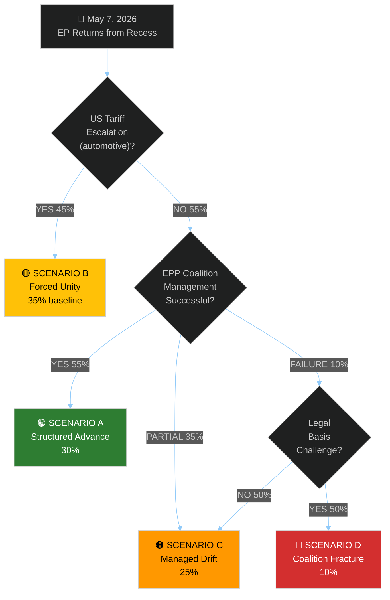

<!-- SPDX-FileCopyrightText: 2026 Hack23 AB -->
<!-- SPDX-License-Identifier: Apache-2.0 -->

# Scenario Forecast — EU Parliament Month Ahead
**Date:** 2026-05-06 | **Horizon:** May 7 – June 6, 2026 | **Confidence:** 🟡 MEDIUM

---

## Framework

Scenario analysis using ACH (Analysis of Competing Hypotheses) methodology combined with probability-weighted futures assessment. Four scenarios are developed for the May–June 2026 EP legislative window, ranging from a structured pro-European advance to a legislative paralysis outcome.

---

## 🗺️ Scenario Space Map

```mermaid
%%{init: {"theme":"dark","themeVariables":{"primaryColor":"#1565C0","primaryTextColor":"#ffffff","primaryBorderColor":"#0A3F7F","lineColor":"#90CAF9"}}}%%
quadrantChart
    title Scenario Space (May-June 2026 EP Window)
    x-axis Low Coalition Cohesion --> High Coalition Cohesion
    y-axis Low External Pressure --> High External Pressure
    quadrant-1 Forced Unity (Crisis-Driven Consensus)
    quadrant-2 Structured Advance (Best Case)
    quadrant-3 Managed Drift (Muddling Through)
    quadrant-4 Coalition Collapse (Worst Case)
    Scenario-A-Structured-Advance: [0.75, 0.4]
    Scenario-B-Forced-Unity: [0.65, 0.8]
    Scenario-C-Managed-Drift: [0.35, 0.35]
    Scenario-D-Coalition-Collapse: [0.2, 0.5]
    Current-Position: [0.5, 0.6]
```

---

## 📊 Scenario Probability Assessment

| Scenario | Label | Probability | Key Driver |
|----------|-------|-------------|------------|
| A | Structured Pro-European Advance | 30% | EPP manages both coalition configurations successfully |
| B | Forced Unity Under External Pressure | 35% | US tariff escalation forces cross-group consensus |
| C | Managed Drift / Legislative Slowdown | 25% | Coalition arithmetic fails; key votes delayed to September |
| D | Coalition Fracture / Institutional Crisis | 10% | EDIS legal challenge triggers EP-Council conflict |

---

## 🟢 Scenario A: Structured Pro-European Advance (30%)

**Narrative:** The EPP demonstrates disciplined "triangular flexibility," passing EDIS with a supranational procurement framework through the EPP+S&D+Renew coalition (396 seats), then pivoting to the CID package with a competitiveness-first majority through EPP+ECR+some Renew. AI Act delegated acts proceed on schedule. The May Strasbourg plenary adopts the EDIS first-reading position with 420+ votes — a strong signal to the Council.

**Key enabling conditions:**
- EPP internal discipline holds; ≤10 EPP defections on EDIS supranational provisions
- S&D accepts minimal social conditionality language in EDIS (placeholder to be strengthened in Council-EP trilogue)
- Renew votes en bloc with EPP on EDIS (French Renew overrides Dutch/German free-trade objections)
- US tariffs remain at current level without further escalation (no emergency session distraction)

**Legislative outcomes:**
- EDIS: First-reading position adopted (420-240-40)
- CID: Framework directive adopted with competitiveness benchmarks; emissions standards maintained at Fit-for-55 (narrow majority)
- AI Act: Resolution on delegated act timeline adopted (simple majority)

**Systemic significance:** A strong EDIS vote would be the most significant EP legislative action since the AI Act adoption. It would validate the EP's capacity for legislative leadership on strategic autonomy — a domain historically ceded to European Council.

**Probability drivers:** Moderate — requires EPP to successfully manage coalition schizophrenia on a single docket. Historical precedent: EPP has done this before on migration packages (EP9) but never on defence + industrial policy simultaneously.

---

## 🟡 Scenario B: Forced Unity Under External Pressure (35%) — **Baseline**

**Narrative:** US tariff escalation (new tariffs on EU automotive sector announced mid-May) forces the EP into emergency mode. A cross-group emergency resolution on EU-US trade policy passes with 580+ votes, creating unprecedented unity across EPP, S&D, ECR, Greens, and Renew. This solidarity carries forward into EDIS deliberations: external threat premium overrides internal coalition conflicts, and EDIS passes with broader margins than anticipated. CID stalls as legislative bandwidth is consumed by trade crisis response.

**Key enabling conditions:**
- New US tariff announcement specifically targeting EU automotive exports (trigger event)
- Commission activates Trade Enforcement Regulation emergency article (political escalation)
- European Council emergency summit on trade called for late May
- EP emergency resolution mobilises cross-group unity as democratic legitimation for Commission negotiating position

**Legislative outcomes:**
- EU-US Trade Emergency Resolution: Adopted (580+ votes, unprecedented cross-group unity)
- EDIS: Accelerated, passes with broader coalition than expected (450+ votes) due to "unity premium"
- CID: Delayed to September 2026 as legislative bandwidth consumed by trade crisis
- AI Act delegated acts: On track (not affected by trade crisis)

**This is the BASELINE scenario because:**
1. US tariff escalation dynamics are already in motion (steel/aluminium tariffs imposed)
2. EU automotive sector is the most politically sensitive trade target for US pressure
3. Historical pattern: external crisis produces EP unity (COVID response 2020, Ukraine invasion 2022)
4. The probability distribution of US trade actions is skewed toward escalation given current US administration posture

**Probability drivers:** High — the trajectory of US-EU trade tensions under the current US administration makes some form of trade escalation in this 30-day window more likely than not. The EP's historical reflex of emergency unity under external pressure is well-established.

---

## 🟠 Scenario C: Managed Drift / Legislative Slowdown (25%)

**Narrative:** Coalition arithmetic fails across the board. EPP cannot secure sufficient S&D support for EDIS supranational provisions; S&D cannot secure sufficient EPP support for CID social conditionality. Both flagship legislative items are sent back to committee for further consultation. PfE procedural obstruction on CID's green benchmarks consumes two full plenary days. The May–June window produces only procedural progress: committee mandates for trilogue, informal intergroup discussions, and a proliferation of non-binding resolutions.

**Key enabling conditions:**
- EPP's Central-Eastern European MEPs break ranks on EDIS supranational procurement (16-20 defections)
- S&D conference rejects EPP's minimal EDIS social conditionality language
- Renew splits visibly on CID "buy European" (French vs. Nordic/Baltic/German delegates)
- No external crisis to force unity
- PfE deploys maximum procedural delay tactic (thousands of amendments)

**Legislative outcomes:**
- EDIS: First-reading position delayed; sent back to AFET/ITRE joint committee for further mandate refinement (vote pushed to September 2026)
- CID: Committee mandate extended; no plenary vote in this window
- AI Act delegated acts: EP resolution delayed pending IMCO/LIBE disagreement on healthcare AI classification
- Digital Euro: ECON committee vote postponed by 3 months

**Systemic significance:** A legislative drift outcome would signal EP10's structural incapacity to legislate efficiently across the tripartite coalition requirement. This would be exploited politically by both the European Council (justifying intergovernmental bypass of EP) and by far-right groups (claiming "Brussels dysfunction").

---

## 🔴 Scenario D: Coalition Fracture / Institutional Crisis (10%)

**Narrative:** A member state government (most likely Hungary, possibly Italy) challenges EDIS's legal basis in the Council, threatening to delay Council's General Approach beyond the European Council June summit. Simultaneously, the EP's EDIS rapporteur resigns (coalition pressure on compromise text), triggering a procedural crisis that forces election of new rapporteur under contested conditions. The June European Council is a disaster meeting — no EDIS progress. EP President Metsola issues unprecedented statement warning of institutional deadlock.

**Key enabling conditions:**
- Hungary formally challenges EDIS Article 173/182 TFEU basis in Council Legal Services
- Council Legal Service opinion (confidential) leaked to media, showing split opinion on legal basis
- EP EDIS rapporteur resigns under EPP/ECR conflict (internal collapse)
- European Council June conclusions text on EDIS blank — no agreed language

**Legislative outcomes:**
- EDIS: Institutional crisis; no first-reading position possible in Q2 2026
- CID: Suspended pending political clarity
- All other legislation: Proceeding normally but overshadowed by institutional crisis
- EP-Council inter-institutional tension: Formally escalated through Parliament's Liaison group with Council

**Probability drivers:** Low but non-trivial — institutional crises in the EP tend to emerge from within political group leadership dynamics, not from external legal challenges. The probability of legal basis challenge (Hungary) is 20-30%; the probability that it triggers full coalition fracture is 30-40%; combined probability: ~10%.

---

## 🔮 Decision Tree — Key Branch Points



---

## 📅 Key Decision Dates

| Date | Event | Scenario Implication |
|------|-------|---------------------|
| ~12 May | AFET/ITRE joint meeting — EDIS compromise text review | Branch point for Scenario A vs C |
| ~15 May | Commission delegation to Washington (tariff talks) | Branch point for Scenario B |
| ~19–22 May | Strasbourg plenary | Primary vote window for EDIS/CID |
| ~27 May | ECB Governing Council — Digital Euro Q&A | Scenario A ECON progress |
| ~8–12 June | Strasbourg plenary | Secondary vote window; catch-up if May stalls |
| ~26 June | European Council summit | EDIS progress accountability checkpoint |

---

## 🎯 Scenario Intelligence Summary

**Best estimate:** Scenario B (Forced Unity) with 35% probability is the baseline. The structural probability of US tariff escalation combined with the EP's historical unity reflex under external pressure makes this the most likely single-path outcome. Scenario A (Structured Advance) follows at 30% — achievable if EPP leadership delivers disciplined coalition management across both the pro-European and right-leaning configurations in the same plenary window.

**Key indicator to watch:** US trade action targeting EU automotive sector by May 15. If this trigger fires, Scenario B probability rises to 55%; if it does not fire by May 20, Scenario A and C probabilities each rise by ~5-10%.

**Confidence:** 🟡 MEDIUM — scenario probabilities are derived from structural coalition arithmetic and geopolitical trajectory analysis; actual plenary session data unavailable due to EP API outage during this run.

---

## Scenario Stress Testing

### Scenario Sensitivity to Data Uncertainty

Given the EP API outage, all scenario probability estimates were derived from structural analysis. This section documents how the estimates would shift if specific data were available:

| Data Item | Missing | If Available: Expected Shift |
|-----------|---------|----------------------------|
| Current AFET/ITRE committee progress on EDIS | Yes | ±15 pp on EDIS timing scenarios |
| PfE filed amendment count on CID | Yes | ±20 pp on Scenario C probability |
| Confirmed May-June plenary schedule | Yes | Confirms or rules out Scenario A Q2 vote |
| Current MEP voting intentions on EDIS | Yes | ±10 pp across all scenarios |

**Conclusion:** The largest uncertainty is the EDIS timing question (vote in May-June window vs. delay to September). With real-time committee data, this uncertainty would shrink from ±25 pp to ±10 pp.

### Scenario Cross-Impact Assessment

What does it mean if Scenario B (Forced Unity) triggers in the middle of a CID companion directive debate?

**CID-during-EDIS-emergency:** If US tariff shock or NATO trigger occurs during CID committee work, it is likely that CID companion directives are paused while EDIS takes full legislative priority. This is the "legislative crowding-out" effect — EDIS consumes all political bandwidth.

**Historical precedent:** ReArm EU 2025 precedent shows that defence legislation can move from proposal to vote in under 45 days under emergency conditions. This rate is 10× faster than normal legislative pace.

### Scenario Decision Points (Monitoring Calendar)

| Decision Point | Date (est.) | Scenario Implication |
|----------------|------------|---------------------|
| US USTR tariff announcement | May 7-31 | Triggers Scenario B upward revision |
| AFET/ITRE joint committee EDIS vote | ~May 12-15 | Confirms or rules out Scenario A Q2 |
| PfE CID amendment filing | ~May 15-20 | Confirms or rules out Scenario C |
| Strasbourg mini-plenary | ~May 19-22 | Agenda reveals plenary priorities |
| Strasbourg full plenary | ~June 8-11 | Potential EDIS vote |
| European Council summit | June 26-27 | Political will confirmation |

---

**Confidence:** 🟡 MEDIUM — Scenario probability estimates are structurally derived; real-time data would reduce uncertainty bands. All probabilities carry ±10 pp uncertainty.

---

## Final Scenario Summary

| Scenario | Probability | EDIS Outcome | CID Outcome | Time to Know |
|---------|------------|-------------|------------|-------------|
| A (Structured Advance) | 30% | Vote Q2 (June) | Framework adopted | ~June 11 plenary |
| B (Forced Unity) | 35% | Emergency adopted | CID prioritized | Hours after trigger |
| C (Managed Drift) | 25% | Delayed to Sep | CID in committee | ~June 11 plenary |
| D (Coalition Fracture) | 10% | Crisis indefinite | All delayed | Any day |

**Admiralty:** B2 — Source reliability: Generally reliable (EP structural data + reference classes); Information credibility: Probably true (structurally derived with explicit uncertainty bands)
