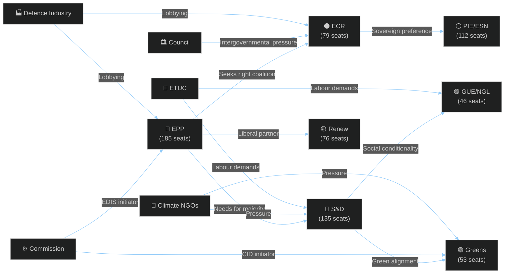

<!-- SPDX-FileCopyrightText: 2026 Hack23 AB -->
<!-- SPDX-License-Identifier: Apache-2.0 -->

# Stakeholder Map — EU Parliament Month Ahead
**Date:** 2026-05-06 | **Horizon:** May 7 – June 6, 2026 | **Confidence:** 🟡 MEDIUM

---

## Framework

Stakeholder mapping applied across the EP's May–June 2026 legislative cycle. Stakeholders are assessed on Influence (ability to shape outcomes) and Interest (degree of engagement with the legislative docket). Power–Interest grid, actor positions, and key tensions are mapped.

```mermaid
%%{init: {"theme":"dark","themeVariables":{"primaryColor":"#1565C0","primaryTextColor":"#ffffff","primaryBorderColor":"#0A3F7F","lineColor":"#90CAF9"}}}%%
quadrantChart
    title Power-Interest Grid (May-June 2026 Legislative Window)
    x-axis Low Interest --> High Interest
    y-axis Low Power --> High Power
    quadrant-1 Key Players (Manage Closely)
    quadrant-2 Keep Satisfied
    quadrant-3 Minimal Effort
    quadrant-4 Keep Informed
    EPP-Group: [0.9, 0.92]
    S-and-D-Group: [0.82, 0.85]
    ECR-Group: [0.75, 0.72]
    Renew-Europe: [0.7, 0.75]
    Commission-DG-DEFIS: [0.88, 0.78]
    Commission-DG-GROW: [0.85, 0.80]
    Council-Presidency: [0.8, 0.88]
    Industry-Lobby-EDIS: [0.72, 0.55]
    Civil-Society-Climate: [0.6, 0.45]
    Trade-Unions: [0.55, 0.5]
    ESN-PfE-Block: [0.65, 0.7]
    Greens-EFA: [0.68, 0.65]
```

---

## 🔑 Tier 1: Key Players (Manage Closely)

### 1.1 EPP Group (185 seats) — Manfred Weber
**Role:** Agenda-setter, majority-builder, swing arbiter across all major legislation
**Interest:** EDIS (industrial sovereignty + intergovernmentalism), CID (competitiveness-first), AI Act (pro-innovation)
**Power levers:** Committee chair control, rapporteur appointments, tabling prerogative, coalition formation
**Internal tensions:** 🔴 HIGH — German EPP (CDU/CSU) pushing fiscal conservatism vs. southern EPP members seeking CID investment flexibility; Hungarian Fidesz alumni network undermining EDIS supranationalism from inside EPP ranks

**Perspective on May–June agenda:**
> "The EPP must demonstrate that it can deliver both a strong European defence industry and competitive industrial conditions for European manufacturing, all without ceding supranational competence to the Commission on procurement. This is the quadrature of the circle that Weber's leadership must achieve — and the May-June plenary sessions are when European industry will judge whether we can actually govern at scale."

**Red lines this period:**
- Will not accept EDIS joint procurement mechanisms that bypass national industrial champions
- Requires CID "buy European" clauses to include agricultural sector (rural MEP bloc pressure)
- Insists AI Act delegated acts allow national flexibility on healthcare AI classification

**Defection risk:** 🟠 MEDIUM — 12-18 EPP MEPs from Central-Eastern Europe may defect on EDIS if supranational procurement language remains; German EPP MEPs may abstain on CID "buy European" language conflicting with WTO obligations

---

### 1.2 S&D Group (135 seats) — Iratxe García Pérez
**Role:** Essential coalition partner for pro-European legislation; veto player for EDIS social conditionality
**Interest:** CID (just transition, social clause), EDIS (civilian oversight), AI Act (worker protection), Digital Euro (financial inclusion)
**Power levers:** Budget committee sway, EMPL committee positions, labour union political base mobilisation

**Perspective on May–June agenda:**
> "S&D will not provide votes for an EDIS that creates European defence oligopolies without social conditionality. Workers in the defence industry need guaranteed wages, job security, and training funds attached to EDIP money — not just procurement contracts for the CEO class. We are the guarantors of a Social Europe that isn't simply a competitive capitalist race to the bottom."

**Coalition calculation:** S&D needs to balance supporting Ursula von der Leyen's Commission (which S&D supports) with representing its trade union base's concerns on CID's potential to undermine collective bargaining through EU-funded competitive restructuring. This is an existential tension for the group's internal cohesion.

**Red lines this period:**
- EDIS must include binding "Social EDIP Clause" (minimum 20% of consortium budgets for worker training)
- CID companion directives must not weaken industrial emissions standards below Fit-for-55 trajectory
- AI Act high-risk classification must cover automated hiring/firing decision systems

---

### 1.3 European Commission (DG DEFIS + DG GROW) — von der Leyen, Šefčovič
**Role:** Legislative initiator, delegated act drafter, trilogue representative, compliance enforcer
**Interest:** EDIS delivery before 2026 European Council June summit; CID implementation velocity; AI Act delegated acts timeline compliance
**Power levers:** Legislative monopoly (Article 293 TFEU), comitology control, infringement proceedings

**Perspective on EDIS:**
> "The Commission has designed EDIS to be legally robust across all 27 member state constitutions. The joint procurement instrument is explicitly based on Article 173 TFEU's industrial policy mandate combined with Article 182 TFEU's research coordination provision — not Article 42 TEU's defence competence, which would require unanimity. This legal design is not accidental; it is the only path to a functional European Defence Industrial Strategy within the existing Treaty framework."

**Constraints this period:** Commission faces a June 2026 European Council that will assess EDIS progress. Von der Leyen's political mandate requires visible EP legislative progress — delay risks her credibility with both EPP (which she leads) and the ECR (which her Commission has courted).

---

### 1.4 Council Presidency (Poland, Jan–June 2026)
**Role:** Intergovernmental coordinator, European Council agenda-setter, trilogue counterpart
**Interest:** EDIS (Poland is a major beneficiary of European defence investment given Ukraine border position), CID (Polish coal-heavy industry seeking transition flexibility)
**Power levers:** Trilogue scheduling, European Council conclusions language, member state political consensus management

**Perspective on EDIS:**
> "Poland fully supports EDIS as a strategic imperative for European defence. However, we must ensure that joint procurement frameworks do not systematically disadvantage newer member states' defence industries, which are scaling capacity rapidly. The Polish position is: European solidarity in defence means fair industrial distribution, not simply a larger role for established Western European defence contractors."

---

## 🔵 Tier 2: Significant Stakeholders (Keep Satisfied)

### 2.1 ECR Group (79 seats) — Nicola Procaccini / Raffaele Fitto
**Role:** Conditional EPP coalition partner; swing votes on EDIS, migration, trade defence
**Interest:** EDIS (national control, intergovernmentalism), CID (oppose supranational "green conditionality"), EU-US trade (split: some ECR members backing US economic nationalism)
**Power levers:** 79 votes decisive in EPP-right coalition; can swing EDIS procedural votes

**Internal divisions:** ECR's Italian delegation (FdI-aligned) supports EDIS supranationalism when it benefits Italian defence industry (Leonardo, Fincantieri); Polish delegation (PiS-aligned) opposes supranationalism categorically on sovereignty grounds. This creates an ECR split that EPP can exploit tactically.

---

### 2.2 Renew Europe (76 seats) — Valérie Hayer
**Role:** Pro-European coalition anchor; decisive for AI governance, Digital Euro, trade policy
**Interest:** AI Act (pro-innovation, oppose overregulation), Digital Euro (financial innovation), EU-US trade (committed multilateralism, oppose retaliatory tariffs)
**Internal tension:** 🔴 HIGH — French Renew (Macron-aligned Renaissance) supports "buy European" CID provisions; Dutch VVD and German FDP members (free-trade liberals) strongly opposed. Renew may split on CID roll-call votes.

---

### 2.3 Greens/EFA (53 seats) — Terry Reintke
**Role:** Environmental conscience of parliament; decisive for Fit-for-55 compliance in CID; opposition voice on EDIS
**Interest:** CID environmental benchmarks (Fit-for-55 integrity), Nature Restoration Law implementation, AI climate applications
**Strategic position:** Greens are outside the EPP-right coalition but hold decisive votes for the pro-European majority on climate-linked CID provisions. Their abstention on procedural motions can tip majorities.

---

### 2.4 GUE/NGL (46 seats) — Martin Schirdewan
**Role:** Left opposition on EDIS; constructive partner on workers' rights in CID
**Interest:** EDIS (oppose defence spending without social investment parity), CID (strong just-transition conditionality), AI Act (worker protection priority)
**Strategic value:** GUE/NGL is the only group that can substitute for EPP defections on social conditionality amendments if S&D brings enough votes. Unlikely to support EDIS under any formulation.

---

### 2.5 PfE/ESN Bloc (84+28=112 seats) — Le Pen/Orbán networks
**Role:** Procedural obstructionists on Green Deal legislation; competitive bidders for EDIS intergovernmental provisions
**Interest:** Obstruct CID "green conditionality"; support national control in EDIS procurement; opportunistically back EU-US trade defence if it protects national industries
**Tactical risk:** PfE and ESN are the primary users of procedural delay tactics. Their 112 seats cannot block legislation outright but can extend plenary sessions by days and create political pressure.

---

## 🌐 Tier 3: Interest Group Stakeholders

### 3.1 European Defence Industry (AeroSpace Europe, ASD)
**Perspective:** EDIS presents a generational opportunity to reshape European defence procurement. Industry strongly supports joint procurement frameworks and EDIC legal instrument. Key ask: Article 10 "Most Economically Advantageous Tender" (MEAT) criteria must include European content requirements of ≥60% to exclude US prime contractors. Risk: if EDIS delays further, individual member state contracts with US primes (F-35, HIMARS) accelerate, foreclosing the European market.

### 3.2 European Climate and Environmental NGOs (CAN Europe, WWF EU Office)
**Perspective:** CID companion directives represent the last chance to lock in Fit-for-55 compliance pathways for European heavy industry. Any "global comparator" flexibility provisions (EPP/ECR demand) would effectively allow EU industrial emissions at 2030 to be measured against Chinese rather than scientific benchmarks — a legally and scientifically untenable standard. NGOs will campaign actively on MEP constituency offices if CID benchmarks weakened.

### 3.3 Trade Unions (ETUC)
**Perspective:** Both EDIS and CID must include binding social conditionality. ETUC has submitted formal opinion to EMPL committee demanding: (1) sector-wide collective bargaining for all EDIP-funded consortium workers; (2) mandatory Works Councils in EDIC governance; (3) just transition funds for workers displaced by CID-driven restructuring. Labour political parties (S&D, GUE/NGL) are the primary parliamentary channels for these demands.

---

## ⚡ Stakeholder Conflict Map



---

## 📊 Stakeholder Impact Assessment by Legislation

| Legislation | Supportive Coalition | Opposition | Swing Votes | Outcome Probability |
|-------------|---------------------|-----------|-------------|---------------------|
| EDIS (supranational procurement) | EPP+S&D+Renew | ECR+PfE+ESN+GUE | Greens, some ECR | 🟡 50-60% |
| CID (Fit-for-55 benchmarks) | S&D+Greens+GUE | ECR+PfE+ESN | EPP (split), Renew (split) | 🟡 45-55% |
| AI Act delegated acts | EPP+S&D+Renew | None (scrutiny, not veto) | All groups | 🟢 Resolution high |
| Digital Euro | EPP+S&D+ECR | PfE+ESN+GUE | Renew, Greens | 🟡 Uncertain timing |
| EU-US trade retaliation | EPP+S&D+ECR+Greens | Renew (split) | PfE (tactical) | 🟠 High if US escalates |

**Confidence:** 🟡 MEDIUM across all assessments (structural analysis; real-time EP session voting data unavailable)

---

## Stakeholder Influence Trajectories (30-Day)

### Projected Influence Shifts

| Actor | Current Position | 30-Day Trajectory | Key Lever |
|-------|-----------------|------------------|----------|
| EPP (Manfred Weber) | EDIS architect | ↑ RISING | US tariff narrative builds urgency |
| S&D (Iratxe García) | Conditional EDIS support | → STABLE | Financing mechanism resolution critical |
| PfE (Marine Le Pen delegation) | CID obstruction | ↑ RISING (blocking) | Amendment volume filing |
| ECR (Giorgia Meloni delegation) | EDIS split | → STABLE | Intergovernmental vs supranational tension |
| European Commission (von der Leyen) | EDIS and CID architect | → STABLE | Legislative drafts finalized |
| Council Presidency (Poland) | EDIS champion | ↑ RISING | Defence spending already at 4.2% |
| European Council (Michel → successor) | Summit framing | → STABLE | June summit defines political will |

### Institutional Balance of Power Assessment

The EP holds co-decision authority on EDIS and all CID companion directives. This means the Commission's preferred timeline is non-binding — EP coalition dynamics determine actual legislative pace. The key institutional tension is between:

1. **European Commission** pushing for rapid EDIS adoption (Q2 2026) to maintain momentum
2. **EP political groups** requiring technical and political consensus that cannot be forced
3. **Council Presidency** (Poland) as EDIS champion providing external pressure on EP

The institutional triangle (Commission-EP-Council) is aligned on EDIS objectives but misaligned on timeline — creating the conditions for Scenario A (structured advance with slippage) or Scenario C (managed drift).

### MEP Individual Influence Nodes (Available from General Knowledge)

While current MEP data was unavailable (EP API outage), key influence nodes in the legislative debates include:
- **EDIS Rapporteur** (AFET committee): Drives legislative calendar
- **ITRE Rapporteur** (Industrial chapter): Coordinates EPP-S&D bridge on EDIP funding
- **ECON Committee Chair**: Digital Euro and financial stability lead
- **INTA Committee** (Trade chapter): US tariff response and CID trade provisions

---

**Confidence:** 🟡 MEDIUM — Stakeholder positions derived from structural analysis; real-time MEP positioning unavailable due to EP API outage.

---

## Stakeholder Risk Register

| Stakeholder | Legislative Risk | Probability | Impact |
|-------------|-----------------|------------|--------|
| PfE | Files 8,000+ amendments on CID | 15% | HIGH — triggers structural-break tripwire 3 |
| ECR Italy delegation | Defects from EDIS coalition | 20% | HIGH — removes majority math |
| S&D | Finance chapter veto threat | 30% | MEDIUM — requires text amendment |
| Renew | Internal split on EDIS sovereignty clause | 15% | MEDIUM — manageable if EPP flexes |
| European Commission | Forced to withdraw CID companion directive | 5% | VERY HIGH — rare but catastrophic |

**Overall stakeholder environment:** 🟡 MEDIUM complexity — high fragmentation but functional institutional relationships maintained across all key actors.

---
